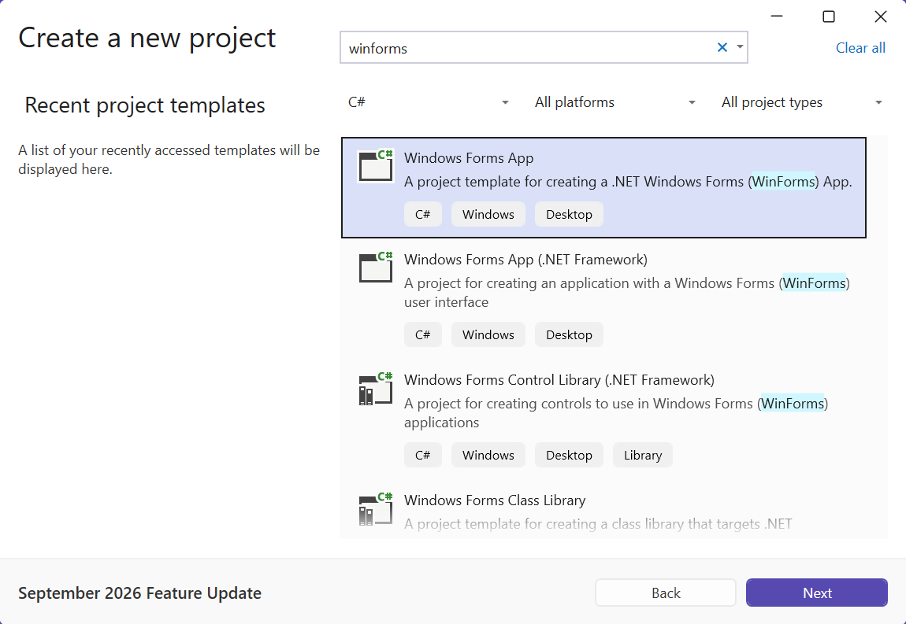
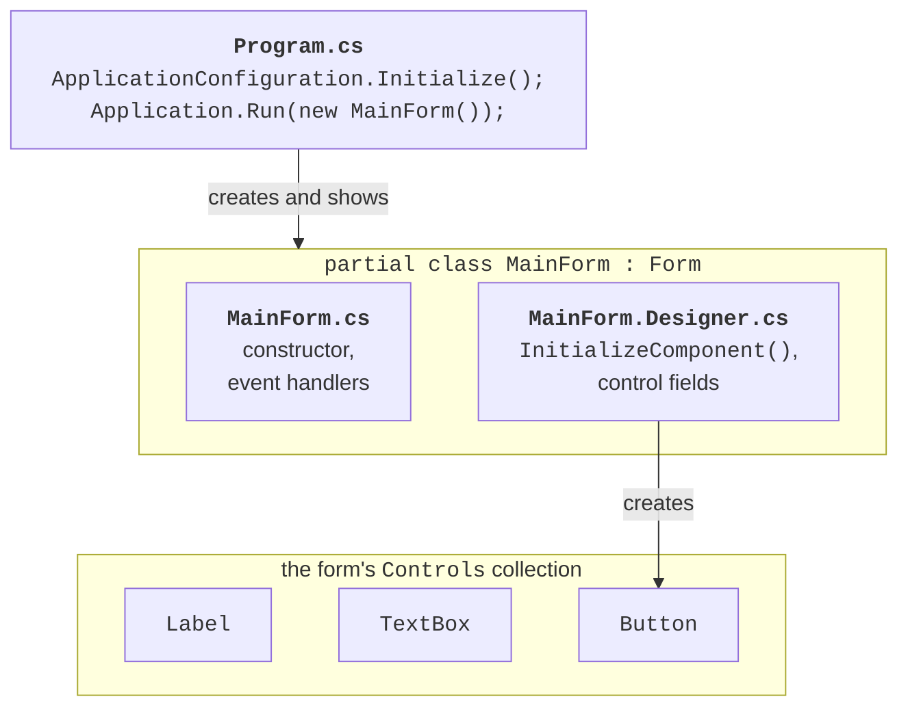

# A Windows Forms project

## .NET desktop application technologies

A **desktop application** runs on the user's computer in its own window: a text editor, a point-of-sale program, a hardware configuration utility. Unlike a console program, it has a **graphical user interface** (GUI): windows, buttons, input fields, menus. The .NET platform offers several technologies for such applications (Table 3.1).

Table 3.1. .NET desktop application technologies {.caption}

| **Technology** | **Features** | **Platforms** |
| --- | --- | --- |
| Windows Forms | the simplest model: forms and controls, a visual designer, UI code in C#; a thin wrapper over Windows windows | Windows |
| WPF | UI described in XAML, vector graphics, styles, data binding, the MVVM pattern (Topics 12–14) | Windows |
| .NET MAUI | a single XAML and C# project for several platforms (Topic 15) | Windows, Android, iOS, macOS |

**Windows Forms** (WinForms) is the oldest of them: it appeared together with .NET Framework 1.0 in 2002. The modern version runs on .NET, is open source, and evolves together with the platform: in .NET 10 it supports dark mode, asynchronous methods for showing forms, and high-resolution displays. Windows Forms is chosen for internal business applications, utilities, and learning projects: a form with a few fields can be created in minutes, and the event model is easy to understand (<https://learn.microsoft.com/dotnet/desktop/winforms/overview/>).

Windows Forms runs **only on Windows**. That is why the project's target framework has a platform suffix—`net10.0-windows`—and the `UseWindowsForms` property brings in the Windows Forms libraries. The project file created by the template looks like this:

```xml
<Project Sdk="Microsoft.NET.Sdk">
  <PropertyGroup>
    <OutputType>WinExe</OutputType>
    <TargetFramework>net10.0-windows</TargetFramework>
    <Nullable>enable</Nullable>
    <UseWindowsForms>true</UseWindowsForms>
    <ImplicitUsings>enable</ImplicitUsings>
  </PropertyGroup>
</Project>
```

The `WinExe` output type means that no console window opens when the application starts. For Windows Forms, the implicit `using` directives (`ImplicitUsings`) add the `System.Windows.Forms` and `System.Drawing` namespaces, so the `Form`, `Button`, `Point`, and `Color` classes are available without explicit `using` directives.

## A Windows Forms project and its structure

### Creating a project

You need the *.NET desktop development* workload in Visual Studio 2026 (installed through the *Visual Studio Installer*). A project is created as follows (<https://learn.microsoft.com/dotnet/desktop/winforms/get-started/create-app-visual-studio>):

1. *File → New → Project…* or the *Create a new project* button in the start window.
2. Type `winforms` in the search box, select the C# language and the *Windows Forms App* template (Fig. 3.1). The *Windows Forms App (.NET Framework)* template is for the old platform; do not choose it.
3. Enter the project name (*Project name*) and location (*Location*), and click *Next*.
4. In the *Additional information* window, choose *Framework*: *.NET 10.0 (Long Term Support)* and click *Create*.



Figure 3.1. Selecting the *Windows Forms App* template {.caption}

The same project is created by the dotnet CLI command `dotnet new winforms -n TemperatureConverter` and run with `dotnet run` in the project folder.

### Project files

The template creates three code files (Fig. 3.2):

- `Program.cs`—the entry point: configures the application and shows the main form;
- `Form1.cs`—the form code written by the programmer: the constructor, event handlers, helper methods;
- `Form1.Designer.cs`—the code generated by the form designer: creating controls and setting their properties.

The `Form1.resx` file (form resources: images, localized strings) appears when the form needs resources, for example after you choose an image for a `PictureBox`. Give the form a meaningful name right away: in *Solution Explorer*, rename the `Form1.cs` file to `MainForm.cs`, and Visual Studio offers to rename the class and all references to it as well.



Figure 3.2. The structure of a Windows Forms application {.caption}

After the form is renamed, the `Main` method in `Program.cs` looks like this:

```cs
namespace TemperatureConverter;

static class Program
{
    [STAThread]
    static void Main()
    {
        ApplicationConfiguration.Initialize();
        Application.Run(new MainForm());
    }
}
```

The `[STAThread]` attribute is required for the clipboard, standard dialogs, and drag-and-drop to work. The `ApplicationConfiguration.Initialize()` method is generated by the compiler from the project properties and enables Windows visual styles, modern text rendering, and the `SystemAware` high-DPI mode. The `Application.Run` method shows the form and starts the **message loop**, which runs until the main form is closed. So the lines after `Application.Run` execute only after the main window is closed.

The `MainForm` form class is declared with the `partial` modifier in both files, so the compiler combines them into a single class. The constructor in `MainForm.cs` calls the `InitializeComponent` method, whose abbreviated contents after placing an input field and a button on the form look like this:

```cs
partial class MainForm
{
    private void InitializeComponent()
    {
        celsiusTextBox = new TextBox();
        convertButton = new Button();
        SuspendLayout();
        // … celsiusTextBox properties
        convertButton.Location = new Point(122, 41);
        convertButton.Name = "convertButton";
        convertButton.Size = new Size(105, 27);
        convertButton.Text = "&Convert";
        convertButton.Click += convertButton_Click;
        // … form properties
        Controls.Add(celsiusTextBox);
        Controls.Add(convertButton);
        Text = "Temperature Converter";
        ResumeLayout(false);
    }

    private TextBox celsiusTextBox;
    private Button convertButton;
}
```

Each control is a **field** of the form class. The `InitializeComponent` method creates the objects, sets their properties, subscribes event handlers (`+=`), and adds the controls to the form's `Controls` collection. The `SuspendLayout` and `ResumeLayout` calls suspend layout recalculation until all properties are set.

## The Visual Studio form designer

The **Windows Forms Designer** lets you build the interface with the mouse (Fig. 3.3). It opens when you double-click the form file in *Solution Explorer* or press **Shift+F7**; **F7** switches to the form code. The main designer windows:

- *Toolbox* (*View → Toolbox*, **Ctrl+Alt+X**)—the panel of controls grouped by category (*Common Controls*, *Containers*, *Menus & Toolbars*, *Data*, *Components*, *Dialogs*). Drag a control onto the form or double-click it;
- *Properties* (*View → Properties Window*, **F4**)—the properties of the selected control. The buttons at the top of the window switch between sorting by category or alphabetically and the events mode (the *Events* button with a lightning bolt icon);
- *Document Outline* (*View → Other Windows → Document Outline*)—the tree of the form's controls: it is convenient for selecting nested controls and changing their nesting by dragging.


Figure 3.3. The Visual Studio 2026 form designer {.caption}

The designer places nonvisual components (`Timer`, `ErrorProvider`, `OpenFileDialog`) in the panel below the form (*component tray*). For .NET projects, the designer runs in a separate `DesignToolsServer.exe` process (<https://learn.microsoft.com/dotnet/desktop/winforms/controls-design/designer-overview>).

The designer names controls `button1` and `textBox2`, and a `button3_Click` handler says nothing about the button's purpose. So change the `(Name)` property right after placing a control: the convention is camelCase with the type name at the end—`celsiusTextBox`, `convertButton`, `resultLabel`. The designer forms the handler name from the control name and the event: `convertButton_Click`.

::: tip Important
Do not edit the `*.Designer.cs` file manually. The designer overwrites it after every change to the form, and code it does not understand (loops, conditions, calls to your own methods) can prevent the form from opening in the designer. Write your own code in `MainForm.cs`, for example in the constructor after `InitializeComponent()` or in the `Load` event handler.
:::
