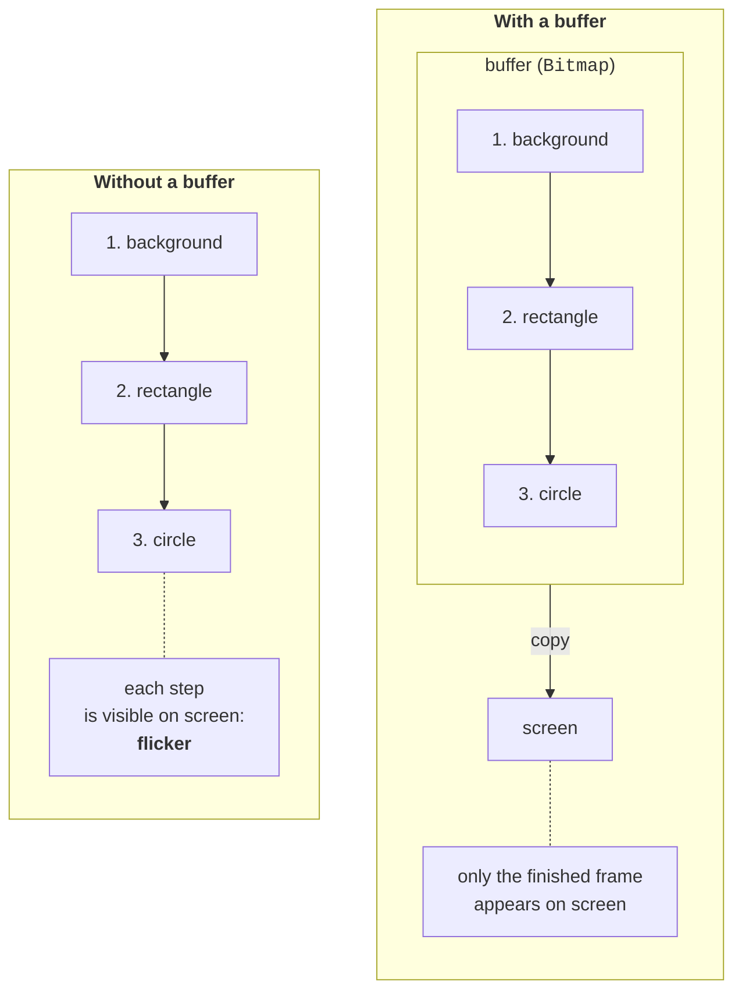
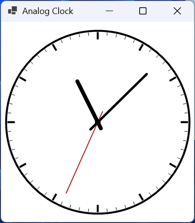
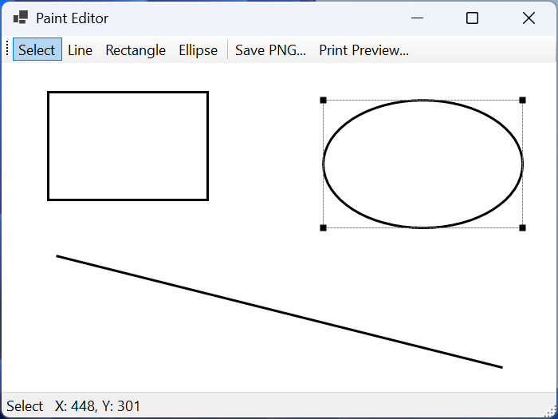

# Animation and drawing with the mouse

## Animation and double buffering

**Animation** is a sequence of frames: at regular intervals, the program changes the data (the angle of a clock hand, the position of a ball) and calls `Invalidate()`. For timing, Windows Forms has the `System.Windows.Forms.Timer` component (<https://learn.microsoft.com/dotnet/api/system.windows.forms.timer>). Its `Tick` event runs on the UI thread every `Interval` milliseconds, so the handler can safely change the form's fields and call `Invalidate()`. The timer's accuracy is limited (the documentation cites 55 ms), so for motion you should calculate the position from real time (`DateTime.Now`, `Stopwatch`) rather than count `Tick` calls.

### Flicker and how to eliminate it

An ordinary form is drawn directly on the screen: first the background (`OnPaintBackground`), then the shapes one by one. If the drawing is complex and is repainted often, the user sees intermediate frames—**flicker**. **Double buffering** eliminates it: all operations are performed in a buffer in memory, and the finished frame reaches the screen in a single copy operation (Fig. 4.6) (<https://learn.microsoft.com/dotnet/desktop/winforms/advanced/how-to-reduce-graphics-flicker-with-double-buffering-for-forms-and-controls>).



Figure 4.6. Drawing without a buffer and with double buffering {.caption}

Standard controls already use double buffering. For a form or a custom control, it is enabled in one of two ways:

```cs
// In the constructor of a form or a Control descendant.
DoubleBuffered = true;

// Or styles for a control that paints itself entirely.
SetStyle(ControlStyles.OptimizedDoubleBuffer
    | ControlStyles.AllPaintingInWmPaint
    | ControlStyles.UserPaint, true);
```

The `AllPaintingInWmPaint` style disables separate background erasing (the background is painted together with everything else in `OnPaint`), and `UserPaint` means the control paints itself rather than the operating system (<https://learn.microsoft.com/dotnet/api/system.windows.forms.controlstyles>). The `DoubleBuffered` property and the `SetStyle` method are **protected**, so for a `Panel` or another ready-made control you must create a descendant, as in the "Paint editor" example.

You can also create a buffer yourself: draw the frame into a `Bitmap`, and in `OnPaint` just copy it with the `DrawImage` method. This is done when the drawing accumulates (brush strokes in an editor) or when it is expensive to redraw for every `WM_PAINT`.

### The "Analog clock" example

The clock is repainted by a timer every 200 ms. The origin is moved to the center of the clock face, the tick marks are drawn by rotating the system, and each hand is drawn in a temporarily rotated system between `Save` and `Restore` (Fig. 4.7). The hands differ in thickness and length: the hour hand is the shortest and thickest, and the second hand is the thinnest and longest.

```cs
using System.Drawing.Drawing2D;

namespace Clock;

public class MainForm : Form
{
    private readonly System.Windows.Forms.Timer timer = new();

    public MainForm()
    {
        Text = "Analog Clock";
        ClientSize = new Size(360, 360);
        BackColor = Color.White;
        DoubleBuffered = true;       // no flicker
        ResizeRedraw = true;
        timer.Interval = 200;        // milliseconds
        timer.Tick += (sender, e) => Invalidate();
        timer.Start();
    }

    protected override void OnPaint(PaintEventArgs e)
    {
        base.OnPaint(e);
        DrawClock(e.Graphics, ClientSize, DateTime.Now);
    }

    protected override void Dispose(bool disposing)
    {
        if (disposing) timer.Dispose();
        base.Dispose(disposing);
    }
```

The full name `System.Windows.Forms.Timer` is needed because the implicit `using` directives also bring in `Timer` classes from the `System.Threading` and `System.Timers` namespaces, whose events run on another thread. The timer is released in the form's overridden `Dispose` method. The `DrawClock` method receives the time as a parameter, so it is easy to check for any moment:

```cs
public static void DrawClock(Graphics g, Size client,
    DateTime time)
{
    float r = Math.Min(client.Width, client.Height) / 2f - 10;
    if (r < 40) return;
    g.SmoothingMode = SmoothingMode.AntiAlias;
    // The origin is at the center of the clock face.
    g.TranslateTransform(client.Width / 2f, client.Height / 2f);

    using var rim = new Pen(Color.Black, 4);
    g.DrawEllipse(rim, -r, -r, 2 * r, 2 * r);
    DrawMarks(g, r);

    float hours = time.Hour % 12 + time.Minute / 60f;
    float minutes = time.Minute + time.Second / 60f;
    DrawHand(g, Color.Black, hours * 30, r * 0.5f, 8);
    DrawHand(g, Color.Black, minutes * 6, r * 0.75f, 5);
    DrawHand(g, Color.Firebrick, time.Second * 6, r * 0.85f, 2);
    g.FillEllipse(Brushes.Black, -6, -6, 12, 12);
}
```

An hour corresponds to 30° (360° / 12), and a minute and a second to 6°. The hour hand takes minutes into account, so at 10:30 it is halfway between 10 and 11.

```cs
// 60 tick marks: after each one, the system rotates by 6°.
private static void DrawMarks(Graphics g, float r)
{
    using var thin = new Pen(Color.Black, 1);
    using var thick = new Pen(Color.Black, 4);
    for (int i = 0; i < 60; i++)
    {
        bool isHour = i % 5 == 0;
        float inner = isHour ? r - 18 : r - 9;
        g.DrawLine(isHour ? thick : thin, 0, -r + 3, 0, -inner);
        g.RotateTransform(6);
    }
}
```

Each hand is drawn in a temporarily rotated system:

```cs
    private static void DrawHand(Graphics g, Color color,
        float angle, float length, float width)
    {
        GraphicsState state = g.Save();
        g.RotateTransform(angle);         // 0° – toward 12
        using var pen = new Pen(color, width);
        pen.StartCap = LineCap.Round;
        pen.EndCap = LineCap.Round;
        g.DrawLine(pen, 0, length * 0.15f, 0, -length);
        g.Restore(state);
    }
}
```

After 60 rotations of 6°, the system returns to its original position (360°), so the hands are drawn relative to the vertical. The numbers on the dial cannot be drawn in a rotated system: they would lie on their sides; their centers are calculated with `Math.Sin` and `Math.Cos`. A hand is drawn along the negative *y* axis (up) with a short "tail" behind the center.



Figure 4.7. The "Analog clock" application {.caption}

## Interactive drawing with the mouse

As the mouse moves over a control, the `MouseDown` (button pressed), `MouseMove` (cursor moves), and `MouseUp` (button released) events are raised, as well as `MouseClick`, `MouseDoubleClick`, and `MouseWheel`. The `MouseEventArgs e` parameter contains the cursor coordinates `e.X`, `e.Y` (`e.Location`) in the **control's** coordinate system and the `e.Button` button. Screen coordinates are returned by `Cursor.Position` and converted with the `PointToClient` and `PointToScreen` methods.

Drawing with the mouse is usually structured as follows:

1. `MouseDown`—create a new shape with a starting point or find the shape under the cursor;
2. `MouseMove` with the button pressed—change the shape's end point or move the selected shape and call `Invalidate()`;
3. `MouseUp`—finish the action;
4. `Paint`—draw **all** shapes in the list.

The drawing is stored as a **model**—a list of shape objects, not pixels. This lets you select and move shapes, save them to a file, and draw them at any scale.

### The "Paint editor" example

The editor draws lines, rectangles, and ellipses, lets you select a shape by clicking and drag it, shows the cursor coordinates in the status bar, saves the drawing as PNG, and shows a print preview (Fig. 4.8). The shapes form a class hierarchy: the abstract base class `Shape` and descendants that describe their own `GraphicsPath` outline (the `Shapes.cs` file).

```cs
using System.Drawing.Drawing2D;

namespace Editor;

// A shape is defined by two points: the start and end of the mouse drag.
public abstract class Shape
{
    public Point Start { get; set; }
    public Point End { get; set; }

    public Rectangle Bounds => Rectangle.FromLTRB(
        Math.Min(Start.X, End.X), Math.Min(Start.Y, End.Y),
        Math.Max(Start.X, End.X), Math.Max(Start.Y, End.Y));
```

The `Bounds` property normalizes the rectangle: the user can drag the mouse in any direction, and the width and height are always positive. Drawing and hit testing use the path created by the descendant:

```cs
// Each descendant describes its own path.
protected abstract GraphicsPath CreatePath();

public void Draw(Graphics g, Pen pen)
{
    using GraphicsPath path = CreatePath();
    g.DrawPath(pen, path);
}

// A hit inside the shape or near its outline.
public bool HitTest(Point point)
{
    using GraphicsPath path = CreatePath();
    using var zone = new Pen(Color.Black, 10);
    return path.IsVisible(point)
        || path.IsOutlineVisible(point, zone);
}
```

For a line, `IsVisible` always returns `False` (the path has no area), so the `IsOutlineVisible` check with a 10-pixel-wide pen does the work.

```cs
    public void Offset(int dx, int dy)
    {
        Start = new Point(Start.X + dx, Start.Y + dy);
        End = new Point(End.X + dx, End.Y + dy);
    }
}

public class LineShape : Shape
{
    protected override GraphicsPath CreatePath()
    {
        var path = new GraphicsPath();
        path.AddLine(Start, End);
        return path;
    }
}

public class RectangleShape : Shape
{
    protected override GraphicsPath CreatePath()
    {
        var path = new GraphicsPath();
        path.AddRectangle(Bounds);
        return path;
    }
}

public class EllipseShape : Shape
{
    protected override GraphicsPath CreatePath()
    {
        var path = new GraphicsPath();
        path.AddEllipse(Bounds);
        return path;
    }
}
```

To add a new kind of shape (a triangle, an arrow), one more `Shape` descendant is enough: the form code works with a `List<Shape>` and does not depend on the concrete classes. The form (the `MainForm.cs` file) creates a `ToolStrip` toolbar, a canvas, and a `StatusStrip` status bar:

```cs
using System.Drawing.Drawing2D;
using System.Drawing.Imaging;
using System.Drawing.Printing;

namespace Editor;

public enum Tool { Select, Line, Rectangle, Ellipse }

// A Panel with double buffering: the property is protected.
public class Canvas : Panel
{
    public Canvas()
    {
        DoubleBuffered = true;
        BackColor = Color.White;
    }
}
```

The form's fields store the drawing model (the list of shapes) and the state of mouse interaction:

```cs
public class MainForm : Form
{
    private readonly List<Shape> shapes = [];
    private readonly Canvas canvas = new() { Dock = DockStyle.Fill };
    private readonly ToolStrip toolBar = new();
    private readonly ToolStripStatusLabel status = new();
    private Tool tool = Tool.Line;
    private Shape? drawing;       // the shape being drawn now
    private Shape? selected;      // the selected shape
    private Point lastPoint;      // the previous mouse position
```

```cs
public MainForm()
{
    Text = "Paint Editor";
    ClientSize = new Size(700, 480);
    foreach (Tool t in Enum.GetValues<Tool>())
        toolBar.Items.Add(t.ToString(), null, (s, e) => tool = t);
    toolBar.Items.Add(new ToolStripSeparator());
    toolBar.Items.Add("Save PNG...", null, (s, e) => SavePng());
    toolBar.Items.Add("Print Preview...", null,
        (s, e) => ShowPrintPreview());
    var statusBar = new StatusStrip();
    statusBar.Items.Add(status);

    Controls.Add(canvas);     // Fill is added first
    Controls.Add(toolBar);
    Controls.Add(statusBar);
    canvas.Paint += (s, e) => DrawShapes(e.Graphics, true);
    canvas.MouseDown += Canvas_MouseDown;
    canvas.MouseMove += Canvas_MouseMove;
    canvas.MouseUp += (s, e) => drawing = null;
}
```

The tool buttons are created in a loop over the values of the `Tool` enumeration: each button's lambda expression captures its own value `t`. The selected tool and the cursor coordinates are shown in the status bar. The control with `DockStyle.Fill` is added first so that the strips docked at the top and bottom do not cover the canvas. The mouse handlers implement the steps described above:

```cs
private void Canvas_MouseDown(object? sender, MouseEventArgs e)
{
    if (e.Button != MouseButtons.Left) return;
    lastPoint = e.Location;
    if (tool == Tool.Select)
    {
        // The topmost shape is the last in the list, so search from the end.
        selected = shapes.LastOrDefault(
            s => s.HitTest(e.Location));
    }
    else
    {
        drawing = tool switch
        {
            Tool.Line => new LineShape(),
            Tool.Rectangle => new RectangleShape(),
            _ => new EllipseShape()
        };
        drawing.Start = drawing.End = e.Location;
        shapes.Add(drawing);
        selected = null;
    }
    canvas.Invalidate();
}
```

```cs
private void Canvas_MouseMove(object? sender, MouseEventArgs e)
{
    status.Text = $"{tool}   X: {e.X}, Y: {e.Y}";
    if (e.Button != MouseButtons.Left) return;
    if (drawing != null)
    {
        drawing.End = e.Location;          // stretching
    }
    else if (selected != null)
    {
        selected.Offset(e.X - lastPoint.X, e.Y - lastPoint.Y);
        lastPoint = e.Location;            // dragging
    }
    canvas.Invalidate();
}

private void DrawShapes(Graphics g, bool showSelection)
{
    g.SmoothingMode = SmoothingMode.AntiAlias;
    using var pen = new Pen(Color.Black, 3);
    foreach (Shape shape in shapes)
        shape.Draw(g, pen);                // a polymorphic call

    if (!showSelection || selected == null) return;
    Rectangle r = selected.Bounds;
    using var frame = new Pen(Color.Gray);
    frame.DashStyle = DashStyle.Dash;
    g.DrawRectangle(frame, r);
    Point[] handles = [new(r.Left, r.Top), new(r.Right, r.Top),
        new(r.Left, r.Bottom), new(r.Right, r.Bottom)];
    foreach (Point p in handles)
        g.FillRectangle(Brushes.Black, p.X - 4, p.Y - 4, 8, 8);
}
```

The selected shape is marked with a dashed frame and black square handles at the corners. When saving and printing, the handles are not needed, so `DrawShapes` has a `showSelection` parameter. The `SavePng`, `CreateDocument`, and `ShowPrintPreview` methods referenced by the toolbar buttons complete the `MainForm` class; they are covered in the next section. While testing the editor, a rectangle, an ellipse, and a line were drawn; clicking near the line in *Select* mode selects it, and clicking an empty area clears the selection (Fig. 4.8).



Figure 4.8. The "Paint editor" application {.caption}
