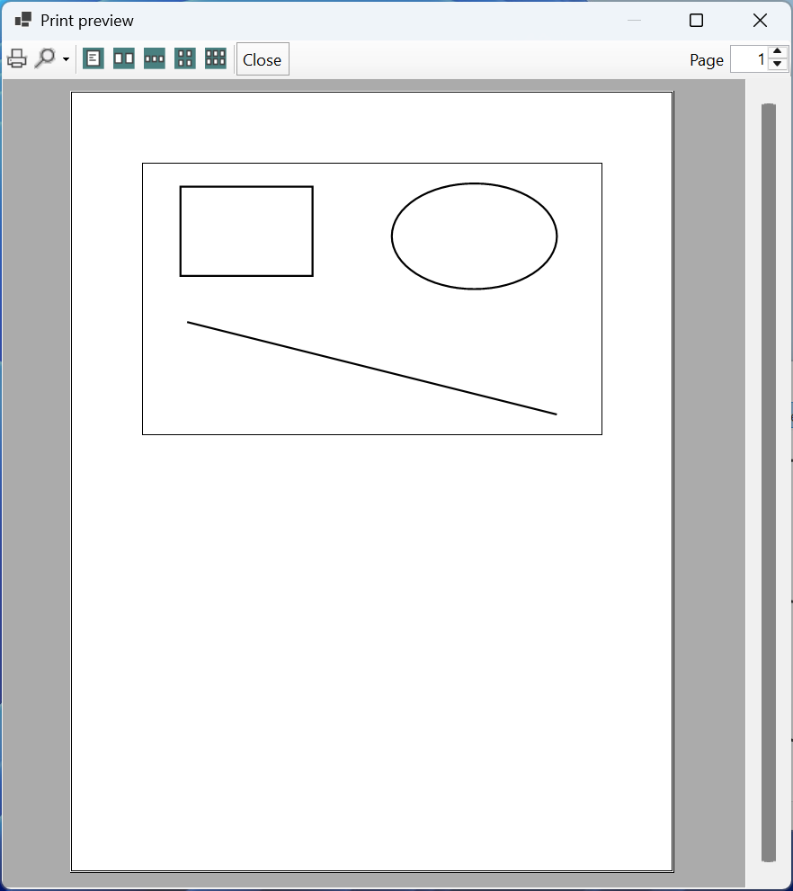

# Images, printing, and custom controls

## Images, export, and printing

### The `Image` and `Bitmap` classes

The abstract `Image` class describes an image, and its descendant **`Bitmap`** is a raster image with an array of pixels (<https://learn.microsoft.com/dotnet/api/system.drawing.bitmap>). GDI+ reads the BMP, PNG, JPEG, GIF, TIFF, and ICO formats and writes BMP, PNG, JPEG, GIF, and TIFF. The main operations:

- `Image.FromFile(path)` or `new Bitmap(path)`—load an image from a file;
- `new Bitmap(width, height)`—create an empty image (32 bits per pixel with transparency);
- `g.DrawImage(image, x, y)`—draw at natural size; `g.DrawImage(image, rectangle)`—scale into a rectangle;
- `g.InterpolationMode = InterpolationMode.HighQualityBicubic`—high-quality scaling (slower than `NearestNeighbor`, which keeps pixels sharp for pixel art);
- `bitmap.Save(path, ImageFormat.Png)`—save to a file.

::: tip Important
`Image.FromFile` keeps the file open until the image is released: while the program is running, the file cannot be overwritten or deleted. If the image is needed for a long time, create a copy in memory (`new Bitmap(file)`) and release the loaded image immediately.
:::

### Drawing into a `Bitmap` and saving as PNG

The `Graphics.FromImage(bitmap)` method returns a `Graphics` object that draws into the image. The same code that draws on screen can create a file. This is how the paint editor saves a drawing: the `Bitmap` dimensions equal the canvas dimensions, the background is filled with white (otherwise it is transparent), and the selection handles are not drawn:

```cs
private void SavePng()
{
    using var dialog = new SaveFileDialog
    {
        Filter = "PNG image (*.png)|*.png",
        FileName = "drawing.png"
    };
    if (dialog.ShowDialog(this) != DialogResult.OK) return;

    using var bitmap = new Bitmap(canvas.Width, canvas.Height);
    using (Graphics g = Graphics.FromImage(bitmap))
    {
        g.Clear(Color.White);
        DrawShapes(g, false);              // without selection handles
    }
    bitmap.Save(dialog.FileName, ImageFormat.Png);
}
```

The PNG format stores images losslessly and is suitable for diagrams and charts; JPEG compresses with losses and is suitable for photos. The `System.Drawing.Imaging` namespace must be included with a `using` directive. Any control can also be saved as an image with the `control.DrawToBitmap(bitmap, rectangle)` method.

### Working with pixels

The `GetPixel(x, y)` and `SetPixel(x, y, color)` methods read and change an individual pixel. For example, conversion to **grayscale** calculates the brightness of each pixel as a weighted sum of the components:

```cs
static Bitmap ToGray(Bitmap source)
{
    var result = new Bitmap(source.Width, source.Height);
    for (int y = 0; y < source.Height; y++)
    {
        for (int x = 0; x < source.Width; x++)
        {
            Color c = source.GetPixel(x, y);
            int gray = (int)(0.299 * c.R + 0.587 * c.G
                + 0.114 * c.B);
            result.SetPixel(x, y,
                Color.FromArgb(c.A, gray, gray, gray));
        }
    }
    return result;
}
```

The `GetPixel` and `SetPixel` methods are simple but slow: each call checks the coordinates and locks the image. For a 1920 × 1080 image (over 2 million pixels), this method took 0.76 s on the test computer. For fast processing, use the `LockBits` method, which provides direct access to the image's byte array (`BitmapData`), and call `UnlockBits` after processing (<https://learn.microsoft.com/dotnet/api/system.drawing.imaging.bitmapdata>).

### Printing

Printing in Windows Forms is built on the same event model as drawing in a window. The **`PrintDocument`** class (the `System.Drawing.Printing` namespace) describes a document; for each page, it raises the **`PrintPage`** event, in which the program draws the page through `e.Graphics` (<https://learn.microsoft.com/dotnet/api/system.drawing.printing.printdocument>). The `PrintPageEventArgs e` parameter contains:

- `e.Graphics`—the page "canvas"; the default unit is 1/100 inch;
- `e.MarginBounds`—the page rectangle without margins (1-inch margins by default);
- `e.PageBounds`—the entire page;
- `e.HasMorePages`—set it to `true` if there is another page after this one: the `PrintPage` event will run again.

The paint editor creates a one-page document. The drawing is moved within the margins and, if necessary, reduced so that both the width and height fit:

```cs
    private PrintDocument CreateDocument()
    {
        var document = new PrintDocument { DocumentName = "Drawing" };
        document.PrintPage += (sender, e) =>
        {
            Graphics g = e.Graphics!;
            Rectangle m = e.MarginBounds;      // page margins
            float scale = Math.Min(1f, Math.Min(
                (float)m.Width / canvas.Width,
                (float)m.Height / canvas.Height));
            g.TranslateTransform(m.Left, m.Top);
            g.ScaleTransform(scale, scale);
            g.DrawRectangle(Pens.Black, 0, 0,
                canvas.Width, canvas.Height);
            DrawShapes(g, false);
            e.HasMorePages = false;            // one page
        };
        return document;
    }

    private void ShowPrintPreview()
    {
        using PrintDocument document = CreateDocument();
        using var preview = new PrintPreviewDialog
        {
            Document = document,
            ClientSize = new Size(800, 600)
        };
        preview.ShowDialog(this);
    }
}
```

The page unit is 1/100 inch, so a 700-pixel-wide canvas on an A4 page (8.27 inches) with 1-inch margins is reduced to the width of the area—627 units. To print the document on a selected printer, use the `PrintDialog` dialog:

```cs
using var printDialog = new PrintDialog { Document = document };
if (printDialog.ShowDialog(this) == DialogResult.OK)
    document.Print();
```

The **`PrintDialog`** dialog lets you choose the printer, the number of copies, and the pages (<https://learn.microsoft.com/dotnet/api/system.windows.forms.printdialog>). The **`PrintPreviewDialog`** dialog shows the pages on screen before printing (Fig. 4.9): all it needs is for the `Document` property to be set and `ShowDialog` to be called (<https://learn.microsoft.com/dotnet/api/system.windows.forms.printpreviewdialog>). To test printing without paper, select the *Microsoft Print to PDF* virtual printer in the dialog.



Figure 4.9. Print preview of a drawing {.caption}

## A custom control

If a drawing is needed in several forms, it is packaged as a **custom control**: a class derived from `Control` that paints itself in `OnPaint` (<https://learn.microsoft.com/dotnet/desktop/winforms/controls/custom>). Such a control has properties and events, appears in the *Toolbox* after the project is built, and is edited in the *Properties* window just like the standard controls.

Rules for creating one:

- in the constructor, enable the `UserPaint`, `AllPaintingInWmPaint`, `OptimizedDoubleBuffer`, and `ResizeRedraw` styles;
- in the setter of each property that affects the appearance, validate the value and call `Invalidate()`;
- for the background and font, use the control's `BackColor`, `ForeColor`, and `Font` properties;
- mark properties with attributes from the `System.ComponentModel` namespace: `[Category]` (the group in the *Properties* window), `[Description]` (the hint at the bottom of the window), `[DefaultValue]` (the default value: it is not written to `Designer.cs` and is shown in regular rather than bold font).

```cs
using System.ComponentModel;

namespace Gauge;

// A semicircular gauge: an arc whose length is proportional to Value.
public class GaugeControl : Control
{
    private int value;

    public GaugeControl()
    {
        SetStyle(ControlStyles.UserPaint
            | ControlStyles.AllPaintingInWmPaint
            | ControlStyles.OptimizedDoubleBuffer
            | ControlStyles.ResizeRedraw, true);
    }

    [Category("Gauge")]
    [Description("Current value from 0 to 100.")]
    [DefaultValue(0)]
    public int Value
    {
        get => value;
        set { this.value = Math.Clamp(value, 0, 100); Invalidate(); }
    }

    protected override void OnPaint(PaintEventArgs e)
    {
        base.OnPaint(e);
        if (Width < 30 || Height < 30) return;
        var box = new Rectangle(10, 10, Width - 20, 2 * Height - 40);
        using var track = new Pen(Color.Gainsboro, 12);
        using var bar = new Pen(ForeColor, 12);
        e.Graphics.DrawArc(track, box, 180, 180);
        e.Graphics.DrawArc(bar, box, 180, 180f * value / 100);
    }
}
```

The gauge is a thick light gray 180° arc (the upper half of an ellipse), on top of which an arc in the `ForeColor` color (black by default) occupies a part proportional to the value. In form code, the control is used like any other: `var gauge = new GaugeControl { Value = 65 };`, and changing `gauge.Value` immediately repaints the gauge.

::: tip Important
In .NET 10, the Windows Forms analyzer checks the public properties of controls. If a property has no `[DefaultValue]` or `[DesignerSerializationVisibility]` attribute and no `ShouldSerializeValue` method, the build fails with error WFO1000 *Property 'Value' does not configure the code serialization for its property content*. The attribute tells the form designer whether the value must be written to `Designer.cs`.
:::

After the project is built (**Ctrl+Shift+B**), the control appears in the *Toolbox* window in a section named after the project (Fig. 4.10). You drag it onto the form, and the `Value` property is found in the *Properties* window in the *Gauge* group (<https://learn.microsoft.com/dotnet/desktop/winforms/controls-design/how-to-create-usercontrol>).


Figure 4.10. A custom control in the *Toolbox* and the *Properties* window {.caption}
