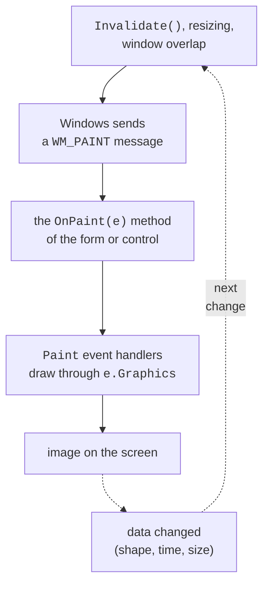
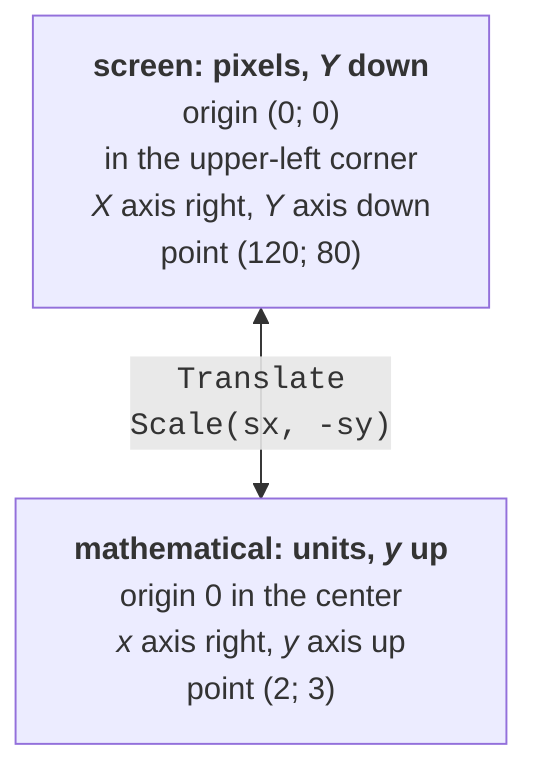
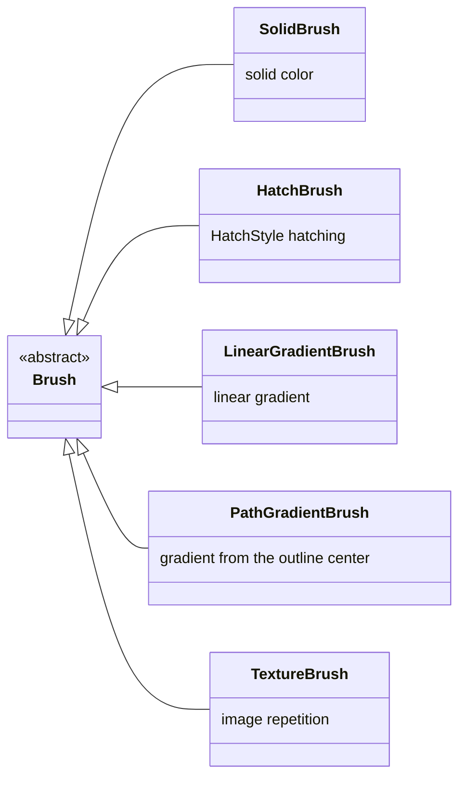

# The Paint event, colors, and pens

## GDI+ and the `Paint` event

Windows Forms controls (buttons, fields, tables) draw themselves. When you need to show something that the ready-made controls do not offer—a chart, a diagram, a clock face, a game board—the program draws it itself. For this, Windows Forms uses **GDI+** (*Graphics Device Interface*), the Windows graphics subsystem that draws lines, shapes, text, and images on the screen, in bitmaps, and on the printer (<https://learn.microsoft.com/dotnet/desktop/winforms/advanced/graphics-and-drawing-in-windows-forms>).

GDI+ classes are collected in the `System.Drawing` namespace (`Graphics`, `Pen`, `Brush`, `Font`, `Color`, `Point`, `Rectangle`, `Bitmap`) and the nested namespaces `System.Drawing.Drawing2D` (gradients, hatching, `GraphicsPath`, `Matrix`), `System.Drawing.Imaging` (image formats), and `System.Drawing.Printing` (printing). In a Windows Forms project, the `System.Drawing` and `System.Windows.Forms` namespaces are included by implicit `using` directives (`<ImplicitUsings>enable</ImplicitUsings>`); the others are included explicitly.

GDI+ is a **Windows-only** technology. Starting with .NET 7, the `System.Drawing.Common` library does not work on other operating systems: calls throw `PlatformNotSupportedException` (<https://learn.microsoft.com/dotnet/core/compatibility/core-libraries/6.0/system-drawing-common-windows-only>). For Windows Forms applications this is not a limitation, since they run only on Windows anyway (the `net10.0-windows` target platform). For image processing in cross-platform programs (web services, Linux), Microsoft recommends third-party libraries such as SkiaSharp or ImageSharp.

### The `Graphics` class

All drawing is done through an object of the **`Graphics`** class—a "canvas" with the methods `DrawLine`, `FillRectangle`, `DrawString`, `DrawImage`, and so on (<https://learn.microsoft.com/dotnet/api/system.drawing.graphics>). A `Graphics` object is associated with a particular surface: a window, a `Bitmap`, or a printer page. Drawing code that takes a `Graphics` parameter draws the same way on all these surfaces: this is used later for saving a drawing as PNG and for printing.

The `Graphics` methods form two groups: the `Draw…` methods draw the **outline** of a shape with a pen (`Pen`), and the `Fill…` methods **fill** its interior with a brush (`Brush`).

### The `Paint` event and the `OnPaint` method

Windows does not store the window image. When a window first appears, is resized, or has part of it uncovered by another window, the system sends the window a `WM_PAINT` message, and the window must redraw itself. In Windows Forms, this message calls the `OnPaint` method, which raises the **`Paint`** event (Fig. 4.1). The `PaintEventArgs e` parameter contains a ready-made `e.Graphics` object and the `e.ClipRectangle` rectangle—the area that needs to be updated (<https://learn.microsoft.com/dotnet/desktop/winforms/controls/custom-painting-drawing>).



Figure 4.1. The window repaint cycle {.caption}

There are two ways to draw. In a form or control that the programmer creates, you override the `OnPaint` method:

```cs
public class MainForm : Form
{
    protected override void OnPaint(PaintEventArgs e)
    {
        base.OnPaint(e);                // invoke the Paint handlers
        e.Graphics.DrawRectangle(Pens.Black, 20, 20, 200, 100);
        e.Graphics.DrawString("Hello, GDI+!", Font,
            Brushes.Black, 30, 55);
    }
}
```

For a ready-made control (for example, a `Panel` or `PictureBox`), you subscribe to the `Paint` event: `panel.Paint += Panel_Paint;`, and the `Panel_Paint(object? sender, PaintEventArgs e)` handler draws through `e.Graphics`. The `base.OnPaint(e)` call is needed so that the `Paint` event handlers subscribed to this form run. Drawing code must be **fast** and **must not change data**: `OnPaint` is called many times, for example on every window resize.

### `Invalidate`, `Update`, and `Refresh`

When the data has changed (a shape was added, a second passed), the image must be redrawn. The `OnPaint` method is **never called directly**: instead, you call one of the control's methods (<https://learn.microsoft.com/dotnet/api/system.windows.forms.control.invalidate>):

- `Invalidate()`—marks the whole control (or the rectangle `Invalidate(rect)`) as needing to be repainted; Windows sends `WM_PAINT` when the message queue is free. Several consecutive calls are combined into one paint;
- `Update()`—immediately paints the areas already marked;
- `Refresh()`—`Invalidate()` and `Update()` together: repaints immediately.

In most cases, `Invalidate()` is enough. If the image depends on the window size, set the `ResizeRedraw = true` property: then the form is repainted completely on every resize, not just in the newly exposed strip.

::: tip Important
The `CreateGraphics()` method returns a `Graphics` object for the window, and you can draw with it anywhere, for example in a button handler. But such an image disappears on the very first repaint: minimize the window, and the drawing is gone. The correct approach: store the data (a list of shapes, coordinates) in the form's fields, call `Invalidate()`, and draw everything in `OnPaint`.
:::

## The coordinate system and colors

By default, GDI+ uses the **screen coordinate system** in pixels: the origin (0; 0) is in the upper-left corner of the client area, the *X* axis points right, and the *Y* axis points **down** (Fig. 4.2). The **client area** is the part of the window without the title bar and border; its dimensions are returned by the `ClientSize` and `ClientRectangle` properties. A mathematical coordinate system (the *y* axis up, the origin in the center) is obtained with transformations, discussed later.



Figure 4.2. Screen and mathematical coordinate systems {.caption}

There are structures for coordinates and sizes (Table 4.1). Each has an integer variant and a variant with the `F` suffix for fractional values (`float`).

Table 4.1. Coordinate and size structures {.caption}

| **Structure** | **Purpose and example** |
| --- | --- |
| `Point`, `PointF` | a point: `new Point(120, 80)`, the `X`, `Y` properties |
| `Size`, `SizeF` | a size: `new Size(640, 400)`, the `Width`, `Height` properties |
| `Rectangle`, `RectangleF` | a rectangle: `new Rectangle(x, y, width, height)`; `Left`, `Right`, `Top`, `Bottom`, `Contains(point)`, `Inflate(dx, dy)`, `IntersectsWith(r)` |

All these types are **structures**, that is, value types. So the line `shape.Location.Offset(5, 5);` changes a **copy** of the point, not the property: you must assign a new value, `shape.Location = new Point(x + 5, y + 5)`.

### Colors

A color is specified by the `Color` structure with four components from 0 to 255: the **alpha channel** A (opacity) and red, green, and blue (R, G, B). Predefined colors are available as static properties (`Color.Black`, `Color.DimGray`), and arbitrary ones are created with the `Color.FromArgb` method: `Color.FromArgb(40, 40, 40)` is dark gray, and `Color.FromArgb(96, Color.Gray)` is semitransparent gray. An alpha channel of 255 means a fully opaque color, and 0 means fully transparent; a semitransparent shape blends with what is already drawn beneath it. The examples in this lecture mostly use black and shades of gray, and shapes are distinguished by line style, hatching, and labels: such a drawing reads well both on screen and in black-and-white print.

## Pens, brushes, and releasing resources

### The `Pen`

A **pen** determines how a line or outline is drawn: the color, the `Width` thickness, the `DashStyle` dash pattern, the `StartCap` and `EndCap` end shapes, and the `LineJoin` corner style:

```cs
Point[] points = [new(20, 130), new(80, 30), new(140, 130),
                  new(200, 30), new(260, 130)];
using var pen = new Pen(Color.Black, 12);
pen.DashStyle = DashStyle.Solid;     // Dash, Dot, DashDot…
pen.LineJoin = LineJoin.Round;       // rounded corners
pen.StartCap = LineCap.Round;        // round start
pen.EndCap = LineCap.ArrowAnchor;    // an arrow at the end
g.DrawLines(pen, points);            // a polyline of five points
```

The pen width is specified in units of the current coordinate system: after scaling (`ScaleTransform`), lines also become thicker or thinner.

### Brushes

A **brush** determines how the interior of a shape or text characters is filled. The abstract `Brush` class has five descendants (Fig. 4.3):

- `SolidBrush`—a solid color;
- `HatchBrush`—a two-color hatch pattern; the pattern is set by the `HatchStyle` enumeration (`DiagonalCross`, `Horizontal`, `Percent20`, and several dozen more);
- `LinearGradientBrush`—a smooth transition between two colors along a line;
- `PathGradientBrush`—a transition from the center of a shape to its outline;
- `TextureBrush`—a fill that repeats an image (tiling).



Figure 4.3. The GDI+ brush class hierarchy {.caption}

```cs
var box = new Rectangle(20, 20, 160, 100);
using var path = new GraphicsPath();
path.AddEllipse(box);
using var radial = new PathGradientBrush(path)
{
    CenterColor = Color.White,        // light center
    SurroundColors = [Color.Black]    // dark edge
};
g.FillEllipse(radial, box);
```

The gradient in this example is described in terms of brightness: the center of the ellipse is light, and the edges are dark. A gradient between any two colors works the same way: the brush calculates intermediate values for each of the A, R, G, B components.

### Releasing resources: `using` and `Dispose`

Pens, brushes, fonts, `GraphicsPath` outlines, images, and `Graphics` itself hold **unmanaged** GDI+ resources (operating system handles). All these classes implement the `IDisposable` interface: after use, you must call `Dispose()` on them. The easiest way is a `using` declaration, which releases the object at the end of the block even if an exception occurs:

```cs
using var pen = new Pen(Color.Black, 2);   // Dispose at the end of the method
using (var font = new Font("Segoe UI", 12))
{
    g.DrawString("Text", font, Brushes.Black, 10, 10);
}                                          // Dispose here
```

The garbage collector will eventually release forgotten objects too, but until then the resources remain occupied; `OnPaint` runs dozens of times per second, so a leak quickly exhausts the process's GDI object limit. There are two exceptions:

- do **not** release `e.Graphics` from `PaintEventArgs`: Windows Forms owns it;
- do **not** release the standard objects `Pens.Black`, `Brushes.Gray`, `SystemBrushes.Control`: they are shared by the whole program.
