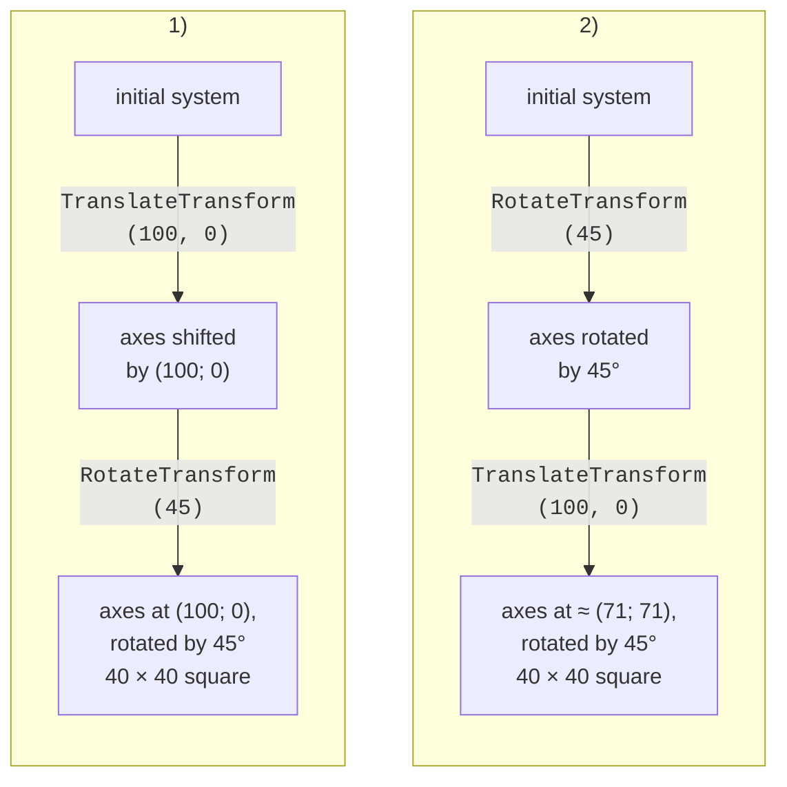
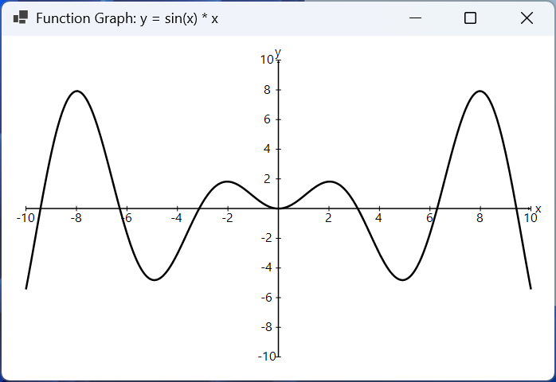

# Shapes, text, and transformations

## Shapes

The main `Graphics` methods for shapes are listed in Table 4.2. Each `Draw…` method has a `Fill…` counterpart, except for lines and Bézier curves, which have no interior. All methods have overloads with integer (`int`, `Point`, `Rectangle`) and fractional (`float`, `PointF`, `RectangleF`) coordinates.

Table 4.2. Shape drawing methods {.caption}

| **Method** | **What it draws** |
| --- | --- |
| `DrawLine`, `DrawLines` | a line segment; a polyline from an array of points |
| `DrawRectangle`, `FillRectangle` | a rectangle (`x`, `y` is the upper-left corner) |
| `DrawRoundedRectangle` | a rectangle with rounded corners (the corner size is a `Size`) |
| `DrawEllipse`, `FillEllipse` | an ellipse inscribed in a rectangle; a circle if the width equals the height |
| `DrawArc` | an arc of an ellipse: the start angle and the sweep angle in degrees |
| `DrawPie`, `FillPie` | a sector of an ellipse (for pie charts) |
| `DrawPolygon`, `FillPolygon` | a closed polygon from an array of points |
| `DrawBezier` | a Bézier curve from four points: start, two control points, end |
| `DrawCurve`, `DrawClosedCurve` | a smooth curve (a cardinal spline) through all the points |
| `DrawPath`, `FillPath` | a compound `GraphicsPath` shape |
| `Clear(color)` | fills the entire surface with a color |

The angles in `DrawArc` and `DrawPie` are measured in degrees **clockwise** from the positive direction of the *X* axis (from "three o'clock"), because the *Y* axis points down. So an angle of −90° means the upward direction.

By default, sloping lines and circles have "jaggies" at the edges. The `g.SmoothingMode = SmoothingMode.AntiAlias` property enables **anti-aliasing**: edge pixels are partially filled, and lines look smooth. Anti-aliasing slows drawing slightly, but in ordinary applications this is unnoticeable.

Each shape is first filled with a brush (`Fill…`) and then outlined with a pen (`Draw…`) so that the fill does not cover the outline:

```cs
g.SmoothingMode = SmoothingMode.AntiAlias;
using var outline = new Pen(Color.Black, 2);
using var hatch = new HatchBrush(HatchStyle.DiagonalCross,
    Color.DimGray, Color.White);
var rect = new Rectangle(20, 20, 130, 90);
g.FillRectangle(hatch, rect);          // fill first
g.DrawRectangle(outline, rect);        // then the outline
g.FillPie(Brushes.LightGray, 180, 20, 90, 90, -90, 270);
g.DrawPie(outline, 180, 20, 90, 90, -90, 270);
```

The sector starts at an angle of −90° (up) and spans 270° clockwise, that is, three quarters of a circle.

## Text

Text is drawn by the `DrawString` method: a string, a `Font`, a brush, and a point or rectangle (<https://learn.microsoft.com/dotnet/api/system.drawing.graphics.drawstring>). A **font** is specified by the typeface name, the size in points, and a `FontStyle` (`Bold`, `Italic`, `Underline`, `Strikeout`, which can be combined with the `|` operator). The form's `Font` property is the default font; it is not released.

If you pass a rectangle, the text automatically wraps at word boundaries, and a **`StringFormat`** object sets alignment and trimming (<https://learn.microsoft.com/dotnet/api/system.drawing.stringformat>):

```cs
using var font = new Font("Segoe UI", 12);
var box = new RectangleF(20, 20, 180, 70);
using var format = new StringFormat
{
    Alignment = StringAlignment.Center,     // horizontally
    LineAlignment = StringAlignment.Center, // vertically
    Trimming = StringTrimming.EllipsisWord  // "…" if it does not fit
};
g.DrawRectangle(Pens.Black, Rectangle.Round(box));
g.DrawString("GDI+ wraps long text inside the rectangle",
    font, Brushes.Black, box, format);
```

The value `StringAlignment.Near` means the left (top) edge, `Center` the center, and `Far` the right (bottom) edge. To position text precisely (centered on a chart bar, to the right of an axis), you need to know its size. The **`MeasureString`** method returns the `SizeF` size of a string for a given font:

```cs
SizeF size = g.MeasureString("Hello, GDI+!", font);
float x = center.X - size.Width / 2;       // text centered on the point
float y = center.Y - size.Height / 2;
g.DrawString("Hello, GDI+!", font, Brushes.Black, x, y);
```

For the Segoe UI 12 pt font, the string "Hello, GDI+!" measures 94.6 × 23.3 pixels: `MeasureString` adds small margins on the left and right, so text aligned by this size looks slightly shifted.

Windows Forms has another way to draw text—the **`TextRenderer`** class with the `DrawText` and `MeasureText` methods (<https://learn.microsoft.com/dotnet/api/system.windows.forms.textrenderer>). It uses the older GDI library, just like the standard controls, so the text looks the same as the captions on buttons and labels. A practical rule: `TextRenderer` is for on-screen text in custom controls; `DrawString` is for drawings that are saved to a `Bitmap`, printed, or scaled with transformations (`TextRenderer` does not support `Graphics` rotation and scaling and draws poorly on a transparent `Bitmap`).

## Coordinate transformations

Instead of recalculating the coordinates of every point, you can change the `Graphics` coordinate system itself. The **transformation** methods (<https://learn.microsoft.com/dotnet/desktop/winforms/advanced/coordinate-systems-and-transformations>):

- `TranslateTransform(dx, dy)`—move the origin;
- `RotateTransform(angle)`—rotate the axes by an angle in degrees (clockwise);
- `ScaleTransform(sx, sy)`—change the scale of the axes; a negative factor mirrors the axis;
- `ResetTransform()`—restore the original system.

After a transformation, all drawing methods work in the new system. For example, a clock face is convenient to draw with the origin at the center: a tick mark is drawn once at the top, and the system is rotated by 6°.

### The order of transformations

Each subsequent call changes the **already transformed** system. So the order matters (Fig. 4.4):

1. `TranslateTransform(100, 0)`, then `RotateTransform(45)`: the origin moves to the point (100; 0), and then the axes rotate around the new origin. The square is at the point (100; 0), rotated by 45°;
2. `RotateTransform(45)`, then `TranslateTransform(100, 0)`: the axes rotate first, and the 100-pixel translation happens along the **rotated** *x* axis. The square ends up at the point (70.7; 70.7).



Figure 4.4. The order of coordinate transformations: a 40 × 40 square in the final system {.caption}

### The `Matrix` class, `Save`, and `Restore`

All transformations are stored in a 3 × 3 matrix of the **`Matrix`** class (<https://learn.microsoft.com/dotnet/api/system.drawing.drawing2d.matrix>). The `g.Transform` property returns and changes the current matrix. A `Matrix` object has the same `Translate`, `Rotate`, and `Scale` methods and, in addition, the `TransformPoints` method, which transforms an array of points. This lets you convert mathematical coordinates to pixels without changing `Graphics`: lines and text are then neither scaled nor mirrored.

If you need to change the system temporarily (to rotate one clock hand), save its state with `g.Save()` and restore it with `g.Restore(state)`:

```cs
GraphicsState state = g.Save();   // remember the system
g.RotateTransform(angle);
g.DrawLine(pen, 0, 0, 0, -length);
g.Restore(state);                 // restore the system
```

::: tip Important
After `ScaleTransform(1, -1)`, the *y* axis points up, but text and images are mirrored too and drawn upside down, and the pen width is scaled together with the axes. So it is more convenient to build charts as in the "Function graph" example: transform the points with a matrix and draw in the screen coordinate system.
:::

### The "Function graph" example

The application plots the function *y* = sin(*x*) · *x* on the interval [−10; 10] with axes and labels. When the window is resized, the graph scales to the new size (Fig. 4.5).

```cs
using System.Drawing.Drawing2D;

namespace Graph;

public class MainForm : Form
{
    // The visible part of the mathematical plane.
    private const float XMin = -10, XMax = 10;
    private const float YMin = -10, YMax = 10;

    public MainForm()
    {
        Text = "Function Graph: y = sin(x) * x";
        ClientSize = new Size(600, 500);
        MinimumSize = new Size(300, 250);
        BackColor = Color.White;
        DoubleBuffered = true;
        ResizeRedraw = true;
    }
```

The plot area is the client area minus 30-pixel strips on each side, where the tick labels are placed:

```cs
protected override void OnPaint(PaintEventArgs e)
{
    base.OnPaint(e);
    Rectangle area = ClientRectangle;
    area.Inflate(-30, -30);          // margins for labels
    DrawGraph(e.Graphics, area);
}
```

The matrix converts a point of the mathematical plane to pixels of the `area` rectangle. By default, `Matrix` methods are applied to a point in the **reverse** order of the calls, just like the `Graphics` calls in Fig. 4.4: the last translation is performed first.

```cs
private static Matrix CreateMatrix(Rectangle area)
{
    float sx = area.Width / (XMax - XMin);
    float sy = area.Height / (YMax - YMin);
    var m = new Matrix();
    m.Translate(area.Left, area.Top);  // 3) to the area rectangle
    m.Scale(sx, -sy);                  // 2) scale, Y up
    m.Translate(-XMin, -YMax);         // 1) (XMin; YMax) to 0
    return m;
}
```

The `DrawGraph` method calculates the curve points in mathematical coordinates and transforms the whole array with a single `TransformPoints` call:

```cs
public static void DrawGraph(Graphics g, Rectangle area)
{
    g.SmoothingMode = SmoothingMode.AntiAlias;
    using Matrix m = CreateMatrix(area);
    DrawAxes(g, m);

    const int Segments = 400;
    var points = new PointF[Segments + 1];
    for (int i = 0; i <= Segments; i++)
    {
        float x = XMin + (XMax - XMin) * i / Segments;
        points[i] = new PointF(x, MathF.Sin(x) * x);
    }
    m.TransformPoints(points);         // to pixels
    using var pen = new Pen(Color.Black, 2.5f);
    g.DrawLines(pen, points);
}
```

The point (−10; 10) goes to the upper-left corner of the area, and (10; −10) to the lower-right one. The curve consists of 400 segments, which is enough for it to look smooth. The axes, tick marks, and labels are drawn the same way:

```cs
    private static void DrawAxes(Graphics g, Matrix m)
    {
        using var font = new Font("Segoe UI", 8);
        using var axis = new Pen(Color.Black, 1.5f);
        axis.EndCap = LineCap.ArrowAnchor;

        for (int v = -10; v <= 10; v += 2)   // tick marks and labels
        {
            if (v == 0) continue;
            PointF[] p = [new(v, 0), new(0, v)];
            m.TransformPoints(p);
            g.DrawLine(Pens.Black, p[0].X, p[0].Y - 3,
                p[0].X, p[0].Y + 3);
            g.DrawLine(Pens.Black, p[1].X - 3, p[1].Y,
                p[1].X + 3, p[1].Y);
            DrawLabel(g, v.ToString(), font, p[0].X, p[0].Y + 12);
            DrawLabel(g, v.ToString(), font, p[1].X - 14, p[1].Y);
        }

        PointF[] ends = [new(XMin, 0), new(XMax, 0),
                         new(0, YMin), new(0, YMax)];
        m.TransformPoints(ends);
        g.DrawLine(axis, ends[0], ends[1]);
        g.DrawLine(axis, ends[2], ends[3]);
        DrawLabel(g, "x", font, ends[1].X + 10, ends[1].Y);
        DrawLabel(g, "y", font, ends[3].X, ends[3].Y - 10);
    }

    // Text centered on the point (x; y).
    private static void DrawLabel(Graphics g, string text,
        Font font, float x, float y)
    {
        SizeF size = g.MeasureString(text, font);
        g.DrawString(text, font, Brushes.Black,
            x - size.Width / 2, y - size.Height / 2);
    }
}
```



Figure 4.5. The "Function graph" application {.caption}

## Compound shapes: `GraphicsPath` and `Region`

The **`GraphicsPath`** class (a path) combines lines, curves, shapes, and even text into a single shape (<https://learn.microsoft.com/dotnet/api/system.drawing.drawing2d.graphicspath>). Shapes are added with the `AddLine`, `AddRectangle`, `AddRoundedRectangle`, `AddEllipse`, `AddArc`, `AddPolygon`, `AddBezier`, and `AddString` methods; the `CloseFigure` method closes the current figure. A finished path is drawn with the `DrawPath` and `FillPath` methods:

```cs
using var path = new GraphicsPath();
path.AddEllipse(20, 20, 100, 100);
path.AddRoundedRectangle(new Rectangle(140, 40, 120, 60),
    new Size(20, 20));
path.AddString("GDI+", FontFamily.GenericSansSerif,
    (int)FontStyle.Bold, 60, new Point(20, 120),
    StringFormat.GenericDefault);
using var hatch = new HatchBrush(HatchStyle.LargeCheckerBoard,
    Color.Gray, Color.White);
g.FillPath(hatch, path);             // one fill for all shapes
g.DrawPath(Pens.Black, path);
```

A path is useful not only for drawing but also for **hit testing**—checking whether the mouse cursor is inside a shape:

- `path.IsVisible(point)`—the point lies inside a closed figure;
- `path.IsOutlineVisible(point, pen)`—the point lies on the outline drawn with the `pen` pen (a wide pen gives a "capture zone" for thin lines);
- `path.GetBounds()`—the rectangle that bounds the path.

For a circle inscribed in the square (20; 20)–(140; 140), `IsVisible(80, 80)` returns `True`, and `IsVisible(25, 25)` returns `False`: the corner of the square lies outside the circle, although inside the `GetBounds()` rectangle.

A **region** (`Region`) is an area of the plane that can be built from rectangles and paths with the `Union`, `Intersect`, `Exclude`, and `Xor` operations (<https://learn.microsoft.com/dotnet/api/system.drawing.region>). A region is used for **clipping**: after `g.Clip` is assigned, drawing happens only inside the region, and the rest is ignored.

```cs
using var ellipse = new GraphicsPath();
ellipse.AddEllipse(20, 20, 220, 140);
using var region = new Region(ellipse);
region.Exclude(new Rectangle(100, 60, 60, 60)); // a "hole"
g.Clip = region;                        // draw only here
for (int x = 0; x < 400; x += 8)
    g.DrawLine(Pens.Black, x, 0, x - 180, 180);
g.ResetClip();
g.DrawPath(Pens.Black, ellipse);
```

The sloping lines fill only the ellipse without the square hole in the center. Clipping is used to keep a chart within its area, to repaint only the changed part, or to create shaped windows (the form's `Region` property).
