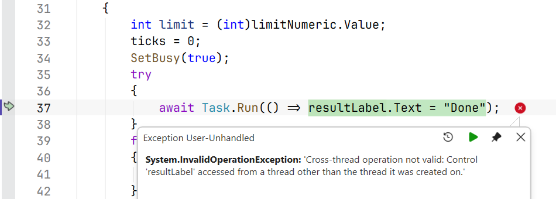
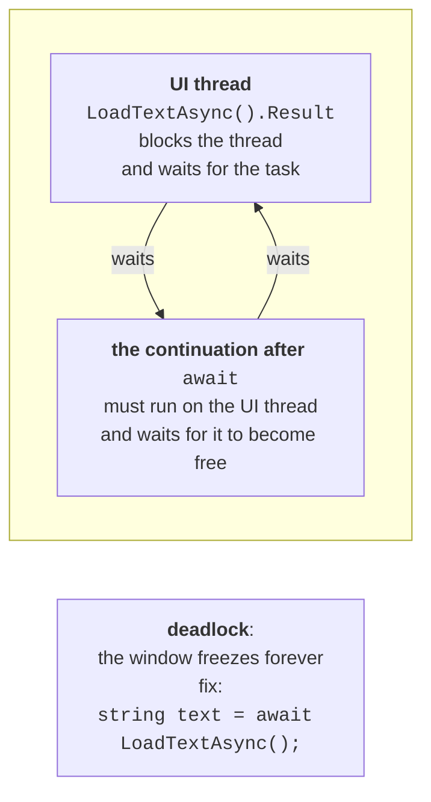
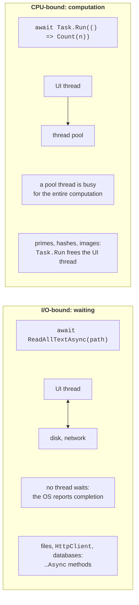
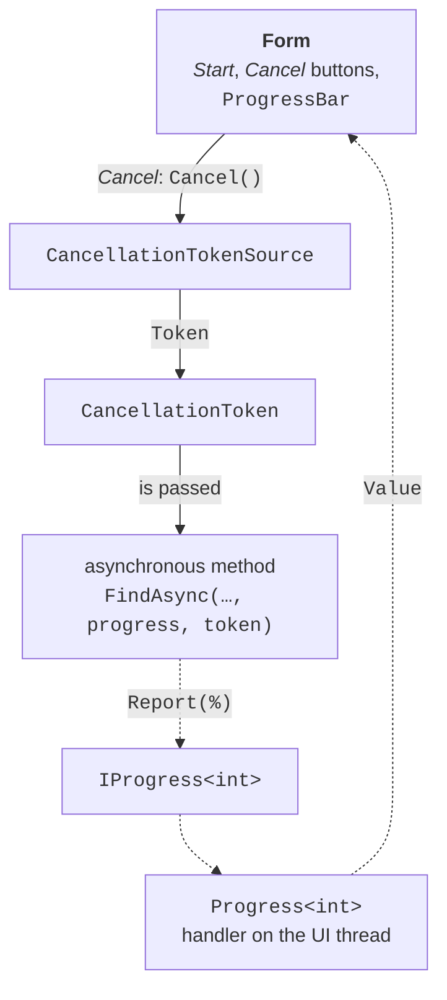

# Context, computation, and cancellation

## The synchronization context

### Where `await` returns to

After `await`, the handler's continuation runs on the UI thread, even though the task ran elsewhere. This is ensured by the **synchronization context**—an object of a class derived from `SynchronizationContext` that can pass a delegate to "its" thread. Windows Forms installs a `WindowsFormsSynchronizationContext` for the UI thread: it posts the continuation to the message queue, and the message loop runs it like an ordinary message. The `await` operator captures the current context (the `SynchronizationContext.Current` property) and, if there is one, sends the continuation through it (<https://learn.microsoft.com/dotnet/api/system.threading.synchronizationcontext>).

A console program has no synchronization context, so the continuation runs on any pool thread. This is easy to see if you print the thread number before and after `await`:

```cs
Console.WriteLine(Where("before await"));
await Task.Delay(100);
Console.WriteLine(Where("after await"));
await Task.Delay(100);
Console.WriteLine(Where("after 2nd await"));

static string Where(string point)
{
    string context =
        SynchronizationContext.Current?.GetType().Name ?? "none";
    int thread = Environment.CurrentManagedThreadId;
    return $"{point}: thread {thread}, context {context}";
}
```

```
before await: thread 2, context none
after await: thread 5, context none
after 2nd await: thread 5, context none
```

The same `Where` method in a form's button handler gives a different result:

```cs
private async void threadsButton_Click(object sender, EventArgs e)
{
    List<string> log = [Where("before await")];
    await Task.Delay(100);
    log.Add(Where("after await"));
    int worker = await Task.Run(
        () => Environment.CurrentManagedThreadId);
    log.Add($"inside Task.Run: thread {worker}");
    await Task.Delay(100).ConfigureAwait(false);
    log.Add(Where("after ConfigureAwait(false)"));
    // We are not on the UI thread here: access controls only like this:
    await logTextBox.InvokeAsync(
        () => logTextBox.Lines = [.. log]);
}
```

```
before await: thread 2, context WindowsFormsSynchronizationContext
after await: thread 2, context WindowsFormsSynchronizationContext
inside Task.Run: thread 6
after ConfigureAwait(false): thread 8, context none
```

After an ordinary `await`, the handler stayed on the UI thread (number 2), the `Task.Run` delegate ran on a pool thread, and the `ConfigureAwait(false)` call disabled returning to the context: the continuation ended up on a pool thread, where `logTextBox` can no longer be accessed directly.

### Accessing controls from another thread

Windows Forms controls can be changed only on the thread that created them. If code inside `Task.Run` assigns `resultLabel.Text`, an `InvalidOperationException` occurs during debugging with the message *Cross-thread operation not valid: Control 'resultLabel' accessed from a thread other than the thread it was created on* (Fig. 5.5). Without a debugger, the check is disabled by default, but the bug does not go away: such code occasionally corrupts the control's state or "hangs" (<https://learn.microsoft.com/dotnet/desktop/winforms/controls/how-to-make-thread-safe-calls>).



Figure 5.5. An exception when accessing a control from another thread {.caption}

The best fix is not to access the form from background code: return the result from the task and show it after `await`, and pass intermediate data through `IProgress<T>` (the section "Operation progress and cancellation"). If background code still needs a control, the call is marshaled to the UI thread:

- `control.Invoke(delegate)`—synchronously: the background thread waits until the UI thread executes the delegate;
- `control.BeginInvoke(delegate)`—queues the delegate and does not wait;
- `await control.InvokeAsync(…)` (.NET 9+)—queues the delegate and returns a task that can be awaited; covered in the section "Asynchronous Windows Forms methods".

The `control.InvokeRequired` property returns `true` if the current thread is not the control's thread.

### `ConfigureAwait(false)` and deadlocks

The `task.ConfigureAwait(false)` method means "the continuation does not need the context". It is written in **libraries** (classes that do not work with the interface): the continuation runs on a pool thread without occupying the UI thread's queue. In form code, controls cannot be accessed after `ConfigureAwait(false)`, so it is not used in event handlers (<https://learn.microsoft.com/dotnet/api/system.threading.tasks.task.configureawait>).

A classic mistake is to wait synchronously for an asynchronous method on the UI thread:

```cs
private void loadButton_Click(object sender, EventArgs e)
{
    string text = LoadTextAsync().Result;   // deadlock!
    statusLabel.Text = text;
}

private async Task<string> LoadTextAsync()
{
    await Task.Delay(500);
    return "Loaded";
}
```

The `Result` property blocks the UI thread until the task completes. But the task completes only when its continuation after `await Task.Delay(500)` runs on the UI thread, and that thread is blocked. Both sides wait for each other forever—a **deadlock** occurs (Fig. 5.6). In a test run, the UI thread was still blocked after 3 seconds, although the delay is only 0.5 s. If you write `await Task.Delay(500).ConfigureAwait(false)` in `LoadTextAsync`, the deadlock disappears, but the UI thread still stalls for 0.5 s. The correct fix is "async all the way": the handler becomes `async void`, and `await` replaces `Result`.



Figure 5.6. A deadlock caused by `Result` on the UI thread {.caption}

## I/O operations and computations

For I/O operations, .NET has truly asynchronous methods: they pass the request to the operating system and release the thread, and when the device finishes, the task receives the result (Fig. 5.7). No thread is spent waiting. Such methods are called directly, without `Task.Run`:

- files: `File.ReadAllTextAsync`, `File.WriteAllTextAsync`, `File.ReadAllLinesAsync`, `StreamReader.ReadLineAsync`, `Stream.ReadAsync`, `Stream.CopyToAsync` (<https://learn.microsoft.com/dotnet/standard/io/asynchronous-file-i-o>);
- network: `HttpClient.GetStringAsync`, `GetByteArrayAsync`, `GetStreamAsync` (<https://learn.microsoft.com/dotnet/api/system.net.http.httpclient>); REST services and JSON are covered in Topic 10;
- databases: `ExecuteReaderAsync`, `ToListAsync` (Topics 7–8).



Figure 5.7. I/O operations and computations {.caption}

An example of a handler that downloads a page and saves it to a file. A single `HttpClient` object is created for the whole application (a static field), because each new client opens new network connections:

```cs
private static readonly HttpClient http = new();

private async void downloadButton_Click(object sender, EventArgs e)
{
    downloadButton.Enabled = false;
    try
    {
        string html = await http.GetStringAsync(urlTextBox.Text);
        await File.WriteAllTextAsync("page.html", html);
        statusLabel.Text = $"Saved {html.Length:N0} characters";
    }
    catch (HttpRequestException ex)
    {
        statusLabel.Text = $"Error: {ex.Message}";
    }
    finally
    {
        downloadButton.Enabled = true;
    }
}
```

For the address `https://learn.microsoft.com/dotnet/csharp/`, the label showed `Saved 59,250 characters`, and for a nonexistent page—`Error: Response status code does not indicate success: 404 (Not Found).` Copying a large file with streams looks like this:

```cs
await using FileStream source = File.OpenRead(from);
await using FileStream target = File.Create(to);
await source.CopyToAsync(target, token);
```

For **computations**, there are no asynchronous methods: the processor has to do the work on some thread. So in a GUI application, computations are moved to the thread pool with `await Task.Run(…)`, as in the "Prime numbers" example. `Task.Run` does not speed up the computation; it only frees the UI thread.

A library method that wraps synchronous code in `Task.Run` and is named `…Async` is bad practice ("async over sync"): it misleads the caller and occupies a pool thread. The library provides a synchronous method, and the UI code decides whether to use `Task.Run`. Conversely, if there is an asynchronous version of an I/O operation, use it rather than `Task.Run(() => File.ReadAllText(path))`.

## Operation progress and cancellation

### `IProgress<T>` and `Progress<T>`

For an asynchronous method to report progress without knowing anything about the form, it takes a parameter of the `IProgress<T>` interface with the single method `Report(T value)`. The form passes an object of the `Progress<T>` class created on the UI thread with a handler:

```cs
var progress = new Progress<int>(p => progressBar.Value = p);
await ProcessAsync(files, progress);      // the method calls Report
```

`Progress<T>` captures the synchronization context at the moment of creation, so the handler always runs on the UI thread, even if `Report` is called from a pool thread (<https://learn.microsoft.com/dotnet/api/system.progress-1>). A `Report` call does not wait for the handler: the message is queued. Two consequences follow: do not call `Report` thousands of times per second (the queue will overflow, and the interface will lag), and do not rely on the last message being processed before the method exits, so the final text is set after `await`. The type `T` can be a number (a percentage) or a record with several fields: `record SearchProgress(int Percent, string File)`.

### Cancellation: `CancellationTokenSource` and `CancellationToken`

Cancellation in .NET is **cooperative**: an operation is not stopped forcibly; it is asked to stop, and it checks for the request itself at convenient points (<https://learn.microsoft.com/dotnet/standard/threading/cancellation-in-managed-threads>). The participants (Fig. 5.8):

- `CancellationTokenSource`—the source of cancellation in the form; the `Cancel()` method sends the request, and `CancelAfter(TimeSpan)` or the `new CancellationTokenSource(TimeSpan)` constructor sets a timeout; the object implements `IDisposable`;
- `CancellationToken`—a read-only structure obtained through the `Token` property and passed to asynchronous methods as a parameter (by convention the last one, named `cancellationToken` or `token`);
- the asynchronous method passes the token on (`Task.Delay(ms, token)`, `ReadLineAsync(token)`, `Task.Run(…, token)`) or calls `token.ThrowIfCancellationRequested()` in a loop.



Figure 5.8. Cancellation and progress reporting {.caption}

A canceled operation ends with an `OperationCanceledException` (or its descendant `TaskCanceledException`), and the task gets the `Canceled` state. The form's handler catches this exception and shows "Canceled": for the user, this is not an error. For example, a loop with `Task.Delay(100, token)` and a 250 ms timeout manages to perform two steps and ends with the exception `TaskCanceledException: A task was canceled.`, and a computational loop inside `Task.Run` with `ThrowIfCancellationRequested` ends with `OperationCanceledException: The operation was canceled.`
