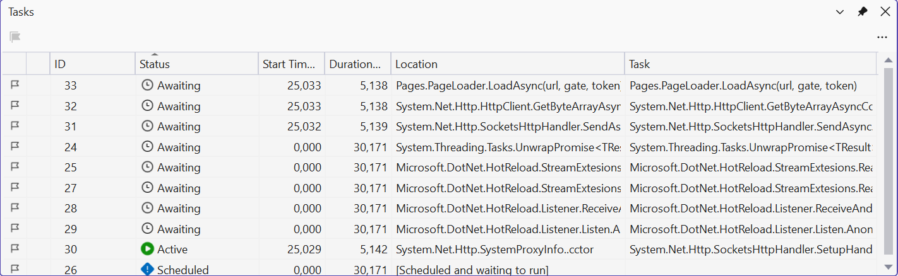
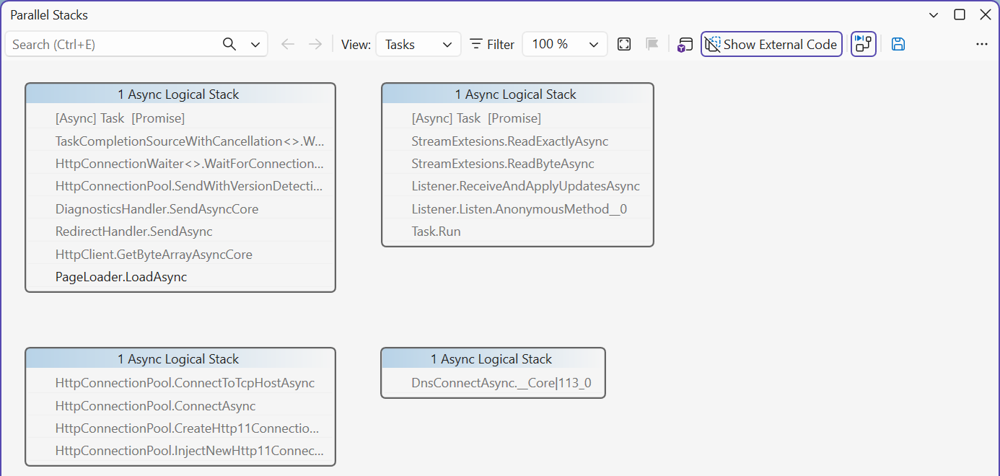

# Debugging and common mistakes

## Debugging and common mistakes

When debugging asynchronous code, the *Call Stack* window shows only the current thread. Visual Studio 2026 has two special windows (<https://learn.microsoft.com/visualstudio/debugger/using-the-tasks-window>):

- *Debug → Windows → Tasks* (available after stopping at a breakpoint)—a table of tasks with the columns *ID*, *Status* (*Scheduled*, *Active*, *Blocked*, *Awaiting*, *Deadlocked*), *Start Time*, *Duration*, *Location*, and *Task* (Fig. 5.10);
- *Debug → Windows → Parallel Stacks* in *Tasks* mode—a graph of asynchronous call stacks: you can see which method is waiting at which `await` (Fig. 5.11) (<https://learn.microsoft.com/visualstudio/debugger/using-the-parallel-stacks-window>).

Figure 5.10. The *Tasks* window during debugging {.caption}

Figure 5.11. The *Parallel Stacks* window in *Tasks* mode {.caption}

The mistakes made most often when writing asynchronous code are listed in Table 5.3.

Table 5.3. Common mistakes in asynchronous programming {.caption}

| **Problem** | **Cause** | **Fix** |
| --- | --- | --- |
| the window is "Not Responding" during an operation | long synchronous work in a handler | `await` an asynchronous method or `await Task.Run(…)` |
| the window freezes forever | `.Result` or `.Wait()` on the UI thread (deadlock) | an `async` handler and `await` |
| `InvalidOperationException: Cross-thread operation not valid` | accessing a control inside `Task.Run` or after `ConfigureAwait(false)` | return the result from the task, `IProgress<T>`, `InvokeAsync` |
| the operation was started twice | the button was not disabled during the operation (reentrancy) | `Enabled = false`, restored in `finally` |
| an exception was not caught, and the application exited | `async void` outside an event handler, a forgotten `await` (CS4014) | return `Task`, wait with `await`, `try`/`catch` in the handler |
| the *Cancel* button does not stop the operation | the token was not passed to calls or is not checked in the loop | pass the `token` on, `ThrowIfCancellationRequested` |
| the progress indicator jumps or slows down the interface | `Report` is called thousands of times per second | report less often: every file, every percent |
