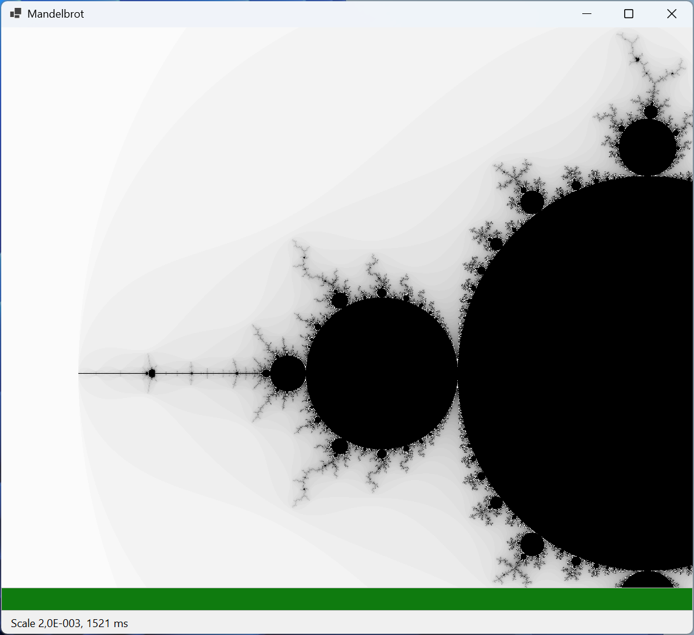
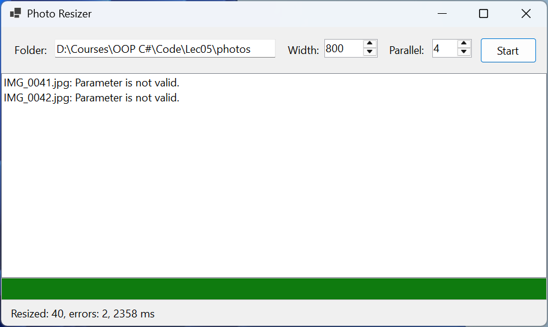

# Practice

Each example is a *Windows Forms App* (.NET 10) project. The controls are placed in the form designer, and their names are given in the problem statement; event handlers are subscribed in the *Properties* window.

## Example 1. File checksums

Create an application that computes SHA-256 checksums of selected files without blocking the interface. An indicator shows progress by the number of bytes read across all files, the *Cancel* button stops the computation, and the result is displayed in the format of the `sha256sum` utility: the hash, a space, `*`, and the file name.

The form contains a `FlowLayoutPanel` with the buttons `computeButton` (*Compute…*) and `cancelButton` (*Cancel*), the list `hashListBox` (`Dock = Fill`, Consolas font), the indicator `progressBar`, the label `statusLabel`, and the `openFileDialog` component (`Multiselect = true`).

```cs
using System.Diagnostics;
using System.Security.Cryptography;

namespace Checksums;

public partial class MainForm : Form
{
    private const int BufferSize = 1024 * 1024;       // 1 MB
    private CancellationTokenSource? cts;

    public MainForm()
    {
        InitializeComponent();
        cancelButton.Enabled = false;
    }

    private async void computeButton_Click(object sender, EventArgs e)
    {
        if (openFileDialog.ShowDialog(this) == DialogResult.OK)
        {
            await ComputeAsync(openFileDialog.FileNames);
        }
    }

    private void cancelButton_Click(object sender, EventArgs e) =>
        cts?.Cancel();

    private async Task ComputeAsync(string[] files)
    {
        long total = files.Sum(f => new FileInfo(f).Length);
        long done = 0;
        var progress = new Progress<int>(bytes =>
        {
            done += bytes;               // runs on the UI thread
            progressBar.Value =
                (int)(done * 100 / Math.Max(total, 1));
        });
        hashListBox.Items.Clear();
        cts = new CancellationTokenSource();
        SetBusy(true);
        var watch = Stopwatch.StartNew();
        try
        {
            foreach (string file in files)
            {
                string hash = await Sha256Async(file, progress,
                    cts.Token);
                string name = Path.GetFileName(file);
                hashListBox.Items.Add($"{hash} *{name}");
            }
            double seconds = watch.Elapsed.TotalSeconds;
            statusLabel.Text = $"Files: {files.Length}, "
                + $"{total / BufferSize:N0} MB, {seconds:F1} s";
        }
        catch (OperationCanceledException)
        {
            statusLabel.Text = $"Canceled at {progressBar.Value} %";
        }
        catch (IOException ex)
        {
            statusLabel.Text = $"Error: {ex.Message}";
        }
        finally
        {
            cts.Dispose();
            cts = null;
            SetBusy(false);
        }
    }

    private static async Task<string> Sha256Async(string path,
        IProgress<int> progress, CancellationToken token)
    {
        await using var stream = new FileStream(path, FileMode.Open,
            FileAccess.Read, FileShare.Read, BufferSize,
            useAsync: true);
        using var sha = IncrementalHash.CreateHash(
            HashAlgorithmName.SHA256);
        byte[] buffer = new byte[BufferSize];
        int read;
        while ((read = await stream.ReadAsync(buffer, token)) > 0)
        {
            sha.AppendData(buffer, 0, read);
            progress.Report(read);
        }
        return Convert.ToHexStringLower(sha.GetHashAndReset());
    }

    private void SetBusy(bool busy)
    {
        computeButton.Enabled = !busy;
        cancelButton.Enabled = busy;
        if (busy)
        {
            progressBar.Value = 0;
            statusLabel.Text = "Computing...";
        }
    }
}
```

The file is read asynchronously in 1 MB chunks: the `useAsync: true` parameter enables true asynchronous Windows I/O, and the `IncrementalHash` class computes the hash incrementally, so the whole file is not loaded into memory. The `Report` method is called once per megabyte rather than for every byte. The `done` variable is changed only in the `Progress<int>` handler, that is, always on the UI thread, so no synchronization is needed. The logic is moved into the `ComputeAsync` method, which returns `Task`, and `async void` remains only in the button handler.

For three files (300, 120, and 1 MB), the list contains lines such as `ac1af4da…8045a9a *video.mp4` (the hash has 64 hexadecimal digits, shortened here), and the status bar shows `Files: 3, 421 MB, 0.6 s` (the second run, with the files in the disk cache). The hashes match the values from `SHA256.HashData`. Clicking *Cancel* during the computation shows `Canceled at 41 %` (Fig. 5.12).


Figure 5.12. The "File checksums" application {.caption}

## Example 2. The Mandelbrot set

Create an application that draws the Mandelbrot set on a background thread with progress display. A left click zooms in twofold around the point under the cursor, and a right click zooms out. If the user clicks while a frame is still being drawn, the outdated frame is canceled. A point *c* = *x* + *iy* belongs to the set (black) if the sequence *z* ← *z*<sup>2</sup> + *c* with *z* = 0 does not leave the circle of radius 2 within 1000 steps; the remaining points get a shade of gray according to the number of steps.

The form contains a `pictureBox` (`Dock = Fill`, the `MouseClick` event), the indicator `progressBar`, and the label `statusLabel` (both `Dock = Bottom`).

```cs
using System.Diagnostics;

namespace Mandelbrot;

// An immutable area of the plane: the center and the pixel size.
public record View(double X, double Y, double Scale);

public partial class MainForm : Form
{
    private const int MaxIterations = 1000;
    private View view = new(-0.5, 0, 0.004);
    private CancellationTokenSource? cts;

    public MainForm()
    {
        InitializeComponent();
        Shown += async (s, e) => await RenderAsync();
    }

    private async void pictureBox_MouseClick(object sender,
        MouseEventArgs e)
    {
        // The point under the cursor becomes the center; left button – zoom in.
        double x = view.X
            + (e.X - pictureBox.Width / 2.0) * view.Scale;
        double y = view.Y
            + (e.Y - pictureBox.Height / 2.0) * view.Scale;
        double zoom = e.Button == MouseButtons.Left ? 0.5 : 2;
        view = new View(x, y, view.Scale * zoom);
        await RenderAsync();
    }

    private async Task RenderAsync()
    {
        cts?.Cancel();                   // stop the previous frame
        using var current = new CancellationTokenSource();
        cts = current;
        View frame = view;               // a copy for the background thread
        Size size = pictureBox.ClientSize;
        var progress = new Progress<int>(p => progressBar.Value = p);
        var watch = Stopwatch.StartNew();
        try
        {
            Bitmap bitmap = await Task.Run(
                () => Draw(frame, size, progress, current.Token),
                current.Token);
            pictureBox.Image?.Dispose();
            pictureBox.Image = bitmap;
            statusLabel.Text = $"Scale {frame.Scale:E1}, "
                + $"{watch.ElapsedMilliseconds} ms";
        }
        catch (OperationCanceledException)
        {
            // The frame is outdated: a new one is already being drawn.
        }
        finally
        {
            if (cts == current)
            {
                cts = null;
            }
        }
    }

    private static Bitmap Draw(View v, Size size,
        IProgress<int> progress, CancellationToken token)
    {
        var bitmap = new Bitmap(size.Width, size.Height);
        try
        {
            for (int py = 0; py < size.Height; py++)
            {
                token.ThrowIfCancellationRequested();
                double y = v.Y + (py - size.Height / 2.0) * v.Scale;
                for (int px = 0; px < size.Width; px++)
                {
                    double x =
                        v.X + (px - size.Width / 2.0) * v.Scale;
                    int n = Iterations(x, y);
                    int c = n == MaxIterations ? 0 : 255 - n % 64 * 4;
                    bitmap.SetPixel(px, py, Color.FromArgb(c, c, c));
                }
                progress.Report((py + 1) * 100 / size.Height);
            }
            return bitmap;
        }
        catch
        {
            bitmap.Dispose();            // the frame is not needed
            throw;
        }
    }

    private static int Iterations(double x, double y)
    {
        double zx = 0, zy = 0;
        int n = 0;
        while (n < MaxIterations && zx * zx + zy * zy <= 4)
        {
            (zx, zy) = (zx * zx - zy * zy + x, 2 * zx * zy + y);
            n++;
        }
        return n;
    }
}
```

Each frame has its own cancellation source, `current`. A new `RenderAsync` call cancels the previous source, and the background drawing stops at the nearest row of pixels (`ThrowIfCancellationRequested`), while its `await` ends with an `OperationCanceledException`, which is simply ignored. The `cts == current` check in `finally` prevents an outdated frame from clearing the source of the new frame.

The `Draw` method is static and receives all data through parameters: the `View` area is an immutable record copied before `Task.Run`. If the background code read the form's `view` field, a click during drawing would change the scale in the middle of a frame. The bitmap is created on the background thread and goes into the `PictureBox` only after `await`, on the UI thread; the previous image is released with `Dispose`.

For an 800 × 554-pixel area, the first frame is drawn in `Scale 4.0E-003, 810 ms`. After two quick left clicks, the first of the two new frames is canceled, and the label shows only the last one: `Scale 1.0E-003, 1481 ms` (Fig. 5.13).



Figure 5.13. The "Mandelbrot set" application {.caption}

## Example 3. Batch photo resizing

Create an application that reduces all `*.jpg` photos in a selected folder to a given width (proportions are preserved, and smaller photos are not enlarged) and saves them to the nested `small` folder. No more than a given number of files are processed at the same time. Corrupted files do not stop the work: at the end, a list of errors is shown. The same button cancels processing while it is running.

The form contains the field `folderTextBox`, the fields `widthNumeric` (100–4000, value 800) and `parallelNumeric` (1–16, value 4), the button `startButton` (*Start*), the list `errorsListBox`, the indicator `progressBar`, and the label `statusLabel`. Processing is moved into the `PhotoResizer` class:

```cs
using System.Collections.Concurrent;
using System.Drawing.Drawing2D;
using System.Drawing.Imaging;

namespace Resize;

public record ResizeReport(int Done, string[] Errors);

public static class PhotoResizer
{
    public static async Task<ResizeReport> ResizeAllAsync(
        string[] files, string outputFolder, int maxWidth,
        int maxParallel, IProgress<int> progress,
        CancellationToken token)
    {
        Directory.CreateDirectory(outputFolder);
        var errors = new ConcurrentBag<string>();
        int done = 0;
        var options = new ParallelOptions
        {
            MaxDegreeOfParallelism = maxParallel,
            CancellationToken = token
        };
        await Parallel.ForEachAsync(files, options,
            async (file, ct) =>
            {
                string name = Path.GetFileName(file);
                try
                {
                    string target = Path.Combine(outputFolder, name);
                    await ResizeAsync(file, target, maxWidth, ct);
                }
                catch (Exception ex) when (ex is IOException
                    or ArgumentException)
                {
                    errors.Add($"{name}: {ex.Message}");
                }
                progress.Report(Interlocked.Increment(ref done));
            });
        return new ResizeReport(done - errors.Count,
            [.. errors.Order()]);
    }

    private static async Task ResizeAsync(string source,
        string target, int maxWidth, CancellationToken token)
    {
        byte[] data = await File.ReadAllBytesAsync(source, token);
        using var input = new MemoryStream(data);
        using var original = new Bitmap(input);   // CPU work
        double k = Math.Min(1.0, (double)maxWidth / original.Width);
        int width = (int)(original.Width * k);
        int height = (int)(original.Height * k);
        using var result = new Bitmap(width, height);
        using (Graphics g = Graphics.FromImage(result))
        {
            g.InterpolationMode =
                InterpolationMode.HighQualityBicubic;
            g.DrawImage(original, 0, 0, width, height);
        }
        using var output = new MemoryStream();
        result.Save(output, ImageFormat.Jpeg);
        await File.WriteAllBytesAsync(target, output.ToArray(),
            token);
    }
}
```

The form's button handler:

```cs
private async void startButton_Click(object sender, EventArgs e)
{
    if (cts is not null)            // a second click – Cancel
    {
        cts.Cancel();
        return;
    }
    string folder = folderTextBox.Text;
    if (!Directory.Exists(folder))
    {
        MessageBox.Show("Folder not found.", Text);
        return;
    }
    string[] files = Directory.GetFiles(folder, "*.jpg");
    progressBar.Maximum = Math.Max(files.Length, 1);
    progressBar.Value = 0;
    var progress = new Progress<int>(n => progressBar.Value = n);
    errorsListBox.Items.Clear();
    cts = new CancellationTokenSource();
    startButton.Text = "&Cancel";
    var watch = Stopwatch.StartNew();
    try
    {
        ResizeReport report = await PhotoResizer.ResizeAllAsync(
            files, Path.Combine(folder, "small"),
            (int)widthNumeric.Value, (int)parallelNumeric.Value,
            progress, cts.Token);
        errorsListBox.Items.AddRange(report.Errors);
        statusLabel.Text = $"Resized: {report.Done}, errors: "
            + $"{report.Errors.Length}, "
            + $"{watch.ElapsedMilliseconds} ms";
    }
    catch (OperationCanceledException)
    {
        statusLabel.Text = "Canceled";
    }
    finally
    {
        cts.Dispose();
        cts = null;
        startButton.Text = "&Start";
    }
}
```

The form class's `cts` field (`private CancellationTokenSource? cts;`) also serves as an "operation in progress" flag: clicking the button again during processing does not start a second run but cancels the first.

`Parallel.ForEachAsync` calls the loop body on pool threads, so decoding and scaling images (computation) do not occupy the UI thread, and reading and writing files is asynchronous. The body runs on several threads at once, so shared data is protected: errors are collected in the thread-safe `ConcurrentBag<T>` collection, and the counter is incremented atomically with the `Interlocked.Increment` method. The exception from a corrupted file is caught inside the body and does not stop the loop; cancellation through `options.CancellationToken` stops starting new files, and `ForEachAsync` throws `OperationCanceledException`.

For 40 photos of 4000 × 3000 and two corrupted files (a text file and an empty one), the status bar showed `Resized: 40, errors: 2, 2951 ms` for one branch and `Resized: 40, errors: 2, 2315 ms` for four; the error list contains `IMG_0041.jpg: Parameter is not valid.` and `IMG_0042.jpg: Parameter is not valid.`, and the reduced files are 800 × 600 (Fig. 5.14). The speedup is small because GDI+ internally performs some operations sequentially: parallelism does not automatically speed up code, and its effect should be measured. Clicking *Cancel* in the middle of processing shows `Canceled`.



Figure 5.14. The "Batch photo resizing" application {.caption}
