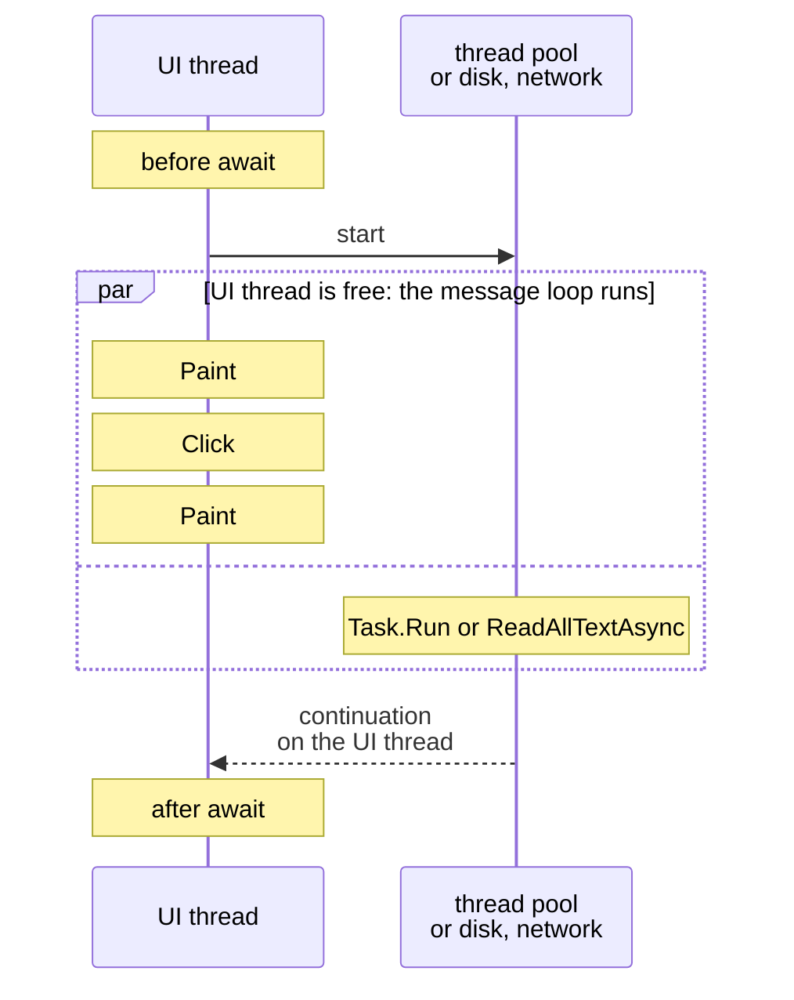

# Tasks, async, and await

## Why the interface "freezes"

A **process** is a running program with its own memory. A process has one or more **threads**—sequences of code execution that the operating system gives turns on the processor cores. Creating a thread is expensive (memory for the stack, context switching), so .NET has a **thread pool**—a set of ready worker threads that execute short work items and return to the pool (<https://learn.microsoft.com/dotnet/standard/threading/the-managed-thread-pool>).

A Windows Forms application has a single **UI thread**: on it, the `Application.Run` method starts the message loop, all controls are created, and all event handlers run (Topic 3). The loop takes messages from the queue (clicks, key presses, repaints) and calls the handlers one at a time. If a handler runs for 5 seconds, then for all those 5 seconds messages only pile up in the queue (Fig. 5.1).

```mermaid
flowchart TB
  subgraph Q["message queue"]
    direction LR
    Q1["<code>Click</code>"] ~~~ Q2["<code>Paint</code>"]
    subgraph QW["new messages<br>are waiting"]
      direction TB
      Q3["<code>MouseMove</code>"] ~~~ Q4["<code>Paint</code>"] ~~~ Q5["<code>KeyDown</code>"]
    end
    Q2 ~~~ QW
  end
  Q --> GM
  subgraph LOOP["<b>message loop (UI thread)</b>"]
    GM["<code>GetMessage</code>"] --> DM["<code>DispatchMessage</code>"]
    DM --> H["<code>Click</code> handler:<br>a 5-second operation"]
    H -.-> GM
    H ~~~ HN["while the handler runs,<br><code>GetMessage</code> is not called"]
  end
  HN ~~~ NR["the window is "(Not Responding)":<br>it is not repainted<br>and does not respond"]
```

Figure 5.1. A long-running handler blocks the UI thread's message loop {.caption}

After a few seconds, Windows notices that the window is not processing messages: the title gets the "(Not Responding)" mark, the content turns pale, and an attempt to close the window offers to terminate the program (Fig. 5.2). The user cannot even click the *Cancel* button.


Figure 5.2. A blocked interface during a synchronous operation {.caption}

An operation is called **synchronous** if the code that called it waits for it to complete, and **asynchronous** if the call returns control immediately and the result appears later. Long-running operations come in two kinds:

- **I/O-bound operations**—reading a file, a request to a web server or database: the processor barely works, and the program waits for a device or the network;
- **CPU-bound computations**—finding prime numbers, image processing, hashing: the processor is busy the whole time.

In both cases, the UI thread must not wait. C# solves this with `Task` objects and the `async`/`await` keywords; this approach is called the **Task-based Asynchronous Pattern** (TAP) (<https://learn.microsoft.com/dotnet/csharp/asynchronous-programming/>).

## `Task` and `Task<T>`

A **task** is an object that represents an operation that is running now or will complete later. The `Task` class (the `System.Threading.Tasks` namespace) describes an operation without a result, and `Task<T>` one with a result of type `T`. You can wait for a task, find out its state, and get its result or exception. A task is not necessarily executed by a separate thread: `Task.Delay(1000)` merely starts a system timer, and a file task waits for a signal from the disk.

The main ways to get a task:

- `Task.Run(() => …)`—queue a delegate to the thread pool (for computations);
- `Task.Delay(ms)`—a task that completes after the specified time (instead of `Thread.Sleep`, which blocks the thread);
- .NET methods whose names end in `Async`, for example `File.ReadAllTextAsync`, `HttpClient.GetStringAsync`, `Stream.CopyToAsync`;
- your own methods with the `async` modifier (the next section).

The state of a task is shown by the `Status` property (Table 5.1). The `IsCompleted`, `IsCompletedSuccessfully`, `IsFaulted`, and `IsCanceled` properties check the state more concisely.

Table 5.1. The main task states {.caption}

| **`TaskStatus` value** | **Meaning** |
| --- | --- |
| `WaitingForActivation` | the task is waiting for an external event: a timer, I/O, other tasks (this is how tasks of `async` methods look) |
| `WaitingToRun` | the `Task.Run` delegate is queued in the thread pool |
| `Running` | the delegate is executing |
| `RanToCompletion` | the task completed successfully, and the result is available |
| `Faulted` | the task completed with an exception (the `Exception` property) |
| `Canceled` | the task was canceled through a `CancellationToken` |

For example, right after `Task.Run(…)` the state is `WaitingToRun`, after `await` it is `RanToCompletion`, the state of `Task.Delay(100)` is `WaitingForActivation`, and a task with an exception is `Faulted`.

A task's result can be obtained in three ways: `await task`, the `task.Result` property, or the `task.Wait()` method. The last two **block** the calling thread until the task completes. On the UI thread this brings us back to "freezing", and combined with `await` it can lead to a deadlock (the section "The synchronization context"). In addition, `Wait()` and `Result` wrap the exception in an `AggregateException`. So in GUI applications, a task's result is obtained only through `await`.

## The `async` and `await` keywords

### How `await` works

The `async` modifier allows the `await` operator to be used in a method. The `await task` operator checks whether the task is complete. If not, the method **returns control** to its caller, and the rest of the method, the **continuation**, is executed after the task completes. When the continuation starts running, `await` returns the task's result or throws its exception (<https://learn.microsoft.com/dotnet/csharp/asynchronous-programming/task-asynchronous-programming-model>).

For an event handler, this means: the code before the first `await` runs on the UI thread, then the handler returns to the message loop, which processes repaints and clicks, and after the operation completes, the continuation again runs on the UI thread (Fig. 5.3). No thread "waits" for the task in the meantime.



Figure 5.3. An asynchronous event handler on a timeline {.caption}

The compiler transforms an `async` method into a **state machine**: a hidden class that stores the local variables and the step number, and each `await` becomes a point where the method can pause and later resume. That is why code with `await` reads like ordinary sequential code: loops, `try`/`catch`, and `using` work as usual.

### Return types of an `async` method

An `async` method can return (<https://learn.microsoft.com/dotnet/csharp/asynchronous-programming/async-return-types>):

- `Task`—an operation without a result: `async Task SaveAsync(…)`;
- `Task<T>`—an operation with a result: `async Task<int> CountAsync(…)`, and `return 42;` inside sets the task's result;
- `ValueTask` and `ValueTask<T>`—structures for methods that often complete without waiting (for example, take a value from a cache): they save memory allocations, but they can be awaited only once;
- `IAsyncEnumerable<T>`—an asynchronous stream of values (the section "Asynchronous data streams");
- `void`—**only for event handlers**.

An `async void` method cannot be awaited: its caller does not know when the method finished and cannot catch its exception. An event handler has the signature of the `EventHandler` delegate, which returns `void`, so `private async void button_Click(…)` is acceptable. All other asynchronous methods return `Task` or `Task<T>` and have the `Async` suffix in their names.

If you call a method that returns `Task` and forget `await`, the method starts running, and the code moves on without waiting for it to finish and missing a possible exception. The compiler warns about this inside `async` methods with warning CS4014 (Fig. 5.4). If the task really does not need to be awaited, it is discarded explicitly: `_ = SaveAsync();` (<https://learn.microsoft.com/dotnet/csharp/language-reference/compiler-messages/async-await-errors>).


Figure 5.4. Warning CS4014 about a missing `await` {.caption}

### The "Prime numbers" example

The form contains the field `limitNumeric` (`NumericUpDown`, 2–100,000,000, value 10,000,000, `ThousandsSeparator = true`), the buttons `syncButton` (*Count (sync)*) and `asyncButton` (*Count (async)*), the labels `resultLabel` and `clockLabel`, and the timer `clockTimer` with a 100 ms interval. The timer shows the current time and counts its ticks: if the UI thread is free, the timer fires about 10 times per second. Both buttons perform the same computational work—counting prime numbers by trial division:

```cs
using System.Diagnostics;

namespace Primes;

public partial class MainForm : Form
{
    private int ticks;       // how many times the timer fired

    public MainForm()
    {
        InitializeComponent();
        clockTimer.Start();  // Interval = 100 ms
    }

    private void clockTimer_Tick(object sender, EventArgs e)
    {
        ticks++;
        clockLabel.Text = DateTime.Now.ToString("HH:mm:ss.f");
    }

    private void syncButton_Click(object sender, EventArgs e)
    {
        int limit = (int)limitNumeric.Value;
        ticks = 0;
        var watch = Stopwatch.StartNew();
        int count = PrimeMath.CountPrimes(limit);  // the UI is blocked
        ShowResult(limit, count, watch.ElapsedMilliseconds);
    }

    private async void asyncButton_Click(object sender, EventArgs e)
    {
        int limit = (int)limitNumeric.Value;
        ticks = 0;
        SetBusy(true);
        try
        {
            var watch = Stopwatch.StartNew();
            int count = await Task.Run(
                () => PrimeMath.CountPrimes(limit));
            ShowResult(limit, count, watch.ElapsedMilliseconds);
        }
        finally
        {
            SetBusy(false);
        }
    }

    private void ShowResult(int limit, int count, long ms) =>
        resultLabel.Text = $"Primes up to {limit:N0}: {count:N0}"
            + $"\n{ms:N0} ms, timer ticks: {ticks}";

    private void SetBusy(bool busy)
    {
        syncButton.Enabled = !busy;
        asyncButton.Enabled = !busy;
        UseWaitCursor = busy;
    }
}

public static class PrimeMath
{
    public static int CountPrimes(int limit)
    {
        int count = 0;
        for (int n = 2; n <= limit; n++)
        {
            if (IsPrime(n))
            {
                count++;
            }
        }
        return count;
    }

    private static bool IsPrime(int n)
    {
        if (n % 2 == 0)
        {
            return n == 2;
        }
        for (int d = 3; (long)d * d <= n; d += 2)
        {
            if (n % d == 0)
            {
                return false;
            }
        }
        return true;
    }
}
```

The *Count (sync)* button shows `Primes up to 10,000,000: 664,579` and `1,907 ms, timer ticks: 0`: during the count the timer did not fire once, the clock stopped, and the window could not be dragged. The *Count (async)* button gives the same result in `1,863 ms, timer ticks: 17`: the computation was performed by a pool thread, while the UI thread updated the clock and repainted the window (the time depends on the processor).

Note three rules that recur in all the examples in this lecture:

- control values (`limitNumeric.Value`) are read **before** `Task.Run`: the lambda expression runs on another thread and must not access the form;
- the buttons are disabled during the operation; otherwise, a second click would start a second operation while the first is still running (**reentrancy**);
- the buttons are re-enabled in a `finally` block so that the interface is restored even after an exception.
