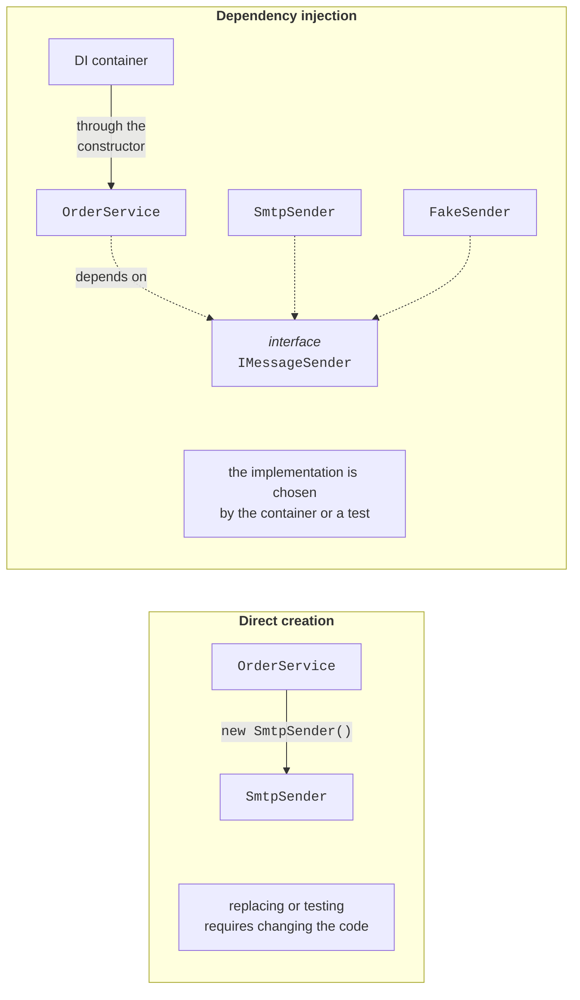
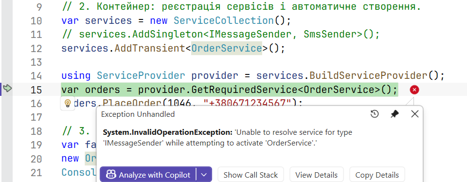
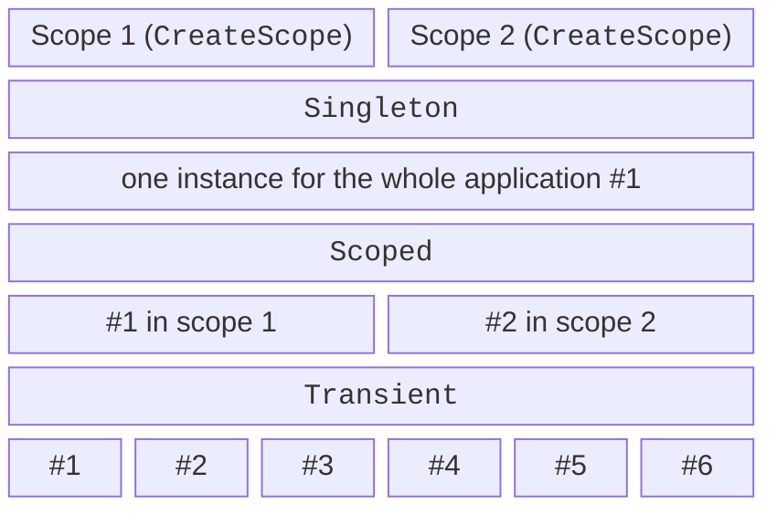

# Dependency injection and the container

## Dependencies and their injection

Classes rarely work alone. An order service sends an email to a customer, a report reads data from a database, a form calls a storage service. An object on which another object's work depends is called a **dependency**. The simplest approach is to create the dependency right in the class:

```cs
public class OrderService
{
    private readonly SmtpSender sender = new("smtp.example.com");

    public void PlaceOrder(int id, string customer) =>
        sender.Send(customer, $"Order {id} accepted");
}
```

Such code is **tightly coupled**: `OrderService` knows the concrete class, its constructor, and the server address. To send SMS messages instead of emails, you would have to change `OrderService`; to test it, you would have to actually send emails; and if `SmtpSender` itself needs settings and a logger, `OrderService` would create those too.

The solution comes from the **Dependency Inversion Principle** (the letter D in SOLID): high-level modules depend on **abstractions**, not on concrete classes. **Dependency injection** (DI) is a technique in which an object **does not create** its dependencies but receives ready-made ones from outside, most often through constructor parameters (*constructor injection*). The class only declares what it needs (Fig. 6.1) (<https://learn.microsoft.com/dotnet/core/extensions/dependency-injection/overview>).



Figure 6.1. Creating a dependency directly and injecting it {.caption}

Objects are wired together in one place at the start of the program—the **composition root**, usually `Program.cs`. That is also where it is decided which implementation each class gets.

The opposite approach is the **Service Locator**: a class itself calls a global registry, `ServiceLocator.Get<IMessageSender>()`. Such code compiles without explicit dependencies in the constructor, so they are not visible from outside, and a "service not registered" error shows up only at run time. The service locator is considered an **antipattern**; the DI container is used only in the composition root.

### The "Notification service" example

The order service depends on the `IMessageSender` interface. The program wires the objects in three ways: manually, with a container, and with a fake implementation for testing. The container is added with a NuGet package: `dotnet add package Microsoft.Extensions.DependencyInjection`.

```cs
using Microsoft.Extensions.DependencyInjection;

Console.OutputEncoding = System.Text.Encoding.UTF8;

// 1. Manual injection: the dependency is passed to the constructor.
var manual = new OrderService(new EmailSender("shop@example.com"));
manual.PlaceOrder(1045, "olena@example.com");

// 2. The container: registering services and creating them automatically.
var services = new ServiceCollection();
services.AddSingleton<IMessageSender, SmsSender>();
services.AddTransient<OrderService>();

using ServiceProvider provider = services.BuildServiceProvider();
var orders = provider.GetRequiredService<OrderService>();
orders.PlaceOrder(1046, "+380671234567");

// 3. A fake implementation for testing without real emails.
var fake = new FakeSender();
new OrderService(fake).PlaceOrder(1047, "test@example.com");
Console.WriteLine($"Fake stored: {fake.Sent[0]}");

public interface IMessageSender
{
    void Send(string to, string text);
}

public class EmailSender(string from) : IMessageSender
{
    public void Send(string to, string text) =>
        Console.WriteLine($"E-mail {from} → {to}: {text}");
}

public class SmsSender : IMessageSender
{
    public void Send(string to, string text) =>
        Console.WriteLine($"SMS → {to}: {text}");
}

public class FakeSender : IMessageSender
{
    public List<string> Sent { get; } = [];
    public void Send(string to, string text) =>
        Sent.Add($"{to}: {text}");
}

// The service depends only on the interface, not on a class.
public class OrderService(IMessageSender sender)
{
    public void PlaceOrder(int id, string customer)
    {
        // ... saving the order ...
        sender.Send(customer, $"Order {id} accepted");
    }
}
```

The `OrderService` class is declared with a C# 12 **primary constructor**: the `sender` parameter is available in all methods. The container sees that the constructor needs `IMessageSender`, finds the registered `SmsSender` implementation, and creates both objects itself. The `OrderService` code never changed. The result:

```
E-mail shop@example.com → olena@example.com: Order 1045 accepted
SMS → +380671234567: Order 1046 accepted
Fake stored: test@example.com: Order 1047 accepted
```

## The `Microsoft.Extensions.DependencyInjection` container

A **DI container** consists of two parts. The `IServiceCollection` collection (the `ServiceCollection` class) contains **registrations**: which type is requested (*service type*), which class to create (*implementation type*), and how long the instance lives. The `BuildServiceProvider` method turns the collection into a **service provider**, `IServiceProvider`, which creates objects and their dependencies (Table 6.1). In DI terms, a **service** is any object that provides functionality to other objects, not just a web service.

Table 6.1. Registering and resolving services {.caption}

| **Call** | **What it registers or returns** |
| --- | --- |
| `AddSingleton<IService, Impl>()` | one instance for the entire container |
| `AddScoped<IService, Impl>()` | one instance per scope |
| `AddTransient<IService, Impl>()` | a new instance for every request |
| `AddSingleton<Impl>()` | a class without an interface |
| `AddSingleton<IService>(sp => …)` | a factory: your code creates the object |
| `AddSingleton<IService>(obj)` | a ready-made object |
| `TryAddSingleton<…>()` | a registration only if the type is not registered yet |
| `AddKeyedSingleton<…>(key)` | a keyed service (also `AddKeyedScoped`, `…Transient`) |
| `GetService<T>()` | the object, or `null` if the type is not registered |
| `GetRequiredService<T>()` | the object, or an `InvalidOperationException` |
| `GetServices<T>()` | all implementations of the type |

The container chooses the **public** constructor with the largest number of parameters it can create. A parameter that cannot be resolved produces an error with the type name:

```
Unable to resolve service for type 'IMessageSender' while attempting
to activate 'OrderService'.
```

In Visual Studio, this exception stops the debugger on the `GetRequiredService` line (Fig. 6.2). To find such errors immediately when the container is built, pass the parameter `new ServiceProviderOptions { ValidateOnBuild = true }`.



Figure 6.2. An exception caused by an unregistered dependency {.caption}

### Multiple implementations and keyed services

One type can be registered several times. `GetRequiredService` returns the **last** registration, and an `IEnumerable<T>` parameter returns all of them in registration order. The `TryAdd…` methods (the `Microsoft.Extensions.DependencyInjection.Extensions` namespace) add nothing if the type is already registered, so libraries use them to register "default" implementations.

When a **specific** implementation out of several is needed, **keyed services** (.NET 8+) are used: the registration has a key (a string, an enumeration, or another object with a correct `Equals`), and the constructor parameter has the `[FromKeyedServices]` attribute. In the fragment below, the `IMessageSender` interface has a `Name` property (`"email"` or `"sms"`):

```cs
var services = new ServiceCollection();
services.AddSingleton<IMessageSender, EmailSender>();
services.AddSingleton<IMessageSender, SmsSender>();
services.AddKeyedSingleton<IMessageSender, EmailSender>("email");
services.AddKeyedSingleton<IMessageSender, SmsSender>("sms");
services.AddTransient<Broadcast>();
services.AddTransient<Alarm>();
using var provider = services.BuildServiceProvider();

var last = provider.GetRequiredService<IMessageSender>();
var email = provider.GetRequiredKeyedService<IMessageSender>("email");
Console.WriteLine($"Last: {last.Name}, by key: {email.Name}");
provider.GetRequiredService<Broadcast>().Run();
provider.GetRequiredService<Alarm>().Run();

public class Broadcast(IEnumerable<IMessageSender> senders)
{
    public void Run() =>
        Console.WriteLine($"Channels: {senders.Count()}");
}

public class Alarm([FromKeyedServices("sms")] IMessageSender sender)
{
    public void Run() => Console.WriteLine($"Alarm: {sender.Name}");
}
```

```
Last: sms, by key: email
Channels: 2
Alarm: sms
```

Keyed and regular registrations do not mix: `IEnumerable<IMessageSender>` contains only the two regular ones. The special key `KeyedService.AnyKey` in a `GetKeyedServices<T>` call returns all implementations registered with keys (in .NET 10, a single `GetKeyedService` with `AnyKey` throws an exception).

## Service lifetimes

The **lifetime** determines when the container creates a new instance and when it releases it (Fig. 6.3, <https://learn.microsoft.com/dotnet/core/extensions/dependency-injection/service-lifetimes>):

- **Singleton**—one instance for the entire container: a cache, settings, a counter;
- **Scoped**—one instance per **scope**. A scope is created by `CreateScope()`; in a web application it is one HTTP request, and in a background service one operation. A typical example is a database context;
- **Transient**—a new instance for every request: lightweight stateless objects.



Figure 6.3. Service lifetimes in two scopes {.caption}

The container releases the objects it created that implement `IDisposable`: Scoped and Transient ones when the scope is disposed, and Singleton ones together with the container. An object passed to a registration ready-made (`AddSingleton(obj)`) is not released by the container.

### The "Lifetimes" example

Each service gets an instance number for its type and prints it when disposed. The `Checkout` service depends on three services with different lifetimes and is requested twice in each of two scopes. The `ValidateScopes` parameter enables scope validation (see below).

```cs
using Microsoft.Extensions.DependencyInjection;

Console.OutputEncoding = System.Text.Encoding.UTF8;

var services = new ServiceCollection();
services.AddSingleton<Counter>();
services.AddScoped<Basket>();
services.AddTransient<PriceFormatter>();
services.AddTransient<Checkout>();

using (var provider = services.BuildServiceProvider(
           new ServiceProviderOptions { ValidateScopes = true }))
{
    for (int n = 1; n <= 2; n++)
    {
        Console.WriteLine($"Scope {n}:");
        using IServiceScope scope = provider.CreateScope();
        IServiceProvider sp = scope.ServiceProvider;
        sp.GetRequiredService<Checkout>().Print();
        sp.GetRequiredService<Checkout>().Print();
    }
    Console.WriteLine("Container shutting down");
}

// Base class: an instance number for each type separately.
public abstract class Tracked : IDisposable
{
    private static readonly Dictionary<string, int> Counts = [];
    public string Id { get; }

    protected Tracked()
    {
        string type = GetType().Name;
        Counts[type] = Counts.GetValueOrDefault(type) + 1;
        Id = $"{type}#{Counts[type]}";
    }

    public void Dispose() => Console.WriteLine($"  Dispose {Id}");
}

public class Counter : Tracked { }
public class Basket : Tracked { }
public class PriceFormatter : Tracked { }

public class Checkout(Counter counter, Basket basket,
    PriceFormatter formatter)
{
    public void Print() => Console.WriteLine(
        $"  {counter.Id}, {basket.Id}, {formatter.Id}");
}
```

The result matches Fig. 6.3 exactly: `Counter` is one for the whole program, `Basket` is separate in each scope, and `PriceFormatter` is new for every `Checkout`. On leaving the scope's `using` block, its Scoped and Transient objects are released (in reverse order of creation), and the Singleton only together with the container:

```
Scope 1:
  Counter#1, Basket#1, PriceFormatter#1
  Counter#1, Basket#1, PriceFormatter#2
  Dispose PriceFormatter#2
  Dispose PriceFormatter#1
  Dispose Basket#1
Scope 2:
  Counter#1, Basket#2, PriceFormatter#3
  Counter#1, Basket#2, PriceFormatter#4
  Dispose PriceFormatter#4
  Dispose PriceFormatter#3
  Dispose Basket#2
Container shutting down
  Dispose Counter#1
```

### Captive dependencies and scope validation

A service may depend only on services that live **at least as long** as it does. If a Singleton receives a Scoped service in its constructor, that service gets "stuck" in the Singleton forever and effectively becomes a Singleton. This is called a **captive dependency**. The bug is insidious: the program works, but, for example, one database context is used by all requests simultaneously.

```cs
services.AddScoped<Basket>();
services.AddSingleton<ReportCache>();   // error: Scoped in a Singleton

public class ReportCache(Basket basket) { … }
```

Without validation, both scopes get the same basket (the same `Guid`). The `ValidateScopes = true` and `ValidateOnBuild = true` parameters detect the error when the container is built, and a request for a Scoped service from the root provider (outside a scope) at the time of the call:

```
Cannot consume scoped service 'Basket' from singleton 'ReportCache'.
Cannot resolve scoped service 'Basket' from root provider.
```

The Generic Host (the next section) enables both checks automatically in the *Development* environment. If a Singleton really needs a Scoped service (for example, a background service needs a database context), it receives `IServiceScopeFactory` and creates a scope for each operation.
