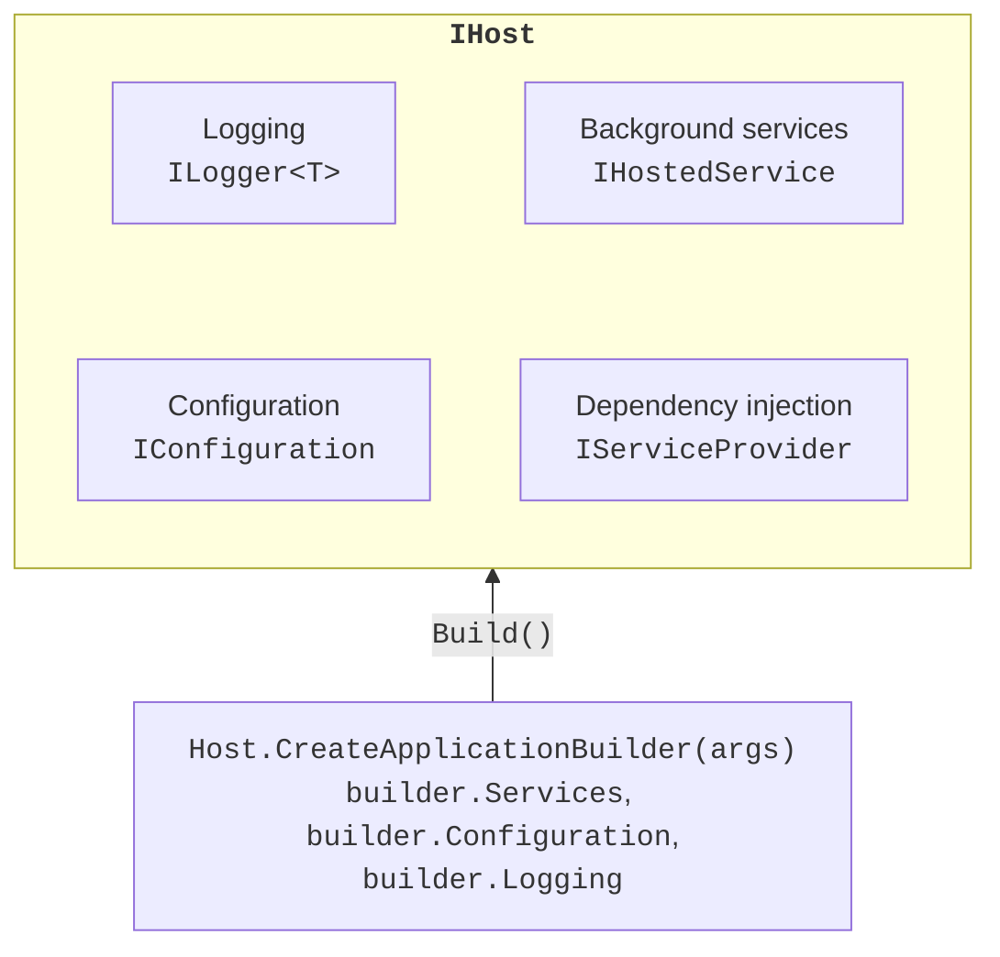
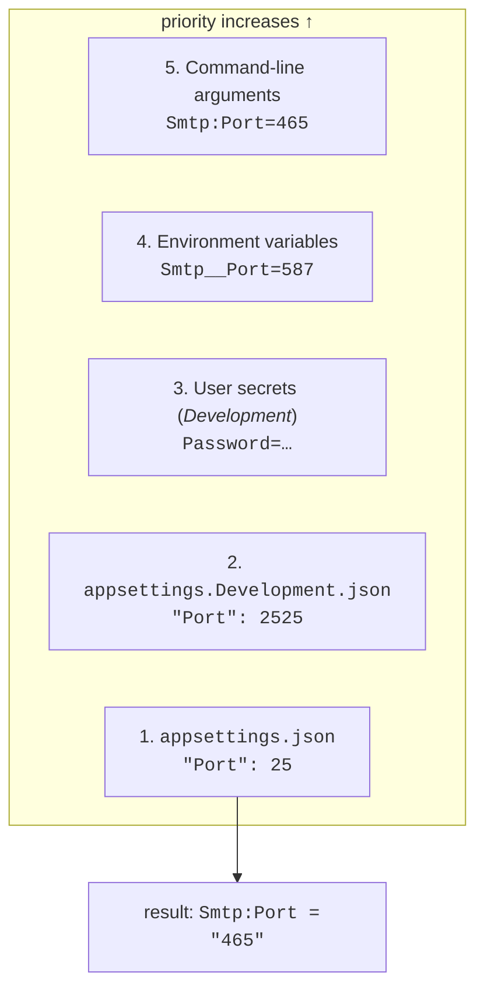

# The host, configuration, and options

## The .NET Generic Host

Besides DI, a console program usually needs configuration, logging, and graceful shutdown. All of this is brought together by the **.NET Generic Host**—an `IHost` object from the `Microsoft.Extensions.Hosting` package (Fig. 6.4, <https://learn.microsoft.com/dotnet/core/extensions/generic-host>). ASP.NET Core is built on it as well.



Figure 6.4. The components of the Generic Host {.caption}

The `Host.CreateApplicationBuilder(args)` method creates a builder with default settings:

- the content root folder is the current folder;
- host configuration from environment variables with the `DOTNET_` prefix and command-line arguments;
- application configuration from `appsettings.json`, `appsettings.{Environment}.json`, user secrets (only in *Development*), environment variables, and the command line;
- the `Console`, `Debug`, `EventSource`, and `EventLog` (Windows only) logging providers;
- scope and dependency validation (`ValidateScopes`, `ValidateOnBuild`) in *Development*.

The builder has the `Services`, `Configuration`, `Logging`, and `Environment` properties. The `Build()` method creates the host, and `Run()` or `await RunAsync()` starts it and waits for it to finish. The *Worker Service* template (`dotnet new worker`) creates exactly such a project: `Program.cs` with a host, a `Worker` class, the `appsettings.json` and `appsettings.Development.json` files, and `Properties/launchSettings.json`.

A **hosted service** (background service) implements `IHostedService` with the `StartAsync` and `StopAsync` methods and is registered with the `AddHostedService<T>()` method. It is more convenient to inherit the abstract `BackgroundService` class and override a single method, `ExecuteAsync(CancellationToken)`: the token is canceled when the host stops.

The host stops when the user presses **Ctrl+C** (or the process receives `SIGTERM`) or code calls `IHostApplicationLifetime.StopApplication()`. The host cancels the tokens of the background services, calls their `StopAsync`, disposes the container, and returns control from `Run`. The `ApplicationStarted`, `ApplicationStopping`, and `ApplicationStopped` events of the same interface let you run code at each stage. The `Environment.Exit` method does not provide graceful shutdown.

## Configuration

**Configuration** consists of settings that are changed without recompiling: server addresses, ports, intervals, log levels. The `IConfiguration` interface presents them as key–value pairs with string values. Hierarchical keys are separated by a colon: a `Smtp` section with a nested `Port` key in JSON gives the key `Smtp:Port`. Keys are case-insensitive (<https://learn.microsoft.com/dotnet/core/extensions/configuration>). The indexer `config["Smtp:Host"]` returns a string or `null`, `GetValue<T>` converts the value to the required type, `GetSection` returns a section, and `GetConnectionString("Shop")` reads the key `ConnectionStrings:Shop`.

### Configuration providers and their priority

Values come from **configuration providers**. The host adds them in a certain order, and if a key exists in several sources, the **one added later** wins (Fig. 6.5, <https://learn.microsoft.com/dotnet/core/extensions/configuration-providers>). So general settings live in `appsettings.json`, and a particular computer or run overrides them without changing any files.



Figure 6.5. The priority order of configuration providers {.caption}

- **JSON files** are copied to the output folder (the *Worker Service* template does this itself). The host rereads them after changes are saved (`reloadOnChange`).
- The **environment** is set by the `DOTNET_ENVIRONMENT` variable: `Development`, `Staging`, `Production` (the default). It determines which `appsettings.{Environment}.json` file is loaded and whether user secrets are included. The check in code: `builder.Environment.IsDevelopment()`.
- **Environment variables** are written with a double underscore instead of a colon: `Smtp__Port`. The colon does not work on all platforms, while `__` is supported everywhere.
- **Command-line arguments** look like `Smtp:Port=465`, `--Smtp:Port 465`, or `/Smtp:Port 465`; the forms with `=` and with a space are not mixed in one command. After `dotnet run`, the program's arguments are separated by `--`.

When launched from Visual Studio or with `dotnet run`, environment variables and arguments are taken from the launch profile `Properties/launchSettings.json`. The *Worker Service* template sets `DOTNET_ENVIRONMENT=Development` in it. The profile is edited in the *Debug → &lt;Project&gt; Debug Properties* window (Fig. 6.6); an `.exe` run directly does not read this file.


Figure 6.6. Environment variables and arguments in a launch profile {.caption}

The `ConfigDemo` program (the *Worker Service* template) prints the SMTP settings. `appsettings.json` has the host `smtp.example.com`, port 25, and `"UseSsl": false`, and `appsettings.Development.json` has the host `localhost` and port 2525:

```cs
HostApplicationBuilder builder = Host.CreateApplicationBuilder(args);
IConfiguration config = builder.Configuration;

string? host = config["Smtp:Host"];               // a string or null
int port = config.GetValue<int>("Smtp:Port");     // type conversion
bool ssl = config.GetValue("Smtp:UseSsl", defaultValue: true);
IConfigurationSection smtp = config.GetSection("Smtp");
string password = smtp["Password"] ?? "(not set)";

Console.WriteLine($"{builder.Environment.EnvironmentName}: " +
    $"{host}:{port}, SSL {ssl}, password {password}");
```

Four runs in PowerShell and their results (the service lines from `dotnet run` are omitted):

```powershell
dotnet run                          # profile: Development
dotnet run --no-launch-profile      # no profile: Production
$env:Smtp__Port = "587"; dotnet run
dotnet run -- Smtp:Port=465 Smtp:UseSsl=true
```

```
Development: localhost:2525, SSL False, password (not set)
Production: smtp.example.com:25, SSL False, password (not set)
Development: localhost:587, SSL False, password (not set)
Development: localhost:465, SSL True, password (not set)
```

The environment variable overrode both files, and the command line also overrode the environment variable, which remained set in the same PowerShell window.

## User secrets

Passwords, API keys, and connection strings with passwords **must not** be written to `appsettings.json`: the file goes into Git (Topic 1), and a secret removed in the next commit remains in the history. On a developer's computer, secrets are stored by the **Secret Manager** (<https://learn.microsoft.com/aspnet/core/security/app-secrets>):

```powershell
dotnet user-secrets init        # adds <UserSecretsId> to the .csproj
dotnet user-secrets set "Smtp:Password" "Pa55-w0rd"
dotnet user-secrets list        # Smtp:Password = Pa55-w0rd
dotnet user-secrets remove "Smtp:Password"
dotnet user-secrets clear
```

Secrets are written to the `%APPDATA%\Microsoft\UserSecrets\<UserSecretsId>\secrets.json` file **outside** the project folder, so they do not end up in the repository. The *Worker Service* template already contains a `UserSecretsId`. In Visual Studio, the file is opened by the *Manage User Secrets* command in the project's context menu (Fig. 6.7). The host includes secrets only in the *Development* environment: after `set`, the `ConfigDemo` program run with the profile prints `Development: localhost:2525, SSL False, password Pa55-w0rd`, and without the profile `(not set)`.


Figure 6.7. User secrets in Visual Studio {.caption}

::: tip Important
The Secret Manager **does not encrypt** the file and is intended for development only. On a server, secrets are passed through environment variables or dedicated vaults (for example, Azure Key Vault). If a secret has already ended up in Git, it is considered exposed and must be changed.
:::

## The options pattern

Reading settings by string keys is inconvenient: a typo in `"Smtp:Prot"` gives `null`, and the type is checked only at run time. The **options pattern** binds a configuration section to a class whose properties have the same names (<https://learn.microsoft.com/dotnet/core/extensions/options>). An options class must have a public parameterless constructor and properties with `get` and `set`.

```cs
public class DiscountOptions
{
    public int Percent { get; set; }
}

builder.Services.Configure<DiscountOptions>(
    builder.Configuration.GetSection("Discount"));
// or with validation (see below):
builder.Services.AddOptions<DiscountOptions>()
    .Bind(builder.Configuration.GetSection("Discount"));
```

A service receives options through one of three interfaces (Table 6.2).

Table 6.2. Options pattern interfaces {.caption}

| **Interface** | **Lifetime** | **Value after the file changes** |
| --- | --- | --- |
| `IOptions<T>` | Singleton | does not change: `Value` is read once |
| `IOptionsSnapshot<T>` | Scoped | new in each new scope; cannot be used in a Singleton |
| `IOptionsMonitor<T>` | Singleton | always the current `CurrentValue`, the `OnChange` event |

The program reads the discount in three ways, changes `appsettings.json` while running, and reads it again a second later:

```cs
var monitor = host.Services
    .GetRequiredService<IOptionsMonitor<DiscountOptions>>();
monitor.OnChange(o =>
    Console.WriteLine($"  OnChange: {o.Percent} %"));
var fixedValue = host.Services
    .GetRequiredService<IOptions<DiscountOptions>>();

Print("Start");
File.WriteAllText("appsettings.json",
    """{ "Discount": { "Percent": 15 } }""");
await Task.Delay(1000);                  // the file is reread
Print("After the file change");

void Print(string title)
{
    using IServiceScope scope = host.Services.CreateScope();
    var snapshot = scope.ServiceProvider
        .GetRequiredService<IOptionsSnapshot<DiscountOptions>>();
    Console.WriteLine(
        $"{title}: IOptions {fixedValue.Value.Percent}, " +
        $"Snapshot {snapshot.Value.Percent}, " +
        $"Monitor {monitor.CurrentValue.Percent}");
}
```

```
Start: IOptions 5, Snapshot 5, Monitor 5
  OnChange: 15 %
  OnChange: 15 %
After the file change: IOptions 5, Snapshot 15, Monitor 15
```

The `OnChange` event fired twice: the file system reports a file write with several notifications, so the handler must be prepared for repeats.

### Validating options

An invalid value in the configuration is better detected **at startup** than after an hour of running. `OptionsBuilder` supports three kinds of validation:

- `ValidateDataAnnotations()`—the `[Required]`, `[Range]`, `[RegularExpression]` attributes from the `System.ComponentModel.DataAnnotations` namespace (the `Microsoft.Extensions.Options.DataAnnotations` package);
- `Validate(o => condition, "message")`—an arbitrary rule, for example a relationship between two properties;
- a class that implements `IValidateOptions<T>` for complex rules.

Without additional calls, validation runs on the first access to `Value`, and calling `ValidateOnStart()` moves it to host startup: the host does not start and logs an `OptionsValidationException` with a list of all errors. An example is given in the "Weather monitor" program below.
