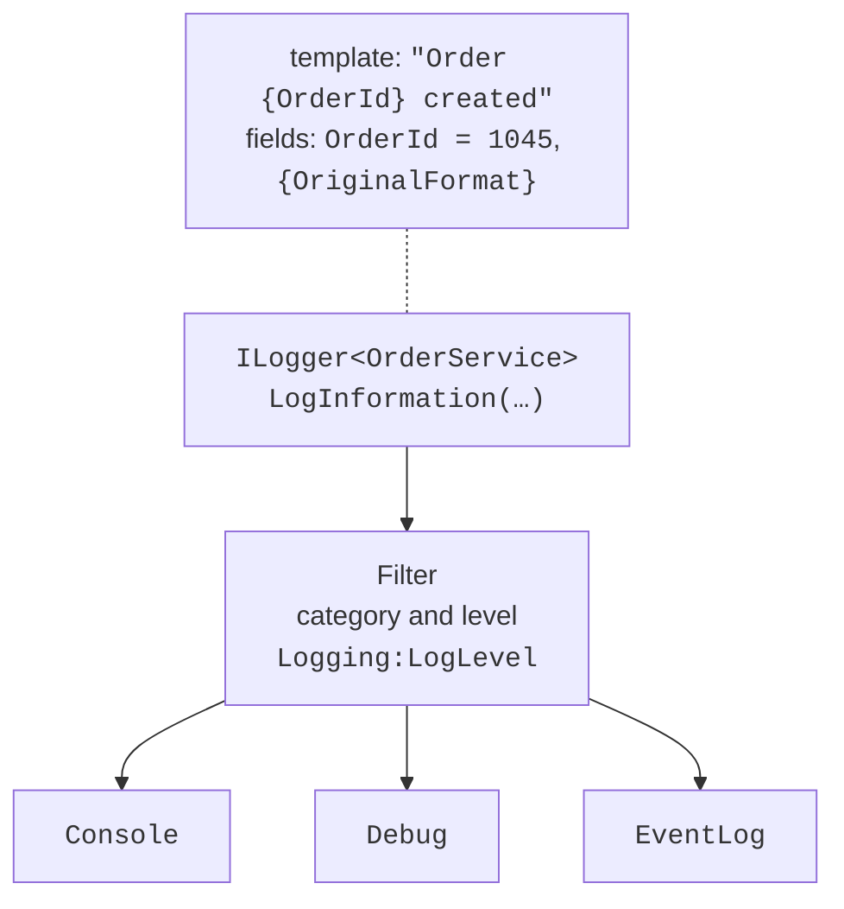

# Logging

## Logging

A **log** is a sequence of records about program events: startup, completed operations, warnings, errors. Unlike `Console.WriteLine`, a log has severity levels, filters, and several destinations, which are configured without changing the code (<https://learn.microsoft.com/dotnet/core/extensions/logging/overview>).

A service receives a logger through its constructor as `ILogger<T>`. The type parameter sets the **category**—the full class name, for example `Shop.OrderService`. Each record has a **level** (Table 6.3). Without configuration, levels from `Information` and above are written.

Table 6.3. Log levels {.caption}

| **Level** | **Number** | **Method** | **When to use** |
| --- | --- | --- | --- |
| `Trace` | 0 | `LogTrace` | the most detailed data; may contain sensitive information |
| `Debug` | 1 | `LogDebug` | debugging during development |
| `Information` | 2 | `LogInformation` | the normal flow of work |
| `Warning` | 3 | `LogWarning` | unusual events that do not stop the work |
| `Error` | 4 | `LogError` | an error in the current operation |
| `Critical` | 5 | `LogCritical` | a failure that requires immediate attention |
| `None` | 6 | – | turn logging off |

### Message templates

The first argument of the `Log…` methods is a **message template** with named placeholders in curly braces, and the values are passed as the following arguments. The values are substituted by **position**, not by name. The provider receives both the finished text and the separate fields: this is **structured logging**, in which records can be searched and filtered by the `OrderId` field rather than by parsing text.

```cs
logger.LogInformation("Customer {Customer} paid {Amount} UAH",
    customer, amount);                        // correct
logger.LogInformation($"Customer {customer} paid {amount} UAH");
// bad: the fields are lost, and the string is built even for a disabled level
```

For the second line, the .NET analyzer issues warning CA2254 (the template should be a constant expression). An exception is passed as the first argument: `logger.LogError(ex, "Order error {Id}", id)`. Numbers and dates in the log text are formatted with the invariant culture, that is, with a period: `1250.5`.

The `BeginScope` method opens a **log scope**: its data is added to all records inside the `using` block. A program with the `LoggerFactory.Create` factory (the `Microsoft.Extensions.Logging.Console` package) demonstrates levels, categories, a filter, and a scope:

```cs
using ILoggerFactory factory = LoggerFactory.Create(logging =>
{
    logging.SetMinimumLevel(LogLevel.Debug);
    logging.AddFilter("Shop.Payments", LogLevel.Warning);
    logging.AddSimpleConsole(o => o.IncludeScopes = true);
});

ILogger orders = factory.CreateLogger("Shop.Orders");
ILogger payments = factory.CreateLogger("Shop.Payments");

int id = 1045;
decimal amount = 1250.5m;
orders.LogDebug("Checking the cart");
using (orders.BeginScope("Order {OrderId}", id))
{
    orders.LogInformation("Customer {Customer} paid {Amount} UAH",
        "Olena", amount);
    payments.LogInformation("Payment of {Amount} UAH succeeded", amount);
    payments.LogWarning("Duplicate payment of {Amount} UAH", amount);
}
```

The `Shop.Payments` category passes only warnings, so the informational record about the payment is filtered out. The line `=> Order 1045` is the scope:

```
dbug: Shop.Orders[0]
      Checking the cart
info: Shop.Orders[0]
      => Order 1045
      Customer Olena paid 1250.5 UAH
warn: Shop.Payments[0]
      => Order 1045
      Duplicate payment of 1250.5 UAH
```

### Filters in configuration

In an application with a host, levels are set in the `Logging` section of the configuration. `LogLevel:Default` applies to all categories, a category name applies to it and all categories with that prefix (`Microsoft` covers `Microsoft.Hosting.Lifetime`), and a nested provider section (`Console`, `Debug`) overrides the general rules for that provider. The longest prefix match is chosen:

```json
{
  "Logging": {
    "LogLevel": {
      "Default": "Information",
      "Microsoft": "Warning",
      "Microsoft.Hosting.Lifetime": "Information"
    },
    "Console": {
      "FormatterName": "simple",
      "FormatterOptions": { "SingleLine": true }
    }
  }
}
```

### Logging providers

Records that pass the filter are received by all connected **logging providers** (Fig. 6.8, <https://learn.microsoft.com/dotnet/core/extensions/logging/providers>):

- `Console`—the console window; the **formatters** `simple` (the default, with the `SingleLine`, `TimestampFormat`, and `IncludeScopes` options), `json`, and `systemd`;
- `Debug`—the Visual Studio *Output* window through `System.Diagnostics.Debug`, only when a debugger is attached;
- `EventSource`—`Microsoft-Extensions-Logging` trace events for the `dotnet-trace` tool;
- `EventLog`—the Windows *Application* log (Event Viewer). It does not inherit the general rules and by default writes only levels from `Warning` up.



Figure 6.8. The logging pipeline {.caption}

The `builder.Logging.ClearProviders()` method removes the default providers, after which you add the ones you need: `AddConsole()`, `AddJsonConsole()`, `AddDebug()`. The `json` formatter writes each record as a JSON object with the `EventId`, `LogLevel`, `Category`, `Message`, and `State` fields, where `State` contains the separate placeholder values (`"Customer": "Olena"`, `"Amount": 1250.5`) and the template itself.

The built-in providers do not write logs to files. For that, third-party libraries such as Serilog or NLog are used; they plug into the same `ILogger<T>`.

### The `[LoggerMessage]` source generator

The `LogInformation` methods parse the template every time and box numbers into objects. For frequently executed code, a **source generator** is recommended: in a `partial` class, you declare a `partial` method with the `[LoggerMessage]` attribute, which specifies the event ID, level, and template. The compiler creates the implementation; the method parameters match the placeholders case-insensitively (<https://learn.microsoft.com/dotnet/core/extensions/logging/source-generation>). An example of such declarations is the `WeatherWorker` class below.

An instance method takes the logger from a field or a primary constructor parameter of type `ILogger`; a static method receives `ILogger` as its first parameter. The method returns `void`, and a parameter of type `Exception` is passed as the record's exception. Errors in the template become compiler warnings.

### The "Weather monitor" example

A console host (the *Worker Service* template) periodically reads the temperature from a sensor, logs the measurements, and warns about heat. The monitor's options are read from the `Weather` section and validated at startup. The sensor is simulated: every fifth measurement ends with a timeout. `Program.cs`:

```cs
using System.ComponentModel.DataAnnotations;

Console.OutputEncoding = System.Text.Encoding.UTF8;

HostApplicationBuilder builder = Host.CreateApplicationBuilder(args);

builder.Services.AddOptions<WeatherOptions>()
    .Bind(builder.Configuration.GetSection(WeatherOptions.Section))
    .ValidateDataAnnotations()
    .ValidateOnStart();
builder.Services.AddSingleton<ITemperatureSensor, FakeSensor>();
builder.Services.AddHostedService<WeatherWorker>();

using IHost host = builder.Build();
await host.RunAsync();

public class WeatherOptions
{
    public const string Section = "Weather";

    [Required]
    public string City { get; set; } = "";

    [Range(1, 3600)]
    public int IntervalSeconds { get; set; } = 60;

    [Range(-50, 60)]
    public double AlertTemperature { get; set; } = 35;
}

public interface ITemperatureSensor
{
    double Read();
}

// A simulated sensor: every fifth measurement fails.
public class FakeSensor : ITemperatureSensor
{
    private readonly Random random = new(2026);
    private int count;

    public double Read()
    {
        if (++count % 5 == 0)
            throw new TimeoutException("no response");
        return 24 + random.NextDouble() * 10;
    }
}
```

The `WeatherWorker.cs` background service receives the sensor, options, and logger through a primary constructor:

```cs
using Microsoft.Extensions.Options;

public partial class WeatherWorker(
    ITemperatureSensor sensor,
    IOptions<WeatherOptions> options,
    ILogger<WeatherWorker> logger) : BackgroundService
{
    private int readings;

    protected override async Task ExecuteAsync(
        CancellationToken stoppingToken)
    {
        WeatherOptions o = options.Value;
        LogStarted(o.City, o.IntervalSeconds);
        while (!stoppingToken.IsCancellationRequested)
        {
            try
            {
                double t = sensor.Read();
                readings++;
                if (t >= o.AlertTemperature)
                    LogHeat(o.City, t, o.AlertTemperature);
                else
                    LogReading(o.City, t);
            }
            catch (TimeoutException ex)
            {
                LogSensorError(o.City, ex.Message);
            }
            await Task.Delay(TimeSpan.FromSeconds(o.IntervalSeconds),
                stoppingToken);
        }
    }

    public override Task StopAsync(CancellationToken token)
    {
        LogStopped(readings);
        return base.StopAsync(token);
    }

    [LoggerMessage(1, LogLevel.Information,
        "Monitoring {City} every {Seconds} s")]
    private partial void LogStarted(string city, int seconds);

    [LoggerMessage(2, LogLevel.Information,
        "{City}: {Temperature:F1} °C")]
    private partial void LogReading(string city, double temperature);

    [LoggerMessage(3, LogLevel.Warning,
        "{City}: heat {Temperature:F1} °C (threshold {Limit} °C)")]
    private partial void LogHeat(string city, double temperature,
        double limit);

    [LoggerMessage(4, LogLevel.Error,
        "{City}: sensor error – {Error}")]
    private partial void LogSensorError(string city, string error);

    [LoggerMessage(5, LogLevel.Information,
        "Monitoring stopped, readings: {Count}")]
    private partial void LogStopped(int count);
}
```

The `appsettings.json` file contains a `Weather` section with the options (the city "Madrid", an interval of 2 s, a threshold of 30 °C) and the `Logging` section shown in "Filters in configuration".

When the user presses **Ctrl+C**, `Task.Delay` receives the canceled token and ends the loop with an `OperationCanceledException`, which the host expects. Then the host calls `StopAsync`. The result (long lines of the `Microsoft.Hosting.Lifetime` category are wrapped, the path is shortened; see also Fig. 6.9):

```
info: Microsoft.Hosting.Lifetime[0]
      Application started. Press Ctrl+C to shut down.
info: Microsoft.Hosting.Lifetime[0] Hosting environment: Production
info: Microsoft.Hosting.Lifetime[0] Content root path: D:\Courses\OOP C#\Code\Lec06\…
info: WeatherWorker[1] Monitoring Madrid every 2 s
info: WeatherWorker[2] Madrid: 25.6 °C
info: WeatherWorker[2] Madrid: 26.8 °C
warn: WeatherWorker[3] Madrid: heat 33.2 °C (threshold 30 °C)
warn: WeatherWorker[3] Madrid: heat 33.9 °C (threshold 30 °C)
fail: WeatherWorker[4] Madrid: sensor error – no response
warn: WeatherWorker[3] Madrid: heat 33.2 °C (threshold 30 °C)
info: WeatherWorker[2] Madrid: 24.8 °C
info: Microsoft.Hosting.Lifetime[0] Application is shutting down...
info: WeatherWorker[5] Monitoring stopped, readings: 6
```


Figure 6.9. The weather monitor log in the console {.caption}

The event ID from the attribute appears in square brackets after the category. A run with invalid options, `dotnet run -- Weather:IntervalSeconds=0 Weather:City=`, does not start: a `fail` record of the `Microsoft.Extensions.Hosting.Internal.Host` category "Hosting failed to start" and an unhandled exception (lines wrapped):

```
Unhandled exception. Microsoft.Extensions.Options.
OptionsValidationException: DataAnnotation validation failed for
'WeatherOptions' members: 'City' with the error: 'The City field is
required.'.; DataAnnotation validation failed for 'WeatherOptions'
members: 'IntervalSeconds' with the error: 'The field IntervalSeconds
must be between 1 and 3600.'.
```
