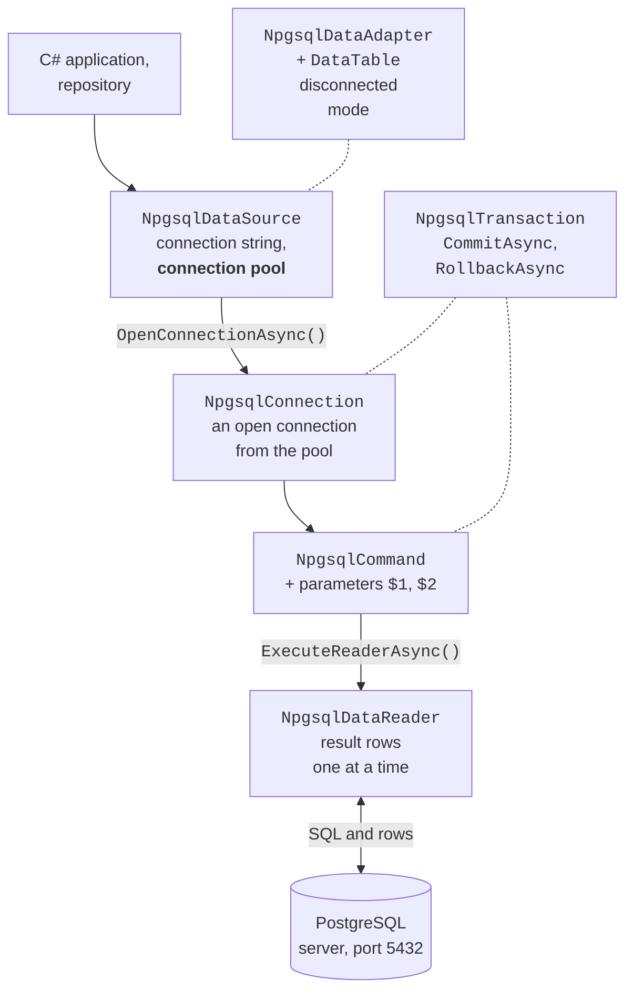

# ADO.NET architecture and commands

## ADO.NET architecture

**ADO.NET** is a set of .NET classes for working with data sources (<https://learn.microsoft.com/dotnet/framework/data/adonet/ado-net-overview>). The abstract base classes of the `System.Data.Common` namespace define a common interface, and a **data provider** for a particular DBMS implements them (Table 7.2). Providers are distributed as NuGet packages: Microsoft.Data.SqlClient (SQL Server), Microsoft.Data.Sqlite, MySqlConnector, **Npgsql** (PostgreSQL). So code for different DBMSs is similar: the class prefixes and the SQL dialect differ.

Table 7.2. The main ADO.NET and Npgsql provider classes {.caption}

| **Base class** | **Npgsql** | **Purpose** |
| --- | --- | --- |
| `DbDataSource` | `NpgsqlDataSource` | a factory of connections and commands, the connection pool |
| `DbConnection` | `NpgsqlConnection` | a connection to the server |
| `DbCommand` | `NpgsqlCommand` | an SQL command with parameters |
| `DbParameter` | `NpgsqlParameter` | the value of a command parameter |
| `DbDataReader` | `NpgsqlDataReader` | sequential reading of result rows |
| `DbTransaction` | `NpgsqlTransaction` | a transaction |
| `DbDataAdapter` | `NpgsqlDataAdapter` | filling a `DataTable` and saving changes |

ADO.NET has two modes of operation. In **connected** mode, the program opens a connection, executes a command, and reads the result while the connection is open (Fig. 7.8). In **disconnected** mode, the data is copied into a `DataTable` object in memory, the connection is closed, and changes are saved later in a single operation. The Entity Framework Core object-relational mapper (Topic 8) is built on top of an ADO.NET provider.



Figure 7.8. ADO.NET architecture with the Npgsql provider {.caption}

### The Npgsql package

**Npgsql** is an open-source ADO.NET provider for PostgreSQL (<https://www.npgsql.org/doc/>). As of September 2026, the current package version is 10.0.3 for .NET 8, 9, and 10 (<https://www.nuget.org/packages/Npgsql>). The package is added in *Solution Explorer*: the project context menu *Manage NuGet Packages…*, the *Browse* tab, search for `Npgsql`, the *Install* button (Fig. 7.9), or with the command:

```powershell
dotnet add package Npgsql
```

::: info Screenshot
Visual Studio 2026: project context menu → Manage NuGet Packages… → Browse → "Npgsql"; package selected, version 10.0.3, Install button
:::

Figure 7.9. Installing the Npgsql package in Visual Studio {.caption}

### The connection string and configuration

A **connection string** contains `key=value` pairs separated by semicolons (<https://www.npgsql.org/doc/connection-string-parameters.html>):

```
Host=localhost;Port=5432;Database=library;Username=library_app;
Password=Change-Me-2026
```

A connection string with a password **must not** be written in code or in `appsettings.json`, which goes into Git. As discussed in Topic 6, during development it is stored in **user secrets**—a `secrets.json` file in the user profile outside the project folder (<https://learn.microsoft.com/aspnet/core/security/app-secrets>)—and on a server in the `ConnectionStrings__Library` environment variable. Secrets are added with the `Microsoft.Extensions.Configuration.UserSecrets` package:

```powershell
dotnet add package Microsoft.Extensions.Configuration.UserSecrets
dotnet add package `
    Microsoft.Extensions.Configuration.EnvironmentVariables
dotnet user-secrets init
$cs = "Host=localhost;Database=library;Username=library_app;" +
    "Password=Change-Me-2026"
dotnet user-secrets set "ConnectionStrings:Library" $cs
```

The `config.GetConnectionString("Library")` method reads the `ConnectionStrings:Library` key; if the string is not configured, it returns `null`.

### `NpgsqlDataSource` and the connection pool

Opening a physical connection to the server is an expensive operation: a network connection, authentication, creating a process on the server. So Npgsql uses a **connection pool** by default: when the program closes or disposes an `NpgsqlConnection`, the physical connection is not closed but is returned to the pool and used by the next open (<https://www.npgsql.org/doc/basic-usage.html>). The pool parameters are set in the connection string: `Pooling` (`true` by default), `Minimum Pool Size` (0), `Maximum Pool Size` (100), `Connection Idle Lifetime` (300 s—the time after which extra idle connections are closed).

The pool belongs to the **`NpgsqlDataSource`** object, which is created **once** for the whole application and is thread-safe.

The `dataSource.CreateCommand(sql)` method creates a command that takes a connection from the pool itself and returns it after execution, and `await dataSource.OpenConnectionAsync()` opens a connection for several commands and a transaction.

Thanks to the pool, the right style is to open connections as late as possible and release them as early as possible (`await using`), rather than keeping one connection open for the entire run of the program.

## Executing commands

### The `ExecuteNonQuery`, `ExecuteScalar`, and `ExecuteReader` methods

An `NpgsqlCommand` object executes SQL with one of three methods, depending on the result (Table 7.3). Each has an asynchronous version with the `Async` suffix that does not block the thread while waiting for the server's response (Topic 5): in desktop applications the interface does not "freeze", and in web services the thread serves other requests.

Table 7.3. Command execution methods {.caption}

| **Method** | **Returns** | **Use** |
| --- | --- | --- |
| `ExecuteNonQueryAsync` | `int`—the number of rows changed | `INSERT`, `UPDATE`, `DELETE`, DDL |
| `ExecuteScalarAsync` | `object?`—the first value of the first row | `count(*)`, `INSERT … RETURNING id` |
| `ExecuteReaderAsync` | `NpgsqlDataReader` | `SELECT` with many rows |

### Reading results

`NpgsqlDataReader` reads the result **sequentially, forward only**: the `ReadAsync()` method moves to the next row and returns `false` when the rows run out. The values of the current row are read with typed methods by column number (from 0): `GetInt32`, `GetInt64`, `GetString`, `GetDecimal`, `GetBoolean`, `GetDateTime`, or the universal `GetFieldValue<T>` (for example, `GetFieldValue<DateOnly>`). The column number for a name is returned by `GetOrdinal("title")`.

If a cell contains `NULL`, the typed methods throw an `InvalidCastException`. So columns that can be empty are first checked with the `IsDBNull` method. Likewise, `ExecuteScalarAsync` returns `DBNull.Value` if the value is empty, and `null` if there are no rows. To pass `NULL` in a parameter, use `DBNull.Value`.

While a reader is open, the connection is occupied by it: another command cannot be executed on the same connection. So the reader is disposed immediately after reading (`await using`).

### The "Book catalog" example

A console application adds a book, changes the number of copies, searches for books by part of the title, and issues a loan. All the SQL for the `books` table is collected in a **repository** class: the rest of the program calls the `AddAsync` and `FindAsync` methods and does not depend on SQL. The project is a .NET 10 console application with the `Npgsql`, `Microsoft.Extensions.Configuration.UserSecrets`, and `…EnvironmentVariables` packages. A book is described by the record `public record Book(int Id, string Title, int? PubYear, string? Isbn, int Copies);` (the `Book.cs` file).

The repository receives `NpgsqlDataSource` through a primary constructor. Command parameters are positional: `$1`, `$2` correspond to the first and second parameters added (the `BookRepository.cs` file):

```cs
using Npgsql;

namespace Library;

// A repository: all the SQL for the books table in one class.
public class BookRepository(NpgsqlDataSource dataSource)
{
    public async Task<long> CountAsync()
    {
        await using NpgsqlCommand cmd =
            dataSource.CreateCommand("SELECT count(*) FROM books");
        return (long)(await cmd.ExecuteScalarAsync())!;
    }

    public async Task<int> AddAsync(string title, int? pubYear,
        string? isbn, int copies)
    {
        await using NpgsqlCommand cmd = dataSource.CreateCommand("""
            INSERT INTO books (title, pub_year, isbn, copies)
            VALUES ($1, $2, $3, $4)
            RETURNING id
            """);
        cmd.Parameters.AddWithValue(title);
        cmd.Parameters.AddWithValue((object?)pubYear ?? DBNull.Value);
        cmd.Parameters.AddWithValue((object?)isbn ?? DBNull.Value);
        cmd.Parameters.AddWithValue(copies);
        return (int)(await cmd.ExecuteScalarAsync())!;
    }
```

The `count(*)` function returns `bigint`, so the result is cast to `long`. The raw string literal `"""…"""` keeps multiline SQL without escaping.

```cs
public async Task<int> UpdateCopiesAsync(int id, int copies)
{
    await using NpgsqlCommand cmd = dataSource.CreateCommand(
        "UPDATE books SET copies = $1 WHERE id = $2");
    cmd.Parameters.AddWithValue(copies);
    cmd.Parameters.AddWithValue(id);
    return await cmd.ExecuteNonQueryAsync();  // number of rows
}
```

The `ExecuteNonQueryAsync` method returns 0 if there is no book with that `id`: this is how the program learns that there was nothing to change. The `DeleteAsync` method with the `DELETE FROM books WHERE id = $1` command is written the same way. The search reads rows into a list of `Book` objects:

```cs
    public async Task<List<Book>> FindAsync(string text)
    {
        await using NpgsqlCommand cmd = dataSource.CreateCommand("""
            SELECT id, title, pub_year, isbn, copies
            FROM books
            WHERE title ILIKE $1
            ORDER BY title
            """);
        cmd.Parameters.AddWithValue($"%{text}%");
        await using NpgsqlDataReader reader =
            await cmd.ExecuteReaderAsync();
        var books = new List<Book>();
        while (await reader.ReadAsync())
        {
            books.Add(new Book(
                reader.GetInt32(0),
                reader.GetString(1),
                reader.IsDBNull(2) ? null : reader.GetInt32(2),
                reader.IsDBNull(3) ? null : reader.GetString(3),
                reader.GetFieldValue<int>(4)));
        }
        return books;
    }
}
```

The `Program.cs` file reads the connection string from the configuration, creates a single `NpgsqlDataSource`, and catches database errors. The `LoanService` class is covered in the section "Transactions".

```cs
using Library;
using Microsoft.Extensions.Configuration;
using Npgsql;

IConfiguration config = new ConfigurationBuilder()
    .AddUserSecrets<Program>()
    .AddEnvironmentVariables()
    .Build();
string connectionString = config.GetConnectionString("Library")
    ?? throw new InvalidOperationException(
        "Connection string 'Library' is not configured.");

await using NpgsqlDataSource dataSource =
    NpgsqlDataSource.Create(connectionString);
var books = new BookRepository(dataSource);
var loans = new LoanService(dataSource);
```

```cs
try
{
    Console.WriteLine($"Books: {await books.CountAsync()}");
    int id = await books.AddAsync("Code Complete", 2004,
        "978-0735619678", 2);
    Console.WriteLine($"Added book {id}");
    Console.WriteLine(
        $"Updated: {await books.UpdateCopiesAsync(id, 5)}");
    foreach (Book b in await books.FindAsync("code"))
    {
        Console.WriteLine(
            $"{b.Id,3} {b.Title,-15} {b.PubYear,5} {b.Copies,3}");
    }

    long loanId = await loans.IssueAsync(id, readerId: 3, days: 14);
    Console.WriteLine($"Loan {loanId} issued");
    await loans.IssueAsync(bookId: 4, readerId: 3, days: 14);
}
catch (InvalidOperationException ex)
{
    Console.Error.WriteLine(ex.Message);
}
catch (PostgresException ex)
    when (ex.SqlState == PostgresErrorCodes.UniqueViolation)
{
    Console.Error.WriteLine($"Duplicate: {ex.ConstraintName}");
}
catch (NpgsqlException ex)
{
    Console.Error.WriteLine($"Database error: {ex.Message}");
}
```

The result of the first run after the "Library" script: the case-insensitive search for "code" finds two books, and book 4 (*Clean Architecture*) has no available copies:

```
Books: 5
Added book 6
Updated: 1
  3 Clean Code       2008   1
  6 Code Complete    2004   5
Loan 6 issued
Book 4 is not available.
```

An error reported by the server is represented by a `PostgresException` (a descendant of `NpgsqlException`) with the `SqlState` code and the `ConstraintName` constraint name: running the program again causes an ISBN uniqueness violation (code `23505`, the constant `PostgresErrorCodes.UniqueViolation`) and prints `Duplicate: books_isbn_key`. If the server is not running, the program prints:

```
Database error: Failed to connect to 127.0.0.1:5432
```
