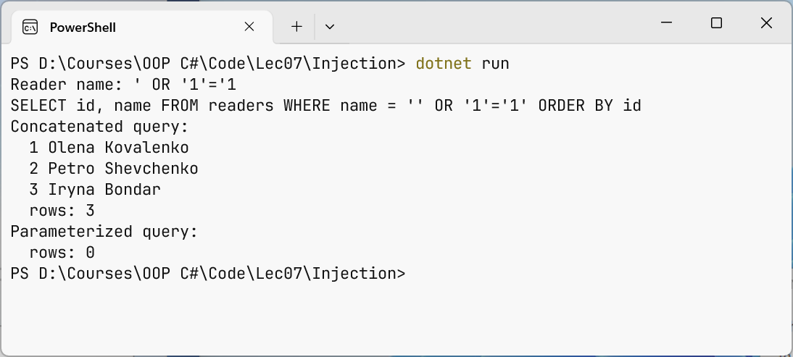
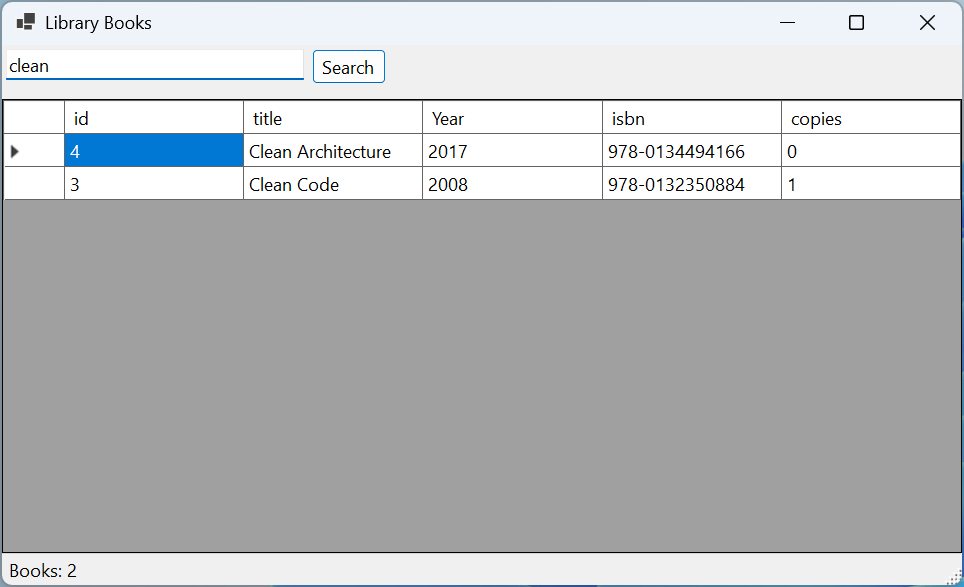

# Parameters, transactions, and DataGridView

## SQL injection and parameterized queries

The most dangerous mistake when working with a database is building SQL text from strings entered by the user. **SQL injection** is an attack in which an attacker enters a fragment of SQL, and the server executes it as part of the command (<https://owasp.org/www-community/attacks/SQL_Injection>). This can be used to read other people's data, bypass a password check, or drop tables.

### The "SQL injection" example

The program searches for a reader by name in two ways: by string concatenation and with a parameter. The `using` directives and the creation of `dataSource` are the same as in `Program.cs` of the "Book catalog" example.

```cs
Console.Write("Reader name: ");
string name = Console.ReadLine() ?? "";

// DANGEROUS: the entered text becomes part of the SQL command.
string sql = "SELECT id, name FROM readers "
    + $"WHERE name = '{name}' ORDER BY id";
Console.WriteLine(sql);
await using (NpgsqlCommand unsafeCmd = dataSource.CreateCommand(sql))
{
    await PrintReadersAsync("Concatenated query", unsafeCmd);
}
```

```cs
// Safe: the value is sent separately from the command text.
await using (NpgsqlCommand safeCmd = dataSource.CreateCommand(
    "SELECT id, name FROM readers WHERE name = $1 ORDER BY id"))
{
    safeCmd.Parameters.AddWithValue(name);
    await PrintReadersAsync("Parameterized query", safeCmd);
}

static async Task PrintReadersAsync(string title, NpgsqlCommand cmd)
{
    Console.WriteLine($"{title}:");
    await using NpgsqlDataReader reader =
        await cmd.ExecuteReaderAsync();
    int count = 0;
    while (await reader.ReadAsync())
    {
        Console.WriteLine(
            $"  {reader.GetInt32(0)} {reader.GetString(1)}");
        count++;
    }
    Console.WriteLine($"  rows: {count}");
}
```

Instead of a name, the user enters the string `' OR '1'='1` (Fig. 7.10). The first quote closes the string literal, and the condition becomes `name = '' OR '1'='1'`, which is true for every row:

```
Reader name: ' OR '1'='1
SELECT id, name FROM readers WHERE name = '' OR '1'='1' ORDER BY id
Concatenated query:
  1 Olena Kovalenko
  2 Petro Shevchenko
  3 Iryna Bondar
  rows: 3
Parameterized query:
  rows: 0
```



Figure 7.10. SQL injection and a parameterized query {.caption}

The input `x'; DROP TABLE loans; --` is even more dangerous: after the quote comes a separate command that drops the table, and `--` turns the rest of the string into a comment. A parameterized query protects against both attacks: the command text and the parameter values are sent to the server **separately**, and a value is never parsed as SQL. Any quotes and semicolons in the name remain just characters of the name, so no such reader is found.

Rules for safe work:

- pass all values that come from outside (the keyboard, a file, the network, a form field) only as parameters: `$1` and `Parameters.AddWithValue(value)`. Npgsql also supports named `@name` parameters with `AddWithValue("name", value)`, but the documentation recommends positional ones;
- a parameter can replace only a **value**, not a table name, column name, or sort direction. Such parts are chosen from a list of allowed options in code (`"title"`, `"pub_year"`), not substituted from input;
- the `%` and `_` characters in a `LIKE` parameter remain wildcards: this is not injection, but a search for `50%` will find extra rows;
- connect as a role with minimal privileges, not as `postgres`: then even a successful attack cannot drop the database.

## Transactions

A **transaction** is a sequence of commands that executes as a single unit: either all changes are saved, or none are. Issuing a book consists of two commands: decreasing the number of copies and adding a record to `loans`. If the program crashes between them, the book "disappears". Transactions have the **ACID** properties:

- **atomicity**—all commands are executed or canceled together;
- **consistency**—after the transaction, all integrity constraints hold;
- **isolation**—concurrent transactions do not see each other's unfinished changes;
- **durability**—committed changes survive even a power failure.

In SQL, a transaction is started by `BEGIN`, committed by `COMMIT`, and canceled by `ROLLBACK`. Each command outside an explicit transaction runs in its own transaction.

```sql
BEGIN;
UPDATE books SET copies = copies - 1 WHERE id = 2 AND copies > 0;
INSERT INTO loans (book_id, reader_id, due)
VALUES (2, 3, CURRENT_DATE + 14);
COMMIT;   -- or ROLLBACK to cancel both changes
```

In Npgsql, a transaction is started by the `BeginTransactionAsync()` method of an open connection. Each command of the transaction is created on **the same** connection with this transaction object. The `CommitAsync()` method commits the changes, and `RollbackAsync()` cancels them; if the transaction object is disposed without `CommitAsync` (for example, because of an exception), the changes are rolled back automatically. PostgreSQL does not support nested transactions: only one can be active on a connection at a time.

**Isolation levels** determine how much concurrent transactions affect each other (<https://www.postgresql.org/docs/current/transaction-iso.html>). In PostgreSQL, the default is `Read Committed`: each command sees the data committed before it started. The `Repeatable Read` level sees a snapshot of the data as of the start of the transaction, and `Serializable` guarantees a result as if executed sequentially but may end the transaction with a serialization error, in which case it is retried. The level is passed as a parameter: `BeginTransactionAsync(IsolationLevel.Serializable)`.

### The "Issuing a book" example

The `LoanService` class issues a book in a transaction (the `LoanService.cs` file of the "Book catalog" project). The availability check and the decrease in the number of copies are performed by **one** `UPDATE … WHERE copies > 0` command: if two programs issue the last copy at the same time, the second command changes 0 rows, because PostgreSQL locks the row being changed until the end of the first transaction.

```cs
using Npgsql;

namespace Library;

public class LoanService(NpgsqlDataSource dataSource)
{
    // Issuing a book: decrease copies and add a record to loans,
    // or do nothing.
    public async Task<long> IssueAsync(int bookId, int readerId,
        int days)
    {
        await using NpgsqlConnection conn =
            await dataSource.OpenConnectionAsync();
        await using NpgsqlTransaction tx =
            await conn.BeginTransactionAsync();

        await using var take = new NpgsqlCommand("""
            UPDATE books SET copies = copies - 1
            WHERE id = $1 AND copies > 0
            """, conn, tx);
        take.Parameters.AddWithValue(bookId);
        if (await take.ExecuteNonQueryAsync() == 0)
        {
            await tx.RollbackAsync();
            throw new InvalidOperationException(
                $"Book {bookId} is not available.");
        }
```

```cs
        await using var insert = new NpgsqlCommand("""
            INSERT INTO loans (book_id, reader_id, due)
            VALUES ($1, $2, CURRENT_DATE + $3)
            RETURNING id
            """, conn, tx);
        insert.Parameters.AddWithValue(bookId);
        insert.Parameters.AddWithValue(readerId);
        insert.Parameters.AddWithValue(days);
        long loanId = (long)(await insert.ExecuteScalarAsync())!;

        await tx.CommitAsync();   // commit both changes
        return loanId;
    }
}
```

If there is no reader with the number `readerId`, the `INSERT` command violates the foreign key and throws a `PostgresException` with code `23503` (`ForeignKeyViolation`). The exception leaves the method before `CommitAsync`, `await using` disposes the transaction, and the decrease of `copies` is rolled back: the number of copies stays correct. The result of the call is shown in the "Book catalog" example: loan 6 is issued, and for book 4, which has no copies, `Book 4 is not available.` is printed.

## Disconnected mode and `DataGridView`

The **`DataTable`** class (the `System.Data` namespace) stores a table in memory: the `Columns` and `Rows` collections and the state of each row (`Added`, `Modified`, `Deleted`) (<https://learn.microsoft.com/dotnet/api/system.data.datatable>). An **`NpgsqlDataAdapter`** object executes a `SELECT` command, opens and closes the connection itself, and fills the table with the `Fill` method. The adapter's command needs its own closed connection (`dataSource.CreateConnection()`): commands from `dataSource.CreateCommand` give no access to their connection, and `Fill` fails for them with a `NotSupportedException`. The finished table is assigned to the `DataSource` property of a `DataGridView` control (Topic 3), and the grid creates columns from the data names and types itself. The adapter's `Update` method together with `NpgsqlCommandBuilder` can save changed rows back, but applications more often use explicit `INSERT`/`UPDATE` commands with parameters or Entity Framework Core (Topic 8). To simply fill a table without an adapter, there is the `table.Load(reader)` method.

The *Windows Forms App* "Book Browser" application shows books in a grid and searches for them by part of the title. `Program.cs` creates an `NpgsqlDataSource` (the connection string from user secrets, using the `AddUserSecrets(typeof(Program).Assembly)` method because the `Program` class is static) and passes it to the form's constructor. The form creates in code the `searchBox` field, the *Search* button (which is also the `AcceptButton`, so **Enter** starts the search too), the `grid` table with `Dock = DockStyle.Fill` and `ReadOnly = true`, and a `StatusStrip` status bar with the `status` label. The form's `Load` handler and the button's `Click` handler call the `LoadBooks` method, which fills a `DataTable` with the adapter and assigns it to the grid.

The application is shown in Fig. 7.11.

```cs
private void LoadBooks()
{
    // The adapter opens the connection itself, so the command
    // needs its own (still closed) connection, not CreateCommand.
    using NpgsqlConnection conn = dataSource.CreateConnection();
    using var cmd = new NpgsqlCommand("""
        SELECT id, title, pub_year AS "Year", isbn, copies
        FROM books
        WHERE title ILIKE $1
        ORDER BY title
        """, conn);
    cmd.Parameters.AddWithValue($"%{searchBox.Text.Trim()}%");
    using var adapter = new NpgsqlDataAdapter(cmd);
    var table = new DataTable();
    try
    {
        adapter.Fill(table);   // open, read, close
        grid.DataSource = table;
        status.Text = $"Books: {table.Rows.Count}";
    }
    catch (NpgsqlException ex)
    {
        MessageBox.Show(this, ex.Message, "Database error",
            MessageBoxButtons.OK, MessageBoxIcon.Error);
    }
}
```

The alias `"Year"` in double quotes keeps the uppercase letter and becomes the column header of the grid. An empty search field gives the pattern `%%`, that is, all books. The `Fill` method is synchronous and blocks the interface for large results; in that case, `ExecuteReaderAsync` and `table.Load(reader)` are used, as in the "Product catalog" lab example.



Figure 7.11. The "Book Browser" application with PostgreSQL data {.caption}
