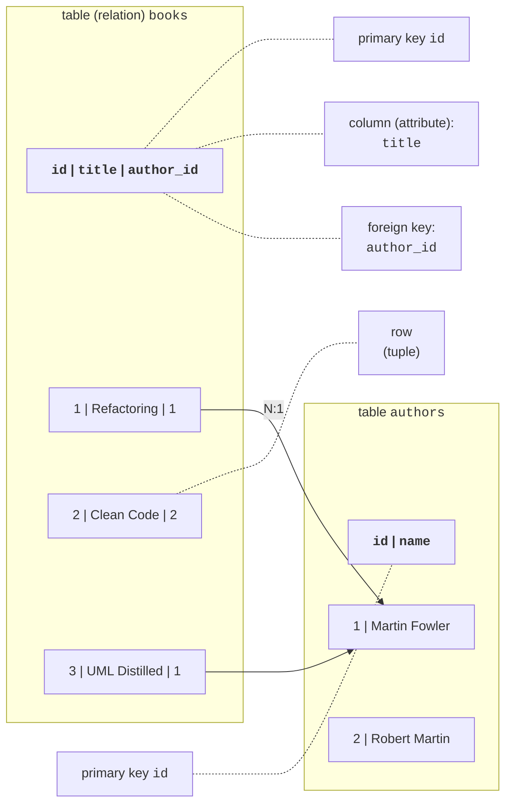
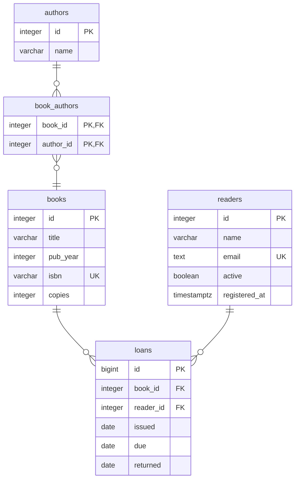
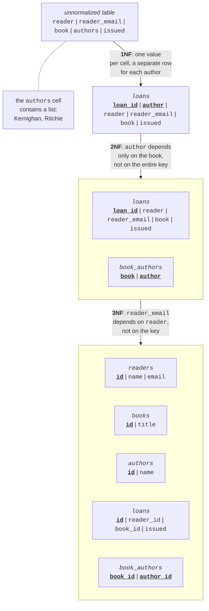
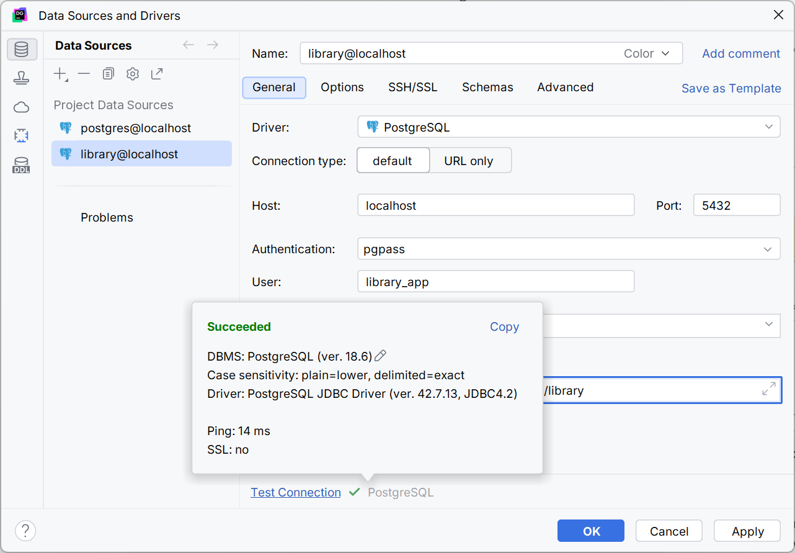

# The relational model and PostgreSQL

## Databases and the relational model

Almost every application stores data: a store's products, students' grades, a library's books. While there is little data, it can be written to text files, for example CSV. But when many users work with the data at the same time, there are millions of records, and an error during saving must not corrupt information, you need a database. A **database** is an organized collection of related data, and a **database management system** (DBMS) is a program that stores this data on disk, executes queries, controls access, and prevents inconsistencies. Common DBMSs: PostgreSQL, Microsoft SQL Server, MySQL, Oracle Database, SQLite.

Most DBMSs are **relational**: data is stored in tables, and queries are written in **SQL** (*Structured Query Language*). This lecture uses the free **PostgreSQL** DBMS (<https://www.postgresql.org/docs/current/>).

### Tables, rows, and columns

The **relational model** describes data as a set of **tables**, or **relations** (Fig. 7.1). Each table has a name and a fixed set of **columns**, or **attributes**; each column has a data type (an integer, a string, a date). A **row**, or **tuple**, describes one object: one book, one author. The order of rows in a table is not defined: if a certain order is needed, it is specified in the query.



Figure 7.1. The main concepts of the relational model {.caption}

### Keys

A **primary key** is a column or several columns whose values uniquely identify a row. A primary key cannot repeat and cannot be empty. Most often it is a **surrogate key**—an integer `id` that the DBMS generates itself. A **natural key** is a value from the domain (an ISBN, an email), but such values sometimes change, so they are marked with a uniqueness constraint, and `id` remains the primary key. A key of several columns is called a **composite key**.

A **foreign key** is a column whose value refers to the primary key of another table. In Fig. 7.1, the `author_id` column of the `books` table contains the author's `id`: the DBMS will not allow writing the number of an author who does not exist and will not let you delete an author to whom books refer.

### Relationships between tables

Foreign keys form **relationships** of three kinds:

- **one-to-many** (1:N)—the most common: one reader has many loans, and each loan belongs to one reader. The foreign key is placed in the table on the "many" side (`loans.reader_id`);
- **one-to-one** (1:1)—a row of one table corresponds to at most one row of another (a user and their profile). It is implemented with a foreign key with a uniqueness constraint;
- **many-to-many** (N:M)—a book has several authors, and an author writes several books. The relational model does not store lists in cells, so a **junction table** (`book_authors`) with two foreign keys is created; an N:M relationship decomposes into two 1:N relationships.

### Data integrity

**Data integrity** is the conformance of data to the rules of the domain. The DBMS checks them on every change and rejects a command that violates a rule:

- **entity integrity**—each row has a unique non-empty primary key;
- **referential integrity**—a foreign key refers to an existing row;
- **domain integrity**—a value matches the column's type and constraints (`NOT NULL`, `CHECK`, `UNIQUE`): the publication year cannot be negative, and an email does not repeat.

Checks in the database do not replace checks in the program (a friendly message for the user), but they guarantee correct data even if another program or an administrator changes it.

## Database design

### The ER diagram

Design starts with the domain: which objects (entities) exist in the system, what properties they have, and how they are related. The result is depicted with an **ER diagram** (*entity-relationship diagram*): an entity is a rectangle with a list of attributes, and a relationship is a line with cardinality marks. Fig. 7.2 shows the "Library" database used in the lecture examples: authors and books are related through `book_authors` (N:M), and readers borrow books (the `loans` table). The marks: PK—primary key, FK—foreign key, UQ—unique value.



Figure 7.2. The ER diagram of the "Library" database {.caption}

### Normalization

A table in which the same data repeats causes **anomalies**: if a reader's email is written in every loan, then after the email changes it will have to be corrected in many rows, and a missed row will keep the wrong value. **Normalization** is splitting tables so that each fact is stored once. For most applications, the first three normal forms are enough (Fig. 7.3):

1. **First normal form** (1NF): each cell contains a single value, with no lists or repeating groups. The author list "Kernighan, Ritchie" is split into separate rows.
2. **Second normal form** (2NF): the table is in 1NF, and each non-key column depends on the **entire** primary key, not on part of it. The author depends only on the book, not on the loan, so the "book – author" pair moves to a separate table.
3. **Third normal form** (3NF): the table is in 2NF, and non-key columns do not depend on each other (there are no transitive dependencies). The email depends on the reader, not on the loan, so the reader's data moves to the `readers` table, and a loan stores only `reader_id`.



Figure 7.3. Normalizing the loans table to the third normal form {.caption}

A short rule for 3NF: each non-key column describes "the key, the whole key, and nothing but the key". Sometimes data is deliberately duplicated for faster reports (**denormalization**), but in learning projects the schema is brought to 3NF.

## The PostgreSQL DBMS and tools

**PostgreSQL** is a free, open-source object-relational DBMS that runs on Windows, Linux, and macOS. A new major version is released every year and supported for five years; minor versions with fixes are released every quarter. As of September 2026, the current version is **PostgreSQL 18** (release 18.6), supported until November 2030; PostgreSQL 19 is in beta testing (<https://www.postgresql.org/support/versioning/>).

### Installing on Windows

For Windows, the PostgreSQL project recommends the interactive installer from EDB (<https://www.postgresql.org/download/windows/>). During installation:

1. on the *Select Components* page, keep *PostgreSQL Server*, *pgAdmin 4* (a graphical client), and *Command Line Tools* (`psql`); *Stack Builder* is not needed for the lab assignments;
2. in the *Password* field, set the password for the `postgres` superuser and remember it;
3. keep port **5432** (the standard PostgreSQL port) and the default locale.

The server is installed as a Windows service (*postgresql-x64-18*) and starts together with the system. The `postgres` superuser has all rights, so a separate role and a database owned by it are created for the application. The database owner can create tables in it:

```sql
CREATE ROLE library_app LOGIN PASSWORD 'Change-Me-2026';
CREATE DATABASE library OWNER library_app;
```

### The `psql` command-line client

`psql` is the PostgreSQL console client (<https://www.postgresql.org/docs/current/app-psql.html>). It is started from the *Start* menu (*SQL Shell (psql)*) or from the `bin` folder of the installed server:

```powershell
cd "C:\Program Files\PostgreSQL\18\bin"
.\psql.exe -U library_app -d library
```

SQL commands in `psql` end with a semicolon. Service **meta-commands** start with a backslash: `\l`—list databases, `\c library`—connect to a database, `\dt`—list tables, `\d books`—table structure, `\i 'D:/Courses/OOP C#/Code/Lec07/library.sql'`—run a script file, `\q`—quit.

### pgAdmin and DataGrip

**pgAdmin 4** (<https://www.pgadmin.org/docs/>) is installed together with the server—a web client for administration: a tree of servers and databases, the *Query Tool* query editor, backups. In this course, the main tool is **JetBrains DataGrip** (<https://www.jetbrains.com/datagrip/>)—an environment for working with various DBMSs with SQL autocompletion, query checking, and diagram generation. Since October 2025, DataGrip has been free for non-commercial use, including learning (<https://blog.jetbrains.com/datagrip/2025/10/01/datagrip-is-now-free-for-non-commercial-use/>): the license is activated through a JetBrains Account, and sending anonymous usage statistics cannot be turned off under this license. Students can also get the free JetBrains Student Pack (<https://www.jetbrains.com/community/education/>).

A database connection is created in the *Database Explorer* window: *+ → Data Source → PostgreSQL*; enter the parameters in the *Host*, *Port*, *User*, *Password*, and *Database* fields (instead of a password, you can choose *Authentication: pgpass*—then DataGrip takes the password from the `%APPDATA%\postgresql\pgpass.conf` file, just like `psql`); on the first connection, DataGrip offers to download the driver, and the *Test Connection* button checks the connection (Fig. 7.4). Queries are written in a console (*New → Query Console*) and executed with **Ctrl+Enter** (<https://www.jetbrains.com/help/datagrip/postgresql.html>).



Figure 7.4. Connecting to PostgreSQL in DataGrip {.caption}

### Data types

Each column has a type (<https://www.postgresql.org/docs/current/datatype.html>). The main PostgreSQL types and the corresponding .NET types returned by the Npgsql provider are listed in Table 7.1.

Table 7.1. The main PostgreSQL data types {.caption}

| **PostgreSQL type** | **Meaning** | **.NET type** |
| --- | --- | --- |
| `integer` | an integer from −2,147,483,648 to 2,147,483,647 | `int` |
| `bigint` | an 8-byte integer | `long` |
| `numeric(p, s)` | an exact decimal number: `p` digits, `s` of them after the decimal point (money) | `decimal` |
| `double precision` | an approximate floating-point number | `double` |
| `varchar(n)`, `text` | a string of up to `n` characters; a string without a length limit | `string` |
| `boolean` | `true` or `false` | `bool` |
| `date` | a date without time | `DateOnly`, `DateTime` |
| `timestamptz` | a point in time; stored in UTC | `DateTime` (UTC) |

For surrogate keys, an **identity column** `integer GENERATED ALWAYS AS IDENTITY` (or `bigint` for large tables) is used: the DBMS assigns the next number itself, and an attempt to insert a value manually causes an error (<https://www.postgresql.org/docs/current/ddl-identity-columns.html>). The legacy `serial` type is not used in new schemas.
