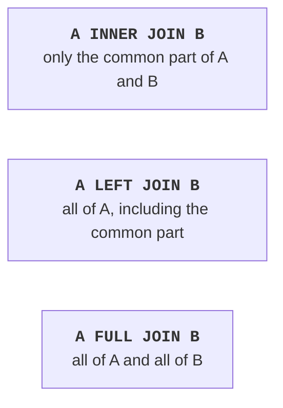

# SQL: tables and queries

## Creating tables: DDL

SQL commands are divided into groups: **DDL** (*Data Definition Language*) creates and changes the structure (`CREATE`, `ALTER`, `DROP`), **DML** (*Data Manipulation Language*) changes data (`INSERT`, `UPDATE`, `DELETE`), `SELECT` queries read data, and transaction control commands (`BEGIN`, `COMMIT`, `ROLLBACK`) combine other commands into a single unit. SQL keywords are not case-sensitive, but it is customary to write them in uppercase. Table and column names are written in lowercase with underscores (`pub_year`): PostgreSQL converts names with uppercase letters to lowercase unless they are enclosed in double quotes. String values are enclosed in **single** quotes: `'Clean Code'`.

### The "Library" example

The script creates the database tables from Fig. 7.2 (the `library.sql` file, run in `psql` with the `\i` command or in the DataGrip console). The `DROP TABLE IF EXISTS` command at the beginning lets you run the script repeatedly.

```sql
DROP TABLE IF EXISTS loans, book_authors, readers, books, authors;

CREATE TABLE authors (
    id   integer GENERATED ALWAYS AS IDENTITY PRIMARY KEY,
    name varchar(100) NOT NULL
);

CREATE TABLE books (
    id       integer GENERATED ALWAYS AS IDENTITY PRIMARY KEY,
    title    varchar(200) NOT NULL,
    pub_year integer CHECK (pub_year BETWEEN 1450 AND 2100),
    isbn     varchar(17) UNIQUE,
    copies   integer NOT NULL DEFAULT 1 CHECK (copies >= 0)
);

-- N:M relationship: a composite primary key of two foreign keys.
CREATE TABLE book_authors (
    book_id   integer REFERENCES books (id) ON DELETE CASCADE,
    author_id integer REFERENCES authors (id) ON DELETE RESTRICT,
    PRIMARY KEY (book_id, author_id)
);
```

```sql
CREATE TABLE readers (
    id            integer GENERATED ALWAYS AS IDENTITY PRIMARY KEY,
    name          varchar(100) NOT NULL,
    email         text NOT NULL UNIQUE,
    active        boolean NOT NULL DEFAULT true,
    registered_at timestamptz NOT NULL DEFAULT now()
);

CREATE TABLE loans (
    id        bigint GENERATED ALWAYS AS IDENTITY PRIMARY KEY,
    book_id   integer NOT NULL REFERENCES books (id),
    reader_id integer NOT NULL REFERENCES readers (id),
    issued    date NOT NULL DEFAULT CURRENT_DATE,
    due       date NOT NULL,
    returned  date,
    CHECK (due >= issued)
);

CREATE INDEX ix_loans_reader_id ON loans (reader_id);
```

The order of commands matters: a table referenced by a foreign key is created earlier and dropped later. A comment in SQL starts with two hyphens `--`.

### Constraints

**Constraints** describe integrity rules (<https://www.postgresql.org/docs/current/ddl-constraints.html>):

- `PRIMARY KEY`—a primary key (unique and not `NULL`); a composite key is written on a separate line: `PRIMARY KEY (book_id, author_id)`;
- `REFERENCES table (column)`—a foreign key. The `ON DELETE` action determines what happens when the parent row is deleted: `NO ACTION` or `RESTRICT` (the default—forbid), `CASCADE` (delete the dependent rows too), `SET NULL` (clear the reference);
- `NOT NULL`—the value is required; `UNIQUE`—values do not repeat;
- `CHECK (condition)`—an arbitrary condition for a row; `DEFAULT`—the value if it is not specified in `INSERT`.

When a book is deleted, its rows in `book_authors` are deleted automatically (`CASCADE`), and an author who has books cannot be deleted (`RESTRICT`). A constraint can be given a name (`CONSTRAINT ck_books_title CHECK (…)`): it appears in the error message.

### Changing the structure and indexes

The structure of an existing table is changed with the `ALTER TABLE` command and dropped with `DROP`:

```sql
ALTER TABLE readers ADD COLUMN phone varchar(20);
ALTER TABLE books RENAME COLUMN copies TO in_stock;
DROP TABLE loans;               -- a table with data, permanently
```

An **index** is an auxiliary structure (usually a B-tree) that lets you find rows without scanning the whole table, like the subject index in a book. PostgreSQL automatically creates indexes for primary keys and `UNIQUE` constraints, but **not** for foreign keys. So the `ix_loans_reader_id` index in the script speeds up finding a reader's loans. Indexes slow down `INSERT` and `UPDATE`, so they are created for columns that are frequently used for searching, joining, and sorting.

After the script runs, DataGrip builds a schema diagram from the foreign keys: the context menu of the `public` schema in *Database Explorer*—*Diagrams → Show Diagram* (Fig. 7.5).

::: info Screenshot
DataGrip: right-click schema public → Diagrams → Show Diagram; tables authors, books, book\_authors, readers, loans with foreign-key links
:::

Figure 7.5. A database schema diagram in DataGrip {.caption}

## Modifying and querying data

### `INSERT`, `UPDATE`, `DELETE`

The `INSERT` command adds rows. Identity columns and columns with a `DEFAULT` value are not specified. The `RETURNING` clause returns values of the inserted rows, for example the generated `id` values:

```sql
INSERT INTO authors (name)
VALUES ('Brian Kernighan'), ('Dennis Ritchie'),
       ('Martin Fowler'), ('Robert Martin');

INSERT INTO books (title, pub_year, isbn, copies)
VALUES ('The C Programming Language', 1988, '978-0131103627', 2),
       ('Refactoring', 2018, '978-0134757599', 3),
       ('Clean Code', 2008, '978-0132350884', 1),
       ('Clean Architecture', 2017, '978-0134494166', 0),
       ('UML Distilled', 2003, '978-0321193681', 2);

INSERT INTO book_authors (book_id, author_id)
VALUES (1, 1), (1, 2), (2, 3), (3, 4), (4, 4), (5, 3);
```

```sql
INSERT INTO readers (name, email)
VALUES ('Olena Kovalenko', 'olena@example.com'),
       ('Petro Shevchenko', 'petro@example.com'),
       ('Iryna Bondar', 'iryna@example.com')
RETURNING id, name;

INSERT INTO loans (book_id, reader_id, issued, due, returned)
VALUES (1, 1, '2026-09-01', '2026-09-15', '2026-09-10'),
       (2, 1, '2026-09-05', '2026-09-19', NULL),
       (3, 2, '2026-09-02', '2026-09-16', NULL),
       (2, 2, '2026-09-10', '2026-09-24', NULL),
       (5, 1, '2026-09-12', '2026-09-26', NULL);
```

For the command with `RETURNING`, `psql` first prints a table with the `id` and `name` of the three new readers (1, 2, 3), and then the command name and the number of rows: `INSERT 0 3`.

The `UPDATE` command changes columns of the rows that satisfy the `WHERE` condition, and `DELETE` deletes rows:

```sql
UPDATE books
SET copies = copies + 1
WHERE id = 3;

DELETE FROM readers
WHERE active = false AND id NOT IN (SELECT reader_id FROM loans);
```

::: tip Important
`UPDATE` and `DELETE` **without** `WHERE` change or delete **all** rows of the table. Before running such a command, it is useful to run a `SELECT` with the same condition and make sure that exactly the right rows are selected.
:::

### The `SELECT` query

A `SELECT` query returns a result table. Its clauses are written in a fixed order (<https://www.postgresql.org/docs/current/queries-table-expressions.html>):

```sql
SELECT title, pub_year               -- which columns
FROM books                           -- from which table
WHERE title ILIKE '%clean%' AND pub_year >= 2010  -- which rows
ORDER BY pub_year DESC               -- order
LIMIT 10 OFFSET 0;                   -- 10 rows, skip 0
```

- `SELECT *` selects all columns; in programs it is better to list the required columns explicitly. A column alias is set with `AS`: `count(*) AS loans`;
- `WHERE` conditions are combined with the `AND`, `OR`, `NOT` operators; there are also `BETWEEN a AND b`, `IN (1, 2, 3)`, `LIKE` (a pattern with `%`—any characters, `_`—one character), and `ILIKE`—a PostgreSQL extension that ignores case;
- `ORDER BY` sorts in ascending (`ASC`) or descending (`DESC`) order; `LIMIT` and `OFFSET` select a "page" of the result (pagination).

**`NULL`** means "the value is unknown". Any comparison with `NULL`, even `NULL = NULL`, gives not `true` but `NULL`, so the row does not get into the result. `NULL` is checked only with the `IS NULL` and `IS NOT NULL` operators: the condition `returned = NULL` finds no rows, while `returned IS NULL` finds unreturned books.

### Aggregate functions and grouping

**Aggregate functions** calculate one value for a set of rows: `count(*)`—the number of rows, `count(column)`—the number of non-`NULL` values, `sum`, `avg`, `min`, `max`. The query `SELECT count(*), min(pub_year), max(pub_year) FROM books` returns 5, 1988, and 2018.

The `GROUP BY` clause splits rows into groups with the same values, and aggregate functions are calculated for each group. The `SELECT` list may contain only grouping columns and aggregates. `WHERE` filters rows **before** grouping, and `HAVING` filters groups **after** it:

```sql
SELECT a.name, count(*) AS books
FROM authors AS a
JOIN book_authors AS ba ON ba.author_id = a.id
GROUP BY a.name
HAVING count(*) > 1
ORDER BY a.name;
```

```
     name      | books
---------------+-------
 Martin Fowler |     2
 Robert Martin |     2
(2 rows)
```

### Joining tables

Data split by normalization into several tables is brought together with a **join** (Fig. 7.6). The join condition is written after `ON`, and the tables are given short aliases:

- `INNER JOIN` (or just `JOIN`)—only the pairs of rows for which the condition holds;
- `LEFT JOIN`—all rows of the left table; if there is no pair, the columns of the right table contain `NULL`; `RIGHT JOIN`—the other way around;
- `FULL JOIN`—all rows of both tables.



Figure 7.6. Types of table joins: the gray area is the result rows {.caption}

A list of books with authors joins three tables through the `book_authors` junction table:

```sql
SELECT b.title, a.name AS author, b.pub_year
FROM books AS b
JOIN book_authors AS ba ON ba.book_id = b.id
JOIN authors AS a ON a.id = ba.author_id
ORDER BY b.title, a.name;
```

```
           title            |     author      | pub_year
----------------------------+-----------------+----------
 Clean Architecture         | Robert Martin   |     2017
 Clean Code                 | Robert Martin   |     2008
 Refactoring                | Martin Fowler   |     2018
 The C Programming Language | Brian Kernighan |     1988
 The C Programming Language | Dennis Ritchie  |     1988
 UML Distilled              | Martin Fowler   |     2003
(6 rows)
```

The number of loans of each reader is counted with a `LEFT JOIN` so that the reader without loans also appears in the report. The `count(l.id)` function does not count `NULL`, so it gives 0 for her, and `FILTER` counts only the rows that satisfy the condition (Fig. 7.7):

```sql
SELECT r.name,
       count(l.id) AS loans,
       count(l.id) FILTER (WHERE l.returned IS NULL) AS on_hand
FROM readers AS r
LEFT JOIN loans AS l ON l.reader_id = r.id
GROUP BY r.id, r.name
ORDER BY loans DESC, r.name;
```

```
       name       | loans | on_hand
------------------+-------+---------
 Olena Kovalenko  |     3 |       2
 Petro Shevchenko |     2 |       2
 Iryna Bondar     |     0 |       0
(3 rows)
```

::: info Screenshot
DataGrip query console with the SELECT … LEFT JOIN … GROUP BY query above, result grid with 3 rows below, database tree on the left
:::

Figure 7.7. Running a query in the DataGrip console {.caption}

### Subqueries

A **subquery** is a `SELECT` query in parentheses inside another query. It can return a single value (`WHERE copies = (SELECT max(copies) FROM books)`) or a set of values for `IN` and `EXISTS`. For example, the condition `WHERE id NOT IN (SELECT book_id FROM loans)` selects books that nobody has borrowed yet (*Clean Architecture*). Overdue loans as of September 20, 2026 (the difference of two dates is an integer number of days):

```sql
SELECT r.name, b.title, l.due,
       DATE '2026-09-20' - l.due AS days_late
FROM loans AS l
JOIN readers AS r ON r.id = l.reader_id
JOIN books AS b ON b.id = l.book_id
WHERE l.returned IS NULL AND l.due < DATE '2026-09-20'
ORDER BY days_late DESC;
```

```
       name       |    title    |    due     | days_late
------------------+-------------+------------+-----------
 Petro Shevchenko | Clean Code  | 2026-09-16 |         4
 Olena Kovalenko  | Refactoring | 2026-09-19 |         1
(2 rows)
```

Instead of a fixed date, an application uses `CURRENT_DATE`. The `NOT IN` condition works correctly only if the subquery does not return `NULL` (the `loans.book_id` column has `NOT NULL`); in other cases `NOT EXISTS` is more reliable.
