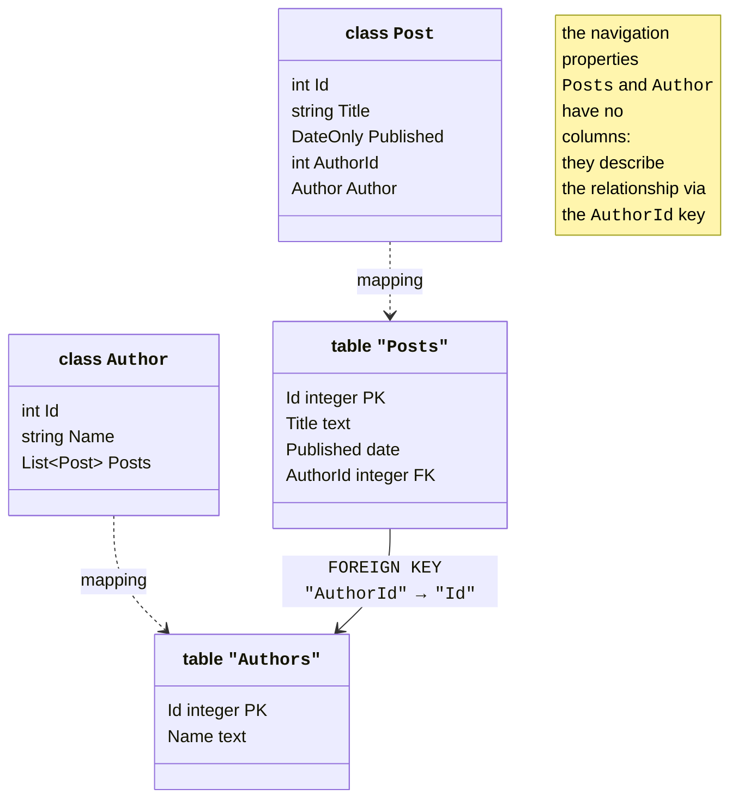
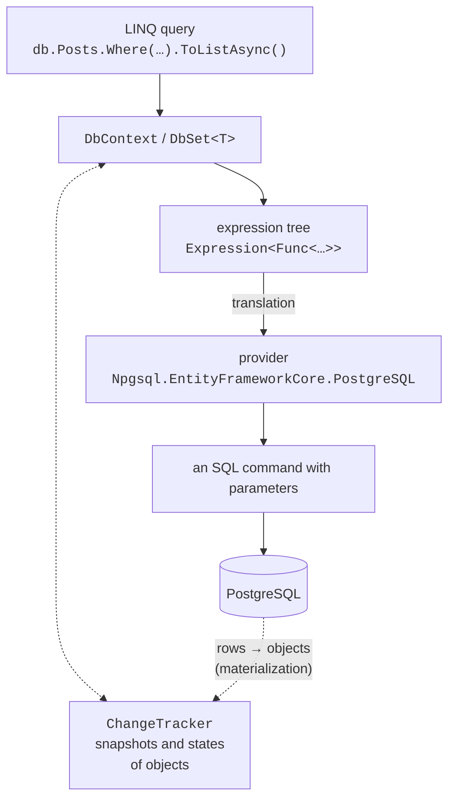
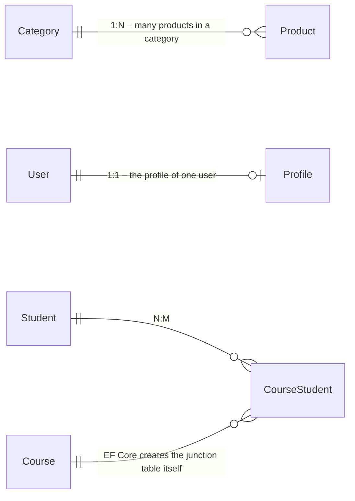

# The data context and model

## ORM and Entity Framework Core

In Topic 7, the program worked with PostgreSQL through ADO.NET: it wrote SQL commands, passed parameters, and manually converted `NpgsqlDataReader` rows into objects. Such code repeats for every table, and an error in a column name is detected only at run time.

The object and relational models are organized differently, and this difference is called the **object-relational impedance mismatch**: objects refer to each other, while tables do so through key values; a `List<Post>` collection has no corresponding column; classes have inheritance, tables do not; an object has identity in memory, while a row has a primary key. **ORM** (*object-relational mapping*) is a library that bridges this gap: classes are mapped to tables, properties to columns, and references to foreign keys (Fig. 8.1), and the programmer writes queries in C#.



Figure 8.1. Mapping classes to tables {.caption}

**Entity Framework Core** (EF Core) is an open-source ORM from Microsoft (<https://learn.microsoft.com/ef/core/>). The current version, EF Core 10 (November 2025), has long-term support (LTS) until November 2028 and runs only on .NET 10. EF Core supports different DBMSs through **database providers**: SQL Server, SQLite, and Azure Cosmos DB from Microsoft, and PostgreSQL through the `Npgsql.EntityFrameworkCore.PostgreSQL` package from the Npgsql developers (<https://www.npgsql.org/efcore/>).

A comparison of data access approaches:

- **ADO.NET**—full control over SQL and the lowest overhead, but a lot of repetitive code;
- a **micro-ORM** (for example, the Dapper library)—the programmer writes the SQL, and the library only converts the result rows into objects;
- **EF Core**—SQL is generated from LINQ queries, object changes are tracked and saved with a single call, and the database schema is created and changed with migrations.

EF Core supports two approaches. In the **code-first** approach, the programmer writes classes, and EF Core creates tables from them. In the **database-first** approach, the database already exists, and the classes are generated from it with the `dotnet ef dbcontext scaffold` command. The lecture uses code-first.

### How EF Core works

The application accesses the `DbSet<T>` properties of a **context** object, `DbContext` (Fig. 8.2). A LINQ query against a `DbSet<T>` is not executed immediately: the C# compiler stores it as an **expression tree**—an object that describes the condition `p => p.Price < 1000` as data rather than compiled code. The provider translates the tree into the PostgreSQL SQL dialect, executes the command through Npgsql, and **materializes** the result—creates objects from the rows. The context remembers the loaded objects in the **change tracker** (`ChangeTracker`) so that it can later save their changes with `INSERT`, `UPDATE`, and `DELETE` commands.



Figure 8.2. The architecture of Entity Framework Core {.caption}

## Installation and the data context

To work with PostgreSQL, the following packages are added to the project (a .NET 10 console application):

```powershell
dotnet add package Npgsql.EntityFrameworkCore.PostgreSQL
dotnet add package Microsoft.EntityFrameworkCore.Design
$cfg = "Microsoft.Extensions.Configuration"
dotnet add package "$cfg.UserSecrets"
dotnet add package "$cfg.EnvironmentVariables"
```

The provider package (version 10.0.3) itself brings in `Microsoft.EntityFrameworkCore`, `Microsoft.EntityFrameworkCore.Relational`, and `Npgsql`. The `…Design` package is needed only by the command-line tools; it does not end up in the program. In Visual Studio, packages are found in the *Manage NuGet Packages* window (Fig. 8.3). For migrations, the `dotnet-ef` **tool** is installed (<https://learn.microsoft.com/ef/core/cli/dotnet>):

```powershell
dotnet tool install --global dotnet-ef   # or update
dotnet ef --version                      # 10.0.12
```


Figure 8.3. EF Core packages in a project {.caption}

The database for each example is created separately in `psql` or DataGrip as `postgres`, and the `library_app` role from Topic 7 is made its owner: `CREATE DATABASE blog_ef OWNER library_app;`. EF Core will create the tables. As in Topic 7, the connection string is stored in user secrets:

```powershell
dotnet user-secrets init
$cs = "Host=localhost;Database=blog_ef;" +
      "Username=library_app;Password=Change-Me-2026"
dotnet user-secrets set "ConnectionStrings:Blog" $cs
```

### `DbContext` and `DbSet<T>`

A **context** class inherits `DbContext` and represents a session of work with the database (<https://learn.microsoft.com/ef/core/dbcontext-configuration/>). Its `DbSet<T>` properties correspond to tables: queries are executed and objects are added through them. The `OnConfiguring` method chooses the provider and the connection string, and the `OnModelCreating` method refines the model. The classes that EF Core maps to tables are called **entities**. The blog model (the `Model.cs` file):

```cs
using Microsoft.EntityFrameworkCore;
using Microsoft.Extensions.Configuration;

namespace Blog;

public class Author
{
    public int Id { get; set; }
    public string Name { get; set; } = "";
    public List<Post> Posts { get; } = [];
}

public class Post
{
    public int Id { get; set; }
    public string Title { get; set; } = "";
    public DateOnly Published { get; set; }
    public int AuthorId { get; set; }             // foreign key
    public Author Author { get; set; } = null!;   // navigation
}

public class BlogContext : DbContext
{
    public DbSet<Author> Authors => Set<Author>();
    public DbSet<Post> Posts => Set<Post>();

    // The connection string: user secrets or an environment variable
    private static readonly string? ConnectionString =
        new ConfigurationBuilder()
            .AddUserSecrets<BlogContext>()
            .AddEnvironmentVariables()
            .Build()
            .GetConnectionString("Blog");

    protected override void OnConfiguring(
        DbContextOptionsBuilder options) =>
        options.UseNpgsql(ConnectionString);
}
```

A context is created for **one logical operation** and disposed: `await using var db = new BlogContext();`. In applications with dependency injection (Topic 6), the context receives its options through the constructor `BlogContext(DbContextOptions<BlogContext> options) : DbContext(options)` and is registered with the method `services.AddDbContext<BlogContext>(o => o.UseNpgsql(connectionString))`.

## The model: conventions, annotations, and the Fluent API

### Conventions

EF Core builds the model by **conventions**—rules that require no configuration (<https://learn.microsoft.com/ef/core/modeling/>):

- a table is named after the `DbSet<T>` property (`Posts`), and a column after the property;
- the `Id` or `<Class>Id` property is the **primary key**; a key of type `int` is generated by the database (in PostgreSQL, a `GENERATED BY DEFAULT AS IDENTITY` column);
- a property that refers to another entity (`Author`) or a collection (`Posts`) is a **navigation property**, and `AuthorId` is the relationship's **foreign key**;
- with **nullable reference types** enabled (`<Nullable>enable</Nullable>`), the `string` type becomes a `NOT NULL` column, and `string?` a column that allows `NULL`; likewise `int` and `int?`.

C# types are mapped to PostgreSQL types (Table 8.1). Npgsql does not change the case of names, so the tables are named `"Posts"`, `"Authors"` in quotes: in `psql` they are also written in quotes, `SELECT * FROM "Posts";`.

Table 8.1. Mapping C# types to PostgreSQL types {.caption}

| **C# type** | **PostgreSQL type** | **Note** |
| --- | --- | --- |
| `int`, `long` | `integer`, `bigint` | a key—with `IDENTITY` |
| `string` | `text` | with `[MaxLength(n)]`—`character varying(n)` |
| `decimal` | `numeric` | with `[Precision(10, 2)]`—`numeric(10,2)` |
| `bool`, `double` | `boolean`, `double precision` |  |
| `DateOnly`, `TimeOnly` | `date`, `time` |  |
| `DateTime` | `timestamp with time zone` | only values with `Kind = Utc` |
| `Guid`, `byte[]` | `uuid`, `bytea` |  |

### Annotations and the Fluent API

If the conventions are not enough, the model is refined in two ways. **Data annotations** are attributes from the `System.ComponentModel.DataAnnotations` and `Microsoft.EntityFrameworkCore` namespaces placed on classes and properties. The **Fluent API** consists of calls to `ModelBuilder` methods in `OnModelCreating` (Table 8.2). The Fluent API can do everything attributes can and more (composite keys, multi-column indexes, `CHECK` constraints), and it takes precedence when configurations conflict.

Table 8.2. Data annotations and the corresponding Fluent API methods {.caption}

| **Annotation** | **Fluent API and purpose** |
| --- | --- |
| `[Key]` | `HasKey(p => p.Code)`—a primary key with a different name |
| `[Required]` | `Property(p => p.Name).IsRequired()`—`NOT NULL` |
| `[MaxLength(200)]` | `HasMaxLength(200)`—`character varying(200)` |
| `[Precision(10, 2)]` | `HasPrecision(10, 2)`—`numeric(10,2)` |
| `[Column("title")]`, `[Table("books")]` | `HasColumnName("title")`, `ToTable("books")` |
| `[NotMapped]` | `Ignore(p => p.Total)`—a property without a column |
| `[Index(nameof(Name), IsUnique = true)]` | `HasIndex(t => t.Name).IsUnique()` |
| `[Timestamp]` | `IsRowVersion()`—a concurrency token |
| – | `ToTable(t => t.HasCheckConstraint(…))`, `HasDefaultValueSql("now()")` |

The configuration of one entity is conveniently moved into a separate class that implements `IEntityTypeConfiguration<T>` with a `Configure(EntityTypeBuilder<T> b)` method; all such classes in the assembly are applied with a single call, `model.ApplyConfigurationsFromAssembly(typeof(ShopContext).Assembly)`, in `OnModelCreating`.

A practical rule: simple constraints (`[MaxLength]`, `[Precision]`) are written as attributes, because they are visible next to the property, while indexes, relationships, and database constraints go through the Fluent API.

## Relationships between entities

A relationship is described by navigation properties and a foreign key (<https://learn.microsoft.com/ef/core/modeling/relationships>). The main kinds of relationships are shown in Fig. 8.4.



Figure 8.4. Relationships between entities {.caption}

- **One-to-many** (1:N): `Category` has a `List<Product> Products` collection, and `Product` has a `CategoryId` key and a `Category` reference. An `int` key means a **required** relationship, and `int?` an optional one.
- **One-to-one** (1:1): `User` has a `Profile? Profile` reference, and `Profile` has a `UserId` key and a `User` reference. The dependent entity is the one with the foreign key.
- **Many-to-many** (N:M): `Student` has `List<Course> Courses`, and `Course` has `List<Student> Students`. EF Core creates the `CourseStudent` junction table with a composite key itself. If the relationship needs its own data (a grade, an enrollment date), an explicit `Enrollment` entity with two 1:N relationships is created (a relationship **with a payload**).

Relationships that cannot be inferred by convention are configured with the `HasOne`/`HasMany` and `WithOne`/`WithMany` methods:

```cs
model.Entity<Session>()
    .HasOne(s => s.Hall)          // a session has one hall
    .WithMany(h => h.Sessions)    // a hall has many sessions
    .HasForeignKey(s => s.HallId)
    .OnDelete(DeleteBehavior.Restrict);
```

**Cascade delete**: for a required relationship, EF Core creates `ON DELETE CASCADE` by default—deleting a category also deletes its products; for an optional one, the key of the dependent objects loaded into the context is set to `NULL`. The behavior is changed with the `OnDelete` method: `Restrict` forbids deleting the principal row while dependent ones exist (<https://learn.microsoft.com/ef/core/saving/cascade-delete>).

A value object without its own key (an address, a date range) is modeled as a **complex type**: `model.Entity<Customer>().ComplexProperty(c => c.Address);` or the `[ComplexType]` attribute on the class. Its properties become the `Address_City`, `Address_Street` columns of the owner's table. The older mechanism of **owned types** (`OwnsOne`) has a hidden key and behaves like an entity; for new models, the documentation recommends complex types (<https://learn.microsoft.com/ef/core/modeling/complex-types>).
