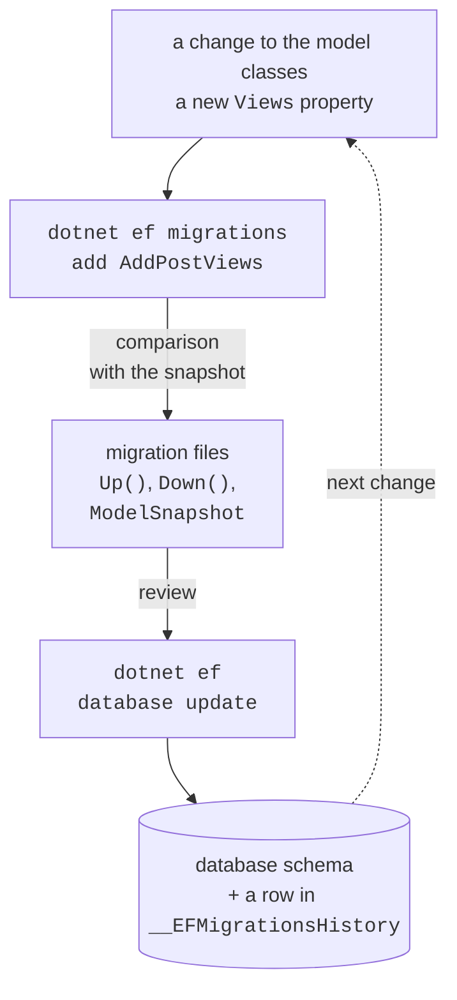
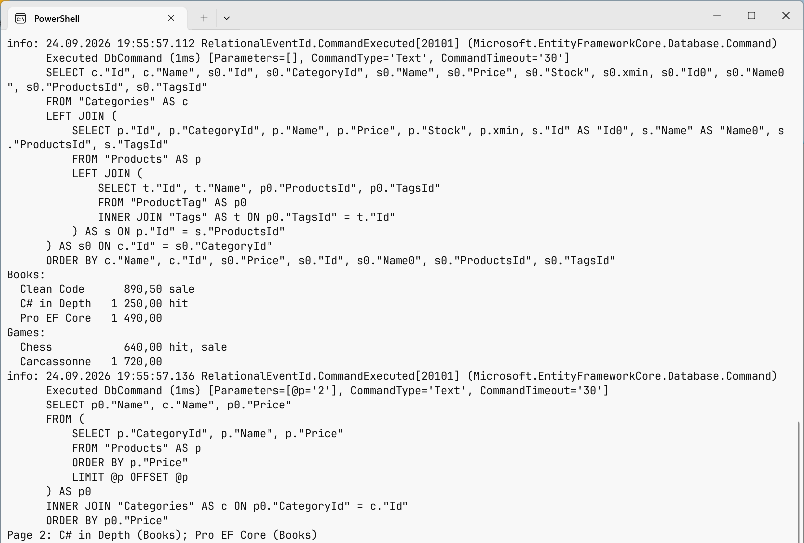

# Migrations and LINQ queries

## Migrations

A **migration** is a C# class with the `Up` (apply the schema change) and `Down` (undo it) methods, which EF Core generates by comparing the current model with the **model snapshot** (`ModelSnapshot`) taken after the previous migration (Fig. 8.5, <https://learn.microsoft.com/ef/core/managing-schemas/migrations/>).



Figure 8.5. Working with migrations {.caption}

The commands are run in the project folder:

- `dotnet ef migrations add InitialCreate`—create a migration in the `Migrations` folder;
- `dotnet ef database update`—apply all new migrations to the database;
- `dotnet ef database update AddPostViews`—move to the specified migration (extra ones are undone with the `Down` methods);
- `dotnet ef migrations remove`—remove the last migration that has not been applied yet;
- `dotnet ef migrations list`—list migrations;
- `dotnet ef migrations script`—an SQL script for the database administrator;
- `dotnet ef dbcontext scaffold "<connection string>" Npgsql.EntityFrameworkCore.PostgreSQL -o Models`—generate a context and classes from an existing database (database-first).

In Visual Studio, the same actions are performed with the `Add-Migration` and `Update-Database` commands in the *Package Manager Console* window (the `Microsoft.EntityFrameworkCore.Tools` package).

For the blog model, `dotnet ef migrations add InitialCreate` prints `Build started...`, `Build succeeded.`, and `Done. To undo this action, use 'ef migrations remove'` and creates three files: `20260924165317_InitialCreate.cs`, `…Designer.cs`, and `BlogContextModelSnapshot.cs`. The `dotnet ef database update` command applies the migration (Fig. 8.6). The red `Failed executing DbCommand` line on the first run is not an error: EF Core looks for the history table, which does not exist yet, and then creates it itself. After `Done.`, the database gets the `"Authors"` and `"Posts"` tables and the service table `"__EFMigrationsHistory"` with the `MigrationId` and `ProductVersion` columns, which records the applied migrations (Fig. 8.7).


Figure 8.6. Creating and applying a migration {.caption}

The `dotnet ef migrations script` command does not connect to the database and shows the migration's SQL (a fragment):

```sql
CREATE TABLE "Posts" (
    "Id" integer GENERATED BY DEFAULT AS IDENTITY,
    "Title" text NOT NULL,
    "Published" date NOT NULL,
    "AuthorId" integer NOT NULL,
    CONSTRAINT "PK_Posts" PRIMARY KEY ("Id"),
    CONSTRAINT "FK_Posts_Authors_AuthorId" FOREIGN KEY ("AuthorId")
        REFERENCES "Authors" ("Id") ON DELETE CASCADE
);
CREATE INDEX "IX_Posts_AuthorId" ON "Posts" ("AuthorId");
```

After the property `public int Views { get; set; }` is added to the `Post` class, the `dotnet ef migrations add AddPostViews` command generates a migration:

```cs
protected override void Up(MigrationBuilder migrationBuilder)
{
    migrationBuilder.AddColumn<int>(
        name: "Views",
        table: "Posts",
        type: "integer",
        nullable: false,
        defaultValue: 0);
}

protected override void Down(MigrationBuilder migrationBuilder)
{
    migrationBuilder.DropColumn(name: "Views", table: "Posts");
}
```

A migration is always **reviewed** before it is applied: EF Core sees renaming a property as dropping a column and creating a new one, that is, as data loss; in that case, the migration code is corrected to `RenameColumn`. Migrations are stored in Git together with the code.


Figure 8.7. Tables created by a migration {.caption}

**Seed data.** Unchanging reference data (cinema halls, statuses) is specified in the model with the `HasData` method with explicit keys: it gets into the migration as `InsertData` commands. For other data, the documentation recommends the `UseSeeding` and `UseAsyncSeeding` methods in the context options: they are called by `database update`, `Migrate`, and `EnsureCreated` (<https://learn.microsoft.com/ef/core/modeling/data-seeding>).

### The "Blog" example

The program adds an author with two posts, reads the posts, and changes and deletes one of them (the `Program.cs` file; the model is in the `Model.cs` file above):

```cs
using Blog;
using Microsoft.EntityFrameworkCore;

await using var db = new BlogContext();

// Create: an author and two posts with one SaveChangesAsync
var author = new Author { Name = "Olena Koval" };
author.Posts.Add(new Post
    { Title = "EF Core basics", Published = new(2026, 9, 1) });
author.Posts.Add(new Post
    { Title = "Migrations", Published = new(2026, 9, 8) });
db.Authors.Add(author);
int saved = await db.SaveChangesAsync();
Console.WriteLine($"Saved rows: {saved}, author Id: {author.Id}");

// Read: the author's posts sorted by date
var posts = await db.Posts
    .Where(p => p.Author.Name == "Olena Koval")
    .OrderBy(p => p.Published)
    .ToListAsync();
foreach (var p in posts)
    Console.WriteLine($"{p.Id}. {p.Title} ({p.Published:d})");

// Update: change a property and save
var post = await db.Posts.SingleAsync(p => p.Title == "Migrations");
post.Title = "EF Core migrations";
await db.SaveChangesAsync();

// Delete
db.Posts.Remove(post);
await db.SaveChangesAsync();
Console.WriteLine($"Posts left: {await db.Posts.CountAsync()}");
```

The result of the first run on an empty database:

```
Saved rows: 3, author Id: 1
1. EF Core basics (9/1/2026)
2. Migrations (9/8/2026)
Posts left: 1
```

The `Add` method adds the whole object graph: the author and the posts from its collection. `SaveChangesAsync` executes three `INSERT` commands, returns the number of rows changed, and writes the generated keys into the `Id` and `AuthorId` properties. The condition `p.Author.Name == …` is converted into a `JOIN` of the `"Posts"` and `"Authors"` tables. No separate method is needed for the update: the context itself detects that the `Title` property of the loaded object has changed.

## LINQ to Entities queries

A query against a `DbSet<T>` has the type `IQueryable<T>` and is built with LINQ methods (covered in the OOP course): `Where`, `OrderBy`/`ThenBy`, `Select`, `Skip`/`Take`, `Count`, `Sum`, `Max`, `GroupBy`, `Any` (<https://learn.microsoft.com/ef/core/querying/>). Execution is **deferred**: SQL is sent only when the result is needed—on a call to `ToListAsync`, `FirstOrDefaultAsync`, `SingleAsync`, `CountAsync`, `AnyAsync`, or during an `await foreach` iteration. So a query can be composed step by step:

```cs
IQueryable<Product> query = db.Products;
if (onlyInStock)
    query = query.Where(p => p.Stock > 0);      // not executed yet
query = query.OrderBy(p => p.Price);
List<Product> list = await query.ToListAsync(); // one SELECT
```

The difference between `IQueryable<T>` and `IEnumerable<T>` is fundamental: `IQueryable<T>` methods are added to the SQL query, while `IEnumerable<T>` methods run in memory. After `AsEnumerable()` or `ToList()`, the next `Where` filters rows that have already been loaded, that is, the whole table is read from the database.

### Projections, pagination, and grouping

A `Select` **projection** into a record or an anonymous type reads only the needed columns and returns objects that are not tracked. **Pagination** is done with a `Skip`/`Take` pair, always after `OrderBy`; otherwise the row order is undefined. The `ToQueryString()` method shows the SQL without executing the query; for the query of the second page

```cs
var page = db.Products
    .OrderBy(p => p.Price)
    .Skip((pageNo - 1) * PageSize).Take(PageSize)
    .Select(p => new { p.Name, Category = p.Category.Name, p.Price });
Console.WriteLine(page.ToQueryString());
```

the Npgsql provider generates the following SQL:

```sql
-- @p='2'
SELECT p0."Name", c."Name" AS "Category", p0."Price"
FROM (
    SELECT p."CategoryId", p."Name", p."Price"
    FROM "Products" AS p
    ORDER BY p."Price"
    LIMIT @p OFFSET @p
) AS p0
INNER JOIN "Categories" AS c ON p0."CategoryId" = c."Id"
ORDER BY p0."Price"
```

The values of C# variables become **parameters** (`@p`) rather than part of the SQL text, so SQL injection is impossible. `GroupBy` with the `Count`, `Sum`, `Max` aggregates in `Select` is translated into `GROUP BY` with the `count(*)`, `sum`, `max` functions, so the server does the counting, not the program.

String methods are translated too: `p.Name.Contains(text)` gives `LIKE`, and the PostgreSQL `ILIKE` function (case-insensitive) is available as `EF.Functions.ILike(p.Name, $"%{text}%")`.

### Translation and client evaluation

Not every C# expression can be converted to SQL. If you call your own method `Rules.IsLong(v.Minutes)` in `Where`, EF Core throws an `InvalidOperationException` with the message *The LINQ expression … could not be translated* and a suggestion to rewrite the query or explicitly switch to in-memory evaluation through `AsEnumerable()` (<https://learn.microsoft.com/ef/core/querying/client-eval>). The exception is the **final** `Select`: such a call is allowed there; EF Core reads the needed columns and calls the method for each row in the program (**client evaluation**).

### The SQL log

To see all the commands the context executes, **simple logging** is enabled in `OnConfiguring` (<https://learn.microsoft.com/ef/core/logging-events-diagnostics/simple-logging>):

```cs
options.UseNpgsql(ConnectionString)
    .LogTo(Console.WriteLine, LogLevel.Information)
    .EnableSensitiveDataLogging();   // parameter values
```

For each command, an `Executed DbCommand` message with the execution time, parameters, and SQL text is printed to the console (Fig. 8.8). The `EnableSensitiveDataLogging` method shows parameter values instead of `?`; it is enabled only during development, because user data gets into the log. The namespace of `LogLevel` is `Microsoft.Extensions.Logging`.



Figure 8.8. SQL queries generated by EF Core {.caption}
