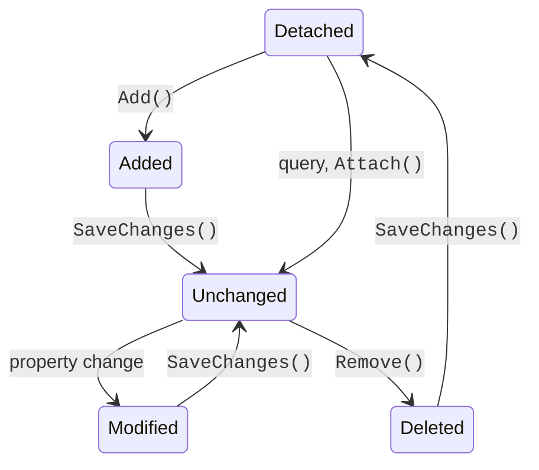

# Related data and change tracking

## Loading related data

The query `db.Categories.ToListAsync()` reads only the categories table: the `Products` collections remain empty. Related data is loaded in three ways (<https://learn.microsoft.com/ef/core/querying/related-data/>).

**Eager loading**—the `Include` and `ThenInclude` methods add a `JOIN` to the query. Inside `Include`, the collection can be filtered and sorted:

```cs
var categories = await db.Categories
    .Include(c => c.Products.Where(p => p.Stock > 0))
    .ThenInclude(p => p.Tags)
    .ToListAsync();
```

**Explicit loading**—loading a relationship of an already loaded object: `await db.Entry(category).Collection(c => c.Products).LoadAsync();` or `db.Entry(product).Reference(p => p.Category).LoadAsync()`.

**Lazy loading** loads a relationship automatically on the first access to the property. It requires the `Microsoft.EntityFrameworkCore.Proxies` package, a `UseLazyLoadingProxies()` call, and `virtual` navigation properties (<https://learn.microsoft.com/ef/core/querying/related-data/lazy>). The convenience is deceptive:

```cs
// An antiexample: 1 query for categories + one query per category
foreach (var c in await db.Categories.ToListAsync())
    Console.WriteLine($"{c.Name}: {c.Products.Count}");
```

For three categories, the log shows four `SELECT` commands, and for a thousand, a thousand and one. This is the **N+1 query problem**: the number of round trips to the server grows with the amount of data, and each one adds network latency. That is why this course does not use lazy loading: related data is loaded explicitly through `Include`, and for reports a **projection** is written that calculates everything in a single query: `db.Categories.Select(c => new { c.Name, Count = c.Products.Count })`.

**Split queries.** Several collection `Include`s in one query multiply the result rows (a "cartesian explosion"): a category with 100 products, each with 5 tags, gives 500 rows. The `AsSplitQuery()` method executes a separate `SELECT` for each collection (<https://learn.microsoft.com/ef/core/querying/single-split-queries>).

### The "Online store" example

The store model contains 1:N (category – products) and N:M (products – tags) relationships; the tables are created by the `InitialCreate` migration, the database is `shop_ef`, and the secrets key is `ConnectionStrings:Shop` (the `Model.cs` file):

```cs
using System.ComponentModel.DataAnnotations;
using Microsoft.EntityFrameworkCore;
using Microsoft.Extensions.Configuration;

namespace Shop;

public class Category
{
    public int Id { get; set; }
    [MaxLength(100)]
    public required string Name { get; set; }
    public List<Product> Products { get; } = [];      // 1:N
}

public class Product
{
    public int Id { get; set; }
    [MaxLength(200)]
    public required string Name { get; set; }
    [Precision(10, 2)]
    public decimal Price { get; set; }
    public int Stock { get; set; }
    public int CategoryId { get; set; }
    public Category Category { get; set; } = null!;
    public List<Tag> Tags { get; } = [];              // N:M
    [Timestamp]
    public uint Version { get; set; }                 // xmin
}

public class Tag
{
    public int Id { get; set; }
    [MaxLength(50)]
    public required string Name { get; set; }
    public List<Product> Products { get; } = [];      // N:M
}
```

```cs
public class ShopContext : DbContext
{
    public DbSet<Category> Categories => Set<Category>();
    public DbSet<Product> Products => Set<Product>();
    public DbSet<Tag> Tags => Set<Tag>();

    // The connection string: user secrets or an environment variable
    private static readonly string? ConnectionString =
        new ConfigurationBuilder()
            .AddUserSecrets<ShopContext>()
            .AddEnvironmentVariables()
            .Build()
            .GetConnectionString("Shop");

    protected override void OnConfiguring(
        DbContextOptionsBuilder options) =>
        options.UseNpgsql(ConnectionString);

    protected override void OnModelCreating(ModelBuilder model)
    {
        model.Entity<Tag>().HasIndex(t => t.Name).IsUnique();
        model.Entity<Product>().ToTable(t => t.HasCheckConstraint(
            "CK_Products_Stock", "\"Stock\" >= 0"));
    }
}
```

The migration creates the `"Categories"`, `"Products"`, and `"Tags"` tables and the `"ProductTag"` junction table with the `"ProductsId"` and `"TagsId"` columns and a composite primary key. The `Version` property does not get a column: it is mapped to the PostgreSQL system column `xmin` (the section "Transactions and concurrency"). The program fills an empty database and runs three queries (the `Program.cs` file):

```cs
using Microsoft.EntityFrameworkCore;
using Shop;

await using var db = new ShopContext();
if (!await db.Categories.AnyAsync())
{
    var sale = new Tag { Name = "sale" };
    var hit = new Tag { Name = "hit" };
    var books = new Category { Name = "Books" };
    var games = new Category { Name = "Games" };
    Product P(string name, decimal price, int stock, Category c,
        params Tag[] tags)
    {
        var p = new Product
        {
            Name = name, Price = price, Stock = stock, Category = c
        };
        p.Tags.AddRange(tags);
        return p;
    }
    db.Products.AddRange(
        P("C# in Depth", 1250m, 4, books, hit),
        P("Clean Code", 890.5m, 0, books, sale),
        P("Pro EF Core", 1490m, 7, books),
        P("Chess", 640m, 12, games, sale, hit),
        P("Carcassonne", 1720m, 3, games));
    await db.SaveChangesAsync();
}
```

```cs
// 1:N – categories with products sorted by price
var categories = await db.Categories
    .OrderBy(c => c.Name)
    .Include(c => c.Products.OrderBy(p => p.Price))
    .ThenInclude(p => p.Tags.OrderBy(t => t.Name))
    .AsNoTracking()
    .ToListAsync();
foreach (var c in categories)
{
    Console.WriteLine($"{c.Name}:");
    foreach (var p in c.Products)
    {
        var tags = string.Join(", ", p.Tags.Select(t => t.Name));
        Console.WriteLine($"  {p.Name,-12} {p.Price,9:N2} {tags}");
    }
}

// A DTO projection and pagination: the second page of 2 products
const int PageSize = 2;
int pageNo = 2;
List<ProductRow> page = await db.Products
    .OrderBy(p => p.Price)
    .Skip((pageNo - 1) * PageSize)
    .Take(PageSize)
    .Select(p => new ProductRow(p.Name, p.Category.Name, p.Price))
    .ToListAsync();
Console.WriteLine($"Page {pageNo}: " +
    string.Join("; ", page.Select(r => $"{r.Name} ({r.Category})")));

// Grouping and aggregates are performed in the database
var stats = await db.Products
    .GroupBy(p => p.Category.Name)
    .Select(g => new
    {
        Category = g.Key,
        Count = g.Count(),
        InStock = g.Sum(p => p.Stock),
        MaxPrice = g.Max(p => p.Price)
    })
    .OrderBy(s => s.Category)
    .ToListAsync();
foreach (var s in stats)
    Console.WriteLine($"{s.Category}: {s.Count} products, " +
        $"{s.InStock} in stock, max {s.MaxPrice:N2}");

record ProductRow(string Name, string Category, decimal Price);
```

The result:

```
Books:
  Clean Code      890.50 sale
  C# in Depth   1,250.00 hit
  Pro EF Core   1,490.00
Games:
  Chess           640.00 hit, sale
  Carcassonne   1,720.00
Page 2: C# in Depth (Books); Pro EF Core (Books)
Books: 3 products, 11 in stock, max 1,490.00
Games: 2 products, 15 in stock, max 1,720.00
```

The first query is translated into one `SELECT` with two `LEFT JOIN`s (categories – products – tags through `"ProductTag"`) and the sorting `ORDER BY c."Name", c."Id", s0."Price", …`: EF Core adds the keys to the sorting in order to assemble the rows back into collections. To add tags to a product, `p.Tags.AddRange(tags)` is enough: EF Core inserts the junction table rows itself. `AsNoTracking()` speeds up a query whose data is only displayed (the section "Change tracking").

## Change tracking

For each loaded or added object, the context stores an **entry** with a state and a snapshot of the original property values (<https://learn.microsoft.com/ef/core/change-tracking/>). The state is described by the `EntityState` enumeration (Fig. 8.9):

- `Detached`—the object is not tracked by the context;
- `Added`—new; saving will perform an `INSERT`;
- `Unchanged`—loaded and not changed;
- `Modified`—at least one property changed; an `UPDATE` of only the changed columns will be performed;
- `Deleted`—marked with the `Remove` method; a `DELETE` will be performed.



Figure 8.9. Entity states in `ChangeTracker` {.caption}

`SaveChangesAsync` calls `ChangeTracker.DetectChanges()`, compares the current values with the snapshots, executes the commands **in one transaction**, and moves the entries to the `Unchanged` state (deleted ones to `Detached`). The `Update(entity)` method marks **all** properties of an object created outside the context (for example, obtained from a form) as `Modified`, and `Attach(entity)` adds it as `Unchanged`. An entry's state can be read and changed: `db.Entry(product).State`; a property's original value is `db.Entry(product).Property(p => p.Price).OriginalValue`. A text description of all entries is given by the `db.ChangeTracker.DebugView.LongView` property, which is convenient to view in the debugger (Fig. 8.10).


Figure 8.10. The change tracking state in the debugger {.caption}

**No-tracking queries.** Snapshots and entries require memory and time. For data that is only displayed, `AsNoTracking()` is used (<https://learn.microsoft.com/ef/core/querying/tracking>); such objects cannot be changed through `SaveChanges`, because the context does not know about them.

**Bulk operations.** To change or delete thousands of rows, you should not load them into memory. The `ExecuteUpdateAsync` and `ExecuteDeleteAsync` methods immediately execute one `UPDATE` or `DELETE` command for the query condition, bypassing `ChangeTracker` (<https://learn.microsoft.com/ef/core/saving/execute-insert-update-delete>). In EF Core 10, the `ExecuteUpdateAsync` parameter is an ordinary lambda expression, so you can write `if` in it and add `SetProperty` conditionally. Objects loaded earlier do not learn about such changes.

### The "Entity states" example

The program works with the `shop_ef` database after the "Online store" example and shows the states of entries before and after saving, a no-tracking query, and bulk operations:

```cs
using Microsoft.EntityFrameworkCore;
using Shop;

await using var db = new ShopContext();

var chess = await db.Products.SingleAsync(p => p.Name == "Chess");
Console.WriteLine($"Loaded: {db.Entry(chess).State}");

chess.Price = 590m;                                  // Modified
var puzzle = new Product
    { Name = "Puzzle", Price = 310m, Stock = 5,
      CategoryId = chess.CategoryId };
db.Products.Add(puzzle);                             // Added
var old = await db.Products
    .SingleAsync(p => p.Name == "Carcassonne");
db.Products.Remove(old);                             // Deleted

db.ChangeTracker.DetectChanges();       // update the states
Console.Write(db.ChangeTracker.DebugView.ShortView);
var price = db.Entry(chess).Property(p => p.Price);
Console.WriteLine($"Price: {price.OriginalValue} -> " +
    $"{price.CurrentValue}");

int saved = await db.SaveChangesAsync();
Console.WriteLine($"Saved: {saved}; Chess: {db.Entry(chess).State}" +
    $", Carcassonne: {db.Entry(old).State}, Puzzle Id: {puzzle.Id}");

// A no-tracking query: the objects do not get into ChangeTracker
db.ChangeTracker.Clear();
var all = await db.Products.AsNoTracking().ToListAsync();
Console.WriteLine($"Read {all.Count} products, tracked: " +
    $"{db.ChangeTracker.Entries().Count()}");

// Bulk operations: one SQL command, without loading objects
int updated = await db.Products
    .Where(p => p.Category.Name == "Books")
    .ExecuteUpdateAsync(s =>
        s.SetProperty(p => p.Price, p => p.Price * 0.9m));
int deleted = await db.Products
    .Where(p => p.Stock == 0)
    .ExecuteDeleteAsync();
Console.WriteLine($"Updated: {updated}, deleted: {deleted}");
```

The result:

```
Loaded: Unchanged
Product {Id: -2147482642} Added FK {CategoryId: 2}
Product {Id: 4} Modified FK {CategoryId: 2}
Product {Id: 5} Deleted FK {CategoryId: 2}
Price: 640.00 -> 590
Saved: 3; Chess: Unchanged, Carcassonne: Detached, Puzzle Id: 6
Read 5 products, tracked: 0
Updated: 3, deleted: 1
```

Before saving, a new object has a **temporary** negative key, and after `SaveChangesAsync` a real one generated by the database. `DebugView` does not call `DetectChanges` itself, so without an explicit call the price change is not visible yet. The original value `640.00` was read from a `numeric(10,2)` column and keeps two decimal places. The bulk update changed three books, and `ExecuteDeleteAsync` deleted the product with zero stock.
