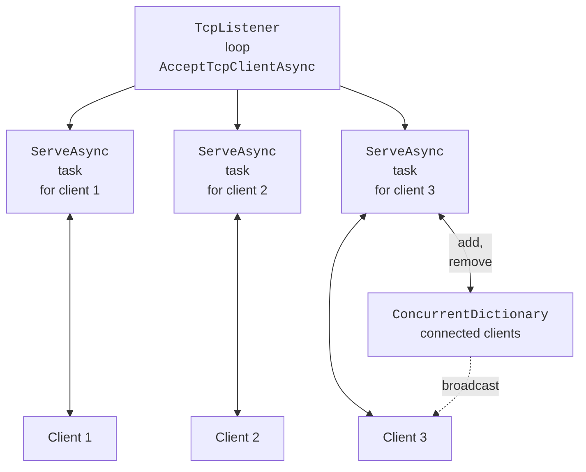

# Serving multiple clients

## Serving multiple clients

The echo server serves clients one after another. To serve them simultaneously, the accept loop starts a separate **asynchronous task** for each client and, without waiting for it to finish, accepts the next one (Fig. 9.7). An asynchronous task does not occupy a thread while it waits for data, so one server can serve hundreds of connections.

Client tasks run in parallel on different thread pool threads, so shared data needs protection:

- the collection of connected clients is stored in a `ConcurrentDictionary<TKey, TValue>` (<https://learn.microsoft.com/dotnet/api/system.collections.concurrent.concurrentdictionary-2>), which is safe to modify from multiple threads;
- two tasks must not write to the same `NetworkStream` simultaneously: the bytes of two messages would get interleaved. Writes are serialized with a lock; for asynchronous code use `SemaphoreSlim`, because `await` cannot be used inside `lock`.



Fig. 9.7. A server serving multiple clients {.caption}

A **graceful shutdown** of a server means: stop accepting new connections, notify the clients, wait for their tasks to finish, and close the sockets. The stop signal is passed with a **cancellation token** `CancellationToken` (<https://learn.microsoft.com/dotnet/standard/threading/cancellation-in-managed-threads>): after `Cancel()` is called, the `AcceptTcpClientAsync(token)` and `ReadLineAsync(token)` methods throw `OperationCanceledException`. A client shuts down just as gracefully: `Shutdown(SocketShutdown.Send)` tells the server that there will be no more requests (the server reads the end of the stream), after which the client reads the remaining responses and closes the socket.

### Example: a chat

The chat server accepts any number of clients. The first line from a client is the name, and each following line is a message that the server broadcasts to everyone. The listening address can be given as an argument: without an argument the server listens on all interfaces (the firewall prompt appears on the first run), and with the argument `127.0.0.1` it listens only on this computer. Pressing **Enter** in the server window stops it.

```cs
using System.Collections.Concurrent;
using System.Net;
using System.Net.Sockets;
using System.Text;

Console.OutputEncoding = Encoding.UTF8;

// Address from the argument; without an argument – all network interfaces.
IPAddress address = args.Length > 0
    ? IPAddress.Parse(args[0]) : IPAddress.Any;
var clients = new ConcurrentDictionary<int, StreamWriter>();
var sendLock = new SemaphoreSlim(1, 1);
var tasks = new List<Task>();
int lastId = 0;

using var stop = new CancellationTokenSource();
_ = Task.Run(() => { Console.ReadLine(); stop.Cancel(); });

var listener = new TcpListener(address, 5055);
listener.Start();
Console.WriteLine($"Chat server is listening on {listener.LocalEndpoint}");
Console.WriteLine("Enter – stop the server");
try
{
    while (true)
    {
        TcpClient client =
            await listener.AcceptTcpClientAsync(stop.Token);
        int id = Interlocked.Increment(ref lastId);
        tasks.Add(ServeAsync(id, client, stop.Token));
    }
}
catch (OperationCanceledException)
{
    listener.Stop();        // new connections are no longer accepted
}
await Task.WhenAll(tasks);  // wait for all clients to finish
Console.WriteLine("Server stopped");

async Task ServeAsync(int id, TcpClient client,
    CancellationToken token)
{
    using (client)
    {
        NetworkStream stream = client.GetStream();
        var reader = new StreamReader(stream, Encoding.UTF8);
        var writer = new StreamWriter(stream, new UTF8Encoding(false))
        {
            AutoFlush = true,
            NewLine = "\n"
        };
        string? name = null;
        try
        {
            // The first line from the client is the user name.
            name = (await reader.ReadLineAsync(token))?.Trim();
            if (name is null || name.Length is 0 or > 20) return;
            clients[id] = writer;
            await BroadcastAsync($"* {name} joins the chat");

            string? line;
            while ((line = await reader.ReadLineAsync(token)) != null)
            {
                if (line.Length > 500) line = line[..500];
                await BroadcastAsync($"{name}: {line}");
            }
        }
        catch (OperationCanceledException)
        {
            await writer.WriteLineAsync("* Server is shutting down");
        }
        catch (IOException)
        {
            // The connection was broken without a proper close.
        }
        finally
        {
            if (clients.TryRemove(id, out _))
            {
                await BroadcastAsync($"* {name} leaves the chat");
            }
        }
    }
}

async Task BroadcastAsync(string message)
{
    Console.WriteLine($"{DateTime.Now:HH:mm:ss} {message}");
    await sendLock.WaitAsync();     // one network write at a time
    try
    {
        foreach ((int id, StreamWriter writer) in clients)
        {
            try
            {
                await writer.WriteLineAsync(message);
            }
            catch (Exception ex)
                when (ex is IOException or ObjectDisposedException)
            {
                clients.TryRemove(id, out _);
            }
        }
    }
    finally
    {
        sendLock.Release();
    }
}
```

The `Interlocked.Increment` method atomically increments the ID counter. The expression `line[..500]` truncates an overly long message. The `ServeAsync` task finishes when the client closes the connection (`ReadLineAsync` returns `null`), when the connection is broken (`IOException`), or when the server stops; in all cases the `finally` block removes the client from the dictionary and notifies the others.

The client is a Windows Forms application (Fig. 9.8). The project was created from the *Windows Forms App* template, the `Form1.cs` and `Form1.Designer.cs` files were deleted, and `Program.cs` runs `new ChatForm()`. The form is built in code:

```cs
using System.Net.Sockets;
using System.Text;

namespace ChatClient;

public class ChatForm : Form
{
    private readonly TextBox hostBox = new() { Text = "127.0.0.1" };
    private readonly TextBox nameBox = new()
    {
        PlaceholderText = "Name"
    };
    private Button connectButton = new()
    {
        Text = "Connect", AutoSize = true
    };
    private ListBox messages = new() { Dock = DockStyle.Fill };
    private TextBox inputBox = new() { Dock = DockStyle.Fill };
    private readonly Button sendButton = new()
    {
        Text = "Send", Dock = DockStyle.Right, Enabled = false
    };
    private TcpClient? client;
    private StreamWriter? writer;
    private CancellationTokenSource? cts;

    public ChatForm()
    {
        Text = "Chat Client";
        AutoScaleDimensions = new SizeF(96, 96); // sizes for 100 %
        AutoScaleMode = AutoScaleMode.Dpi;       // scale to the DPI
        ClientSize = new Size(460, 360);
        var top = new FlowLayoutPanel
        {
            Dock = DockStyle.Top, AutoSize = true
        };
        top.Controls.AddRange([hostBox, nameBox, connectButton]);
        var bottom = new Panel
        {
            Dock = DockStyle.Bottom, Height = 28
        };
        bottom.Controls.AddRange([inputBox, sendButton]);
        Controls.AddRange([messages, bottom, top]);
        AcceptButton = sendButton;      // Enter sends the line

        connectButton.Click += async (_, _) => await ConnectAsync();
        sendButton.Click += async (_, _) => await SendAsync();
        FormClosing += (_, _) => Disconnect();
    }

    private async Task ConnectAsync()
    {
        if (client != null)
        {
            Disconnect();
            return;
        }
        connectButton.Enabled = false;
        try
        {
            client = new TcpClient();
            await client.ConnectAsync(hostBox.Text, 5055);
            NetworkStream stream = client.GetStream();
            writer = new StreamWriter(stream, new UTF8Encoding(false))
            {
                AutoFlush = true,
                NewLine = "\n"
            };
            await writer.WriteLineAsync(nameBox.Text);
            cts = new CancellationTokenSource();
            SetConnected(true);
            _ = ReceiveAsync(new StreamReader(stream), cts.Token);
        }
        catch (SocketException ex)
        {
            Disconnect();
            messages.Items.Add($"* {ex.Message}");
        }
        connectButton.Enabled = true;
    }

    // await does not block the UI thread, and the continuation runs
    // on that same thread, so the ListBox can be changed without Invoke.
    private async Task ReceiveAsync(StreamReader reader,
        CancellationToken token)
    {
        try
        {
            string? line;
            while ((line = await reader.ReadLineAsync(token)) != null)
            {
                messages.Items.Add(line);
                messages.TopIndex = messages.Items.Count - 1;
            }
            messages.Items.Add("* Connection closed by server");
        }
        catch (Exception) when (token.IsCancellationRequested)
        {
            return;                 // the user disconnected
        }
        catch (IOException ex)
        {
            messages.Items.Add($"* Connection lost: {ex.Message}");
        }
        Disconnect();
    }

    private async Task SendAsync()
    {
        if (writer is null || inputBox.Text.Length == 0) return;
        try
        {
            await writer.WriteLineAsync(inputBox.Text);
            inputBox.Clear();
        }
        catch (IOException)
        {
            Disconnect();
        }
    }

    private void Disconnect()
    {
        cts?.Cancel();
        client?.Dispose();          // closes the socket and the stream
        client = null;
        writer = null;
        SetConnected(false);
    }

    private void SetConnected(bool connected)
    {
        connectButton.Text = connected ? "Disconnect" : "Connect";
        hostBox.Enabled = nameBox.Enabled = !connected;
        sendButton.Enabled = connected;
    }
}
```

The `ReceiveAsync` receive loop is started without `await` and runs as long as the connection is open. Each `await` releases the UI thread, so the window responds to input, and the continuation after `await` runs on the UI thread again (the Windows Forms synchronization context), so controls can be changed without `Invoke`. Clicking *Disconnect* cancels the token and closes the `TcpClient`.

For testing, the server was started with the argument `127.0.0.1`, and two clients (Olena and Taras) were connected to it; Taras sent a message and disconnected. Olena's window contains the same messages without timestamps, and the server log contains timestamped lines such as `14:23:32 Olena: Hi! Who has already done the lab?` and `14:23:33 * Taras leaves the chat`.

If you press **Enter** in the server window while clients are connected, each client receives `* Server is shutting down` and `* Connection closed by server`, and the server prints `Server stopped` only after all client tasks have finished.


Fig. 9.8. Two Windows Forms chat clients and the server console {.caption}

To start the server and the client with one command in Visual Studio 2026, add both projects to one solution, choose *Configure Startup Projects…* in the solution's context menu, select *Multiple startup projects*, and set the *Start* action for both projects (Fig. 9.9) (<https://learn.microsoft.com/visualstudio/ide/how-to-set-multiple-startup-projects>). The server must be first in the list. A second client instance is started with *Debug → Start New Instance* in the project's context menu.


Fig. 9.9. Starting the server and client at the same time {.caption}
