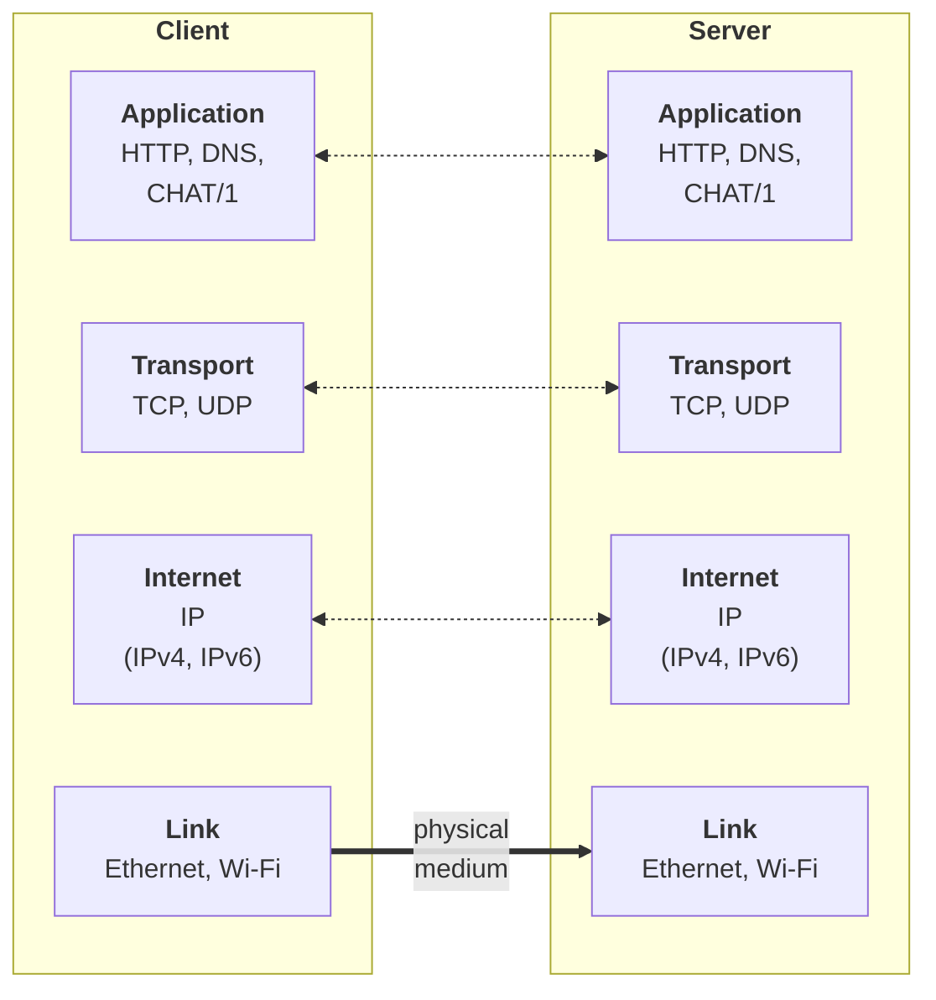
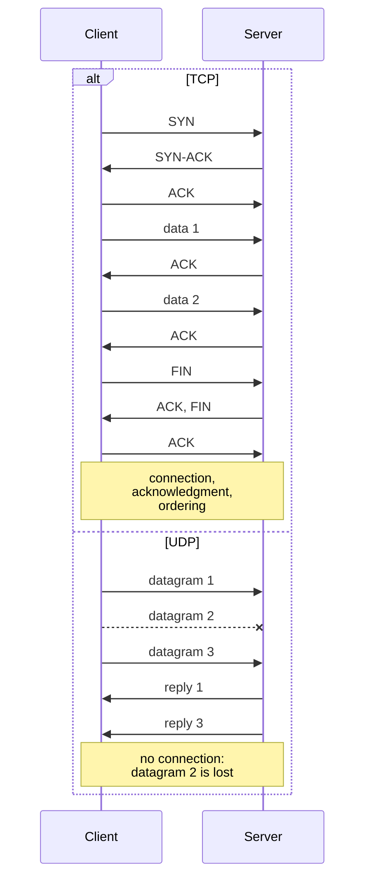
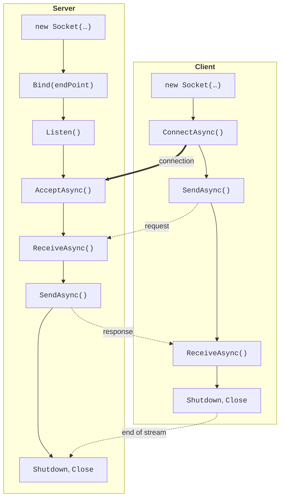

# Networking, TCP, UDP, and Socket

## Networking basics

A network application consists of at least two programs that exchange data. A **server** waits for requests and serves them, and a **client** sends requests to the server. This is how a browser and a web server, a mail program and a mail server, or a network game work. The programs can run on different computers or on the same one: for learning, it is convenient to run the server and the client on one computer in two terminal windows.

### The TCP/IP protocol stack

A **protocol** is a set of rules for exchanging data: the message format, their order, and how errors are handled. Network protocols form a **stack** of layers. The OSI reference model has seven layers, while the Internet uses the simpler four-layer TCP/IP model (Fig. 9.1):

- **link** – transfers frames within a single network (Ethernet, Wi-Fi);
- **internet** – delivers packets between networks by IP address (the IP protocol);
- **transport** – transfers data between programs by port number (TCP, UDP);
- **application** – protocols of specific applications (HTTP, DNS, and custom protocols).



Fig. 9.1. The TCP/IP protocol stack {.caption}

Each layer uses the services of the layer below: a program passes data to the transport layer, which splits it into segments, the internet layer wraps the segments into IP packets, and so on. On the receiving computer the data travels up the stack. A C# programmer works at the boundary between the application and transport layers: the program builds application messages, and the operating system and network hardware take care of delivery.

### IP addresses

An **IP address** identifies a computer's network interface. Two versions are used:

- **IPv4** – a 32-bit address written as four numbers 0–255: `192.168.1.20`;
- **IPv6** – a 128-bit address written as hexadecimal groups: `2001:db8::15`.

Special addresses: `127.0.0.1` (IPv6: `::1`) is the **loopback** address, "this computer", and data sent to it never leaves the machine; `0.0.0.0` (`::`) on a server means "all network interfaces"; `255.255.255.255` is the local network broadcast address. The addresses `10.x.x.x`, `172.16–31.x.x`, and `192.168.x.x` are private: they are used in home and lab networks. In .NET an address is described by the `IPAddress` class, and an "address + port" pair by the `IPEndPoint` class.

### Ports

A **port** is a number from 0 to 65,535 that identifies a program on a computer: a web server, a mail server, and a chat can all run on one IP address at the same time. Ports 0–1023 are assigned to well-known services (HTTP – 80, HTTPS – 443, DNS – 53), 1024–49,151 can be registered for applications, and 49,152–65,535 are handed out to clients temporarily by the operating system. The port registry is maintained by IANA (<https://www.iana.org/assignments/service-names-port-numbers/service-names-port-numbers.xhtml>). The lecture examples use ports 5050–5070: they are not taken by standard services. Only one program can listen on a given port of a given protocol on a given address.

### Domain names and DNS

People find names (`learn.microsoft.com`) easier to remember than addresses. Converting a name to addresses is done by **DNS** (*Domain Name System*), and in .NET by the `Dns` class (<https://learn.microsoft.com/dotnet/api/system.net.dns>):

```cs
using System.Net;

IPAddress[] addresses = await Dns.GetHostAddressesAsync("localhost");
foreach (IPAddress address in addresses)
{
    Console.WriteLine($"{address,-24} {address.AddressFamily}");
}
```

The program prints two addresses: `::1` (`InterNetworkV6`) and `127.0.0.1` (`InterNetwork`). For a website the method returns one or more addresses that depend on where the request comes from.

## The TCP and UDP protocols

The transport layer offers two main protocols (Fig. 9.2).

**TCP** (*Transmission Control Protocol*, <https://www.rfc-editor.org/rfc/rfc9293>) establishes a **connection** with three messages SYN, SYN-ACK, ACK (the **three-way handshake**), numbers the bytes, acknowledges receipt, retransmits lost data, and delivers it to the receiver in the correct order. To a program, a TCP connection looks like a bidirectional **byte stream**, similar to a file.

**UDP** (*User Datagram Protocol*, <https://www.rfc-editor.org/rfc/rfc768>) does not establish a connection: the program sends individual **datagrams**, each of which arrives whole but may be lost, duplicated, or arrive out of order. On the other hand, UDP is fast, has no connection setup delay, and supports broadcasting. TCP is used by the web, email, file transfer, and chats; UDP by DNS, streaming video and audio, games, and network discovery.



Fig. 9.2. Data exchange over TCP and UDP {.caption}

## The `Socket` class

A **socket** is an operating system object through which a program sends and receives data over the network. In .NET it is represented by the `Socket` class from the `System.Net.Sockets` namespace (<https://learn.microsoft.com/dotnet/api/system.net.sockets.socket>). The constructor takes three parameters: the address family `AddressFamily` (`InterNetwork` – IPv4, `InterNetworkV6` – IPv6), the socket type `SocketType` (`Stream` – a stream, `Dgram` – datagrams), and the protocol `ProtocolType` (`Tcp`, `Udp`).

The lifecycle of TCP sockets is shown in Fig. 9.3, and the main methods are listed in Table 9.1. The server **binds** the socket to an address and port, puts it into **listen** mode, and **accepts** connections: for each client the `AcceptAsync` method returns a new socket, while the listening socket waits for the next clients. The client creates a socket and **connects** to the server's address and port; the client's own port is chosen by the operating system.



Fig. 9.3. The lifecycle of server and client sockets {.caption}

Table 9.1. Main methods of the `Socket` class {.caption}

| **Method** | **Purpose** |
| --- | --- |
| `Bind(EndPoint)` | bind the socket to a local address and port |
| `Listen(backlog)` | start listening; `backlog` is the length of the queue of not-yet-accepted connections |
| `AcceptAsync()` | wait for a client and get a socket for exchanging data with it |
| `ConnectAsync(EndPoint)` | connect to a server |
| `SendAsync(buffer)` | send bytes; returns the number of bytes sent |
| `ReceiveAsync(buffer)` | receive the available bytes (from 1 up to the buffer size); 0 means the peer closed the connection |
| `Shutdown(SocketShutdown)` | signal that sending (`Send`), receiving (`Receive`), or both are finished |
| `Close()`, `Dispose()` | release the socket |

All waiting operations have asynchronous versions that return `Task` or `ValueTask` and accept a `CancellationToken`. Asynchronous code (Topic 5) does not block a thread while data travels over the network, so these are the versions used in servers and UI applications. The simplest echo server on "raw" sockets returns all received bytes to the client:

```cs
using System.Net;
using System.Net.Sockets;
using System.Text;

Console.OutputEncoding = Encoding.UTF8;

using var listener = new Socket(AddressFamily.InterNetwork,
    SocketType.Stream, ProtocolType.Tcp);
listener.Bind(new IPEndPoint(IPAddress.Loopback, 5050));
listener.Listen(backlog: 10);
Console.WriteLine($"Server is listening on {listener.LocalEndPoint}");

var buffer = new byte[4096];
while (true)
{
    using Socket handler = await listener.AcceptAsync();
    int received;
    // ReceiveAsync returns 0 when the client has closed the connection.
    while ((received = await handler.ReceiveAsync(buffer)) > 0)
    {
        await handler.SendAsync(buffer.AsMemory(0, received));
    }
    handler.Shutdown(SocketShutdown.Both);
}
```

The `ReceiveAsync` method returns **as many bytes as have already arrived**, not as many as the client sent in one call: one send may arrive in pieces, and several sends may arrive together. A result of 0 means the client has finished sending. The `using` statement closes the socket even if an exception occurs. A detailed description of working with `Socket`: <https://learn.microsoft.com/dotnet/fundamentals/networking/sockets/socket-services>.
