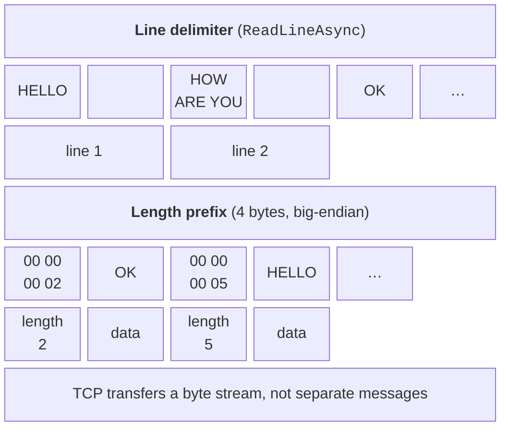

# TCP: client, server, and protocol

## The `TcpListener`, `TcpClient`, and `NetworkStream` classes

For TCP, .NET provides more convenient wrapper classes over `Socket` (<https://learn.microsoft.com/dotnet/fundamentals/networking/sockets/tcp-classes>):

- `TcpListener` – the server: `Start()` performs `Bind` and `Listen`, `AcceptTcpClientAsync()` accepts a client, `Stop()` stops listening;
- `TcpClient` – a connection: `ConnectAsync(host, port)` connects by name or address, `GetStream()` returns the stream, and the `Client` property gives access to the underlying `Socket`;
- `NetworkStream` – a stream (`Stream`) over a socket: `ReadAsync`, `WriteAsync`, `ReadExactlyAsync`, and other familiar stream methods.

The stream can be "wrapped" in the `StreamReader` and `StreamWriter` classes to exchange lines of text. Text is transferred as bytes, so both sides must use the same **encoding** – UTF-8. Two details are easy to miss:

- `StreamWriter` buffers data by default; without `AutoFlush = true` or a call to `FlushAsync` the line never reaches the network, and both programs end up waiting for each other;
- `new StreamWriter(stream, Encoding.UTF8)` sends a **BOM** at the start of writing – three bytes `EF BB BF` that end up at the beginning of the peer's first line. A `new UTF8Encoding(false)` object writes UTF-8 without a BOM.

The `NewLine = "\n"` property makes the line separator the same on all operating systems (on Windows the default is `"\r\n"`); `ReadLineAsync` recognizes both variants.

### Example: an echo server

The server accepts clients one at a time, reads lines, and returns each line with the `Echo:` prefix. The server listens only on the loopback address, so it can be reached only from this computer.

```cs
using System.Net;
using System.Net.Sockets;
using System.Text;

Console.OutputEncoding = Encoding.UTF8;

var listener = new TcpListener(IPAddress.Loopback, 5050);
listener.Start();
Console.WriteLine($"Echo server is listening on {listener.LocalEndpoint}");

while (true)
{
    // Wait for the next client (one at a time).
    using TcpClient client = await listener.AcceptTcpClientAsync();
    EndPoint? remote = client.Client.RemoteEndPoint;
    Console.WriteLine($"Client {remote} connected");

    NetworkStream stream = client.GetStream();
    var reader = new StreamReader(stream, Encoding.UTF8);
    var writer = new StreamWriter(stream, new UTF8Encoding(false))
    {
        AutoFlush = true,   // send every line immediately
        NewLine = "\n"
    };

    string? line;
    while ((line = await reader.ReadLineAsync()) != null)
    {
        Console.WriteLine($"{remote} → {line}");
        await writer.WriteLineAsync($"Echo: {line}");
    }
    Console.WriteLine($"Client {remote} disconnected");
}
```

The client sends the lines you type and prints the responses; an empty line ends the session:

```cs
using System.Net.Sockets;
using System.Text;

Console.OutputEncoding = Encoding.UTF8;

using var client = new TcpClient();
await client.ConnectAsync("127.0.0.1", 5050);
Console.WriteLine($"Connected to {client.Client.RemoteEndPoint}");

NetworkStream stream = client.GetStream();
var reader = new StreamReader(stream, Encoding.UTF8);
var writer = new StreamWriter(stream, new UTF8Encoding(false))
{
    AutoFlush = true,
    NewLine = "\n"
};

while (true)
{
    Console.Write("> ");
    string? text = Console.ReadLine();
    if (string.IsNullOrEmpty(text))
    {
        break;                      // empty line – exit
    }
    await writer.WriteLineAsync(text);
    string? answer = await reader.ReadLineAsync();
    if (answer is null)
    {
        Console.WriteLine("The server closed the connection");
        break;
    }
    Console.WriteLine(answer);
}
```

Run the server and the client in two Windows Terminal tabs (Fig. 9.4) or with `dotnet run` in two project folders. The client output (the lines you type follow `>`):

```
Connected to [::ffff:127.0.0.1]:5050
> Hello, server!
Echo: Hello, server!
> TCP transfers lines
Echo: TCP transfers lines
>
```


Fig. 9.4. Echo server and client in two Windows Terminal panes {.caption}

The `TcpClient()` constructor creates an IPv6 socket in **dual mode**, which also handles IPv4, so the server address is shown as an IPv4 address mapped to IPv6: `[::ffff:127.0.0.1]`. The server logs lines such as `127.0.0.1:64104 → Hello, server!`: the client port 64104 was assigned by the operating system. While the first client is connected, a second one waits in the `Listen` queue: the server loop serves clients one after another. How to serve clients simultaneously is covered later.

## The listening address and Windows Firewall

The address the server listens on determines who can connect:

- `IPAddress.Loopback` (`127.0.0.1`) – only programs on this computer;
- `IPAddress.Any` (`0.0.0.0`) – all IPv4 network interfaces: the server is reachable on the local network;
- `IPAddress.IPv6Any` with `listener.Server.DualMode = true` – IPv4 and IPv6 at the same time.

A client connecting to the name `localhost` tries the address `::1` first. If the server listens only on `127.0.0.1`, that attempt is refused, and on Windows the connection is established about 2 s later. That is why the example clients use `"127.0.0.1"`.

**Windows Firewall** blocks incoming connections by default (<https://learn.microsoft.com/windows/security/operating-system-security/network-security/windows-firewall/rules>). When a program first starts listening on a network (non-loopback) interface and there is no rule for it, Windows shows the *Windows Security Alert* window (Fig. 9.5). A user with administrator rights can allow access on private (*Private networks*) or public networks. If you close the window with *Cancel* or do not have administrator rights, **blocking** rules are created, and clients from other computers cannot connect even though everything works on this computer. You can view and delete such rules in *Windows Security → Firewall & network protection → Allow an app through firewall*. The firewall does not inspect the loopback interface.

::: info Screenshot
First run of ChatServer bound to 0.0.0.0: Windows Security Alert, Private networks checked
:::

Fig. 9.5. The Windows Firewall prompt on the first server start {.caption}

::: tip Tip
During development, listen on `IPAddress.Loopback`. Use `IPAddress.Any` when clients really run on other computers, and allow access only on private networks.
:::

## Message boundaries in a TCP stream

TCP transfers a **byte stream**, not messages: if a client sent 10 bytes twice, the server may receive 20 bytes in one `ReadAsync` call, or 3 and then 17. So the application protocol must define where each message ends. Two approaches are common (Fig. 9.6):

- a **delimiter** – the message ends with the `\n` character; this is how text protocols (SMTP, FTP, Redis) and `ReadLineAsync` work. The text itself must not contain the delimiter;
- a **length prefix** – the message length is sent before the message as a fixed number of bytes; the receiver reads exactly that many bytes. This is how binary data and files are transferred.



Fig. 9.6. Defining message boundaries in a TCP stream {.caption}

Multi-byte numbers in network protocols are usually written in **network byte order** (*big-endian*): most significant byte first. x86 and ARM processors store numbers in the reverse order (*little-endian*), so for writing you use `BinaryPrimitives.WriteInt32BigEndian`, `ReadInt64BigEndian`, and other methods from the `System.Buffers.Binary` namespace (<https://learn.microsoft.com/dotnet/api/system.buffers.binary.binaryprimitives>). To read exactly *n* bytes, use `ReadExactlyAsync`: it repeats reading until the buffer is full, or throws `EndOfStreamException` if the connection closed earlier. Methods for sending and reading a length-prefixed message:

```cs
// Message: 4 length bytes (big-endian), then the UTF-8 bytes.
static async Task WriteMessageAsync(Stream stream, string text)
{
    byte[] data = Encoding.UTF8.GetBytes(text);
    byte[] prefix = new byte[4];
    BinaryPrimitives.WriteInt32BigEndian(prefix, data.Length);
    await stream.WriteAsync(prefix);
    await stream.WriteAsync(data);
}

static async Task<string> ReadMessageAsync(Stream stream)
{
    byte[] prefix = new byte[4];
    await stream.ReadExactlyAsync(prefix);   // exactly 4 bytes
    int length = BinaryPrimitives.ReadInt32BigEndian(prefix);
    if (length is < 0 or > 1_000_000)        // protection against 2 GB
    {
        throw new InvalidDataException($"length {length}");
    }
    byte[] data = new byte[length];
    await stream.ReadExactlyAsync(data);
    return Encoding.UTF8.GetString(data);
}
```

For the messages `OK` and `HELLO`, the bytes `00 00 00 02` `4F 4B` `00 00 00 05` `48 45 4C 4C 4F` go over the network (verified by printing with `Convert.ToHexString`). The receiver checks the length: without a limit, an attacker could send the number 2,000,000,000 and force the program to allocate 2 GB of memory. Files are transferred the same way: a header contains the file name and size, followed by the content bytes. The file name from the client is passed through `Path.GetFileName` so that a name like `..\..\x.exe` cannot escape the server folder.

Structured data is convenient to transfer as **JSON**: one object is serialized into one line (the *JSON Lines* format), and message boundaries are again defined by `\n` (<https://learn.microsoft.com/dotnet/standard/serialization/system-text-json/overview>):

```cs
var options = new JsonSerializerOptions
{
    Encoder = JavaScriptEncoder.UnsafeRelaxedJsonEscaping
};
var message = new ChatMessage("Olena", "Hi!", 2);

// Sender: one JSON object – one line.
string json = JsonSerializer.Serialize(message, options);
await writer.WriteLineAsync(json);

// Receiver: line → object.
string? line = await reader.ReadLineAsync();
ChatMessage? received = line is null
    ? null : JsonSerializer.Deserialize<ChatMessage>(line);

record ChatMessage(string From, string Text, int Room);
```

The JSON line looks like `{"From":"Olena","Text":"Hi!","Room":2}`. Without the `UnsafeRelaxedJsonEscaping` encoder, the serializer writes non-ASCII characters (for example, Cyrillic letters) as `\u041E…` codes: this is valid JSON, but longer and unreadable.

## An application protocol

When the client and the server are written by different people, the exchange rules must be described in a document – an **application protocol**. A protocol description contains:

- **how messages are delimited**: UTF-8 lines with `\n`, a length prefix, or JSON Lines;
- the client's **commands** and their arguments: `ADD 2 3`, `QUIT`;
- **responses** with status codes, as in the SMTP and HTTP protocols: `1xx` – information, `2xx` – success, `4xx` – an error in the request, `5xx` – a server error (Table 9.2);
- **session states**: which commands are allowed before login (`HELLO`, `LOGIN`) and after it;
- **limits**: the maximum line or file length, the number of connections, the idle timeout;
- the **protocol version** in the greeting (`CALC/1.0`), so that an old client and a new server can agree or refuse gracefully.

Table 9.2. Response codes of the CALC/1.0 teaching protocol {.caption}

| **Code** | **Meaning** | **Example** |
| --- | --- | --- |
| 100 | the server is ready and reports the protocol version | `100 CALC/1.0 ready` |
| 200 | the command was executed | `200 6.5` |
| 400 | invalid command format | `400 format: SUB number number` |
| 403 | the command is not allowed in this session state | `403 send HELLO CALC/1.0 first` |
| 404 | unknown command | `404 unknown command "SQRT"` |
| 413 | the message is too large, the connection is closed | `413 line longer than 100` |
| 505 | the protocol version is not supported | `505 only CALC/1.0 is supported` |

Numeric codes are convenient for programs, and the text after the code is for people. Numbers in the protocol use the invariant culture (`CultureInfo.InvariantCulture`): a server with Ukrainian settings and a client with English ones must understand `2.5` the same way. The full implementation of the CALC/1.0 protocol is given in the lab assignment.
