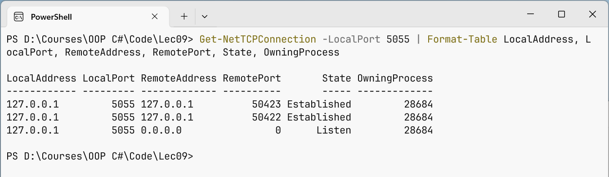

# UDP, errors, and diagnostics

## UDP and broadcast messages

For UDP, use the `UdpClient` class (<https://learn.microsoft.com/dotnet/api/system.net.sockets.udpclient>). The `new UdpClient(endPoint)` constructor binds the socket to an address and port; `SendAsync(bytes, endPoint)` sends a datagram; `ReceiveAsync(token)` waits for the next datagram and returns a `UdpReceiveResult` with the `Buffer` bytes and the sender address `RemoteEndPoint`, which is convenient for replying. One send operation is one datagram, so you do not need to define message boundaries, but:

- a datagram may be lost, so important requests are repeated or wait for a reply with a timeout;
- the datagram size is limited; messages over  1400 bytes may be fragmented and get lost more often;
- on Windows, sending to a port nobody listens on can cause the next `ReceiveAsync` to throw a `SocketException` with the `ConnectionReset` code, so it is handled and the loop continues.

A **broadcast** message sent to the address `255.255.255.255` is received by all computers on the local network that listen on that port. To send one, you must set `EnableBroadcast = true`. Routers do not forward such messages beyond the local network. A typical use is server **discovery**: the client does not know the server's address, sends a request to everyone, and the server replies with its address and port.

### Example: finding a server

The discovery server listens on UDP port 5070 and replies to the request `DISCOVER CHAT/1` with the line `CHAT/1 5055 <name>`, that is, the chat port and its name. An optional argument sets the local address, as in the chat server.

```cs
using System.Net;
using System.Net.Sockets;
using System.Text;

Console.OutputEncoding = Encoding.UTF8;
IPAddress local = args.Length > 0
    ? IPAddress.Parse(args[0]) : IPAddress.Any;

using var udp = new UdpClient(new IPEndPoint(local, 5070));
Console.WriteLine($"Waiting for requests: {udp.Client.LocalEndPoint}");

byte[] reply = Encoding.UTF8.GetBytes("CHAT/1 5055 Group CS-25 chat");
while (true)
{
    UdpReceiveResult request = await udp.ReceiveAsync();
    string text = Encoding.UTF8.GetString(request.Buffer);
    Console.WriteLine($"{request.RemoteEndPoint}: {text}");
    if (text == "DISCOVER CHAT/1")
    {
        await udp.SendAsync(reply, request.RemoteEndPoint);
    }
}
```

The client sends the broadcast request three times and collects replies for 2 s. The timeout is set by `CancellationTokenSource(2000)`: when the time runs out, `ReceiveAsync` throws `OperationCanceledException`. A `HashSet` discards duplicate replies to the repeated requests.

```cs
using System.Net;
using System.Net.Sockets;
using System.Text;

Console.OutputEncoding = Encoding.UTF8;
IPAddress local = args.Length > 0
    ? IPAddress.Parse(args[0]) : IPAddress.Any;

using var udp = new UdpClient(new IPEndPoint(local, 0));
udp.EnableBroadcast = true;       // allow broadcast sending
byte[] request = Encoding.UTF8.GetBytes("DISCOVER CHAT/1");
var everyone = new IPEndPoint(IPAddress.Broadcast, 5070);

// A datagram may be lost, so the request is sent three times.
for (int i = 0; i < 3; i++)
{
    await udp.SendAsync(request, everyone);
}
Console.WriteLine($"Request sent to {everyone}");

var found = new HashSet<string>();
using var timeout = new CancellationTokenSource(2000);
try
{
    while (true)
    {
        UdpReceiveResult result =
            await udp.ReceiveAsync(timeout.Token);
        string[] parts = Encoding.UTF8.GetString(result.Buffer)
            .Split(' ', 3);
        if (parts.Length != 3 || parts[0] != "CHAT/1") continue;

        string server = $"{result.RemoteEndPoint.Address}:{parts[1]}";
        if (found.Add(server))
        {
            Console.WriteLine($"Found \"{parts[2]}\" – {server}");
        }
    }
}
catch (OperationCanceledException)
{
    Console.WriteLine($"Search finished, servers: {found.Count}");
}
```

The result when the server and client are started with the argument `127.0.0.1` (on a local network without the argument, the client finds servers on other computers):

```
Request sent to 255.255.255.255:5070
Found "Group CS-25 chat" – 127.0.0.1:5055
Search finished, servers: 1
```

The server log contains three identical lines `127.0.0.1:63836: DISCOVER CHAT/1`; if the server is not running, the client prints `Search finished, servers: 0`.

## Errors, timeouts, and security

### Exceptions from network operations

Socket errors are reported with a `SocketException`; its `SocketErrorCode` property contains a value of the `SocketError` enumeration (<https://learn.microsoft.com/dotnet/api/system.net.sockets.socketerror>) (Table 9.3). Operations on a `NetworkStream` wrap the `SocketException` in an `IOException`, and operations on a closed stream throw `ObjectDisposedException`.

Table 9.3. Common socket error codes {.caption}

| **`SocketError`** | **Code** | **Typical cause** |
| --- | --- | --- |
| `ConnectionRefused` | 10061 | nobody is listening on the address and port: the server is not running, or the port is different |
| `AddressAlreadyInUse` | 10048 | the port is already taken by another program or another instance of the server |
| `TimedOut` | 10060 | the computer is unreachable or a firewall blocks the packets |
| `ConnectionReset` | 10054 | the peer closed the connection abnormally; for UDP, the recipient's port is closed |
| `HostNotFound` | 11001 | DNS did not find the computer name |

A broken connection shows up in different ways: a proper close appears as the end of the stream (`ReadAsync` returns 0, `ReadLineAsync` returns `null`), and an abnormal one as an `IOException`. But if the cable is unplugged or the computer is turned off, TCP may report nothing for a long time: the read simply keeps waiting.

### Timeouts and keepalive checks

To keep the program from waiting forever, operations are limited in time with a cancellation token:

```cs
using var timeout = new CancellationTokenSource(
    TimeSpan.FromSeconds(5));
await client.ConnectAsync("127.0.0.1", 5055, timeout.Token);
string? line = await reader.ReadLineAsync(timeout.Token);
```

After cancellation the state of the stream is undefined (part of a line might have been read), so the connection is closed. For long-lived connections without activity, a **heartbeat** is used: the client periodically sends a service message (`PING`), and the server replies with `PONG` and closes a connection from which nothing has arrived for a long time.

### Security

A server on the network receives data from anyone, so:

- **validate all input**: lengths, sizes, number ranges, file names (the file transfer example); do not trust values sent by the client;
- **limit resources**: line length, number of connections, idle time. The `ReadLineAsync` method reads a line of any length, so public servers read lines with their own limit;
- **encrypt data**: TCP transfers bytes in plain text, and anyone with access to the network can see them. For a secure connection, the stream is wrapped in the `SslStream` class, which implements the TLS protocol: the server calls `AuthenticateAsServerAsync` with a certificate, the client calls `AuthenticateAsClientAsync` with the server name, and then the exchange goes through the `SslStream` like a regular stream (<https://learn.microsoft.com/dotnet/api/system.net.security.sslstream>);
- **do not invent your own encryption**: home-made algorithms almost always have vulnerabilities, while TLS has been proven by years of use. Passwords are never transferred without TLS.

## Diagnosing network applications

When a client cannot connect, first check whether the server is listening on the right port. The PowerShell cmdlet `Get-NetTCPConnection` (<https://learn.microsoft.com/powershell/module/nettcpip/get-nettcpconnection>) shows TCP connections, their state, and the process ID (Fig. 9.10). For a chat server with two clients:

```powershell
Get-NetTCPConnection -LocalPort 5055 |
    Format-Table LocalAddress, LocalPort, RemoteAddress,
        RemotePort, State, OwningProcess
```

For a server with two clients, the cmdlet prints three lines: one in the `Listen` state (the server is listening, remote address `0.0.0.0:0`) and two in the `Established` state (established connections with the client ports, for example 59438 and 59439), all with the same `OwningProcess`. Other tools:

- `netstat -ano | findstr :5055` – the classic command with the same data (<https://learn.microsoft.com/windows-server/administration/windows-commands/netstat>);
- `Test-NetConnection 127.0.0.1 -Port 5055` – checks whether a connection to the port succeeds (the `TcpTestSucceeded` property);
- *Resource Monitor* (`resmon`), the *Network → Listening Ports* tab – the ports programs listen on and the firewall status for each of them;
- temporary console output on the server (as in the examples) and breakpoints in Visual Studio: while stopped at a breakpoint, the peer may get a timeout.



Fig. 9.10. Viewing the chat server's TCP connections {.caption}
