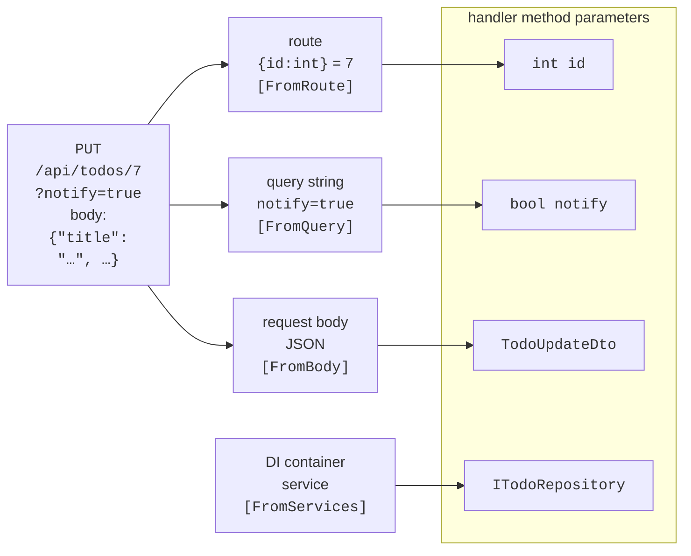

# Routes, results, and validation

## Endpoints and routes

An **endpoint** is a combination of an HTTP method, a **route template**, and a **handler** – a delegate or method that runs for the request (<https://learn.microsoft.com/aspnet/core/fundamentals/minimal-apis/route-handlers>):

```cs
app.MapGet("/api/hello/{name}", (string name) => $"Hello, {name}!");
```

The `MapGet`, `MapPost`, `MapPut`, `MapPatch`, `MapDelete` methods register endpoints for the corresponding HTTP methods. In a route template, curly braces denote a **parameter**, and what follows a colon is a **constraint**:

- `{id:int}` – only an integer; for `/api/todos/abc` the route does not match, and the client gets 404 rather than a conversion error;
- `{id:int:min(1)}`, `{code:length(3)}`, `{date:datetime}`, `{slug:regex(^[a-z-]+$)}` – other constraints; several constraints are separated by colons;
- `{page?}` – an optional parameter, `{**path}` – the rest of the address.

### Route groups

The endpoints of one resource share a prefix and often share settings. The **`MapGroup`** method creates a **route group**: its prefix is added to all endpoints in the group, and calls such as `WithTags` (a documentation section), `RequireAuthorization`, or `AddEndpointFilter` apply to each of them (see the `MapTodoEndpoints` method in the "To-do list" example).

### Parameter binding

ASP.NET Core fills handler parameters automatically: this is **parameter binding** (Fig. 10.5, <https://learn.microsoft.com/aspnet/core/fundamentals/minimal-apis/parameter-binding>). If the name matches a route parameter, the value comes from the route; a simple type (`int`, `bool`, `string`, `DateOnly`, an enumeration) comes from the query string; a type registered in the DI container comes from services; a complex type (a class, a record) comes from the JSON body (a request has only one body); `HttpContext` and `CancellationToken` are special objects of the current request. The source can be specified explicitly with the `[FromRoute]`, `[FromQuery]`, `[FromHeader]`, `[FromBody]`, `[FromServices]` attributes. A parameter with a nullable type or a default value is optional; if a required parameter is missing, the service returns 400.



Fig. 10.5. Sources of handler parameter values {.caption}

## Results, validation, and errors

### `Results` and `TypedResults`

A handler can return any object – it will be serialized to JSON with code 200. To control the status code, you return an `IResult` **result** (<https://learn.microsoft.com/aspnet/core/fundamentals/minimal-apis/responses>). The `Results` and `TypedResults` factories have the same methods: `Ok(value)`, `Created(uri, value)`, `NoContent()`, `BadRequest()`, `NotFound()`, `Conflict()`, `ValidationProblem(errors)`, `Problem(detail, statusCode: …)`.

The difference is in the type: `Results.Ok(x)` returns `IResult`, while `TypedResults.Ok(x)` returns the concrete type `Ok<TodoItem>`. Concrete types are checked by the compiler and are visible to the OpenAPI generator, so the document describes all possible responses without extra attributes. If a handler returns results of different types, the return type is written as a **`Results<…>`** union, for example `Results<Ok<TodoItem>, NotFound>` (the `GetById` method in the example).

### Validation

Before .NET 10, input validation in Minimal API was written by hand or with libraries. Now it is built in (<https://learn.microsoft.com/aspnet/core/release-notes/aspnetcore-10.0>): just call `builder.Services.AddValidation()` and annotate DTO properties and parameters with attributes from the `System.ComponentModel.DataAnnotations` namespace: `[Required]`, `[StringLength]`, `[MaxLength]`, `[Range]`, `[EmailAddress]`, `[RegularExpression]`. Validation runs **before** the handler for parameters from the route, query string, headers, and body; on an error the handler is not called, and the client gets 400 with a list of errors. Complex rules are defined with your own attribute derived from `ValidationAttribute` or with the `IValidatableObject` interface, and the `DisableValidation()` method turns validation off for an individual endpoint.

A **DTO** (*Data Transfer Object*) is a separate type for the data the service exchanges with the client. The client must not send the `Id` or internal fields of an entity, so creation uses `TodoCreateDto` rather than `TodoItem`. A DTO also protects the API format from changing when the database model changes.

### `ProblemDetails` and exception handling

A web service returns errors in the standard **Problem Details** format (RFC 9457, <https://www.rfc-editor.org/rfc/rfc9457>): JSON with the fields `type`, `title`, `status`, `detail`, and, for validation, `errors`; the content type is `application/problem+json`. For the service to always respond in this format, three calls are needed (<https://learn.microsoft.com/aspnet/core/fundamentals/error-handling-api>):

- `builder.Services.AddProblemDetails()` – registers the service that creates the error body;
- `app.UseExceptionHandler()` – catches an unhandled exception, logs it, and returns 500 without a stack trace (implementation details do not reach the client);
- `app.UseStatusCodePages()` – adds a body to empty 404 and 405 responses.

In the Development environment, invalid JSON in the request body causes a `BadHttpRequestException`, and without extra configuration the client would get 500. The exception handler's `StatusCodeSelector` property returns code 400 for it, taken from the exception itself (see the example).

### Example: a to-do list

The web service stores to-dos in memory and implements the endpoints from Table 10.3. The list supports filtering by completed to-dos and paging. The project was created from the *ASP.NET Core Web API* template; the `Todo.cs` file contains the entity and the DTOs:

```cs
using System.ComponentModel.DataAnnotations;

namespace TodoApi;

public enum Priority { Low, Normal, High }

// The entity stored by the repository.
public class TodoItem
{
    public int Id { get; set; }
    public string Title { get; set; } = "";
    public Priority Priority { get; set; }
    public DateOnly? DueDate { get; set; }
    public bool IsDone { get; set; }
}

// DTO: what the client sends when creating a to-do.
public record TodoCreateDto(
    [Required, StringLength(100, MinimumLength = 3,
        ErrorMessage = "The title must contain 3 to 100 characters.")]
    string Title,
    Priority Priority = Priority.Normal,
    DateOnly? DueDate = null);

// DTO for replacing a to-do completely (PUT).
public record TodoUpdateDto(
    [Required, StringLength(100, MinimumLength = 3,
        ErrorMessage = "The title must contain 3 to 100 characters.")]
    string Title,
    Priority Priority,
    DateOnly? DueDate,
    bool IsDone);

public record PagedResult<T>(IReadOnlyList<T> Items,
    int Page, int PageSize, int TotalCount);
```

The repository is described by the `ITodoRepository` interface (the `TodoRepository.cs` file). The endpoints depend only on the interface, so the in-memory implementation was later replaced with EF Core without changing the handlers. The methods are asynchronous because database access is asynchronous:

```cs
namespace TodoApi;

public interface ITodoRepository
{
    Task<PagedResult<TodoItem>> GetPageAsync(bool? done,
        int page, int pageSize);
    Task<TodoItem?> FindAsync(int id);
    Task<TodoItem> AddAsync(TodoItem item);
    Task<bool> UpdateAsync(TodoItem item);
    Task<bool> DeleteAsync(int id);
}
```

The in-memory repository is registered as a **Singleton** (one object for the whole application), while Kestrel processes requests in parallel on different threads. So every access to the list is protected by a `lock` on an object of type `Lock` (Topic 5):

```cs
// Data in process memory: lost after a restart.
public class InMemoryTodoRepository : ITodoRepository
{
    private readonly List<TodoItem> items = [];
    private readonly Lock sync = new();   // requests run in parallel
    private int nextId = 1;

    public Task<PagedResult<TodoItem>> GetPageAsync(bool? done,
        int page, int pageSize)
    {
        lock (sync)
        {
            var filtered = items
                .Where(t => done == null || t.IsDone == done)
                .ToList();
            var slice = filtered.Skip((page - 1) * pageSize)
                .Take(pageSize).ToList();
            return Task.FromResult(new PagedResult<TodoItem>(
                slice, page, pageSize, filtered.Count));
        }
    }

    public Task<TodoItem?> FindAsync(int id)
    {
        lock (sync)
            return Task.FromResult(items.Find(t => t.Id == id));
    }

    public Task<TodoItem> AddAsync(TodoItem item)
    {
        lock (sync) { item.Id = nextId++; items.Add(item); }
        return Task.FromResult(item);
    }

    public Task<bool> UpdateAsync(TodoItem item)
    {
        lock (sync)
        {
            int i = items.FindIndex(t => t.Id == item.Id);
            if (i >= 0) items[i] = item;
            return Task.FromResult(i >= 0);
        }
    }

    public Task<bool> DeleteAsync(int id)
    {
        lock (sync)
            return Task.FromResult(
                items.RemoveAll(t => t.Id == id) > 0);
    }
}
```

The endpoints are collected in the `MapTodoEndpoints` extension method (the `TodoEndpoints.cs` file). The paging parameters are validated with `[Range]` attributes directly in the handler signature:

```cs
using System.ComponentModel.DataAnnotations;
using Microsoft.AspNetCore.Http.HttpResults;

namespace TodoApi;

public static class TodoEndpoints
{
    public static RouteGroupBuilder MapTodoEndpoints(
        this IEndpointRouteBuilder app)
    {
        var group = app.MapGroup("/api/todos").WithTags("Todos");
        group.MapGet("/", GetAll);
        group.MapGet("/{id:int}", GetById).WithName("GetTodo");
        group.MapPost("/", Create);
        group.MapPut("/{id:int}", Update);
        group.MapDelete("/{id:int}", Delete);
        return group;
    }

    // GET /api/todos?done=false&page=1&pageSize=10
    static async Task<Ok<PagedResult<TodoItem>>> GetAll(
        ITodoRepository repo, bool? done = null,
        [Range(1, 1000)] int page = 1,
        [Range(1, 50)] int pageSize = 10) =>
        TypedResults.Ok(
            await repo.GetPageAsync(done, page, pageSize));

    static async Task<Results<Ok<TodoItem>, NotFound>> GetById(
        int id, ITodoRepository repo) =>
        await repo.FindAsync(id) is { } item
            ? TypedResults.Ok(item)
            : TypedResults.NotFound();

    static async Task<Created<TodoItem>> Create(
        TodoCreateDto dto, ITodoRepository repo)
    {
        var item = await repo.AddAsync(new TodoItem
        {
            Title = dto.Title.Trim(),
            Priority = dto.Priority,
            DueDate = dto.DueDate
        });
        return TypedResults.Created($"/api/todos/{item.Id}", item);
    }

    static async Task<Results<NoContent, NotFound>> Update(
        int id, TodoUpdateDto dto, ITodoRepository repo)
    {
        var item = new TodoItem
        {
            Id = id, Title = dto.Title.Trim(),
            Priority = dto.Priority, DueDate = dto.DueDate,
            IsDone = dto.IsDone
        };
        return await repo.UpdateAsync(item)
            ? TypedResults.NoContent()
            : TypedResults.NotFound();
    }

    static async Task<Results<NoContent, NotFound>> Delete(
        int id, ITodoRepository repo) =>
        await repo.DeleteAsync(id)
            ? TypedResults.NoContent()
            : TypedResults.NotFound();
}
```

`TypedResults.Created` returns code 201, a `Location` header with the address of the new to-do, and the to-do itself in the body. The `Program.cs` file registers the services and configures the pipeline:

```cs
using System.Text.Json;
using System.Text.Json.Serialization;
using TodoApi;

var builder = WebApplication.CreateBuilder(args);

builder.Services.AddOpenApi();
builder.Services.AddProblemDetails();   // errors per RFC 9457
builder.Services.AddValidation();       // DTO validation (.NET 10)
builder.Services.ConfigureHttpJsonOptions(options =>
    options.SerializerOptions.Converters.Add(   // "high", not 2
        new JsonStringEnumConverter(JsonNamingPolicy.CamelCase)));
builder.Services.AddSingleton<ITodoRepository,
    InMemoryTodoRepository>();

var app = builder.Build();

app.UseExceptionHandler(new ExceptionHandlerOptions
{
    // Invalid JSON in the body – 400, other exceptions – 500.
    StatusCodeSelector = ex => ex is BadHttpRequestException bad
        ? bad.StatusCode : StatusCodes.Status500InternalServerError
});

app.UseStatusCodePages();     // empty 404, 405 -> ProblemDetails
if (app.Environment.IsDevelopment())
{
    app.MapOpenApi();         // the /openapi/v1.json document
}
app.UseHttpsRedirection();

app.MapTodoEndpoints();
app.Run();
```

After starting (**Ctrl+F5** or `dotnet run`), the service listens on the address from `launchSettings.json`. Responses to requests from the `TodoApi.http` file (next section) are shown below; the JSON bodies are formatted for readability, the service writes them on one line.

```
POST /api/todos  {"title":"Buy milk","priority":"high",
                  "dueDate":"2026-09-20"}

HTTP/1.1 201 Created
Content-Type: application/json; charset=utf-8
Location: /api/todos/1

{
  "id": 1,
  "title": "Buy milk",
  "priority": "high",
  "dueDate": "2026-09-20",
  "isDone": false
}
```

```
POST /api/todos  { "title": "Ok" }

HTTP/1.1 400 Bad Request
Content-Type: application/problem+json

{
  "type": "https://tools.ietf.org/html/rfc9110#section-15.5.1",
  "title": "One or more validation errors occurred.",
  "status": 400,
  "errors": {
    "Title": [
      "The title must contain 3 to 100 characters."
    ]
  },
  "traceId": "00-4eea5e7d413a9f7a81ebc71892a13548-ebd2ed03168fca2f-00"
}
```

After a second to-do is created and a `PUT` marks the first one as done, the request `GET /api/todos?done=false` returns a page with one to-do (`"id": 2`) and `"totalCount": 1`. A request for a nonexistent to-do returns 404 with a `ProblemDetails` body, `PATCH /api/todos/1` returns 405 with the header `Allow: DELETE, GET, PUT`, and `GET /api/todos?pageSize=100` returns 400 with a `"pageSize"` error. The `traceId` field links the response to an entry in the server log.
