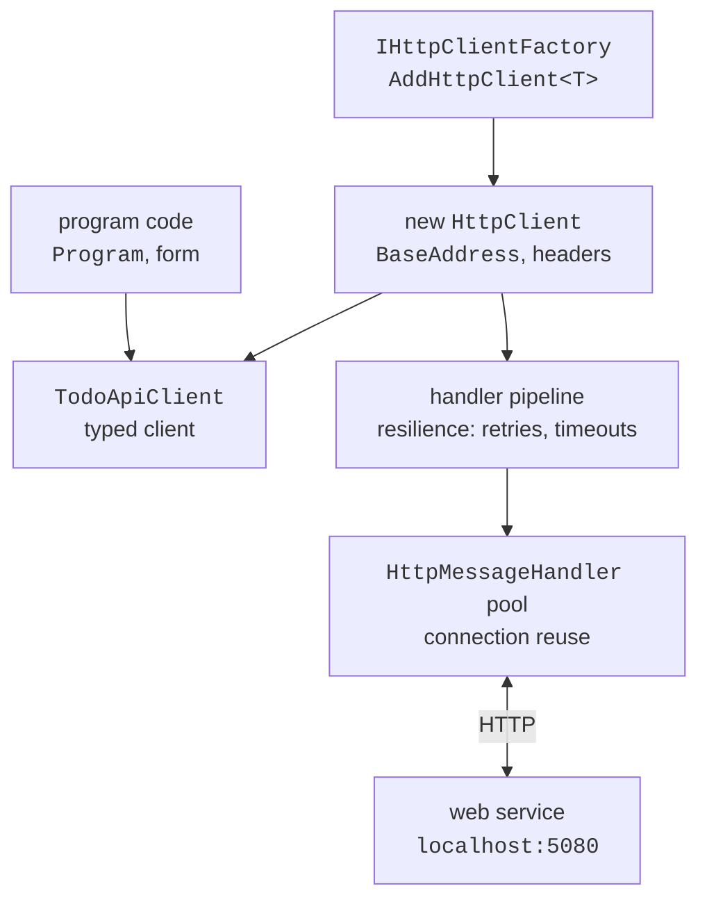

# The HttpClient client and security

## The `HttpClient` client

A C# program calls a web service with the **`HttpClient`** class (<https://learn.microsoft.com/dotnet/fundamentals/networking/http/httpclient>). Its main members:

- `BaseAddress` – the base address; relative request addresses are resolved against it (the address must end with "/");
- `GetAsync`, `PostAsync`, `PutAsync`, `PatchAsync`, `DeleteAsync`, `SendAsync` – send a request and return an `HttpResponseMessage` with `StatusCode`, `Headers`, and `Content`;
- `Timeout` – the request timeout (100 s by default); after it a `TaskCanceledException` is thrown;
- `DefaultRequestHeaders` – headers for all requests.

Extension methods from the `System.Net.Http.Json` namespace combine a request with JSON (<https://learn.microsoft.com/dotnet/api/system.net.http.json.httpclientjsonextensions>): `GetFromJsonAsync<T>` sends a `GET` and deserializes the body, `PostAsJsonAsync` and `PutAsJsonAsync` serialize an object into the body, and `response.Content.ReadFromJsonAsync<T>` reads the response body. They use the web JSON settings (camelCase).

### Error handling

A network call can fail at several levels. If the server is unavailable, an `HttpRequestException` is thrown; a timeout causes a `TaskCanceledException`, and cancellation with a `CancellationToken` causes an `OperationCanceledException`. But if the server responded with a 4xx or 5xx code, **no** exception is thrown: you need to check `response.IsSuccessStatusCode` or call `EnsureSuccessStatusCode()` (`GetFromJsonAsync` calls it itself). A 404 code is often an expected "not found" result, and for 400 it is worth reading the `ProblemDetails` body and showing the user the list of errors. In a UI application, the methods are called with `await` (Topic 5) so that the window does not "hang".

### `IHttpClientFactory` and typed clients

`HttpClient` is designed to be **reused**. If you create and dispose one for every request, the operating system does not have time to close the connections, and under load the sockets run out. A single static `HttpClient` for the whole program solves this problem but does not notice DNS changes. The recommended approach in applications with DI is the `IHttpClientFactory` **factory** (<https://learn.microsoft.com/dotnet/core/extensions/httpclient-factory>): it hands out new lightweight `HttpClient` objects, while the expensive `HttpMessageHandler` connection handlers are kept in a pool and refreshed periodically (Fig. 10.7).



Fig. 10.7. A typed client and `IHttpClientFactory` {.caption}

A **typed client** is an ordinary class that receives an `HttpClient` in its constructor and provides domain methods (`CreateAsync`, `GetPageAsync`) instead of addresses and JSON. It is registered with the `AddHttpClient<TodoApiClient>(…)` method of the `Microsoft.Extensions.Http` package. **Resilience** can be added to the registration: the `AddStandardResilienceHandler()` method of the `Microsoft.Extensions.Http.Resilience` package retries requests after transient failures (5xx, 408, 429, a dropped connection) with increasing delay, limits the time of an attempt, and temporarily stops requests to a service that keeps failing (<https://learn.microsoft.com/dotnet/core/resilience/http-resilience>). Retrying a non-idempotent `POST` can create a duplicate, so retries are turned off for such methods.

### Example: a console client

The console application works with the "To-do list" service: it creates to-dos, shows validation errors, prints the list, and looks up a nonexistent to-do. The `Microsoft.Extensions.Hosting` (Topic 6) and `Microsoft.Extensions.Http.Resilience` packages are added to the project. The `Models.cs` file mirrors the service's JSON format; the client does not reference the server project:

```cs
namespace TodoClient;

public enum Priority { Low, Normal, High }

public record TodoItem(int Id, string Title, Priority Priority,
    DateOnly? DueDate, bool IsDone);

public record TodoCreateDto(string Title,
    Priority Priority = Priority.Normal, DateOnly? DueDate = null);

public record PagedResult<T>(List<T> Items, int Page,
    int PageSize, int TotalCount);

// An error response body in the ProblemDetails format.
public record ApiProblem(string? Title,
    Dictionary<string, string[]>? Errors);
```

The typed client (the `TodoApiClient.cs` file) has its own JSON settings: the web settings plus enumerations as camelCase strings, as on the server. A 404 response for `FindAsync` is not an error but a `null` result. The `EnsureSuccessStatusCode()` method throws an exception without the response body, so the custom `EnsureSuccessAsync` method adds the `ProblemDetails` text to the message and passes the status code to the `StatusCode` property of the `HttpRequestException`:

```cs
using System.Net;
using System.Net.Http.Json;
using System.Text.Json;
using System.Text.Json.Serialization;

namespace TodoClient;

// A typed client: the HttpClient comes from IHttpClientFactory.
public class TodoApiClient(HttpClient http)
{
    private static readonly JsonSerializerOptions Json =
        new(JsonSerializerOptions.Web)
        {
            Converters = { new JsonStringEnumConverter(
                JsonNamingPolicy.CamelCase) }
        };

    public async Task<PagedResult<TodoItem>> GetPageAsync(
        bool? done = null, int page = 1, int pageSize = 10,
        CancellationToken ct = default)
    {
        string url = $"api/todos?page={page}&pageSize={pageSize}";
        if (done != null)
            url += done.Value ? "&done=true" : "&done=false";
        return (await http.GetFromJsonAsync<PagedResult<TodoItem>>(
            url, Json, ct))!;
    }

    public async Task<TodoItem?> FindAsync(int id,
        CancellationToken ct = default)
    {
        using var response =
            await http.GetAsync($"api/todos/{id}", ct);
        if (response.StatusCode == HttpStatusCode.NotFound)
            return null;                         // 404 is not an error
        await EnsureSuccessAsync(response, ct);
        return await response.Content.ReadFromJsonAsync<TodoItem>(
            Json, ct);
    }

    public async Task<TodoItem> CreateAsync(TodoCreateDto dto,
        CancellationToken ct = default)
    {
        using var response = await http.PostAsJsonAsync(
            "api/todos", dto, Json, ct);
        await EnsureSuccessAsync(response, ct);
        return (await response.Content.ReadFromJsonAsync<TodoItem>(
            Json, ct))!;
    }

    // Like EnsureSuccessStatusCode, but with the ProblemDetails text.
    private static async Task EnsureSuccessAsync(
        HttpResponseMessage response, CancellationToken ct)
    {
        if (response.IsSuccessStatusCode) return;
        string message = $"HTTP {(int)response.StatusCode}";
        if (response.Content.Headers.ContentType?.MediaType
            == "application/problem+json")
        {
            var problem = await response.Content
                .ReadFromJsonAsync<ApiProblem>(Json, ct);
            message += $": {problem?.Title}";
            foreach (string error in problem?.Errors?.Values
                         .SelectMany(e => e) ?? [])
                message += $"{Environment.NewLine}  {error}";
        }
        throw new HttpRequestException(message, null,
            response.StatusCode);
    }
}
```

The `Program.cs` file registers the typed client in the container. The base address can be changed in the configuration (`appsettings.json` or the `--TodoApi:BaseAddress=…` argument):

```cs
using System.Net;
using Microsoft.Extensions.DependencyInjection;
using Microsoft.Extensions.Hosting;
using Microsoft.Extensions.Http.Resilience;
using Microsoft.Extensions.Logging;
using TodoClient;

Console.OutputEncoding = System.Text.Encoding.UTF8;

var builder = Host.CreateApplicationBuilder(args);
builder.Logging.SetMinimumLevel(LogLevel.Warning);
builder.Services.AddHttpClient<TodoApiClient>(client =>
    {
        client.BaseAddress = new Uri(
            builder.Configuration["TodoApi:BaseAddress"]
            ?? "http://localhost:5080/");
    })
    .AddStandardResilienceHandler(options =>
        options.Retry.DisableForUnsafeHttpMethods());

using IHost host = builder.Build();
var api = host.Services.GetRequiredService<TodoApiClient>();
```

The program catches a validation error by its status code, and an exception without a status code means the server is unavailable:

```cs
try
{
    var milk = await api.CreateAsync(new("Buy milk",
        Priority.High, new DateOnly(2026, 9, 20)));
    Console.WriteLine($"Created: #{milk.Id} {milk.Title}");
    await api.CreateAsync(new("Prepare a report"));

    try
    {
        await api.CreateAsync(new("Ok"));
    }
    catch (HttpRequestException ex)
        when (ex.StatusCode == HttpStatusCode.BadRequest)
    {
        Console.WriteLine(ex.Message);
    }

    var page = await api.GetPageAsync(pageSize: 5);
    Console.WriteLine($"Total to-dos: {page.TotalCount}");
    foreach (var t in page.Items)
    {
        string mark = t.IsDone ? "x" : " ";
        Console.WriteLine($"  [{mark}] #{t.Id} {t.Title,-20} " +
            $"{t.Priority,-6} {t.DueDate:dd.MM.yyyy}");
    }
    var missing = await api.FindAsync(99);
    Console.WriteLine(
        $"To-do #99: {missing?.Title ?? "not found"}");
}
catch (HttpRequestException ex)
{
    Console.Error.WriteLine(ex.StatusCode is null
        ? $"The server is unavailable ({ex.HttpRequestError})."
        : ex.Message);
    return 1;
}
return 0;
```

The output for a freshly started service:

```
Created: #1 Buy milk
HTTP 400: One or more validation errors occurred.
  The title must contain 3 to 100 characters.
Total to-dos: 2
  [ ] #1 Buy milk             High   20.09.2026
  [ ] #2 Prepare a report     Normal 
To-do #99: not found
```

If the service is not running, the program writes the line "`The server is unavailable (ConnectionError).`" to the error stream and exits with code 1.

The same `TodoApiClient` class is used unchanged in a Windows Forms or WPF application: the form receives it through its constructor (Topic 6), and the button handlers call its methods with `await`.

## CORS and authentication (overview)

A browser allows a page's JavaScript code to call only the server the page was loaded from (the **same-origin policy**). If the frontend runs on `http://localhost:5173` and the API on `http://localhost:5080`, these are different **origins**, and the browser blocks the response until the service allows access through the **CORS** mechanism (*Cross-Origin Resource Sharing*) (<https://learn.microsoft.com/aspnet/core/security/cors>): a named policy is registered with `builder.Services.AddCors`, specifying the allowed origins `policy.WithOrigins("http://localhost:5173")`, methods, and headers, and enabled in the pipeline with `app.UseCors("Frontend")`.

CORS applies only to browsers: a console client, Windows Forms, and `.http` files work without it.

### Token authentication

Most web services allow only known users to change data. A common approach is an **access token** (*bearer token*) in the **JWT** format (*JSON Web Token*): the client obtains a signed token from a sign-in service (for example, Microsoft Entra ID) and sends it with every request in the `Authorization: Bearer <token>` header. The service checks the signature and expiration without querying the user database. Setting it up (the `Microsoft.AspNetCore.Authentication.JwtBearer` package) takes three lines: `builder.Services.AddAuthentication().AddJwtBearer()`, `builder.Services.AddAuthorization()`, and `.RequireAuthorization()` for a group of endpoints. A request without a token gets 401 and the `WWW-Authenticate: Bearer` header, and a user without the required permissions gets 403; `AllowAnonymous()` opens an individual endpoint to everyone. Configuring the issuer, keys, and test tokens (`dotnet user-jwts`) is described in the documentation (<https://learn.microsoft.com/aspnet/core/security/authentication/configure-jwt-bearer-authentication>).
