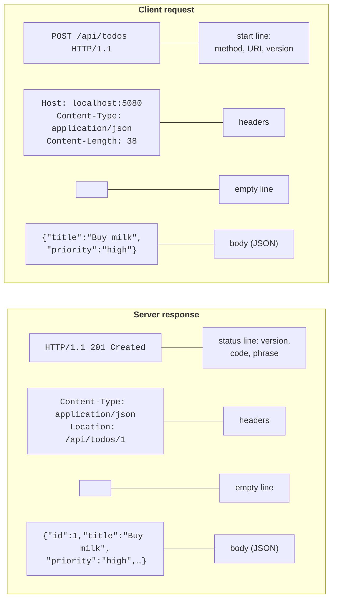
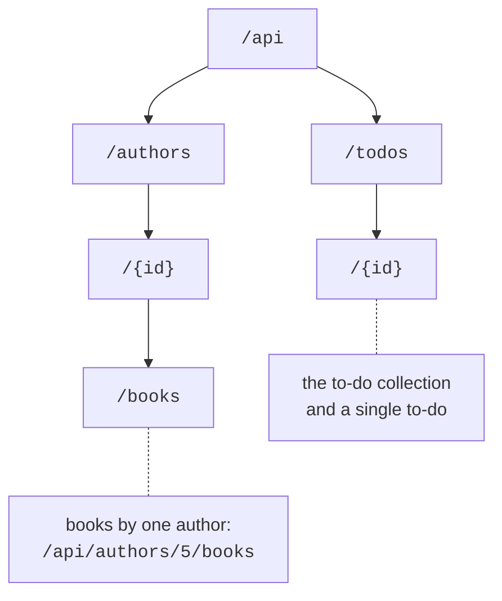
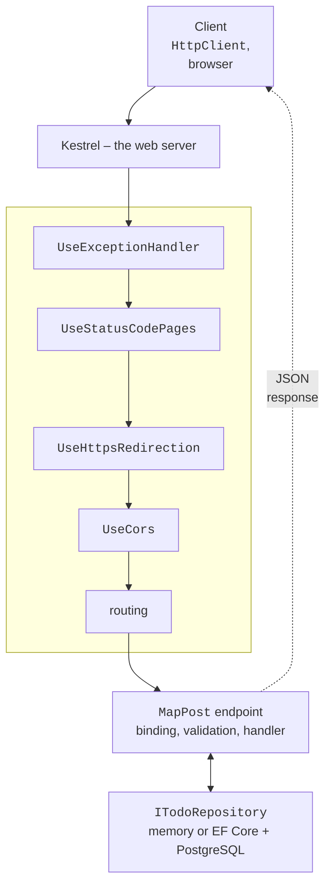

# HTTP, REST, JSON, and Minimal API

## The HTTP protocol

A **web service** is a program that provides data and operations to other programs over the network using the **HTTP** protocol (*Hypertext Transfer Protocol*). Unlike sockets (Topic 9), where the programmer invents the message format, HTTP already defines what a request and a response look like, so a client in C#, JavaScript, or Python works with the service in the same way. The modern semantics of HTTP are described in the RFC 9110 standard (<https://www.rfc-editor.org/rfc/rfc9110>).

The exchange is always started by the **client**: it sends a **request**, and the **server** returns one **response**. Both messages have the same structure (Fig. 10.1): a start line, headers, an empty line, and an optional **body**. The `Content-Type` header reports the body format (for web services, `application/json`), `Accept` says which format the client expects, and `Location` gives the address of a newly created resource.



Fig. 10.1. The structure of an HTTP request and response {.caption}

### HTTP methods

The **method** (or "verb") shows what the client wants to do with the resource (Table 10.1). A method is **safe** if it does not change data on the server, and **idempotent** if several identical requests produce the same result as one. The client can safely retry idempotent requests after a network failure; retrying a `POST` creates a duplicate.

Table 10.1. The main HTTP methods {.caption}

| **Method** | **Purpose** | **Safe** | **Idempotent** |
| --- | --- | --- | --- |
| `GET` | get a resource or a collection | yes | yes |
| `POST` | create a resource in a collection | no | no |
| `PUT` | replace a resource completely | no | yes |
| `PATCH` | change part of a resource | no | no |
| `DELETE` | delete a resource | no | yes |
| `HEAD` | like `GET`, but without a response body | yes | yes |

### Status codes

A response starts with a **status code** – a three-digit number the client uses to decide what to do next. The first digit sets the class: 2xx – success, 3xx – redirection, 4xx – client error (a bad request), 5xx – server error (Table 10.2).

Table 10.2. The HTTP status codes a web service returns most often {.caption}

| **Code** | **When it is returned** |
| --- | --- |
| `200 OK` | a successful `GET` or another operation with a response body |
| `201 Created` | a `POST` created a resource; the `Location` header contains its address |
| `204 No Content` | a successful `PUT`, `PATCH`, `DELETE` without a response body |
| `400 Bad Request` | invalid JSON or validation errors |
| `401 Unauthorized` | missing or invalid credentials (token) |
| `404 Not Found` | there is no resource at this address |
| `405 Method Not Allowed` | the route exists, but not for this method |
| `500 Internal Server Error` | an unhandled exception on the server |

## The REST architectural style

**REST** (*Representational State Transfer*) is an architectural style for web services proposed by Roy Fielding. It is not a separate protocol or library but a set of rules for using HTTP:

- data is presented as **resources** – to-dos, books, users; each resource has its own **URI**: `/api/todos/7`;
- the client receives not the server object itself but its **representation**, most often JSON;
- the action on a resource is defined by the HTTP method, not by a name in the address: `DELETE /api/todos/7`, not `POST /api/deleteTodo?id=7`;
- the server **does not store client state** between requests (*stateless*): each request contains everything needed, so the service is easy to scale across several servers.

Resources form a hierarchy (Fig. 10.2). A collection is denoted by a plural noun (`/api/todos`), an item by an identifier within the collection (`/api/todos/7`), and dependent resources by a nested collection (`/api/authors/5/books`). Filtering, sorting, and paging are set with the **query string**: `/api/todos?done=false&page=2`. Addresses are written in lowercase, words are separated with hyphens, and there is no trailing "/".



Fig. 10.2. A REST resource hierarchy {.caption}

A typical set of CRUD operations (*Create, Read, Update, Delete*) for a to-do collection is given in Table 10.3. This is exactly the service built next.

Table 10.3. Endpoints of the "To-do list" service {.caption}

| **Request** | **Action** | **Codes** |
| --- | --- | --- |
| `GET /api/todos` | list of to-dos (a page) | 200, 400 |
| `GET /api/todos/{id}` | a single to-do | 200, 404 |
| `POST /api/todos` | create a to-do | 201, 400 |
| `PUT /api/todos/{id}` | replace a to-do | 204, 400, 404 |
| `DELETE /api/todos/{id}` | delete a to-do | 204, 404 |

## The JSON format and `System.Text.Json`

**JSON** (*JavaScript Object Notation*) is a text data format with objects `{ }`, arrays `[ ]`, strings, numbers, `true`, `false`, and `null`. In .NET, converting objects to JSON (**serialization**) and back (**deserialization**) is handled by the `System.Text.Json` library built into the platform (<https://learn.microsoft.com/dotnet/standard/serialization/system-text-json/overview>).

Settings are defined by the `JsonSerializerOptions` class. By default, property names are written as in C# (`Title`), while web services usually use **camelCase** (`title`). The ready-made set of **web settings** `JsonSerializerOptions.Web` enables camelCase, case-insensitive name matching, and reading numbers from strings; ASP.NET Core and the `HttpClient` JSON methods use exactly these settings. An example:

```cs
using System.Text.Encodings.Web;
using System.Text.Json;
using System.Text.Json.Serialization;

Console.OutputEncoding = System.Text.Encoding.UTF8;

var book = new Book(7, "Leaves of Grass", Genre.Poetry, null);

Console.WriteLine(JsonSerializer.Serialize(book));
Console.WriteLine(JsonSerializer.Serialize(book,
    JsonSerializerOptions.Web));

var options = new JsonSerializerOptions(JsonSerializerOptions.Web)
{
    WriteIndented = true,
    DefaultIgnoreCondition = JsonIgnoreCondition.WhenWritingNull,
    Encoder = JavaScriptEncoder.UnsafeRelaxedJsonEscaping,
    Converters = { new JsonStringEnumConverter() }
};
Console.WriteLine(JsonSerializer.Serialize(book, options));

Book? copy = JsonSerializer.Deserialize<Book>(
    """{"ID":"7","title":"Leaves of Grass","genre":"Poetry"}""", options);
Console.WriteLine(copy);

enum Genre { Novel, Poetry }

record Book(int Id, string Title, Genre Genre,
    [property: JsonPropertyName("isbn")] string? Isbn13);
```

Output:

```
{"Id":7,"Title":"Leaves of Grass","Genre":1,"isbn":null}
{"id":7,"title":"Leaves of Grass","genre":1,"isbn":null}
{
  "id": 7,
  "title": "Leaves of Grass",
  "genre": "Poetry"
}
Book { Id = 7, Title = Leaves of Grass, Genre = Poetry, Isbn13 =  }
```

The `[JsonPropertyName]` attribute sets the JSON name regardless of the naming policy. Enumerations are written as numbers by default (`"genre":1`), while the `JsonStringEnumConverter` writes them as names, which are clearer to clients. By default `JsonSerializer` escapes non-ASCII characters such as Cyrillic (`\u041C…`) – this is valid but hard-to-read JSON; ASP.NET Core writes such characters without escaping. `WhenWritingNull` skips properties whose value is `null`. When reading, `"ID"` is matched case-insensitively, and the number `7` is read from the string `"7"`.

In a web service, the same settings are applied to all endpoints with the `ConfigureHttpJsonOptions` method (see the "To-do list" example).

## An ASP.NET Core Minimal API project

**ASP.NET Core** is a cross-platform .NET framework for web applications and web services. Service endpoints can be described in two ways: with **controller** classes or with **Minimal API** – calls to `MapGet`, `MapPost`, and so on, without controllers (<https://learn.microsoft.com/aspnet/core/fundamentals/minimal-apis>). Minimal API needs less code and starts faster; in .NET 10 it supports everything a typical service needs: route groups, validation, OpenAPI, filters.

### Creating the project

In Visual Studio 2026 (the *ASP.NET and web development* workload), choose *File → New → Project…*, select the *ASP.NET Core Web API* template, and in the *Additional information* window (Fig. 10.3) set *.NET 10.0 (Long Term Support)*, check *Configure for HTTPS* and *Enable OpenAPI support*, and **clear** the *Use controllers* check box. The same project is created by the command

```powershell
dotnet new webapi -n TodoApi
```


Fig. 10.3. Settings of a new *ASP.NET Core Web API* project {.caption}

The template creates a project file with the `Microsoft.NET.Sdk.Web` SDK and the `Microsoft.AspNetCore.OpenApi` package, and the files `Program.cs`, `appsettings.json`, `Properties/launchSettings.json`, and `TodoApi.http`. The whole service starts in `Program.cs` with two stages:

1. `WebApplication.CreateBuilder(args)` creates the **builder**: configuration, logging, and the dependency container `builder.Services` (Topic 6). Services are registered here: `AddOpenApi()`, `AddProblemDetails()`, your own classes;
2. `builder.Build()` creates the application `app`. Next you configure the middleware **pipeline** (`app.Use…`) and the endpoints (`app.Map…`), and `app.Run()` starts the server and blocks until it stops.

### Kestrel, launch profiles, and HTTPS

Requests are accepted by the built-in **Kestrel** web server (<https://learn.microsoft.com/aspnet/core/fundamentals/servers/kestrel>). Addresses and the environment are set in the `Properties/launchSettings.json` file: the `http` profile listens on, for example, `http://localhost:5080`, the `https` profile also on `https://localhost:7080` (the template chooses the ports at random), and the variable `ASPNETCORE_ENVIRONMENT=Development` enables the development environment (Topic 6). To start from the terminal, use `dotnet run --launch-profile https`. HTTPS on a developer machine requires a trusted certificate, created with the command `dotnet dev-certs https --trust` (<https://learn.microsoft.com/aspnet/core/security/enforcing-ssl>).

### The request pipeline

Each request goes through the **middleware pipeline**: a chain of components that are called in the order of `app.Use…` registration and can handle the request, change the response, or pass the request on (<https://learn.microsoft.com/aspnet/core/fundamentals/middleware/>). At the end, routing selects the endpoint that produces the response (Fig. 10.4). Order matters: the exception handler is registered first so that it catches errors from all subsequent components.



Fig. 10.4. Request processing in ASP.NET Core; the middleware is outlined with a dashed line {.caption}
