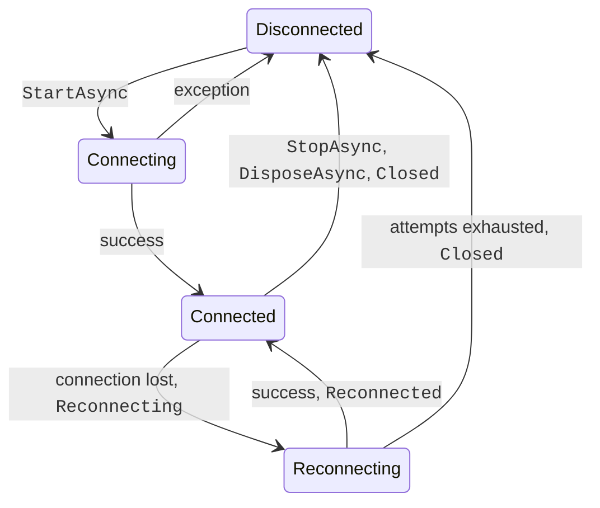
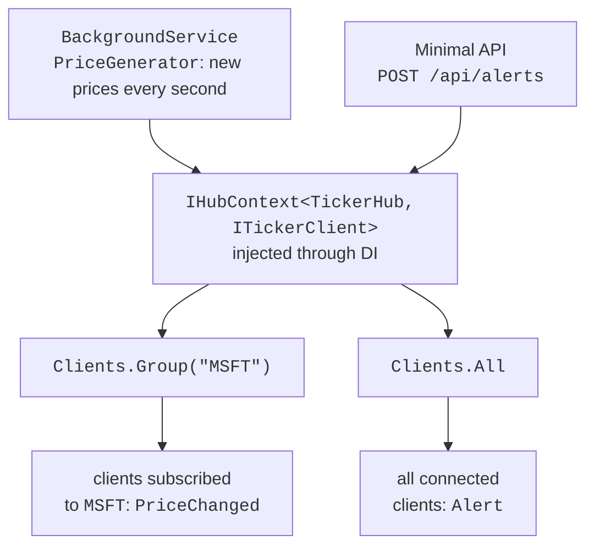

# Reconnection and sending messages

## The connection lifecycle and reconnection

A `HubConnection` is in one of the states of the `HubConnectionState` enumeration (Fig. 11.6); the `State` property returns the current state. Without extra configuration, a lost connection (a server restart, a network failure) moves the connection to the `Disconnected` state and raises the `Closed` event.



Fig. 11.6. `HubConnection` states with automatic reconnection {.caption}

The builder method `WithAutomaticReconnect()` enables automatic reconnection: after the connection is lost, the client moves to the `Reconnecting` state, raises the `Reconnecting` event, and makes attempts after 0, 2, 10, and 30 seconds. After a successful attempt the connection is `Connected` again and the `Reconnected` event is raised with a **new** `ConnectionId`; if all four attempts fail, it becomes `Disconnected` and the `Closed` event is raised. The intervals can be set with a `TimeSpan[]` array or your own implementation of the `IRetryPolicy` interface. Connection events have delegate types that return `Task`, so a synchronous handler returns `Task.CompletedTask`. To observe reconnection, `WithAutomaticReconnect()` and event handlers were added to the console chat client (the `Log` method prints a line with the time):

```cs
connection.Reconnecting += error =>
{
    Log($"Reconnecting: {error?.Message}");
    return Task.CompletedTask;
};
connection.Reconnected += connectionId =>
{
    Log($"Reconnected: {connectionId}");
    return Task.CompletedTask;
};
// The Closed handler is similar: Log($"Closed: {error?.Message}").
```

The server process was forcibly terminated (as in a crash) and started again a few seconds later. The client output:

```
Name: Olena
[11:14:47] Connected: PYtBvbvJqGtiklrTxycHnw
[11:14:50] Reconnecting: The remote party closed the WebSocket
connection without completing the close handshake.
[11:14:57] Reconnected: 99z3WZOoCGK7aHZY8mBnAw
I am back
[11:15:26] Olena: I am back
[11:15:28] Closed:
```

During reconnection SignalR does not keep messages sent in the meantime, and the new connection does not belong to any group. So in the `Reconnected` event the client calls methods such as `JoinRoom` again, and the UI disables the send buttons in the `Reconnecting` state. For short outages, ASP.NET Core 8+ also offers **stateful reconnect** (`WithStatefulReconnect()` on the client and `AllowStatefulReconnects` on the server), which buffers messages and resends them.

::: tip Important
`WithAutomaticReconnect` does not retry the **first** connection. If the server is not running, `StartAsync` immediately throws an `HttpRequestException` (*No connection could be made because the target machine actively refused it. (localhost:5110)*), and without `try`/`catch` the program crashes. The initial connection is wrapped in a loop with a delay, or the user is told that the server is unavailable.
:::

## Sending messages from outside a hub

Often a message is initiated not by a client but by the server itself: a timer, a background service, a REST endpoint, a change in the database. A hub cannot be created manually, so to send messages from other parts of the application you use the `IHubContext<THub>` service (for a strongly typed hub, `IHubContext<THub, T>`), obtained through dependency injection (<https://learn.microsoft.com/aspnet/core/signalr/hubcontext>). It has the `Clients` and `Groups` properties but no `Caller` or `Others`: outside a hub there is no connection that called the method.

A typical event source is a **background service** (Topic 6): a class derived from `BackgroundService` whose `ExecuteAsync` method runs for the whole lifetime of the server (<https://learn.microsoft.com/aspnet/core/fundamentals/host/hosted-services>). The service is registered with the `AddHostedService<T>()` method. A Minimal API endpoint (Topic 10) also receives `IHubContext` as a handler parameter (Fig. 11.7).



Fig. 11.7. Sending messages from a background service and a REST endpoint {.caption}

### Example: a stock ticker

The `TickerServer` server changes the sample prices of three stocks every second and sends them to the clients subscribed to the corresponding symbol (a group named after the symbol). The `POST /api/alerts` endpoint sends an announcement to all clients. The server's `Program.cs` file:

```cs
using Microsoft.AspNetCore.SignalR;

var builder = WebApplication.CreateBuilder(args);
builder.Services.AddSignalR();
builder.Services.AddHostedService<PriceGenerator>();

var app = builder.Build();
app.MapHub<TickerHub>("/hubs/ticker");
app.MapHub<JobHub>("/hubs/jobs");        // streaming

// A REST endpoint also sends messages to the hub's clients.
app.MapPost("/api/alerts", async (Alert alert,
    IHubContext<TickerHub, ITickerClient> hub) =>
{
    await hub.Clients.All.Alert(alert.Text);
    return Results.Accepted();
});

app.Run("http://localhost:5111");

public record Alert(string Text);
```

The `TickerHub.cs` file:

```cs
using Microsoft.AspNetCore.SignalR;

public record Quote(string Symbol, decimal Price, decimal Change);

public interface ITickerClient
{
    Task PriceChanged(Quote quote);
    Task Alert(string text);
}

public class TickerHub : Hub<ITickerClient>
{
    public static readonly string[] Symbols =
        ["MSFT", "AAPL", "NVDA"];

    // A group named after the symbol – all subscribers of that symbol.
    public async Task Subscribe(string symbol)
    {
        symbol = symbol.ToUpperInvariant();
        if (!Symbols.Contains(symbol))
        {
            throw new HubException($"Unknown symbol: {symbol}");
        }
        await Groups.AddToGroupAsync(Context.ConnectionId, symbol);
    }

    public Task Unsubscribe(string symbol) =>
        Groups.RemoveFromGroupAsync(Context.ConnectionId,
            symbol.ToUpperInvariant());
}
```

The `PriceGenerator.cs` background service uses a `PeriodicTimer`, which does not accumulate missed ticks and stops together with the server via the cancellation token:

```cs
using Microsoft.AspNetCore.SignalR;

// A background service that changes prices every second and sends them to groups.
public class PriceGenerator(
    IHubContext<TickerHub, ITickerClient> hub,
    ILogger<PriceGenerator> logger) : BackgroundService
{
    private readonly Dictionary<string, decimal> prices = new()
    {
        ["MSFT"] = 512.40m, ["AAPL"] = 231.75m, ["NVDA"] = 178.20m
    };

    protected override async Task ExecuteAsync(
        CancellationToken token)
    {
        logger.LogInformation("Price generator started");
        using var timer = new PeriodicTimer(TimeSpan.FromSeconds(1));
        while (await timer.WaitForNextTickAsync(token))
        {
            foreach (string symbol in TickerHub.Symbols)
            {
                double delta = Random.Shared.NextDouble() - 0.5;
                decimal change = Math.Round((decimal)delta * 3, 2);
                decimal price = prices[symbol] += change;
                await hub.Clients.Group(symbol)
                    .PriceChanged(new Quote(symbol, price, change));
            }
        }
    }
}
```

The console client takes the symbols from command-line arguments. The `Quote` object is deserialized into a record with the same properties declared in the client:

```cs
using Microsoft.AspNetCore.SignalR;
using Microsoft.AspNetCore.SignalR.Client;

string[] symbols = args.Length > 0 ? args : ["MSFT"];

await using HubConnection connection = new HubConnectionBuilder()
    .WithUrl("http://localhost:5111/hubs/ticker")
    .WithAutomaticReconnect()
    .Build();

connection.On<Quote>("PriceChanged", q => Console.WriteLine(
    $"{DateTime.Now:HH:mm:ss} {q.Symbol,-5}{q.Price,9:F2}" +
    $"{q.Change,8:+0.00;-0.00;0.00}"));
connection.On<string>("Alert", text =>
    Console.WriteLine($"ALERT: {text}"));

await connection.StartAsync();
foreach (string symbol in symbols)
{
    try
    {
        await connection.InvokeAsync("Subscribe", symbol);
        Console.WriteLine($"Subscribed: {symbol}");
    }
    catch (HubException ex)
    {
        Console.Error.WriteLine(ex.Message);
    }
}
Console.ReadLine();                  // Enter – exit

// The message type has the same properties as on the server.
record Quote(string Symbol, decimal Price, decimal Change);
```

The client was started with `dotnet run -- MSFT nvda IBM`, and a few seconds later an announcement was sent from another terminal: `curl.exe -X POST http://localhost:5111/api/alerts -H "Content-Type: application/json" -d '{"text":"Market closes in 5 minutes"}'` (response `202 Accepted`). The beginning of the client output:

```
Subscribed: MSFT
Subscribed: nvda
An unexpected error occurred invoking 'Subscribe' on the server.
HubException: Unknown symbol: IBM
11:18:48 MSFT    519.36   +1.46
11:18:48 NVDA    175.63   +0.73
11:18:49 MSFT    520.76   +1.40
11:18:49 NVDA    177.09   +1.46
11:18:50 MSFT    522.14   +1.38
11:18:50 NVDA    177.00   -0.09
ALERT: Market closes in 5 minutes
```

The client receives only the prices of the symbols it subscribed to; AAPL prices are sent to a group that has no members. The numbers are printed with US regional settings.
