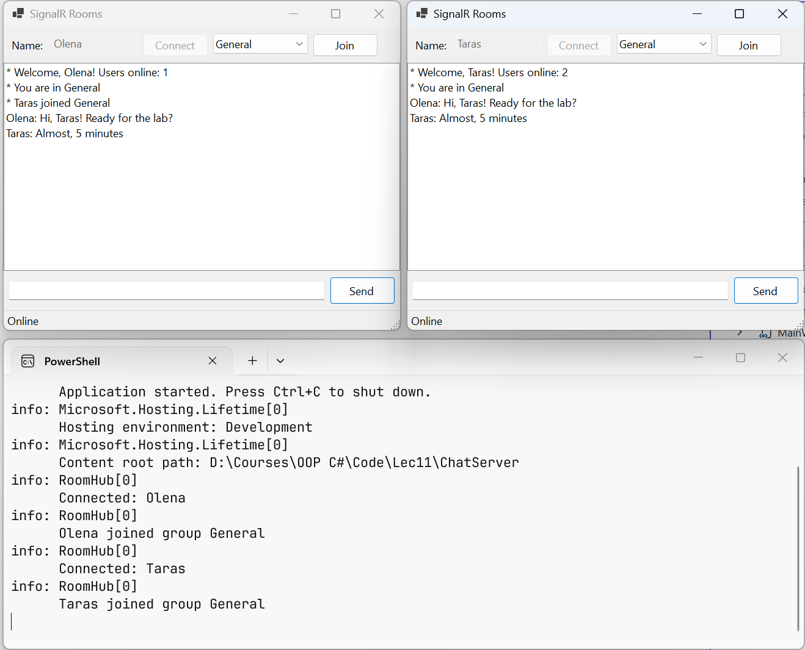

# Groups, typed hubs, and forms

## Connections, groups, and strongly typed hubs

### The connection context

The hub's `Context` property describes the connection that called the method: `ConnectionId` is a unique identifier, `User` is the authenticated user, and `Items` is a dictionary for connection data. The `Context.GetHttpContext()` method returns the HTTP context with the query string and headers.

The hub's `OnConnectedAsync` and `OnDisconnectedAsync(Exception? exception)` methods are called after a client connects and after it disconnects (the parameter contains an exception if the connection was broken by an error). They are overridden to maintain a list of participants, send a greeting, or notify others that someone left.

In the lecture examples, the user name is passed in the **query string** of the hub address: `/hubs/rooms?user=Olena`. This way the name is not verified: anyone can claim to be anyone. Real applications use **authentication** (cookies or JWT tokens), the `[Authorize]` attribute on the hub, and the `Context.User` property, and `Clients.User(id)` sends a message to all of a user's connections (<https://learn.microsoft.com/aspnet/core/signalr/authn-and-authz>).

### Groups

A **group** is a named set of connections: a chat room, a topic subscription, a table in a restaurant (<https://learn.microsoft.com/aspnet/core/signalr/groups>). The `Groups.AddToGroupAsync(connectionId, name)` and `Groups.RemoveFromGroupAsync(connectionId, name)` methods add and remove connections, and `Clients.Group(name)` sends a message to all members. Groups do not need to be created in advance: a group appears with its first member. The server does not keep membership after a disconnect and does not provide a list of groups or their members, so such data, if needed, is stored separately.

### A strongly typed hub

The client method name in `SendAsync("ReceiveMessage", …)` is a string, and the compiler will not catch a typo in it. A **strongly typed hub** `Hub<T>` uses an interface `T` with the client methods instead of strings: `Clients.All.ReceiveMessage(user, text)`. Each interface method returns `Task`, and the method name becomes the message name (the `Async` suffix is not dropped). The `SendAsync` method is not available in such a hub.

The client receives an exception thrown in a hub method with a generic message without details, so as not to expose the server's internal information. If the error text is intended for the client, throw a `HubException`: its message is passed to the client unchanged.

### Example: a chat with rooms

The `RoomHub` hub serves rooms: a user connects with a name in the query string, joins a room (a group), and writes messages only to its members. The hub is strongly typed with the `IRoomClient` interface. User information is stored by the `UserRegistry` singleton service based on a thread-safe `ConcurrentDictionary`, because hub methods for different clients run in parallel:

```cs
using System.Collections.Concurrent;

public class ChatUser(string name)
{
    public string Name { get; } = name;
    public string? Room { get; set; }
}

// Singleton: lives for the whole lifetime of the server, unlike the hub.
public class UserRegistry
{
    private readonly ConcurrentDictionary<string, ChatUser> users =
        new();

    public int Count => users.Count;

    public void Add(string connectionId, string name) =>
        users[connectionId] = new ChatUser(name);

    public ChatUser Get(string connectionId) => users[connectionId];

    public ChatUser? Remove(string connectionId) =>
        users.TryRemove(connectionId, out ChatUser? user)
            ? user : null;
}
```

The hub receives the registry and a logger (`ILogger`, Topic 6) through a primary constructor:

```cs
using Microsoft.AspNetCore.SignalR;

// Methods the server calls on the clients.
public interface IRoomClient
{
    Task ReceiveMessage(string user, string text);
    Task Notify(string text);
}

public class RoomHub(UserRegistry users, ILogger<RoomHub> logger)
    : Hub<IRoomClient>
{
    public override async Task OnConnectedAsync()
    {
        // The name is passed in the query string: /hubs/rooms?user=Olena
        string? name =
            Context.GetHttpContext()?.Request.Query["user"];
        name = string.IsNullOrWhiteSpace(name)
            ? "Guest" : name.Trim();
        users.Add(Context.ConnectionId, name);
        logger.LogInformation("Connected: {User}", name);
        await Clients.Caller.Notify(
            $"Welcome, {name}! Users online: {users.Count}");
    }

    public override async Task OnDisconnectedAsync(
        Exception? exception)
    {
        ChatUser? user = users.Remove(Context.ConnectionId);
        if (user?.Room is not null)
        {
            await Clients.Group(user.Room)
                .Notify($"{user.Name} left {user.Room}");
        }
        logger.LogInformation("Disconnected: {User}", user?.Name);
    }

    public async Task JoinRoom(string room)
    {
        ChatUser user = users.Get(Context.ConnectionId);
        if (user.Room == room)
        {
            return;
        }
        if (user.Room is not null)
        {
            await Groups.RemoveFromGroupAsync(Context.ConnectionId,
                user.Room);
            await Clients.Group(user.Room)
                .Notify($"{user.Name} left {user.Room}");
        }
        await Groups.AddToGroupAsync(Context.ConnectionId, room);
        user.Room = room;
        logger.LogInformation("{User} joined group {Room}",
            user.Name, room);
        await Clients.OthersInGroup(room)
            .Notify($"{user.Name} joined {room}");
    }

    public async Task SendToRoom(string text)
    {
        ChatUser user = users.Get(Context.ConnectionId);
        if (user.Room is null)
        {
            // The HubException text is passed to the client.
            throw new HubException("Join a room first");
        }
        await Clients.Group(user.Room)
            .ReceiveMessage(user.Name, text);
    }
}
```

The hub is hosted in the same `ChatServer` server: in `Program.cs`, `builder.Services.AddSingleton<UserRegistry>();` is added after `AddSignalR()`, and `app.MapHub<RoomHub>("/hubs/rooms");` after the first `MapHub`. `Clients.OthersInGroup` is used for the newcomer notification: the newcomer does not receive it.

## A Windows Forms client

A GUI application has an important peculiarity: SignalR calls `On` handlers and connection events (`Reconnecting`, `Reconnected`, `Closed`) on **thread pool threads**, not on the UI thread. Controls must not be changed from another thread (Topic 5), so code that updates the form is marshaled to the UI thread with the `Control.InvokeAsync` (.NET 9+) or `BeginInvoke` method (<https://learn.microsoft.com/dotnet/api/system.windows.forms.control.invokeasync>). In contrast, the button handler code after `await connection.StartAsync()` continues on the UI thread, because `await` returns to the form's synchronization context.

### Example: a client for the chat with rooms

The `MainForm` form (*SignalR Rooms*) contains at the top a `FlowLayoutPanel` with a *Name:* label, a `nameTextBox` field, a `connectButton` button (*Connect*), a `roomComboBox` room list (`DropDownStyle = DropDownList`), and a `joinButton` button (*Join*); in the center, a `messagesListBox` list (`Dock = Fill`); at the bottom, a `messageTextBox` field and a `sendButton` button (*Send*, the form's `AcceptButton`); and a `statusStrip` status bar with a `statusLabel` label. The form's `FormClosing` event is subscribed in the form designer. The form code:

```cs
using Microsoft.AspNetCore.SignalR;
using Microsoft.AspNetCore.SignalR.Client;

namespace RoomsClient;

public partial class MainForm : Form
{
    private const string HubUrl = "http://localhost:5110/hubs/rooms";
    private HubConnection? connection;
    private string? room;             // the room that was joined

    public MainForm()
    {
        InitializeComponent();
        roomComboBox.Items.AddRange("General", "Games", "Music");
        roomComboBox.SelectedIndex = 0;
        SetOnline(false, "Offline");
    }

    private async void connectButton_Click(object sender, EventArgs e)
    {
        string name = nameTextBox.Text.Trim();
        if (name.Length == 0)
        {
            MessageBox.Show("Enter your name", Text);
            return;
        }
        connection = new HubConnectionBuilder()
            .WithUrl($"{HubUrl}?user={Uri.EscapeDataString(name)}")
            .WithAutomaticReconnect()
            .Build();
        // On handlers and connection events are called on thread pool
        // threads, so form elements are changed through InvokeAsync.
        connection.On<string, string>("ReceiveMessage",
            (user, text) => AddLine($"{user}: {text}"));
        connection.On<string>("Notify", text => AddLine($"* {text}"));
        connection.Reconnecting += error =>
            InvokeAsync(() => SetOnline(false, "Reconnecting..."));
        connection.Reconnected += async connectionId =>
        {
            await InvokeAsync(() => SetOnline(true, "Online"));
            await JoinRoomAsync();    // a new connection has no groups
        };
        connection.Closed += error =>
            InvokeAsync(() => SetOnline(false, "Offline"));
        try
        {
            connectButton.Enabled = nameTextBox.Enabled = false;
            await connection.StartAsync();
            SetOnline(true, "Online");   // after await – the UI thread
        }
        catch (HttpRequestException ex)
        {
            connection = null;
            connectButton.Enabled = nameTextBox.Enabled = true;
            MessageBox.Show(ex.Message, Text);
        }
    }

    private async void joinButton_Click(object sender, EventArgs e)
    {
        room = (string)roomComboBox.SelectedItem!;
        await JoinRoomAsync();
        await AddLine($"* You are in {room}");
    }

    private async void sendButton_Click(object sender, EventArgs e)
    {
        if (connection is null || messageTextBox.Text.Length == 0)
        {
            return;
        }
        try
        {
            await connection.InvokeAsync("SendToRoom",
                messageTextBox.Text);
            messageTextBox.Clear();
        }
        catch (HubException ex)   // an error passed by the hub
        {
            MessageBox.Show(ex.Message, Text);
        }
    }

    private async void MainForm_FormClosing(object sender,
        FormClosingEventArgs e)
    {
        if (connection is null)
        {
            return;
        }
        e.Cancel = true;             // close the connection first
        HubConnection current = connection;
        connection = null;
        await current.DisposeAsync();
        Close();
    }

    private async Task JoinRoomAsync()
    {
        if (connection is not null && room is not null)
        {
            await connection.InvokeAsync("JoinRoom", room);
        }
    }

    private Task AddLine(string line) => InvokeAsync(() =>
    {
        messagesListBox.Items.Add(line);
        messagesListBox.TopIndex = messagesListBox.Items.Count - 1;
    });

    private void SetOnline(bool online, string status)
    {
        joinButton.Enabled = sendButton.Enabled = online;
        statusLabel.Text = status;
    }
}
```

The `On` handlers return the `Task` from `InvokeAsync`: the code that changes the list runs on the UI thread, and the handler completes after the form is updated. When the form is closing, the `FormClosing` handler first cancels the closing, closes the connection, and only then closes the form again: otherwise the `Closed` event would try to update a form that has already been destroyed.

After the server and two clients are started, Olena and Taras join the *General* room and exchange messages (Fig. 11.5). The first client's list:

```
* Welcome, Olena! Users online: 1
* You are in General
* Taras joined General
Olena: Hi, Taras! Ready for the lab?
Taras: Almost, 5 minutes
```

After Taras closes his window, the line `* Taras left General` appears in Olena's list. An attempt to send a message before choosing a room shows a `MessageBox` with the text *Join a room first*, preceded by a standard prefix the client adds with the `SendToRoom` method name. The server log contains entries of the `RoomHub[0]` category with the text `Connected: Olena`, `Connected: Taras`, `Olena joined group General`, `Taras joined group General`, and `Disconnected: Taras`.



Fig. 11.5. Two Windows Forms clients in the *General* room and the server log {.caption}
