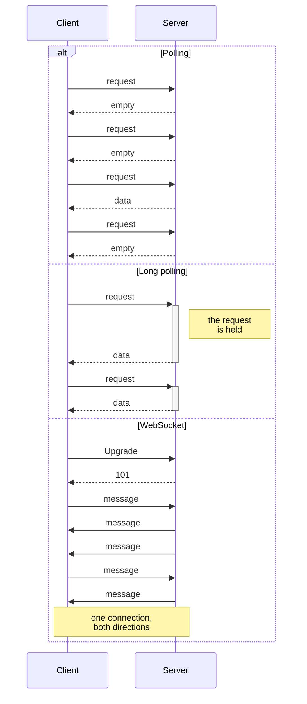
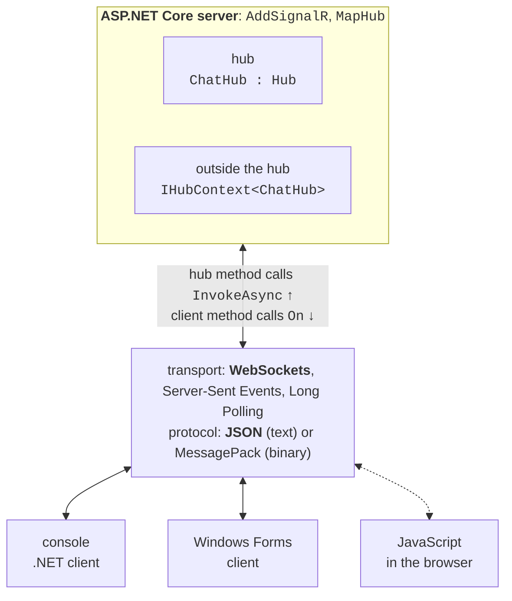
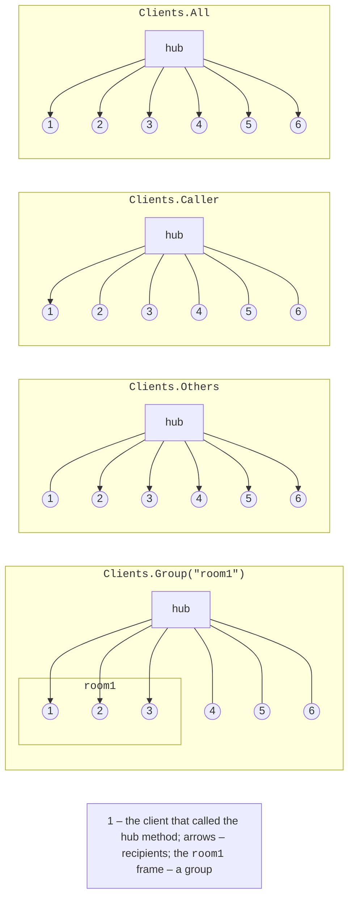
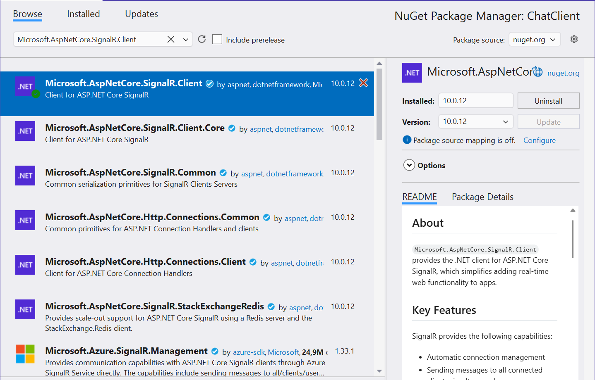

# Architecture, the hub, and the .NET client

## Real-time data exchange

A REST web service (Topic 10) works on a "request – response" basis: the client sends an HTTP request, the server responds, and the exchange ends. The server cannot notify the client of an event on its own: a new chat message, a price change, an order being ready. **Real-time** applications deliver such events as soon as they happen. There are several ways to achieve this (Fig. 11.1):

- **polling** – the client periodically (for example, every second) sends a request "is there anything new?". The approach is simple, but most responses are empty, and the delay equals the polling period;
- **long polling** – the server does not respond immediately but holds the request until data appears or a timeout expires; after the response the client immediately sends a new request. The delay is small, but each message costs a separate HTTP request;
- **Server-Sent Events** (SSE) – the client opens one HTTP request, and the server sends text events in its response without closing the connection (<https://html.spec.whatwg.org/multipage/server-sent-events.html>). The channel is one-way: data from the client is sent with ordinary requests;
- **WebSocket** – the client sends an HTTP request with the `Upgrade: websocket` header, the server replies with code `101 Switching Protocols`, and the same TCP connection becomes a two-way message channel (<https://www.rfc-editor.org/rfc/rfc6455>).



Fig. 11.1. Polling, long polling, and WebSocket {.caption}

Sockets (Topic 9) also provide a two-way channel, but the programmer defines the message format, the boundaries between messages, reconnection, and client tracking. WebSocket works over the standard HTTP and HTTPS ports, so it passes through proxy servers and firewalls, but the message format and connection management are still left to the programmer.

## ASP.NET Core SignalR architecture

**ASP.NET Core SignalR** is an open-source library that adds real-time features to an application: the server can call methods on connected clients at any moment, and clients can call methods on the server. This mechanism is a **remote procedure call** (RPC) (<https://learn.microsoft.com/aspnet/core/signalr/introduction>). SignalR itself manages connections, sends messages to all clients, individual clients, or groups, and restores the connection after a failure.

The central concept of SignalR is the **hub**: a server class whose public methods clients call (Fig. 11.2). The client registers handlers by method name, and the server sends messages with a method name and arguments. The server side of SignalR is part of ASP.NET Core, so no separate server package is needed. Client libraries exist for .NET, JavaScript/TypeScript, Java, and Swift (<https://learn.microsoft.com/aspnet/core/signalr/supported-platforms>).



Fig. 11.2. Architecture of an ASP.NET Core SignalR application {.caption}

### Transports and negotiation

SignalR supports three **transports** in order of decreasing priority: **WebSockets**, **Server-Sent Events**, and **Long Polling**. The transport is chosen automatically: first the client sends a **negotiation** POST request to `<hub>/negotiate`, the server returns a connection ID and a list of available transports, and the client tries them in turn. If WebSocket is unavailable (an old proxy server, a network restriction), the connection still works over SSE or long polling, and the application code does not change. For example, the server of the "Group chat" example responds to the request `POST /hubs/chat/negotiate?negotiateVersion=1` with a JSON object with the fields `connectionId`, `connectionToken`, and `availableTransports`, which lists `WebSockets` (formats `Text`, `Binary`), `ServerSentEvents` (`Text`), and `LongPolling` (`Text`, `Binary`).

### Hub protocols

Messages between the client and the hub are encoded with a **hub protocol**. By default the text **JSON** protocol is used: each message is a JSON object with a type, a method name, and arguments, terminated by the special separator character `0x1E` (<https://github.com/dotnet/aspnetcore/blob/main/src/SignalR/docs/specs/HubProtocol.md>). The binary **MessagePack** protocol produces smaller messages (the "MessagePack, the JavaScript client, scaling" section). The server supports connections with both protocols at the same time.

Every 15 s the server sends the client a service *ping* message and considers the client disconnected if nothing has arrived from it for 30 s (<https://learn.microsoft.com/aspnet/core/signalr/configuration>).

## The server: a hub and its methods

An empty ASP.NET Core web project is enough for a SignalR server (`dotnet new web` or the *ASP.NET Core Empty* template in Visual Studio 2026). Setup takes two lines in `Program.cs` (<https://learn.microsoft.com/aspnet/core/signalr/hubs>):

- `builder.Services.AddSignalR()` registers the SignalR services in the dependency container (Topic 6);
- `app.MapHub<ChatHub>("/hubs/chat")` binds the hub to the address clients connect to.

A hub is a class derived from `Hub` (the `Microsoft.AspNetCore.SignalR` namespace). A client can call each public method of the hub by name. A method can be asynchronous, accept parameters of any serializable types, and return a result. The hub's `Clients` property determines whom to send a message to, and the `SendAsync(name, arguments…)` method calls the method with that name on the clients. The server of the "Group chat" example fits entirely in the `Program.cs` file:

```cs
using Microsoft.AspNetCore.SignalR;

var builder = WebApplication.CreateBuilder(args);
builder.Services.AddSignalR();

var app = builder.Build();
app.MapHub<ChatHub>("/hubs/chat");
app.Run("http://localhost:5110");

public class ChatHub : Hub
{
    // A hub method that clients call.
    public async Task SendMessage(string user, string text)
    {
        // Call the ReceiveMessage method on all clients.
        await Clients.All.SendAsync("ReceiveMessage", user, text);
    }
}
```

The address `http://localhost:5110` is set in `app.Run` so that the server and clients of the examples use the same port regardless of the `launchSettings.json` file.

The recipients of a message are chosen with the properties and methods of `Clients` (Table 11.1, Fig. 11.3). Each of them returns an object with a `SendAsync` method.

Table 11.1. Hub message recipients {.caption}

| **`Clients` member** | **Who receives the message** |
| --- | --- |
| `All` | all connected clients |
| `Caller` | the client that called the hub method |
| `Others` | everyone except the caller |
| `Client(id)`, `Clients(ids)` | the connection with ID `id` or a list of connections |
| `Group(name)`, `Groups(names)` | all connections of a group or of several groups |
| `OthersInGroup(name)` | the group, except the caller |
| `User(userId)`, `Users(ids)` | all connections of an authenticated user |



Fig. 11.3. Message recipients for different `Clients` members {.caption}

::: tip Important
A hub is a **short-lived** (*transient*) object: for each method call SignalR creates a new hub instance and disposes of it after the method finishes. So state (a list of users, message history) must not be stored in hub fields – a separate *singleton* service is registered for it. For the same reason, asynchronous `SendAsync` calls inside a hub are always awaited with `await`.
:::

## The .NET client

The client library for .NET is in the NuGet package `Microsoft.AspNetCore.SignalR.Client` (version 10.0.12 as of September 2026). The package works for console applications, Windows Forms, WPF, and .NET MAUI (<https://www.nuget.org/packages/Microsoft.AspNetCore.SignalR.Client>). It is added in Visual Studio (project context menu → *Manage NuGet Packages…* → the *Browse* tab, Fig. 11.4) or with a command in the project folder:

```powershell
dotnet add package Microsoft.AspNetCore.SignalR.Client
```



Fig. 11.4. Installing the `Microsoft.AspNetCore.SignalR.Client` package {.caption}

A connection to a hub is described by the `HubConnection` class, which is created by the `HubConnectionBuilder`: `WithUrl(address)` sets the hub address, `WithAutomaticReconnect()` enables reconnection, and `Build()` creates the object. The connection is opened with the `StartAsync` method and closed with `StopAsync` or `DisposeAsync` (<https://learn.microsoft.com/aspnet/core/signalr/dotnet-client>).

The client registers the methods the server calls with the `On` method **before** calling `StartAsync`: `connection.On<string, string>("ReceiveMessage", (user, text) => …)`. The type parameters set the argument types; the name must exactly match the name in `SendAsync` on the server. There are two methods for calling a hub method:

- `InvokeAsync("SendMessage", arguments…)` – completes when the hub method has **executed**; it returns the result (`InvokeAsync<T>`), and an exception on the server becomes an exception in the client;
- `SendAsync("SendMessage", arguments…)` – completes as soon as the message has been **sent**, without waiting for the method to execute on the server, and does not report hub errors.

### Example: a group chat

The console client asks for a user name, connects to the `ChatHub` hub, and sends each line you type. Messages from all participants (including your own, because the server uses `Clients.All`) are printed with the time they were received:

```cs
using Microsoft.AspNetCore.SignalR.Client;

Console.Write("Name: ");
string name = Console.ReadLine() ?? "Guest";

await using HubConnection connection = new HubConnectionBuilder()
    .WithUrl("http://localhost:5110/hubs/chat")
    .Build();

// The ReceiveMessage client method that the server calls.
connection.On<string, string>("ReceiveMessage", (user, text) =>
    Console.WriteLine($"[{DateTime.Now:HH:mm:ss}] {user}: {text}"));

await connection.StartAsync();
Console.WriteLine($"Connected: {connection.ConnectionId}");
Console.WriteLine("Type messages, an empty line to exit.");

while (Console.ReadLine() is { Length: > 0 } text)
{
    // Call the SendMessage hub method on the server.
    await connection.InvokeAsync("SendMessage", name, text);
}
```

The server and clients are started in separate terminal windows: `dotnet run` in the `ChatServer` folder, then `dotnet run` in the `ChatClient` folder twice. The window of the first client (Olena) after a conversation with Taras:

```
Name: Olena
Connected: P-eELqGYp-ZqdRSnO_po8Q
Type messages, an empty line to exit.
Hello, everyone!
[11:13:39] Olena: Hello, everyone!
[11:13:42] Taras: Hi, Olena
See you at 15:00
[11:13:45] Olena: See you at 15:00
```

The lines without a time were typed by the user; the rest were printed by the program. The second client shows the same three messages with the same times. Each client gets its own connection ID (`ConnectionId`). An empty line ends the loop, and `await using` closes the connection.
