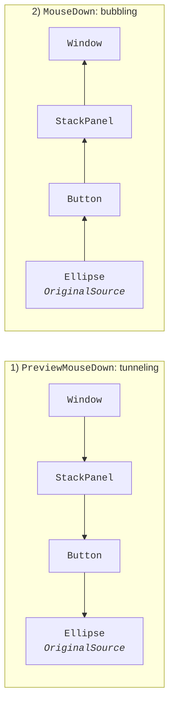
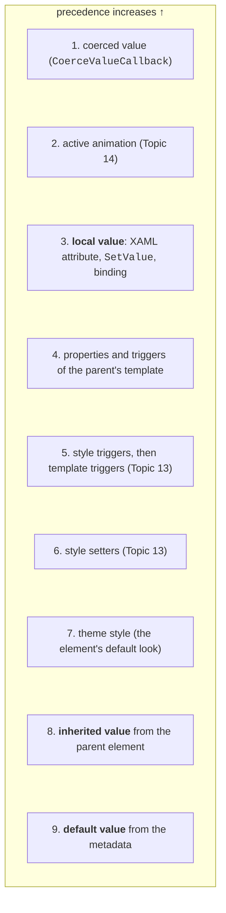

# Events and dependency properties

## Routed events

### Routing strategies

In Windows Forms an event is raised only on the element the user is working with. In WPF a button can contain a circle and text, and a click on the circle must count as a click on the button. That is why most WPF events are **routed events**: they travel through the element tree and invoke handlers on several elements (<https://learn.microsoft.com/dotnet/desktop/wpf/events/routed-events-overview>). There are three strategies:

- **bubbling**: from the source element up to the root (`Click`, `MouseDown`, `KeyDown`, `TextChanged`);
- **tunneling**: from the root down to the source; such events have the `Preview` prefix (`PreviewMouseDown`, `PreviewKeyDown`, `PreviewTextInput`);
- **direct**: only on the element itself, as in Windows Forms (`MouseEnter`, `MouseLeave`).

Input events come in pairs (Fig. 12.8): a single user action first raises a tunneling event, which travels the whole route down, and then a bubbling event with **the same event data**.



Fig. 12.8. Tunneling and bubbling of mouse events {.caption}

A routed event handler receives `sender` – the element the handler is **attached** to – and a `RoutedEventArgs` descendant with the properties:

- `Source` – the element that raised the event (taking the logical tree into account);
- `OriginalSource` – the deepest element of the visual tree where the event occurred (for example, a `TextBlock` inside a button);
- `Handled` – the "handled" mark: handlers further along the route that were attached the usual way are no longer called;
- `RoutedEvent` – the event identifier.

A handler for an event of child elements is attached to the parent element with a qualified event name: `<StackPanel Button.Click="Buttons_Click">`. In code you use `element.AddHandler(ButtonBase.ClickEvent, handler)`. The third argument `handledEventsToo: true` calls the handler even for an event that has already been handled.

Some elements mark events as handled themselves. A `Button` handles `MouseLeftButtonDown` and raises `Click` instead, so a `MouseDown` handler attached in XAML to a panel containing the button does not fire after a click on the button. The solution: handle `Click`, the tunneling `PreviewMouseDown`, or attach the handler through `AddHandler` with `handledEventsToo: true` (<https://learn.microsoft.com/dotnet/desktop/wpf/events/preview-events>).

Tunneling events are used for **filtering**: the parent element sees the input before the child and can cancel it. For example, a `PreviewTextInput` handler of an input field that sets `e.Handled = true` for non-digit characters does not let them into the `TextBox`.

### Example: a calculator

The calculator has 16 buttons in a `UniformGrid` and **one** `Keys_Click` handler attached to the panel: the `Click` event of each button bubbles up to the `UniformGrid`, and `e.Source` tells which button was pressed. An implicit style in the panel's resources (covered in detail in Topic 13) sets the same font, margin, and `Focusable="False"` for all buttons, so that the focus does not stay on a button. `MainWindow.xaml`:

```xml
<Window x:Class="Calculator.MainWindow"
    xmlns="http://schemas.microsoft.com/winfx/2006/xaml/presentation"
    xmlns:x="http://schemas.microsoft.com/winfx/2006/xaml"
    Title="Calculator" Width="280" Height="360">
    <DockPanel Margin="6">
        <TextBox x:Name="display" DockPanel.Dock="Top" Text="0"
                 IsReadOnly="True" Focusable="False" FontSize="28"
                 TextAlignment="Right" Margin="2,2,2,6"/>
        <UniformGrid x:Name="keys" Rows="4" Columns="4"
                     ButtonBase.Click="Keys_Click">
            <UniformGrid.Resources>
                <Style TargetType="Button">
                    <Setter Property="FontSize" Value="20"/>
                    <Setter Property="Margin" Value="2"/>
                    <Setter Property="Focusable" Value="False"/>
                </Style>
            </UniformGrid.Resources>
            <Button Content="7"/> <Button Content="8"/>
            <Button Content="9"/> <Button Content="÷"/>
            <Button Content="4"/> <Button Content="5"/>
            <Button Content="6"/> <Button Content="×"/>
            <Button Content="1"/> <Button Content="2"/>
            <Button Content="3"/> <Button Content="−"/>
            <Button Content="C"/> <Button Content="0"/>
            <Button Content="="/> <Button Content="+"/>
        </UniformGrid>
    </DockPanel>
</Window>
```

`MainWindow.xaml.cs`:

```cs
using System.Windows;
using System.Windows.Controls;

namespace Calculator;

public partial class MainWindow : Window
{
    private decimal left;          // the first operand
    private string operation = ""; // the pending operation
    private bool startNew = true;  // the next digit starts a new number

    public MainWindow()
    {
        InitializeComponent();
    }

    // The Click of each button "bubbles" up to the UniformGrid.
    private void Keys_Click(object sender, RoutedEventArgs e)
    {
        if (e.Source is not Button button)
        {
            return;
        }
        string key = (string)button.Content;
        switch (key)
        {
            case "C":
                left = 0;
                operation = "";
                display.Text = "0";
                startNew = true;
                break;
            case "+" or "−" or "×" or "÷" or "=":
                Calculate();
                operation = key == "=" ? "" : key;
                startNew = true;
                break;
            default:                          // a digit
                display.Text = startNew || display.Text == "0"
                    ? key : display.Text + key;
                startNew = false;
                break;
        }
        e.Handled = true;
    }

    private void Calculate()
    {
        if (!decimal.TryParse(display.Text, out decimal right))
        {
            return;                           // an error is on screen
        }
        try
        {
            left = operation switch
            {
                "+" => left + right,
                "−" => left - right,
                "×" => left * right,
                "÷" => left / right,
                _ => right
            };
            display.Text = Math.Round(left, 10)
                .ToString("0.##########");
        }
        catch (Exception ex) when (ex is DivideByZeroException
            or OverflowException)
        {
            display.Text = "Error";
            left = 0;
            operation = "";
        }
    }
}
```

The calculator performs operations sequentially, without operator precedence. The sequence `12 + 30 =` shows `42`, then `× 2 =` shows `84`, `C 1 ÷ 3 =` shows `0.3333333333`, `C 7 ÷ 0 =` shows `Error`, and `C 2 + 3 × 4 =` shows `20`.

## Dependency properties

### Why dependency properties are needed

The value of a button's `Background` property can come from a XAML attribute, a style, an animation, data binding, or the Windows theme, and a window's `FontSize` is **inherited** by all nested elements. An ordinary C# property with a backing field cannot do this, so most WPF element properties are **dependency properties** (<https://learn.microsoft.com/dotnet/desktop/wpf/properties/dependency-properties-overview>).

A dependency property is registered by a class derived from `DependencyObject` with the static method `DependencyProperty.Register`. The value is stored by the property system, and the ordinary C# property only calls `GetValue` and `SetValue`. During registration, the **metadata** specifies the default value, flags (`AffectsMeasure`, `Inherits`, `BindsTwoWayByDefault`), and callback methods: `PropertyChangedCallback` after a change and `CoerceValueCallback` for forcibly constraining the value.

If a value is set in several ways, the source with the highest precedence wins (Fig. 12.9, <https://learn.microsoft.com/dotnet/desktop/wpf/properties/dependency-property-value-precedence>). A local value (an attribute in XAML, an assignment in code) overrides a style, so a button with `Background="Red"` does not change its color even from a style trigger. The `ClearValue` method removes only the local value, and then the next source takes effect. The `DependencyPropertyHelper.GetValueSource` method reports where the current value came from.



Fig. 12.9. Precedence of dependency property value sources (simplified) {.caption}

An **attached property** is a dependency property registered by one class (`DependencyProperty.RegisterAttached`) whose value is stored on any other element. This is how a panel finds out where to place a child element. In XAML you write `Grid.Row="1"` or `Canvas.Left="40"`, and in code you call the static `Set…` and `Get…` methods: `Canvas.SetLeft(marker, 40)`, `Grid.SetRow(folderList, 1)`, `Grid.GetRow(folderList)`.

### Example: a star rating

A custom **user control** is made up of other elements: it is created with the *Project → Add User Control (WPF)…* command. The `StarRatingControl` element shows five stars, has a `Value` dependency property (0–5), and changes it after a click on a star. The stars are `TextBlock` elements created in the constructor; they inherit `FontSize` from the element itself. `StarRatingControl.xaml`:

```xml
<UserControl x:Class="StarRating.StarRatingControl"
    xmlns="http://schemas.microsoft.com/winfx/2006/xaml/presentation"
    xmlns:x="http://schemas.microsoft.com/winfx/2006/xaml">
    <StackPanel x:Name="starsPanel" Orientation="Horizontal"
                Background="Transparent" Cursor="Hand"
                MouseDown="Stars_MouseDown"/>
</UserControl>
```

`StarRatingControl.xaml.cs`:

```cs
using System.Windows;
using System.Windows.Controls;
using System.Windows.Input;

namespace StarRating;

public partial class StarRatingControl : UserControl
{
    public const int MaxStars = 5;

    // Registering the Value dependency property.
    public static readonly DependencyProperty ValueProperty =
        DependencyProperty.Register(
            nameof(Value), typeof(int), typeof(StarRatingControl),
            new FrameworkPropertyMetadata(
                0,                              // default value
                FrameworkPropertyMetadataOptions.BindsTwoWayByDefault,
                OnValueChanged,
                CoerceValue));

    // An ordinary wrapper property.
    public int Value
    {
        get => (int)GetValue(ValueProperty);
        set => SetValue(ValueProperty, value);
    }

    public StarRatingControl()
    {
        InitializeComponent();
        for (int i = 1; i <= MaxStars; i++)
        {
            starsPanel.Children.Add(new TextBlock { Tag = i });
        }
        UpdateStars();
    }

    private static object CoerceValue(DependencyObject d,
        object baseValue) =>
        Math.Clamp((int)baseValue, 0, MaxStars);

    private static void OnValueChanged(DependencyObject d,
        DependencyPropertyChangedEventArgs e) =>
        ((StarRatingControl)d).UpdateStars();

    private void UpdateStars()
    {
        foreach (TextBlock star in starsPanel.Children)
        {
            star.Text = (int)star.Tag <= Value ? "★" : "☆";
        }
    }

    // The MouseDown event bubbles from a star (TextBlock) to the panel.
    private void Stars_MouseDown(object sender,
        MouseButtonEventArgs e)
    {
        if (e.ChangedButton == MouseButton.Left
            && e.OriginalSource is TextBlock { Tag: int number })
        {
            Value = number;
            e.Handled = true;
        }
    }
}
```

The name of the identifier field must end with `Property`, and the wrapper must contain no other logic: XAML and data binding call `GetValue` and `SetValue` directly, bypassing the wrapper. That is why the reaction to a change is written in the `PropertyChangedCallback` and validation in the `CoerceValueCallback`. The panel's transparent background (`Transparent`) is needed so that the mouse also "hits" the gaps between the stars.

The main window uses the element through the `local` namespace and binds a slider and a label to its `Value` property. This is **element-to-element binding** (`ElementName`): when one property changes, WPF updates the other without code (covered in detail in Topic 13):

```xml
<Window x:Class="StarRating.MainWindow"
    xmlns="http://schemas.microsoft.com/winfx/2006/xaml/presentation"
    xmlns:x="http://schemas.microsoft.com/winfx/2006/xaml"
    xmlns:local="clr-namespace:StarRating"
    Title="Book Rating" Width="300" Height="250">
    <StackPanel Margin="12">
        <TextBlock Text="Clean Code" FontWeight="Bold"/>
        <local:StarRatingControl x:Name="bookRating" Value="4"
                                 FontSize="32"/>
        <Slider Maximum="5" TickPlacement="BottomRight"
                IsSnapToTickEnabled="True" Margin="0,6"
                Value="{Binding Value, ElementName=bookRating}"/>
        <TextBlock Text="{Binding Value, ElementName=bookRating,
                          StringFormat='Rating: {0} of 5'}"/>
        <Button Content="_Clear rating" Margin="0,8"
                HorizontalAlignment="Left" Padding="8,2"
                Click="Clear_Click"/>
    </StackPanel>
</Window>
```

The button handler calls the `ClearValue` method with the argument `StarRatingControl.ValueProperty`, that is, it removes the local value.

After startup you see `★★★★☆` and the label `Rating: 4 of 5` (the value source is `Local`). Moving the slider to 2 changes the stars and the label to `Rating: 2 of 5`, and clicking the fifth star moves the slider to 5. The assignment `bookRating.Value = 9` gives 5 thanks to `CoerceValue`. The *Clear rating* button shows `☆☆☆☆☆` and `Rating: 0 of 5`: the value from the metadata takes effect (source `Default`).
