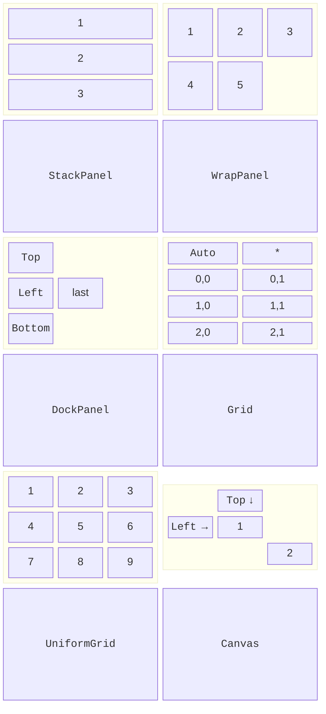
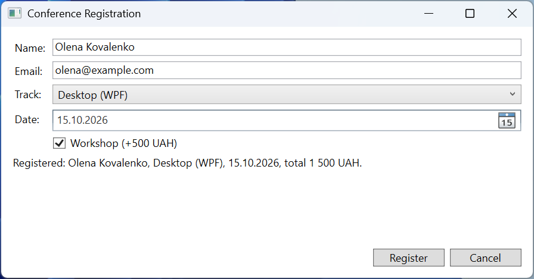

# Layout and controls

## The layout system

### Measuring and arranging

WPF lays out elements in two passes (<https://learn.microsoft.com/dotnet/desktop/wpf/advanced/layout>). During **measuring** (*Measure*), the parent element asks each child how much space it needs (`DesiredSize`). During **arranging** (*Arrange*), it allocates a rectangle to each child (a **layout slot**). That is why a button by default has the size of its text, and after the interface is translated or the font is enlarged, the sizes are recalculated automatically.

The position of an element within its slot is set by properties of the `FrameworkElement` class:

- `Margin` – the outer spacing: one number for all sides, `"10,5"` (left-right, top-bottom), or `"5,0,0,0"` (left, top, right, bottom);
- `Padding` – the inner spacing from the border to the content (in `Control`, `Border`, `TextBlock`);
- `HorizontalAlignment` and `VerticalAlignment` – `Left`, `Center`, `Right`, `Top`, `Bottom`, or `Stretch` (stretch across the whole slot, the default);
- `Width`, `Height` – an explicit size (the default is `Auto`, that is, `double.NaN`), `MinWidth`, `MaxWidth` – limits; the actual size after layout is `ActualWidth`, `ActualHeight`.

A window with `SizeToContent="WidthAndHeight"` fits its size to the content, which is convenient for dialogs.

### Layout panels

A **panel** is an element derived from `Panel` that arranges its `Children` collection according to its own rule (Fig. 12.6, <https://learn.microsoft.com/dotnet/desktop/wpf/controls/panels-overview>):

- `StackPanel` – elements one after another vertically or horizontally (`Orientation`);
- `WrapPanel` – in a row, wrapping when there is not enough space (cards, thumbnails);
- `DockPanel` – along the edges: `DockPanel.Dock="Top"`, `Bottom`, `Left`, `Right`; the last element fills the remaining space (`LastChildFill="True"`). The order of elements matters: first the menu, toolbar, and status bar, and the main content last;
- `Grid` – a table of rows and columns, the main panel for forms;
- `UniformGrid` – a table with equal cells (`Rows`, `Columns`): a keypad, a game board;
- `Canvas` – absolute coordinates `Canvas.Left`, `Canvas.Top` for graphics and diagrams.



Fig. 12.6. WPF layout panels {.caption}

Panels are nested inside one another: a `DockPanel` for the window, a `Grid` for a form, a `StackPanel` for buttons. Besides panels, `Border` (a border and background around a single element), `ScrollViewer` (scrolling content larger than the window), and `Viewbox` (scales content to the available size) are often used.

### The `Grid` panel

`Grid` rows are described with the `RowDefinitions` collection and columns with `ColumnDefinitions`. The height of a row (width of a column) is set in three ways:

- `Auto` – by the largest element in the row;
- a number – a fixed size in independent units;
- `*` – a share of the remaining space: columns `2*` and `3*` divide the remainder in the ratio 2 : 3.

An element is placed with the attached properties `Grid.Row`, `Grid.Column` (numbered from 0, default 0) and `Grid.RowSpan`, `Grid.ColumnSpan`. The classic definition syntax uses the property elements `<Grid.ColumnDefinitions>` with nested `<ColumnDefinition Width="Auto"/>`; .NET 10 introduced a short form with a single attribute `ColumnDefinitions="Auto, *"` (<https://learn.microsoft.com/dotnet/desktop/wpf/whats-new/net100>). A `GridSplitter` lets the user change column widths with the mouse; it is placed in a separate `Auto` column:

```xml
<Grid ColumnDefinitions="2*, Auto, 3*" RowDefinitions="Auto, *">
    <TextBlock Text="Folders" Margin="4"/>
    <TextBlock Grid.Column="2" Text="Preview" Margin="4"/>
    <ListBox x:Name="folderList" Grid.Row="1"/>
    <GridSplitter Grid.Row="1" Grid.Column="1" Width="5"
                  HorizontalAlignment="Stretch"/>
    <Image Grid.Row="1" Grid.Column="2" Stretch="Uniform"/>
</Grid>
```

For a window 484 units wide, the columns get 192, 5, and 287 units: the splitter takes 5, and the remainder is divided in the ratio 2 : 3.

### Example: participant registration

The conference registration window contains name and email fields, a track drop-down list, a date, and a workshop check box. The labels occupy an `Auto` column and the fields a `*` column, so the fields stretch with the window; the message row has height `*` and takes the free space, and the buttons are pinned to the right edge. The `_` character in the labels' `Content` sets an access key, and the `Target` property passes focus to the field: **Alt+E** moves the cursor to the email field. `IsDefault="True"` presses the *Register* button with the **Enter** key. `MainWindow.xaml`:

```xml
<Window x:Class="Registration.MainWindow"
    xmlns="http://schemas.microsoft.com/winfx/2006/xaml/presentation"
    xmlns:x="http://schemas.microsoft.com/winfx/2006/xaml"
    Title="Conference Registration" Width="420" Height="320"
    MinWidth="360" MinHeight="300"
    WindowStartupLocation="CenterScreen"
    FocusManager.FocusedElement="{Binding ElementName=nameBox}">
    <Grid Margin="10" ColumnDefinitions="Auto, *"
          RowDefinitions="Auto, Auto, Auto, Auto, Auto, *, Auto">
        <Label Content="_Name:"
               Target="{Binding ElementName=nameBox}"/>
        <TextBox x:Name="nameBox" Grid.Column="1" Margin="3"/>
        <Label Grid.Row="1" Content="_Email:"
               Target="{Binding ElementName=emailBox}"/>
        <TextBox x:Name="emailBox" Grid.Row="1" Grid.Column="1"
                 Margin="3"/>
        <Label Grid.Row="2" Content="_Track:"
               Target="{Binding ElementName=trackBox}"/>
        <ComboBox x:Name="trackBox" Grid.Row="2" Grid.Column="1"
                  Margin="3" SelectedIndex="0">
            <ComboBoxItem Content="Desktop (WPF)"/>
            <ComboBoxItem Content="Web (ASP.NET Core)"/>
            <ComboBoxItem Content="Mobile (.NET MAUI)"/>
        </ComboBox>
        <Label Grid.Row="3" Content="_Date:"
               Target="{Binding ElementName=datePicker}"/>
        <DatePicker x:Name="datePicker" Grid.Row="3" Grid.Column="1"
                    Margin="3"/>
        <CheckBox x:Name="workshopBox" Grid.Row="4" Grid.Column="1"
                  Margin="3" Content="_Workshop (+500 UAH)"/>
        <TextBlock x:Name="messageText" Grid.Row="5"
                   Grid.ColumnSpan="2" Margin="3"
                   TextWrapping="Wrap"/>
        <StackPanel Grid.Row="6" Grid.ColumnSpan="2"
                    Orientation="Horizontal"
                    HorizontalAlignment="Right">
            <Button Content="_Register" IsDefault="True"
                    MinWidth="80" Margin="3" Click="Register_Click"/>
            <Button Content="_Cancel" IsCancel="True" MinWidth="80"
                    Margin="3" Click="Cancel_Click"/>
        </StackPanel>
    </Grid>
</Window>
```

The code-behind validates the input, shows errors in `messageText`, and calculates the participation fee. WPF event handlers have a second parameter of type `RoutedEventArgs` (the "Routed events" section):

```cs
using System.Windows;
using System.Windows.Controls;

namespace Registration;

public partial class MainWindow : Window
{
    private const decimal BasePrice = 1000m, WorkshopPrice = 500m;

    public MainWindow()
    {
        InitializeComponent();
        datePicker.DisplayDateStart = DateTime.Today;
    }

    private void Register_Click(object sender, RoutedEventArgs e)
    {
        var errors = new List<string>();
        string name = nameBox.Text.Trim();
        string email = emailBox.Text.Trim();
        if (name.Length < 2)
        {
            errors.Add("Enter your name (at least 2 letters).");
        }
        if (!email.Contains('@') || email.EndsWith('@'))
        {
            errors.Add("Enter a valid email.");
        }
        if (datePicker.SelectedDate is not DateTime date
            || date < DateTime.Today)
        {
            errors.Add("Choose a date from today on.");
            date = default;
        }
        if (errors.Count > 0)
        {
            messageText.Text = string.Join("\n", errors);
            return;
        }

        var track = (ComboBoxItem)trackBox.SelectedItem;
        decimal price = BasePrice
            + (workshopBox.IsChecked == true ? WorkshopPrice : 0);
        messageText.Text = $"Registered: {name}, {track.Content}, "
            + $"{date:d}, total {price:N0} UAH.";
    }

    private void Cancel_Click(object sender, RoutedEventArgs e) =>
        Close();
}
```

The `IsChecked` property has the type `bool?` (a check box can have a third, indeterminate state), so it is compared with `true`. The `date` variable is assigned `default` in the error branch: after `is not` the compiler considers it unassigned. After clicking *Register* on an empty form, the message has three lines: `Enter your name (at least 2 letters).`, `Enter a valid email.`, and `Choose a date from today on.`

For the name Olena Kovalenko, the email `olena@example.com`, the *Desktop (WPF)* track, the date October 15, 2026, and the workshop, the line `Registered: Olena Kovalenko, Desktop (WPF), 10/15/2026, total 1,500 UAH.` appears (with US regional settings), and the *Cancel* button (`IsCancel="True"`, the **Esc** key) closes the window. If you widen the window, the fields stretch and the buttons stay at the right edge (Fig. 12.7).



Fig. 12.7. A registration form on a `Grid` panel {.caption}

## Controls and the content model

WPF controls are divided by their **content model** – what and how much they can contain (<https://learn.microsoft.com/dotnet/desktop/wpf/controls/>):

- a `ContentControl` has one object in its `Content` property: `Button`, `CheckBox`, `RadioButton`, `Label`, `ToolTip`, `Window`. A string is displayed as text, an element (`StackPanel`, `Image`) as is, and any other object as the result of `ToString()` (or with a data template, Topic 13);
- a `HeaderedContentControl` adds a `Header`: `GroupBox`, `Expander`, `TabItem`;
- an `ItemsControl` shows the `Items` or `ItemsSource` collection: `ListBox`, `ComboBox`, `ListView`, `TreeView`, `TabControl`, `Menu`;
- the rest have their own properties: `TextBox.Text`, `PasswordBox.Password`, `Slider.Value`, `Image.Source`.

The most commonly used controls are listed in Table 12.2.

Table 12.2. The main WPF controls {.caption}

| **Element** | **Purpose and properties** | **Event** |
| --- | --- | --- |
| `TextBlock`, `Label` | text: `Text` (`TextBlock`, lightweight); `Content` and `Target` (`Label`, access key) | – |
| `TextBox` | an input field: `Text`, `AcceptsReturn`, `IsReadOnly`, `MaxLength` | `TextChanged` |
| `Button` | a button: `Content`, `IsDefault`, `IsCancel`, `Command` | `Click` |
| `CheckBox`, `RadioButton` | `IsChecked` (`bool?`); radio buttons are grouped with `GroupName` or a common parent element | `Checked`, `Click` |
| `ComboBox`, `ListBox` | `Items`, `ItemsSource`, `SelectedItem`, `SelectedIndex` | `SelectionChanged` |
| `Slider` | `Minimum`, `Maximum`, `Value` (`double`), `IsSnapToTickEnabled` | `ValueChanged` |
| `TabControl`, `Expander` | `TabItem` tabs; expansion with `IsExpanded` | `SelectionChanged`, `Expanded` |
| `ListView`, `TreeView` | a `GridView` table; a `TreeViewItem` hierarchy | `SelectionChanged`, `SelectedItemChanged` |

In WPF an access key is marked with the `_` character, not `&`: `Content="_Save"`.
