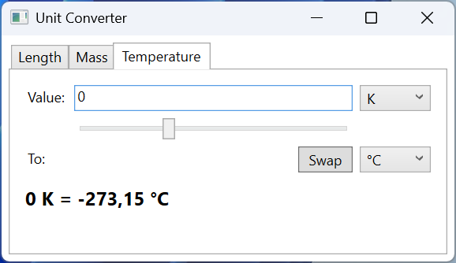

# Practice

## Example 1. A unit converter

Create a WPF application that converts values between units of length, mass, and temperature. Each category is placed on a separate `TabControl` tab. The value is entered in a field or set with a `Slider`, the units are chosen in two `ComboBox` lists, the *Swap* button swaps them, and the result is updated after every change.

Units are described by records: a linear unit is defined by a factor relative to the base unit (meter, kilogram), while temperature conversion is nonlinear, so the record stores two functions. The `Units.cs` file:

```cs
namespace UnitConverter;

// A unit of measurement: conversion to the base unit and back.
public record Unit(string Symbol, Func<double, double> ToBase,
    Func<double, double> FromBase)
{
    public static Unit Linear(string symbol, double factor) =>
        new(symbol, v => v * factor, v => v / factor);

    public override string ToString() => Symbol;   // for the ComboBox
}

public record Category(string Name, double Min, double Max,
    Unit[] Units)
{
    public static readonly Category[] All =
    [
        new("Length", 0, 1000,
        [
            Unit.Linear("m", 1), Unit.Linear("km", 1000),
            Unit.Linear("cm", 0.01), Unit.Linear("mi", 1609.344),
            Unit.Linear("ft", 0.3048), Unit.Linear("in", 0.0254)
        ]),
        new("Mass", 0, 1000,
        [
            Unit.Linear("kg", 1), Unit.Linear("g", 0.001),
            Unit.Linear("t", 1000), Unit.Linear("lb", 0.45359237),
            Unit.Linear("oz", 0.028349523125)
        ]),
        new("Temperature", -100, 200,
        [
            Unit.Linear("°C", 1),
            new("°F", f => (f - 32) * 5 / 9, c => c * 9 / 5 + 32),
            new("K", k => k - 273.15, c => c + 273.15)
        ])
    ];
}
```

The tabs are identical, so their content is moved into a `ConverterPanel` user control that receives the category in its constructor. `ConverterPanel.xaml`:

```xml
<UserControl x:Class="UnitConverter.ConverterPanel"
    xmlns="http://schemas.microsoft.com/winfx/2006/xaml/presentation"
    xmlns:x="http://schemas.microsoft.com/winfx/2006/xaml">
    <Grid Margin="8" ColumnDefinitions="Auto, *, Auto"
          RowDefinitions="Auto, Auto, Auto, Auto">
        <Label Content="_Value:"
               Target="{Binding ElementName=valueBox}"/>
        <TextBox x:Name="valueBox" Grid.Column="1" Margin="3"
                 TextChanged="ValueBox_TextChanged"/>
        <ComboBox x:Name="fromBox" Grid.Column="2" Margin="3"
                  MinWidth="60"
                  SelectionChanged="Unit_SelectionChanged"/>

        <Slider x:Name="valueSlider" Grid.Row="1" Grid.Column="1"
                Margin="3" ValueChanged="Slider_ValueChanged"/>

        <Label Grid.Row="2" Content="_To:"
               Target="{Binding ElementName=toBox}"/>
        <Button Grid.Row="2" Grid.Column="1" Content="_Swap"
                HorizontalAlignment="Right" Margin="3" Padding="8,0"
                Click="Swap_Click"/>
        <ComboBox x:Name="toBox" Grid.Row="2" Grid.Column="2"
                  Margin="3"
                  SelectionChanged="Unit_SelectionChanged"/>

        <TextBlock x:Name="resultText" Grid.Row="3"
                   Grid.ColumnSpan="3" Margin="3,8"
                   FontSize="16" FontWeight="Bold"/>
    </Grid>
</UserControl>
```

`ConverterPanel.xaml.cs`:

```cs
using System.Windows;
using System.Windows.Controls;

namespace UnitConverter;

public partial class ConverterPanel : UserControl
{
    private bool updating;   // protection against mutual event calls

    public ConverterPanel(Category category)
    {
        InitializeComponent();
        valueSlider.Minimum = category.Min;
        valueSlider.Maximum = category.Max;
        fromBox.ItemsSource = category.Units;
        toBox.ItemsSource = category.Units;
        fromBox.SelectedIndex = 0;
        toBox.SelectedIndex = 1;
        valueBox.Text = "1";
    }

    private void Slider_ValueChanged(object sender,
        RoutedPropertyChangedEventArgs<double> e)
    {
        if (updating)
        {
            return;
        }
        updating = true;
        valueBox.Text = $"{e.NewValue:0.#}";
        updating = false;
        Convert();
    }

    private void ValueBox_TextChanged(object sender,
        TextChangedEventArgs e)
    {
        if (!updating && double.TryParse(valueBox.Text, out double v))
        {
            updating = true;
            valueSlider.Value = v;   // the Slider clamps the value itself
            updating = false;
        }
        Convert();
    }

    private void Unit_SelectionChanged(object sender,
        SelectionChangedEventArgs e) => Convert();

    private void Swap_Click(object sender, RoutedEventArgs e) =>
        (fromBox.SelectedIndex, toBox.SelectedIndex) =
            (toBox.SelectedIndex, fromBox.SelectedIndex);

    private void Convert()
    {
        if (fromBox.SelectedItem is not Unit from
            || toBox.SelectedItem is not Unit to)
        {
            return;
        }
        if (!double.TryParse(valueBox.Text, out double value))
        {
            resultText.Text = "Enter a number";
            return;
        }
        double result = to.FromBase(from.ToBase(value));
        resultText.Text =
            $"{value:0.###} {from} = {result:0.###} {to}";
    }
}
```

The main window contains only `<TabControl x:Name="categoryTabs" Margin="6"/>` and creates the tabs in code (`MainWindow.xaml.cs`):

```cs
using System.Windows;
using System.Windows.Controls;

namespace UnitConverter;

public partial class MainWindow : Window
{
    public MainWindow()
    {
        InitializeComponent();
        foreach (Category category in Category.All)
        {
            categoryTabs.Items.Add(new TabItem
            {
                Header = category.Name,
                Content = new ConverterPanel(category)
            });
        }
        categoryTabs.SelectedIndex = 0;
    }
}
```

The slider and the field change each other: assigning `valueBox.Text` raises `TextChanged`, and changing `valueSlider.Value` raises `ValueChanged`. The `updating` flag breaks this cycle; otherwise, while you type `12.`, the slider would rewrite the text to `12` and erase the decimal point. The `ComboBox` shows the `Unit` records through the overridden `ToString()`.

After startup (with US regional settings), the *Length* tab shows `1 m = 0.001 km`. For `42.195` with the units *km* and *mi* it shows `42.195 km = 26.219 mi`, and after *Swap*, `42.195 mi = 67.906 km`. The value 5000 is greater than the slider maximum (1000): the slider stops at the edge, and the result is computed from the text (`5000 m = 3.107 mi`). For `abc` the label shows `Enter a number`. On the *Mass* tab: `70 kg = 154.324 lb`; on the *Temperature* tab: `36.6 °C = 97.88 °F`, `-40 °F = -40 °C`, `0 K = -273.15 °C` (Fig. 12.11).



Fig. 12.11. The "Unit converter" application {.caption}

## Example 2. A routed event demonstrator

Create a WPF application that shows the route of the `PreviewMouseDown` and `MouseDown` events through the nested elements `Window`, `Border`, `StackPanel`, `Button`, and `Ellipse`. Each handler appends a line to a list with the event name, the listening element, the `OriginalSource`, and a `handled` mark. Check boxes let you mark the tunneling event as handled on the panel and attach the handlers with the `handledEventsToo` parameter. `MainWindow.xaml`:

```xml
<Window x:Class="EventDemo.MainWindow"
    xmlns="http://schemas.microsoft.com/winfx/2006/xaml/presentation"
    xmlns:x="http://schemas.microsoft.com/winfx/2006/xaml"
    x:Name="window" Title="Routed Events" Width="600" Height="330">
    <Grid Margin="8" ColumnDefinitions="220, *"
          RowDefinitions="*, Auto">
        <Border x:Name="border" BorderBrush="Black"
                BorderThickness="1" Padding="16" Margin="0,0,8,0">
            <StackPanel x:Name="panel" Background="WhiteSmoke"
                        VerticalAlignment="Center">
                <TextBlock Text="StackPanel" Margin="4"/>
                <Button x:Name="button" Margin="12" Padding="8">
                    <StackPanel Orientation="Horizontal">
                        <Ellipse x:Name="icon" Width="16" Height="16"
                                 Fill="Black" Margin="0,0,6,0"/>
                        <TextBlock Text="Button"/>
                    </StackPanel>
                </Button>
            </StackPanel>
        </Border>
        <ListBox x:Name="logList" Grid.Column="1"
                 FontFamily="Consolas"/>
        <StackPanel Grid.Row="1" Grid.ColumnSpan="2" Margin="0,8,0,0">
            <CheckBox x:Name="stopBox"
                      Content="Handle PreviewMouseDown on panel"/>
            <CheckBox x:Name="handledTooBox" Margin="0,4"
                      Content="Handlers with handledEventsToo = true"
                      Click="HandledTooBox_Click"/>
        </StackPanel>
    </Grid>
</Window>
```

`MainWindow.xaml.cs`:

```cs
using System.Windows;
using System.Windows.Input;

namespace EventDemo;

public partial class MainWindow : Window
{
    private readonly FrameworkElement[] elements;
    private readonly MouseButtonEventHandler previewHandler;
    private readonly MouseButtonEventHandler bubbleHandler;

    public MainWindow()
    {
        InitializeComponent();
        elements = [this, border, panel, button, icon];
        previewHandler = OnPreviewMouseDown;
        bubbleHandler = OnMouseDown;
        Subscribe(handledEventsToo: false);
    }

    private void Subscribe(bool handledEventsToo)
    {
        foreach (FrameworkElement element in elements)
        {
            element.RemoveHandler(PreviewMouseDownEvent,
                previewHandler);
            element.RemoveHandler(MouseDownEvent, bubbleHandler);
            element.AddHandler(PreviewMouseDownEvent, previewHandler,
                handledEventsToo);
            element.AddHandler(MouseDownEvent, bubbleHandler,
                handledEventsToo);
        }
    }

    private void OnPreviewMouseDown(object sender,
        MouseButtonEventArgs e)
    {
        if (!IsInDemo(e))
        {
            return;
        }
        if (sender == this && logList.Items.Count > 0)
        {
            logList.Items.Add("");          // a new click
        }
        Log("Preview", sender, e);
        if (sender == panel && stopBox.IsChecked == true)
        {
            e.Handled = true;
        }
    }

    private void OnMouseDown(object sender, MouseButtonEventArgs e)
    {
        if (IsInDemo(e))
        {
            Log("MouseDown", sender, e);
        }
    }

    // Only clicks inside the border, not on the check boxes or the list.
    private bool IsInDemo(RoutedEventArgs e) =>
        e.OriginalSource is DependencyObject source
        && (source == border || border.IsAncestorOf(source));

    private void Log(string name, object sender, RoutedEventArgs e)
    {
        string element = ((FrameworkElement)sender).Name;
        string source = (e.OriginalSource as FrameworkElement)?.Name
            ?? e.OriginalSource.GetType().Name;
        string handled = e.Handled ? "handled" : "";
        logList.Items.Add(
            $"{name,-9} {element,-6} from {source,-6} {handled}");
    }

    private void HandledTooBox_Click(object sender,
        RoutedEventArgs e) =>
        Subscribe(handledTooBox.IsChecked == true);
}
```

The handlers are attached with the `AddHandler` method: this is the only way to set `handledEventsToo`, and to change the parameter the handler is removed (`RemoveHandler`) and attached again. Element names (`x:Name`) are available through `FrameworkElement.Name`; for an element without a name, the type name is printed, for example `TextBlock` after a click on the button's label.

By default, a click on the black circle on the button gives five `Preview` lines (`window`, `border`, `panel`, `button`, `icon`, all `from icon`) and only one line `MouseDown icon from icon`. The tunneling event traveled from the window to the circle, while the bubbling event stopped at the circle: the button marked `MouseLeftButtonDown` (and therefore the shared `MouseDown` data) as handled and raised `Click`. A click on the panel outside the button gives the full route: `MouseDown` on `panel`, `border`, `window`. If you enable *Handlers with handledEventsToo = true*, after `MouseDown icon` the lines `MouseDown button from icon handled` appear, followed by `panel`, `border`, and `window` with the same mark. If instead you mark `PreviewMouseDown` as handled on the panel without `handledEventsToo`, the log ends with the line `Preview panel from icon`: the ordinary handlers of the button and the circle are no longer called (Fig. 12.12).


Fig. 12.12. The "Routed event demonstrator" application {.caption}

## Example 3. A file manager

Create a WPF application for browsing files: a `TreeView` folder tree on the left, a `ListView` file table on the right with the columns *Name*, *Size, KB*, and *Modified*, and a `GridSplitter` between them. The *File → Open Folder…* menu command (**Ctrl+O**) chooses the root folder with an `OpenFolderDialog`. Subfolders are loaded only when a node is expanded, and the status bar shows the number and total size of the files in the selected folder. Access errors are shown in the status bar. `MainWindow.xaml`:

```xml
<Window x:Class="FileManager.MainWindow"
    xmlns="http://schemas.microsoft.com/winfx/2006/xaml/presentation"
    xmlns:x="http://schemas.microsoft.com/winfx/2006/xaml"
    Title="File Manager" Width="640" Height="380">
    <Window.CommandBindings>
        <CommandBinding Command="Open" Executed="Open_Executed"/>
    </Window.CommandBindings>
    <DockPanel>
        <Menu DockPanel.Dock="Top">
            <MenuItem Header="_File">
                <MenuItem Header="_Open Folder..." Command="Open"/>
                <Separator/>
                <MenuItem Header="E_xit" Click="Exit_Click"/>
            </MenuItem>
        </Menu>
        <StatusBar DockPanel.Dock="Bottom">
            <StatusBarItem x:Name="statusItem"/>
        </StatusBar>
        <Grid ColumnDefinitions="200, Auto, *">
            <TreeView x:Name="folderTree"
                TreeViewItem.Expanded="Folder_Expanded"
                SelectedItemChanged="Folder_SelectedItemChanged"/>
            <GridSplitter Grid.Column="1" Width="5"
                          HorizontalAlignment="Stretch"/>
            <ListView x:Name="fileList" Grid.Column="2">
                <ListView.View>
                    <GridView>
                        <GridViewColumn Header="Name" Width="200"
                          DisplayMemberBinding="{Binding Name}"/>
                        <GridViewColumn Header="Size, KB" Width="80"
                          DisplayMemberBinding="{Binding Size}"/>
                        <GridViewColumn Header="Modified" Width="120"
                          DisplayMemberBinding="{Binding Modified}"/>
                    </GridView>
                </ListView.View>
            </ListView>
        </Grid>
    </DockPanel>
</Window>
```

`MainWindow.xaml.cs`:

```cs
using System.IO;
using System.Windows;
using System.Windows.Controls;
using System.Windows.Input;
using Microsoft.Win32;

namespace FileManager;

// A row of the file table: the values are already formatted.
public record FileRow(string Name, string Size, string Modified);

public partial class MainWindow : Window
{
    private const string Placeholder = "...";  // "not loaded yet"

    public MainWindow()
    {
        InitializeComponent();
        OpenFolder(Environment.GetFolderPath(
            Environment.SpecialFolder.MyDocuments));
    }

    public void OpenFolder(string path)
    {
        folderTree.Items.Clear();
        var root = CreateItem(new DirectoryInfo(path));
        folderTree.Items.Add(root);
        root.IsExpanded = true;       // raises the Expanded event
        root.IsSelected = true;
    }

    private static TreeViewItem CreateItem(DirectoryInfo dir)
    {
        var item = new TreeViewItem { Header = dir.Name, Tag = dir };
        item.Items.Add(Placeholder);   // an arrow will appear
        return item;
    }

    // The Expanded event bubbles from a TreeViewItem node to the TreeView.
    private void Folder_Expanded(object sender, RoutedEventArgs e)
    {
        if (e.OriginalSource is not TreeViewItem
            { Tag: DirectoryInfo dir } item
            || item.Items.Count != 1
            || item.Items[0] as string != Placeholder)
        {
            return;                   // already loaded
        }
        item.Items.Clear();
        try
        {
            foreach (DirectoryInfo sub in dir.EnumerateDirectories())
            {
                item.Items.Add(CreateItem(sub));
            }
        }
        catch (Exception ex) when (ex is UnauthorizedAccessException
            or IOException)
        {
            statusItem.Content = ex.Message;
        }
    }

    private void Folder_SelectedItemChanged(object sender,
        RoutedPropertyChangedEventArgs<object> e)
    {
        if (e.NewValue is not TreeViewItem { Tag: DirectoryInfo dir })
        {
            return;
        }
        try
        {
            FileInfo[] files = dir.GetFiles();
            fileList.ItemsSource = files
                .OrderBy(f => f.Name)
                .Select(f => new FileRow(f.Name,
                    $"{Math.Ceiling(f.Length / 1024.0):N0}",
                    $"{f.LastWriteTime:g}"))
                .ToList();
            long total = files.Sum(f => f.Length);
            statusItem.Content = $"{dir.Name}   Files: {files.Length}"
                + $"   Total: {total / 1024.0:N1} KB";
        }
        catch (Exception ex) when (ex is UnauthorizedAccessException
            or IOException)
        {
            fileList.ItemsSource = null;
            statusItem.Content = ex.Message;
        }
    }

    private void Open_Executed(object sender,
        ExecutedRoutedEventArgs e)
    {
        var dialog = new OpenFolderDialog
        {
            Title = "Choose a folder"
        };
        if (dialog.ShowDialog(this) == true)
        {
            OpenFolder(dialog.FolderName);
        }
    }

    private void Exit_Click(object sender, RoutedEventArgs e) =>
        Close();
}
```

Each new node gets a `...` "placeholder", thanks to which the `TreeView` shows an arrow. The `Expanded` event of a `TreeViewItem` node bubbles, so one handler attached to the `TreeView` with the `TreeViewItem.Expanded` attribute serves all nodes: `e.OriginalSource` is the node that was expanded. A `ListView` with a `GridView` view shows the properties of `FileRow` objects through `DisplayMemberBinding` (data binding, Topic 13). The values are formatted in code with the user's regional settings: a binding with `StringFormat` uses the en-US language by default.

For a `Labs` folder with a `readme.txt` file and the folders `Lab12` and `Photos`, the status bar shows `Labs Files: 1 Total: 0.1 KB` (with US regional settings). After `Lab12` is selected, the table contains the rows `Lab12.csproj` (1 KB, `9/14/2026 9:30 AM`), `MainWindow.xaml` (2 KB), and `MainWindow.xaml.cs` (4 KB, `9/15/2026 11:05 AM`), and the status bar shows `Lab12 Files: 3 Total: 5.4 KB`. For the `Photos\2026` folder with a 2,457,600-byte photo it shows `2026 Files: 1 Total: 2,400.0 KB` (Fig. 12.13).


Fig. 12.13. The "File manager" application {.caption}
