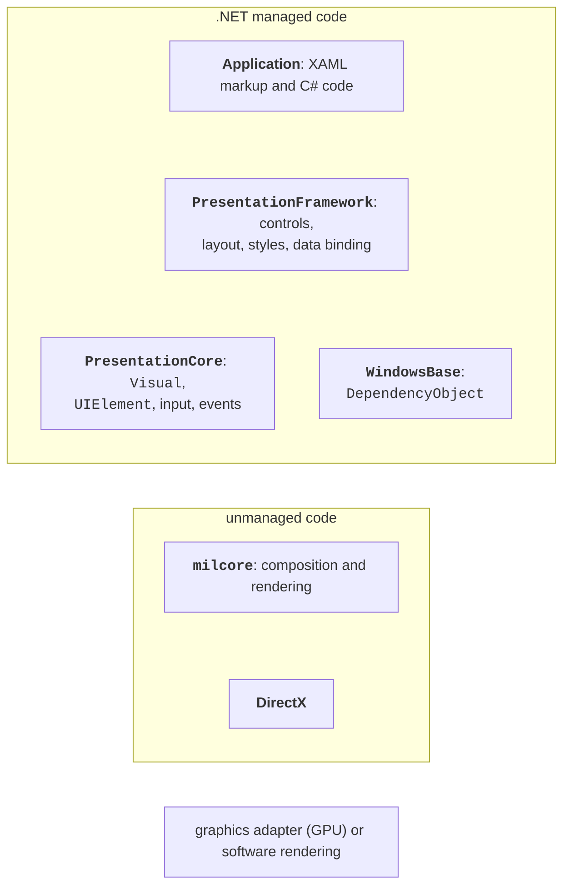
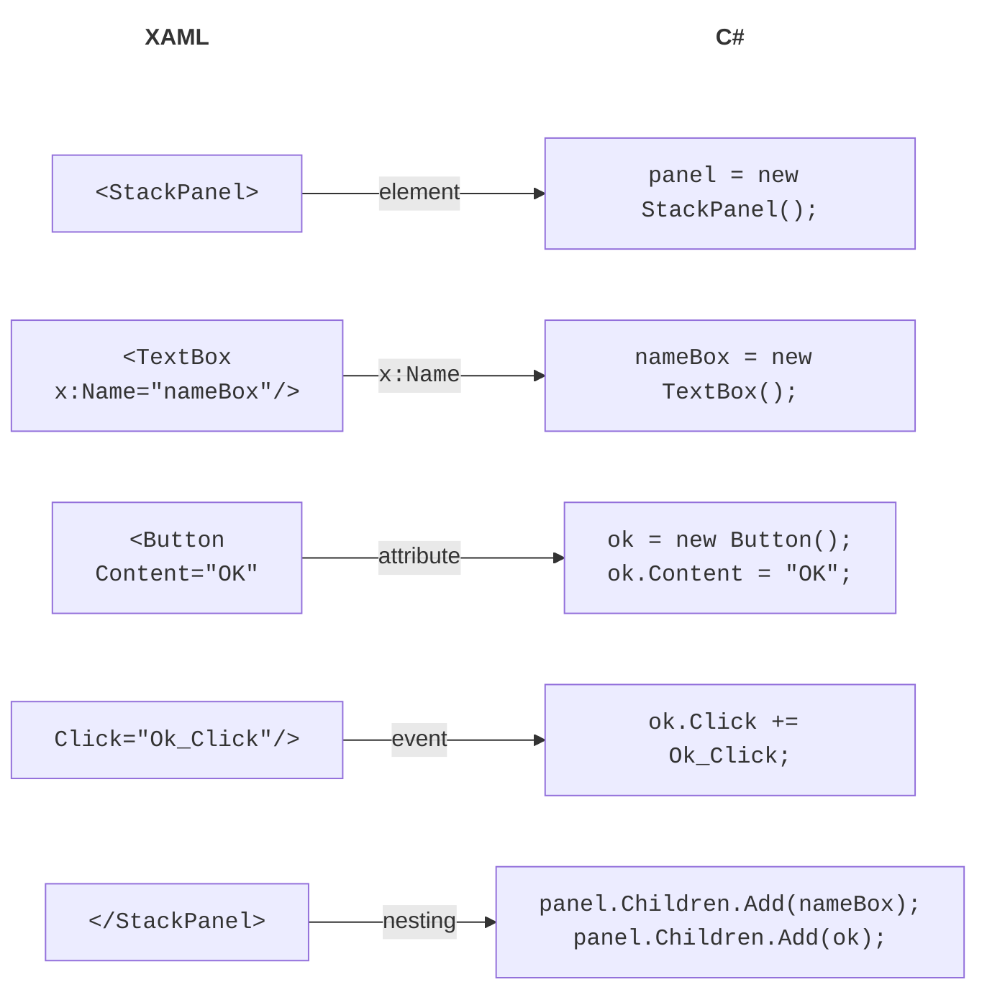
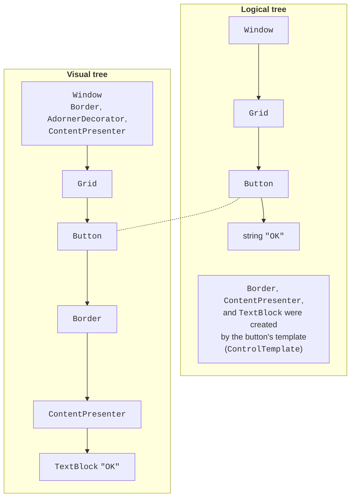
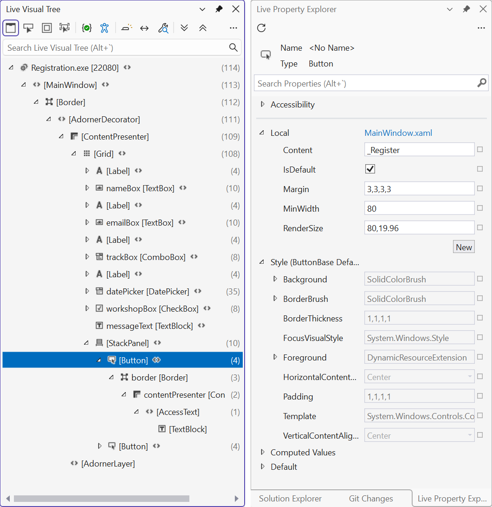

# WPF, XAML, and element trees

## The WPF technology and its architecture

**Windows Presentation Foundation** (WPF) is a technology for building Windows desktop applications in which the interface is described with the declarative **XAML** markup language and the behavior is programmed in C#. WPF appeared in 2006 in .NET Framework 3.0; the modern version is part of .NET, is open source, and runs only on Windows (<https://learn.microsoft.com/dotnet/desktop/wpf/overview/>).

The main differences between WPF and Windows Forms (Topic 3) are given in Table 12.1. Windows Forms "wraps" standard Windows windows and draws them with GDI/GDI+, while WPF draws the whole interface itself through DirectX. So a WPF button can contain an image, a table, or another button, any element can be rotated, scaled, or animated, and the look of elements can be changed completely with styles and templates.

Table 12.1. Comparison of Windows Forms and WPF {.caption}

| **Feature** | **Windows Forms** | **WPF** |
| --- | --- | --- |
| interface description | C# code in `*.Designer.cs` | XAML markup (`*.xaml`) |
| rendering | GDI/GDI+, Windows windows | DirectX, vector graphics |
| size units | screen pixels | device-independent units (1/96 inch) |
| positioning | coordinates, `Anchor`, `Dock` | layout panels, size to content |
| appearance | color and font properties | styles, templates, themes |

The basic WPF unit of size is the **device-independent pixel**, which equals 1/96 inch. `Width="96"` takes 96 physical pixels on a screen at 100 % scale and 144 at 150 %, so the interface is equally sharp on ordinary and high-resolution monitors. Coordinates and sizes are of type `double`.

The WPF architecture is shown in Fig. 12.1 (<https://learn.microsoft.com/dotnet/desktop/wpf/advanced/wpf-architecture>). An application works with managed assemblies: **PresentationFramework** (windows, controls, panels, styles, data binding), **PresentationCore** (visual objects, input, routed events), and **WindowsBase** (dependency properties, the thread dispatcher). Below them is the unmanaged **milcore** component, written for tight integration with DirectX: it composes the image and passes it to the graphics adapter.



Fig. 12.1. WPF architecture {.caption}

WPF uses **retained-mode** rendering. In Windows Forms the program itself draws in the `Paint` handler every time the window needs to be updated (Topic 4). In WPF the program creates a tree of objects (`Button`, `Ellipse`, `TextBlock`), and the system keeps their drawing instructions and redraws the window without the user's code. To change the picture, it is enough to change an object's property, for example `ellipse.Width = 50`.

## A WPF project

### Creating a project

You need the *.NET desktop development* workload in Visual Studio 2026. A project is created as follows (<https://learn.microsoft.com/dotnet/desktop/wpf/get-started/create-app-visual-studio>):

1. *File → New → Project…* or *Create a new project* in the start window.
2. In the *Search for templates* field, type `wpf`, choose the C# language and the *WPF Application* template (not *WPF Application (.NET Framework)*).
3. Set the *Project name* and *Location* and click *Next*.
4. In the *Additional information* window, choose *Framework*: *.NET 10.0 (Long Term Support)* and click *Create*.

The same project is created by the command `dotnet new wpf -n Registration`. The project file differs from Windows Forms only in the `<UseWPF>true</UseWPF>` property instead of `UseWindowsForms` (the target framework is still `net10.0-windows`, the output type `WinExe`). Implicit `using` directives for WPF do not add the `System.Windows…` namespaces, so the template writes them explicitly at the top of the code files.

### Project files

The template creates the following files:

- `App.xaml` and `App.xaml.cs` – the `App` application class derived from `Application`. The `StartupUri="MainWindow.xaml"` attribute sets the window that opens at startup, and the `Application.Resources` section holds application-wide resources. The `Main` method is generated by the compiler;
- `MainWindow.xaml` – the markup of the main window;
- `MainWindow.xaml.cs` – the window's **code-behind**: the constructor and event handlers;
- `AssemblyInfo.cs` – the `ThemeInfo` attribute, needed for custom controls with themes.

The `MainWindow.xaml` template contains the root `Window` element with an `x:Class` attribute, `xmlns` namespaces, and an empty `Grid` panel inside.

The `x:Class` attribute links the markup to the `Registration.MainWindow` class. During the build, the XAML compiler converts the markup into the binary BAML format (embedded in the assembly) and generates the `MainWindow.g.cs` file with the second part of the class: fields for named elements and the `InitializeComponent` method. That is why the class in `MainWindow.xaml.cs` is declared with the `partial` modifier, and its constructor calls `InitializeComponent()`, which loads the markup, creates the objects, and subscribes the event handlers:

```cs
public partial class MainWindow : Window
{
    public MainWindow()
    {
        InitializeComponent();
    }
}
```

Unlike `*.Designer.cs` in Windows Forms, XAML markup is usually written and edited by hand: the XAML editor suggests elements, attributes, and values (IntelliSense), and the *XAML designer* shows the result immediately (Fig. 12.2). Elements can be dragged from the *Toolbox*, but then the designer adds fixed `Margin`, `Width`, and `Height` values that get in the way of layout.


Fig. 12.2. The XAML designer and editor in Visual Studio 2026 {.caption}

## The XAML markup language

**XAML** (*Extensible Application Markup Language*) is an XML-based language in which each **element** creates an object of a class, and each **attribute** sets a property or subscribes an event handler (<https://learn.microsoft.com/dotnet/desktop/wpf/xaml/>). At run time, the markup from Fig. 12.3 produces the same result as the C# code shown on the right.



Fig. 12.3. Correspondence between XAML markup and C# code {.caption}

Syntax rules:

- XAML is case-sensitive: `<Button>`, not `<button>`; every element is closed (`<TextBox/>` or `<Button>…</Button>`);
- XML **namespaces**: `xmlns` without a prefix corresponds to WPF elements, `xmlns:x` to XAML language constructs (`x:Class`, `x:Name`, `x:Key`, `x:Static`), and `xmlns:local="clr-namespace:…"` to classes of your own project (`<local:StarRatingControl/>`);
- `x:Name` gives an element a name: a field appears in the window class that is accessible in the code-behind;
- **type converters** convert an attribute string to the required type: `Margin="5,0,0,0"` to `Thickness`, `Background="LightGray"` to `SolidColorBrush`, `Width="Auto"` to `double.NaN`;
- the **property element** syntax `<Type.Property>` sets a complex value that cannot be written as a string;
- the **content property**: a nested element without a wrapper goes into the property marked with the `ContentProperty` attribute, for example into a button's `Content` or a panel's `Children`;
- **attached properties** such as `Grid.Row="1"` and `DockPanel.Dock="Top"` are declared in another class (the parent panel) and set on the child element.

For example, `<Button.ToolTip><ToolTip Content="Save"/></Button.ToolTip>` inside `<Button>` is a property element, while a nested `<StackPanel>` with an `Ellipse` circle and a `TextBlock` label is the button's content: in WPF a button can contain any tree of elements.

**Markup extensions** are written in curly braces. They compute a value when the markup is loaded or later:

- `{StaticResource AccentBrush}` – a resource by key (the "Resources" section);
- `{x:Static SystemColors.GrayTextBrush}` – the value of a static class member;
- `{Binding Value, ElementName=bookRating}` – data binding (covered in detail in Topic 13);
- `{x:Null}` – the `null` value.

To write text in an attribute that begins with `{`, put `{}` before it: `Text="{}{0}"`.

## The logical and visual trees

WPF interface elements form a tree (Fig. 12.4) (<https://learn.microsoft.com/dotnet/desktop/wpf/advanced/trees-in-wpf>). The **logical tree** corresponds to the markup: the window contains a `Grid`, the `Grid` contains a button, the button contains the string "OK". The logical tree determines property value inheritance (for example, `FontSize`) and resource lookup. The **visual tree** contains everything that is actually drawn: the button template (`ControlTemplate`) creates a `Border`, a `ContentPresenter`, and a `TextBlock`. The visual tree determines the event route and mouse hit testing. The trees are traversed with the `LogicalTreeHelper` and `VisualTreeHelper` classes.



Fig. 12.4. The logical and visual trees of a window with a button (dashed line – the same `Button` object) {.caption}

### XAML debugging tools

During debugging (**F5**, the *Debug* configuration), Visual Studio 2026 shows an **in-app toolbar** above the application window and gives access to the following tools (<https://learn.microsoft.com/visualstudio/xaml-tools/inspect-xaml-properties-while-debugging>):

- *Live Visual Tree* (*Debug → Windows → Live Visual Tree*) – the visual tree of the running window. The *Show Just My XAML* button switches between the elements from your markup and the full tree with templates. The *Select Element in the Running Application* mode finds in the tree the element you clicked in the application window, and *Display Layout Adorners* shows its bounds and margins;
- *Live Property Explorer* – the actual property values of the selected element with the value source (local, style, inherited, default); values can be changed right while the application runs (Fig. 12.5);
- **XAML Hot Reload** – markup changes are applied to the running application after the file is saved, without a restart and with the window state preserved (<https://learn.microsoft.com/visualstudio/xaml-tools/xaml-hot-reload>). C# code changes are applied by .NET Hot Reload (the flame button on the Visual Studio toolbar), but some changes (a new class, a signature change) require a restart.



Fig. 12.5. *Live Visual Tree* and *Live Property Explorer* {.caption}
