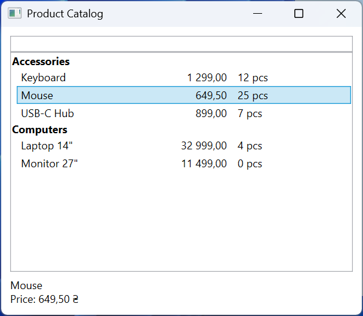
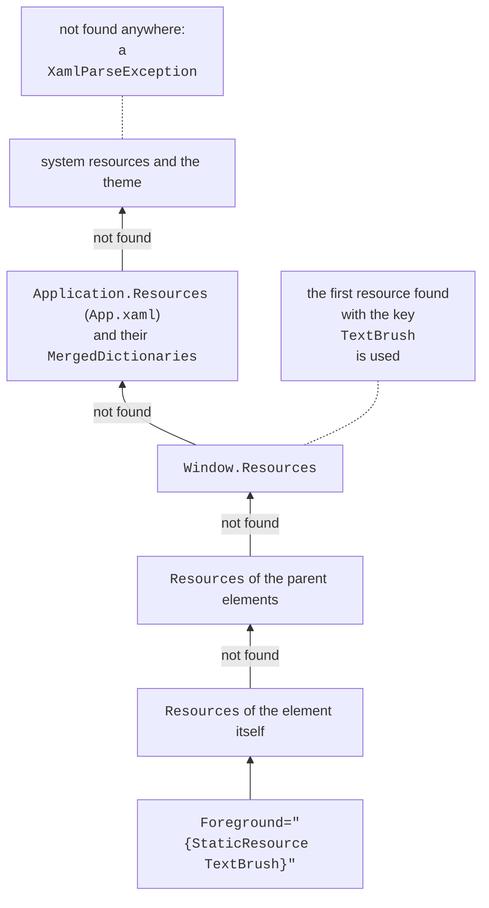
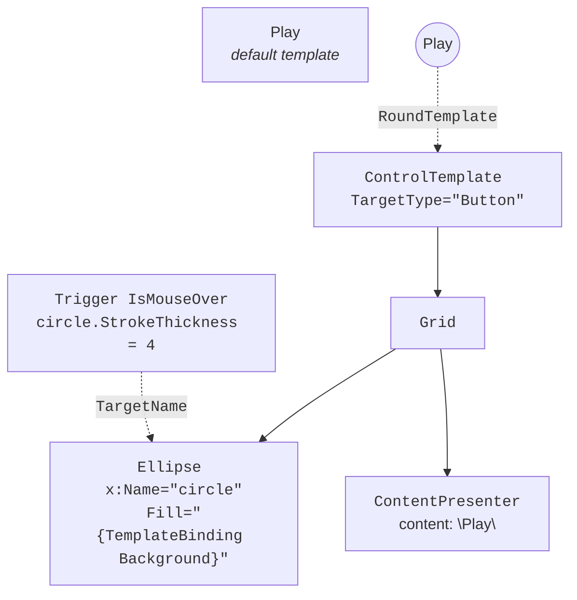

# Collections, styles, and templates

## Collections and data templates

### Collections with notifications

List elements (`ListBox`, `ComboBox`, `ListView`, `DataGrid`) derive from `ItemsControl` and receive data through the `ItemsSource` property. For the on-screen list to update after `Add` and `Remove`, the collection must implement the `INotifyCollectionChanged` interface. The ready-made implementation is `ObservableCollection<T>` (the `System.Collections.ObjectModel` namespace); an ordinary `List<T>` is displayed only once. The `Count` property of this collection also reports changes, so `{Binding Items.Count}` is updated automatically. Changes to the properties of the items themselves are visible only when the item class implements `INotifyPropertyChanged`.

The `DisplayMemberPath` property shows one property of each item, and `SelectedItem` (a `TwoWay` binding) the selected item. The look of an item is fully defined by a **data template** `DataTemplate` assigned to the `ItemTemplate` property (<https://learn.microsoft.com/dotnet/desktop/wpf/data/data-templating-overview>). Inside the template, the data context is the collection item itself. A template with a `DataType` attribute and no key in the resources is applied automatically to all objects of that type (this is how navigation between pages is built, see below).

### Collection views

Between a collection and a list element, WPF creates a **collection view** – an object with the `ICollectionView` interface that sorts, filters, and groups items without changing the collection itself (<https://learn.microsoft.com/dotnet/api/system.componentmodel.icollectionview>). The default view is returned by `CollectionViewSource.GetDefaultView(collection)`:

- `Filter` – a `Predicate<object>` delegate that decides whether to show an item; after the condition changes, `Refresh()` is called;
- `SortDescriptions` – a list of `SortDescription(property, direction)`;
- `GroupDescriptions` – `PropertyGroupDescription(property)`; group headers are described by the list element's `GroupStyle`.

The same settings can be specified in XAML through a `CollectionViewSource` resource (<https://learn.microsoft.com/dotnet/desktop/wpf/data/how-to-sort-and-group-data-using-a-view-in-xaml>). For tabular data there is `DataGrid`: it creates columns from properties itself (`AutoGenerateColumns`) or uses declared `DataGridTextColumn`, `DataGridCheckBoxColumn` columns.

### Example: a product catalog

The catalog shows products grouped by category and sorted by name, filters them by search text, and shows the price of the selected product.

```cs
using System.Collections.ObjectModel;
using System.ComponentModel;
using System.Windows.Data;

namespace Catalog;

public record Product(string Name, string Category,
    decimal Price, int Stock);

public class CatalogViewModel : ObservableObject
{
    public CatalogViewModel()
    {
        Products =
        [
            new("Laptop 14\"", "Computers", 32999m, 4),
            new("Mouse", "Accessories", 649.5m, 25),
            new("Monitor 27\"", "Computers", 11499m, 0),
            new("Keyboard", "Accessories", 1299m, 12),
            new("USB-C Hub", "Accessories", 899m, 7)
        ];
        ProductsView = CollectionViewSource.GetDefaultView(Products);
        ProductsView.Filter = Matches;
        ProductsView.GroupDescriptions.Add(
            new PropertyGroupDescription(nameof(Product.Category)));
        ProductsView.SortDescriptions.Add(new SortDescription(
            nameof(Product.Name), ListSortDirection.Ascending));
    }

    public ObservableCollection<Product> Products { get; }

    public ICollectionView ProductsView { get; }

    public string SearchText
    {
        get;
        set
        {
            if (SetProperty(ref field, value))
            {
                ProductsView.Refresh();   // apply the filter
            }
        }
    } = "";

    public Product? SelectedProduct
    {
        get;
        set => SetProperty(ref field, value);
    }

    private bool Matches(object item) =>
        item is Product p && p.Name.Contains(SearchText,
            StringComparison.CurrentCultureIgnoreCase);
}
```

The window markup (the `ObservableObject` class is the same as in the profile; `App.xaml.cs` overrides `Language` as shown above):

```xml
<Window x:Class="Catalog.MainWindow"
    xmlns="http://schemas.microsoft.com/winfx/2006/xaml/presentation"
    xmlns:x="http://schemas.microsoft.com/winfx/2006/xaml"
    xmlns:local="clr-namespace:Catalog"
    Title="Product Catalog" Width="420" Height="360">
    <Window.DataContext>
        <local:CatalogViewModel/>
    </Window.DataContext>
    <DockPanel Margin="10">
        <TextBox DockPanel.Dock="Top" Text="{Binding SearchText,
                 UpdateSourceTrigger=PropertyChanged, Delay=300}"/>
        <StackPanel DockPanel.Dock="Bottom" Margin="0,6,0,0"
                    DataContext="{Binding SelectedProduct}">
            <TextBlock Text="{Binding Name,
                       FallbackValue=Select a product}"/>
            <TextBlock Text="{Binding Price,
                       StringFormat=Price: {0:C}}"/>
        </StackPanel>
        <ListBox ItemsSource="{Binding ProductsView}"
                 SelectedItem="{Binding SelectedProduct}">
            <ListBox.GroupStyle>
                <GroupStyle>
                    <GroupStyle.HeaderTemplate>
                        <DataTemplate>
                            <TextBlock FontWeight="Bold"
                                       Text="{Binding Name}"/>
                        </DataTemplate>
                    </GroupStyle.HeaderTemplate>
                </GroupStyle>
            </ListBox.GroupStyle>
            <ListBox.ItemTemplate>
                <DataTemplate DataType="{x:Type local:Product}">
                    <StackPanel Orientation="Horizontal">
                        <TextBlock Text="{Binding Name}" Width="150"/>
                        <TextBlock Text="{Binding Price,
                                   StringFormat={}{0:N2}}"
                                   Width="80" TextAlignment="Right"/>
                        <TextBlock Text="{Binding Stock,
                                   StringFormat={}{0} pcs}"
                                   Margin="12,0,0,0"/>
                    </StackPanel>
                </DataTemplate>
            </ListBox.ItemTemplate>
        </ListBox>
    </DockPanel>
</Window>
```

The list contains the groups *Accessories* (Keyboard `1,299.00`, Mouse `649.50`, USB-C Hub `899.00`) and *Computers* (with US regional settings). While no product is selected, the bottom panel's binding cannot be performed and the `FallbackValue` *Select a product* is shown; after the mouse is selected, it shows `Mouse` and `Price: $649.50`. Searching for `o` leaves four products out of five (Fig. 13.4).



Fig. 13.4. A product catalog with filtering and grouping {.caption}

## Resources

**Resources** (Topic 12) are stored in `ResourceDictionary` dictionaries in the `Resources` properties of an element, a window, and the application. The `{StaticResource Key}` extension looks up the resource from the element up the tree to the application and system resources (Fig. 13.5) once, when the markup is loaded. `{DynamicResource Key}` keeps a reference to the key and updates the value if the resource with that key is replaced at run time; it is slightly slower and works only for dependency properties (<https://learn.microsoft.com/dotnet/desktop/wpf/systems/xaml-resources-overview>).



Fig. 13.5. Looking up a resource by key {.caption}

Large sets of resources are moved into separate *Resource Dictionary (WPF)* files and merged in `App.xaml` with the `MergedDictionaries` property. If a key is repeated, the last added dictionary wins (<https://learn.microsoft.com/dotnet/desktop/wpf/systems/xaml-resources-merged-dictionaries>). This is how **visual themes** are implemented: the files `Themes/Light.xaml` and `Themes/Dark.xaml` contain brushes with the same keys, and the application replaces one dictionary with the other:

```xml
<ResourceDictionary
    xmlns="http://schemas.microsoft.com/winfx/2006/xaml/presentation"
    xmlns:x="http://schemas.microsoft.com/winfx/2006/xaml">
    <SolidColorBrush x:Key="WindowBrush" Color="White"/>
    <SolidColorBrush x:Key="TextBrush" Color="#1E1E1E"/>
    <SolidColorBrush x:Key="AccentBrush" Color="#005A9E"/>
</ResourceDictionary>
```

The `Dark.xaml` file differs only in its colors (`#202020`, `#F0F0F0`, `#4CA0E0`). Elements that must change their look with the theme use `DynamicResource`.

## Styles and triggers

A **style** (`Style`) is a named set of property values (`Setter`) for elements of one type `TargetType` (<https://learn.microsoft.com/dotnet/desktop/wpf/controls/styles-templates-overview>):

- a style with an `x:Key` key is applied explicitly: `Style="{StaticResource WarningText}"`;
- a style without a key is **implicit**: it applies to all `TargetType` elements within the scope of the resource;
- `BasedOn` inherits another style; an implicit style has a type as its key, so it is referenced like this: `BasedOn="{StaticResource {x:Type TextBlock}}"`;
- a local attribute value on the element takes precedence over a style setter (Topic 12).

**Triggers** change properties based on a condition and undo the change when the condition stops being met: `Trigger` checks a property of the element itself, `MultiTrigger` checks several properties at once, and `DataTrigger` and `MultiDataTrigger` check a binding value (a ViewModel property or a data item). Animation in triggers (`EventTrigger`, `BeginStoryboard`) is covered in Topic 14.

```xml
<Style x:Key="WarningText" TargetType="TextBlock"
       BasedOn="{StaticResource {x:Type TextBlock}}">
    <Setter Property="FontWeight" Value="Bold"/>
    <Style.Triggers>
        <Trigger Property="IsMouseOver" Value="True">
            <Setter Property="TextDecorations"
                    Value="Underline"/>
        </Trigger>
    </Style.Triggers>
</Style>
```

The `WarningText` style inherits the window's implicit text block style (in the example below it sets `Foreground="{DynamicResource TextBrush}"` and `Margin="4"`) and adds bold text and an underline under the mouse cursor. A data trigger in a data template (`DataTemplate.Triggers`) can, for example, strike through the name of a product that is out of stock: `<DataTrigger Binding="{Binding Stock}" Value="0">` with a setter whose `TargetName` property points to a named element inside the template.

## Control templates

### `ControlTemplate`

The logic and the look of a WPF control are separate: the `Button` class defines the behavior (the `Click` event, the `IsPressed` and `IsMouseOver` properties), while the visual tree is created by a **control template** `ControlTemplate` (Topic 12). By replacing the `Template` property, you can change the look completely while keeping the behavior (Fig. 13.6) (<https://learn.microsoft.com/dotnet/desktop/wpf/controls/how-to-create-apply-template>):

- `TemplateBinding` – binds a property of a template element to a property of the control: `Fill="{TemplateBinding Background}"`, so the button color is still set with the `Background` property;
- `ContentPresenter` – the place where the `Content` is displayed; `RecognizesAccessKey="True"` handles the `_Play` mnemonic;
- `ControlTemplate.Triggers` – template triggers that change its elements by `TargetName`.



Fig. 13.6. A round button template {.caption}

A style alone cannot change the look completely: the default button template replaces the background with a system color under the mouse cursor, ignoring `Background`.

Data templates can also be chosen programmatically: a class derived from `DataTemplateSelector` overrides the `SelectTemplate(item, container)` method and is assigned to the `ItemTemplateSelector` property. The panel that lays out the list items is set by an `ItemsPanelTemplate` (the `ItemsPanel` property, for example a `WrapPanel` instead of the default `VirtualizingStackPanel`) (<https://learn.microsoft.com/dotnet/api/system.windows.controls.datatemplateselector>).

### Example: a stylish button

The application has two round buttons and a dark theme toggle. `App.xaml` merges the light theme dictionary and declares the button template and style:

```xml
<Application x:Class="Styles.App"
    xmlns="http://schemas.microsoft.com/winfx/2006/xaml/presentation"
    xmlns:x="http://schemas.microsoft.com/winfx/2006/xaml"
    StartupUri="MainWindow.xaml">
    <Application.Resources>
        <ResourceDictionary>
            <ResourceDictionary.MergedDictionaries>
                <ResourceDictionary Source="Themes/Light.xaml"/>
            </ResourceDictionary.MergedDictionaries>

            <ControlTemplate x:Key="RoundTemplate"
                             TargetType="Button">
                <Grid>
                    <Ellipse x:Name="circle"
                             Fill="{TemplateBinding Background}"
                             Stroke="{DynamicResource TextBrush}"/>
                    <ContentPresenter RecognizesAccessKey="True"
                                      HorizontalAlignment="Center"
                                      VerticalAlignment="Center"/>
                </Grid>
                <ControlTemplate.Triggers>
                    <Trigger Property="IsMouseOver" Value="True">
                        <Setter TargetName="circle"
                                Property="StrokeThickness" Value="4"/>
                    </Trigger>
                    <Trigger Property="IsPressed" Value="True">
                        <Setter TargetName="circle"
                                Property="Opacity" Value="0.6"/>
                    </Trigger>
                </ControlTemplate.Triggers>
            </ControlTemplate>

            <Style x:Key="RoundButton" TargetType="Button">
                <Setter Property="Width" Value="90"/>
                <Setter Property="Height" Value="90"/>
                <Setter Property="Margin" Value="8"/>
                <Setter Property="Foreground" Value="White"/>
                <Setter Property="Background"
                        Value="{DynamicResource AccentBrush}"/>
                <Setter Property="Template"
                        Value="{StaticResource RoundTemplate}"/>
            </Style>
        </ResourceDictionary>
    </Application.Resources>
</Application>
```

The `MainWindow.xaml` window has `Background="{DynamicResource WindowBrush}"`, and its resources contain an implicit `TextBlock` style and the `WarningText` style from the previous section. It contains three text blocks (one with `Foreground="{StaticResource TextBrush}"`), the buttons `<Button Content="_Play" Style="{StaticResource RoundButton}"/>` and *Stop* with `Background="Gray"`, and a `darkThemeBox` check box (*Dark theme*) with a `Click` handler.

Switching the theme is a purely visual action, so its handler can live in the code-behind. It replaces the theme dictionary, and all `DynamicResource` references are updated:

```cs
private void DarkThemeBox_Click(object sender, RoutedEventArgs e)
{
    string name =
        darkThemeBox.IsChecked == true ? "Dark" : "Light";
    var theme = new ResourceDictionary
    {
        Source = new Uri($"Themes/{name}.xaml", UriKind.Relative)
    };
    Application.Current.Resources.MergedDictionaries[0] = theme;
}
```

In the light theme, the *Play* button has the color `#005A9E` and *Stop* is gray: the local `Background` overrides the style setter, and the template picks it up through `TemplateBinding`. After *Dark theme* is turned on, the background becomes `#202020`, the text and outlines `#F0F0F0`, while the text *Static: keeps the first brush* stays dark and disappears on the dark background: `StaticResource` does not track the dictionary replacement (Fig. 13.7).


Fig. 13.7. Styled controls in the light and dark themes {.caption}
