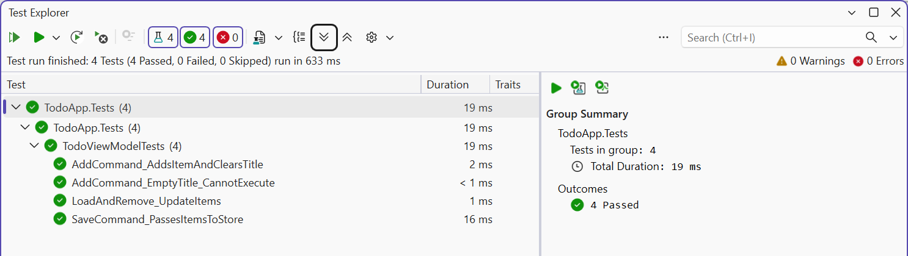

# Application composition and testing

## Application composition and testing

### Dependency injection

A ViewModel receives services through its constructor (Topic 6), so it can no longer be created in XAML: the objects are created by a `ServiceCollection` container in the `OnStartup` method of the `App` class, and the `StartupUri` attribute is removed from `App.xaml`.

**Navigation** between pages is also performed by the ViewModel: the `CurrentPage` property stores the ViewModel of the current page, `<ContentControl Content="{Binding CurrentPage}"/>` shows it, and implicit data templates in the window resources (`<DataTemplate DataType="{x:Type vm:SettingsPageViewModel}">` with the page's `UserControl` inside) choose the View by type. A command merely assigns `CurrentPage = new SettingsPageViewModel()`, and the window content changes.

### Example: a to-do list

The solution consists of three projects. The `TodoApp.Core` library (`net10.0`) contains the model, the ViewModel, and the store and **does not reference WPF**, so the test project does not need `net10.0-windows`. The projects were created with `dotnet new classlib`, `dotnet new wpf`, and `dotnet new xunit3 -f net10.0` (the xUnit.net v3 templates – Topic 2); the `CommunityToolkit.Mvvm` package was added to the library, and `Microsoft.Extensions.DependencyInjection` to the application.

The model and the ViewModel with the library's attributes:

```cs
using CommunityToolkit.Mvvm.ComponentModel;

namespace TodoApp.Core;

public partial class TodoItem : ObservableObject
{
    [ObservableProperty]
    public partial string Title { get; set; } = "";

    [ObservableProperty]
    public partial bool IsDone { get; set; }
}

// The TodoViewModel.cs file
using System.Collections.ObjectModel;
using CommunityToolkit.Mvvm.ComponentModel;
using CommunityToolkit.Mvvm.Input;

namespace TodoApp.Core;

public partial class TodoViewModel(ITodoStore store)
    : ObservableObject
{
    public ObservableCollection<TodoItem> Items { get; } = [];

    [ObservableProperty]
    [NotifyCanExecuteChangedFor(nameof(AddCommand))]
    public partial string NewTitle { get; set; } = "";

    [RelayCommand(CanExecute = nameof(CanAdd))]
    private void Add()
    {
        Items.Add(new TodoItem { Title = NewTitle.Trim() });
        NewTitle = "";
    }

    private bool CanAdd() => !string.IsNullOrWhiteSpace(NewTitle);

    [RelayCommand]
    private void Remove(TodoItem item) => Items.Remove(item);

    [RelayCommand]
    private async Task LoadAsync(CancellationToken token)
    {
        Items.Clear();
        foreach (TodoItem item in await store.LoadAsync(token))
        {
            Items.Add(item);
        }
    }

    [RelayCommand]
    private Task SaveAsync(CancellationToken token) =>
        store.SaveAsync(Items, token);
}
```

Compared with the manual version, the base class, the command fields, the constructor, and the `RaiseCanExecuteChanged` call are gone. The store is described by the `ITodoStore` interface; the `JsonTodoStore(string path)` class implements it with the `JsonSerializer.DeserializeAsync` and `SerializeAsync` methods over a `FileStream` (if the file does not exist yet, `LoadAsync` returns an empty list). In the application, `App.xaml` has no `StartupUri`, and `App.xaml.cs` registers the services, the ViewModel, and the window:

```cs
// The ITodoStore.cs file (the TodoApp.Core library)
namespace TodoApp.Core;

public interface ITodoStore
{
    Task<List<TodoItem>> LoadAsync(CancellationToken token);
    Task SaveAsync(IEnumerable<TodoItem> items,
        CancellationToken token);
}

// The App.xaml.cs file (the TodoApp application)
using System.IO;
using System.Windows;
using Microsoft.Extensions.DependencyInjection;
using TodoApp.Core;

namespace TodoApp;

public partial class App : Application
{
    private ServiceProvider? services;

    protected override void OnStartup(StartupEventArgs e)
    {
        base.OnStartup(e);
        string file = Path.Combine(Environment.GetFolderPath(
            Environment.SpecialFolder.ApplicationData),
            "TodoApp", "todos.json");

        var collection = new ServiceCollection();
        collection.AddSingleton<ITodoStore>(new JsonTodoStore(file));
        collection.AddTransient<TodoViewModel>();
        collection.AddTransient<MainWindow>();
        services = collection.BuildServiceProvider();

        services.GetRequiredService<MainWindow>().Show();
    }
}
```

The window constructor receives the ViewModel from the container, assigns it to `DataContext`, and in the `Loaded` handler runs `viewModel.LoadCommand.Execute(null)`.

The window header with `d:DataContext` is shown above. At the top of the window there is a field `{Binding NewTitle, UpdateSourceTrigger=PropertyChanged}` and an *Add* button (`IsDefault="True"`, `Command="{Binding AddCommand}"`), at the bottom a label `{Binding Items.Count, StringFormat=Tasks: {0}}` and a *Save* button (`SaveCommand`), and in the middle a list:

```xml
<ListBox ItemsSource="{Binding Items}"
         HorizontalContentAlignment="Stretch">
    <ListBox.ItemTemplate>
        <DataTemplate DataType="{x:Type core:TodoItem}">
            <DockPanel>
                <Button DockPanel.Dock="Right"
                    Content="Remove"
                    CommandParameter="{Binding}"
                    Command="{Binding
                        DataContext.RemoveCommand,
                        RelativeSource={RelativeSource
                        AncestorType=ListBox}}"/>
                <CheckBox IsChecked="{Binding IsDone}"
                          Content="{Binding Title}"
                          VerticalAlignment="Center"/>
            </DockPanel>
        </DataTemplate>
    </ListBox.ItemTemplate>
</ListBox>
```

Inside the template the data context is a `TodoItem`, which has no `RemoveCommand`, so the button looks for the command in the `DataContext` of the `ListBox` ancestor through `RelativeSource` and passes the item itself in `CommandParameter="{Binding}"`. After two to-dos are added, the label shows `Tasks: 2`, and *Save* writes `[{"Title":"Buy milk","IsDone":false},{"Title":"Read lecture 13","IsDone":true}]` to the file; the next start loads them with the `LoadCommand` command.

### Unit tests for a ViewModel

A ViewModel does not create windows, so tests call commands and check properties. A fake in-memory store is used instead of a file:

```cs
using TodoApp.Core;

namespace TodoApp.Tests;

public class TodoViewModelTests
{
    // A fake store: no files, data in memory.
    private class FakeStore : ITodoStore
    {
        public List<TodoItem> Saved { get; } = [];

        public Task<List<TodoItem>> LoadAsync(CancellationToken t) =>
            Task.FromResult(new List<TodoItem>
            {
                new() { Title = "Buy milk" },
                new() { Title = "Read lecture 13", IsDone = true }
            });

        public Task SaveAsync(IEnumerable<TodoItem> items,
            CancellationToken t)
        {
            Saved.AddRange(items);
            return Task.CompletedTask;
        }
    }

    private readonly FakeStore store = new();

    [Fact]
    public void AddCommand_AddsItemAndClearsTitle()
    {
        var vm = new TodoViewModel(store) { NewTitle = " Walk " };
        var changed = new List<string?>();
        vm.PropertyChanged += (s, e) => changed.Add(e.PropertyName);

        vm.AddCommand.Execute(null);

        TodoItem item = Assert.Single(vm.Items);
        Assert.Equal("Walk", item.Title);
        Assert.Equal("", vm.NewTitle);
        Assert.Contains(nameof(TodoViewModel.NewTitle), changed);
        Assert.False(vm.AddCommand.CanExecute(null));
    }
}
```

An asynchronous command is awaited in a test with the `ExecuteAsync` method. The class contains three more tests: `AddCommand_EmptyTitle_CannotExecute` (a title of spaces), `LoadAndRemove_UpdateItems` (after `await vm.LoadCommand.ExecuteAsync(null)` and removing the first to-do, one remains), and `SaveCommand_PassesItemsToStore` (checks `store.Saved`). The `dotnet test` command in the solution folder prints (the path is shortened):

```
…\TodoApp.Tests.dll (net10.0|x64) passed (4s 751ms)

Test run summary: Passed!
  total: 4
  failed: 0
  succeeded: 4
  skipped: 0
  duration: 6s 820ms
```

In Visual Studio the same tests are run from the *Test → Test Explorer* window (Fig. 13.12).



Fig. 13.12. ViewModel unit tests in *Test Explorer* {.caption}
