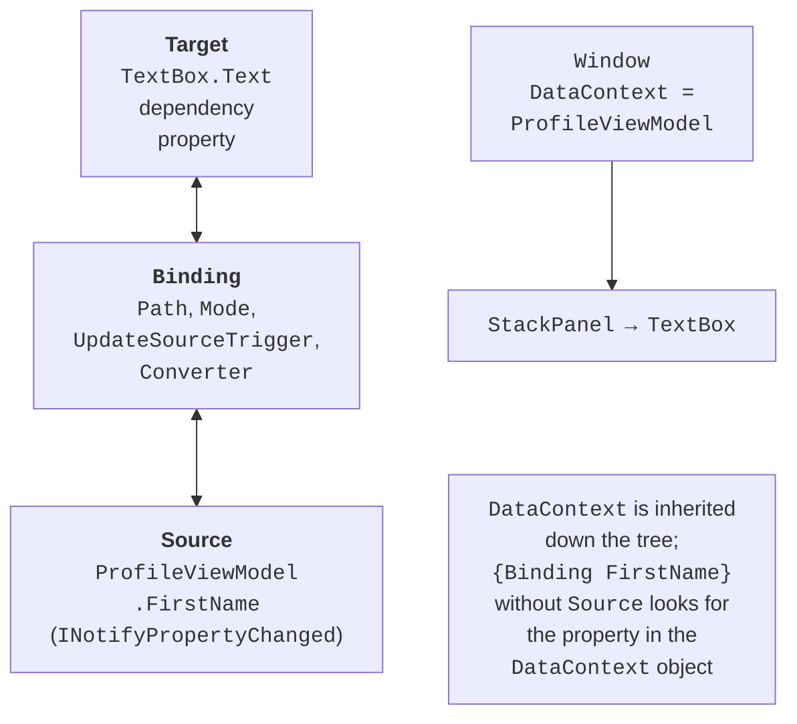
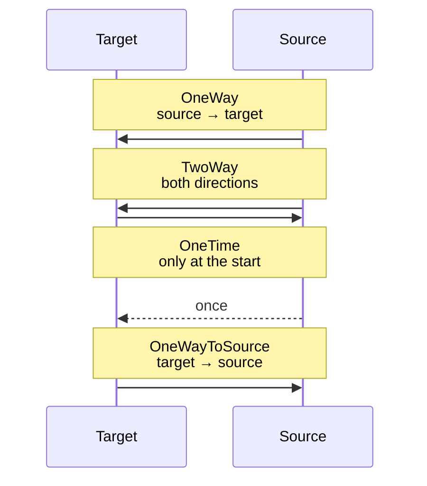

# Binding and value conversion

## Data binding

### Target, source, and data context

In Topic 12, control values were read and changed in event handlers: `nameBox.Text = person.Name`, and after editing, the other way around. Such code grows quickly and gets duplicated. **Data binding** automatically synchronizes two properties: the **target** – a dependency property of a control (`TextBox.Text`, `ListBox.ItemsSource`) – and the **source** – a property of an ordinary C# object (Fig. 13.1) (<https://learn.microsoft.com/dotnet/desktop/wpf/data/>).



Fig. 13.1. The parts of a data binding {.caption}

A binding is described by a `Binding` object, which in XAML is created by the `{Binding}` markup extension. Its main properties:

- `Path` – the path to the source property: `{Binding FirstName}` (the first positional argument is the `Path`), `{Binding SelectedProduct.Price}`, `{Binding Items.Count}`;
- `ElementName` – the source is another element by `x:Name`: `{Binding Value, ElementName=sizeSlider}`;
- `RelativeSource` – the source relative to the target: the element itself (`Self`) or an ancestor of a given type (`{RelativeSource AncestorType=ListBox}`);
- `Source` – an explicit object, for example a resource: `{Binding Source={StaticResource SortedContacts}}`.

If none of the last three is set, the source is the **data context** – the value of the `DataContext` property. It is inherited down the element tree: it is enough to assign an object to the window's `DataContext`, and all nested elements bind to its properties. Binding works only with public **properties**, not with fields.

### Modes and update timing

The `Mode` property determines the direction in which the value is passed (Fig. 13.2): `OneWay` (the default for `TextBlock.Text`, `ItemsSource`), `TwoWay` (the default for properties the user edits: `TextBox.Text`, `CheckBox.IsChecked`, `Slider.Value`, `SelectedItem`), `OneTime` (once, when the binding is created), and `OneWayToSource` (only from the target to the source).

The default mode is set by the property metadata, so you write only a different one explicitly: `{Binding Total, Mode=OneWay}` (<https://learn.microsoft.com/dotnet/desktop/wpf/data/how-to-specify-the-direction-of-the-binding>).



Fig. 13.2. Data binding modes {.caption}

For `TwoWay` and `OneWayToSource` bindings, the `UpdateSourceTrigger` property determines **when** the value is written to the source: `PropertyChanged` – after every change, `LostFocus` – when the element loses focus (the default for `TextBox.Text`), `Explicit` – only after `UpdateSource()` is called in code. To have the text updated while typing, you write `{Binding FirstName, UpdateSourceTrigger=PropertyChanged}`; the `Delay=300` parameter postpones the write for 300 ms after the last keystroke.

## Change notification

### The `INotifyPropertyChanged` interface

The properties of an ordinary class do not report their changes, so a control does not know that the value in the source has changed. For this, the source class implements the `INotifyPropertyChanged` interface (the `System.ComponentModel` namespace) with a single `PropertyChanged` event: the binding subscribes to it and rereads the property whose name is passed in `PropertyChangedEventArgs` (<https://learn.microsoft.com/dotnet/desktop/wpf/data/how-to-implement-property-change-notification>).

To avoid repeating the same code in every class, a base class is created. The `[CallerMemberName]` attribute substitutes the name of the property from which the method is called, and `SetProperty` changes the field and raises the event only when the value has actually changed:

```cs
using System.ComponentModel;
using System.Runtime.CompilerServices;

namespace Profile;

public abstract class ObservableObject : INotifyPropertyChanged
{
    public event PropertyChangedEventHandler? PropertyChanged;

    protected void OnPropertyChanged(
        [CallerMemberName] string? propertyName = null) =>
        PropertyChanged?.Invoke(this,
            new PropertyChangedEventArgs(propertyName));

    // Changes the field and notifies only if the value is different.
    protected bool SetProperty<T>(ref T field, T value,
        [CallerMemberName] string? propertyName = null)
    {
        if (EqualityComparer<T>.Default.Equals(field, value))
        {
            return false;
        }
        field = value;
        OnPropertyChanged(propertyName);
        return true;
    }
}
```

In C# 14 the `field` keyword refers to the automatically created backing field of a property, so a separate field does not need to be declared: `set => SetProperty(ref field, value);`. A computed property (`Greeting`) has no setter of its own, so its change is reported from the setters of the properties it depends on: `OnPropertyChanged(nameof(Greeting))`.

### Binding diagnostics

The compiler does not notice an error in a binding path: the markup `{Binding Nmae}` builds without warnings, and at run time the text block simply stays empty. During debugging (**F5**), WPF writes to the *Output* window a message `System.Windows.Data Error: 40 : BindingExpression path error: 'Nmae' property not found on 'object' ''ProfileViewModel'…` with a description of the target (`target element is 'TextBlock'`, `target property is 'Text'`).

Such lines are easy to miss in a large log, so Visual Studio 2026 collects them in the *XAML Binding Failures* window (*Debug → Windows → XAML Binding Failures*) with the columns *Data Context*, *Binding Path*, *Target*, *Target Type*, *Description*, as well as *File* and *Line* (Fig. 13.3). The *Binding failures* button on the toolbar inside the running application shows the number of errors, and double-clicking a row opens the binding in the XAML editor (<https://learn.microsoft.com/visualstudio/xaml-tools/xaml-data-binding-diagnostics>).


Fig. 13.3. The *XAML Binding Failures* window {.caption}

## Value conversion

### Formatting

The simplest conversion is a `StringFormat` format string, which works when the target is of type `string`: `{Binding Price, StringFormat={}{0:N2}}` (the empty braces `{}` at the start are needed if the format begins with `{`), `{Binding Price, StringFormat=Price: {0:C}}`. The `FallbackValue` property sets the value used when the binding cannot be performed (no source or property), and `TargetNullValue` the value used when the source value is `null`. Several values in one string are combined by a `MultiBinding` with `StringFormat="{}{0} {1}"`.

::: tip Important
WPF formats binding values not according to the Windows regional settings but according to the element's `Language` property, which defaults to `en-US`. So `{0:C}` without extra configuration shows `$649.50` even on a Windows installation with, for example, Ukrainian regional settings. To make bindings use the current culture, override the property metadata once in `App.xaml.cs`:
:::

```cs
protected override void OnStartup(StartupEventArgs e)
{
    // Number and date format in bindings follows the Windows region.
    FrameworkElement.LanguageProperty.OverrideMetadata(
        typeof(FrameworkElement),
        new FrameworkPropertyMetadata(XmlLanguage.GetLanguage(
            CultureInfo.CurrentCulture.IetfLanguageTag)));
    base.OnStartup(e);
}
```

After that, with Ukrainian regional settings the same format gives `649,50 ₴`, and `{0:N2}` gives `1 299,00`.

### Value converters

If a value needs to be converted rather than just formatted (a birth date to an age, `bool` to `Visibility`, a number to a color), you create a **converter** – a class with the `IValueConverter` interface (the `System.Windows.Data` namespace). The `Convert` method converts the source value for the target, and `ConvertBack` works in the opposite direction for `TwoWay` bindings. WPF already has a `BooleanToVisibilityConverter`. A converter is declared as a resource and specified in the binding: `Converter={StaticResource AgeConverter}`. For a `MultiBinding` there is the `IMultiValueConverter` interface, whose `Convert` method receives an array of values.

### Example: a user profile

The window shows a greeting that is updated while the name is typed, the age based on the birth date, and lets you change the heading font size with a slider. The project was created with `dotnet new wpf -n Profile`; the `ObservableObject` class is shown above. The profile ViewModel and a converter that returns `null` for an empty date (then the binding shows `TargetNullValue`):

```cs
namespace Profile;

public class ProfileViewModel : ObservableObject
{
    public string FirstName
    {
        get;
        set
        {
            if (SetProperty(ref field, value))
            {
                OnPropertyChanged(nameof(Greeting));
            }
        }
    } = "Olena";

    public DateTime? BirthDate
    {
        get;
        set => SetProperty(ref field, value);
    } = new DateTime(2006, 3, 14);

    public string Greeting => $"Hello, {FirstName}!";
}

// The AgeConverter.cs file
using System.Globalization;
using System.Windows.Data;

namespace Profile;

// DateTime? (birth date) → the string "19 years".
public class AgeConverter : IValueConverter
{
    public object? Convert(object? value, Type targetType,
        object? parameter, CultureInfo culture)
    {
        if (value is not DateTime birth)
        {
            return null;   // → TargetNullValue
        }
        DateTime today = DateTime.Today;
        int age = today.Year - birth.Year;
        if (birth.Date > today.AddYears(-age))
        {
            age--;
        }
        return $"{age} years";
    }

    public object? ConvertBack(object? value, Type targetType,
        object? parameter, CultureInfo culture) =>
        throw new NotSupportedException();
}
```

The `MainWindow.xaml` markup creates the ViewModel as the window's data context (the code-behind contains only the `InitializeComponent()` call):

```xml
<Window x:Class="Profile.MainWindow"
    xmlns="http://schemas.microsoft.com/winfx/2006/xaml/presentation"
    xmlns:x="http://schemas.microsoft.com/winfx/2006/xaml"
    xmlns:local="clr-namespace:Profile"
    Title="User Profile" Width="360" SizeToContent="Height">
    <Window.Resources>
        <local:AgeConverter x:Key="AgeConverter"/>
    </Window.Resources>
    <Window.DataContext>
        <local:ProfileViewModel/>
    </Window.DataContext>
    <StackPanel Margin="10">
        <TextBlock Text="{Binding Greeting}" FontWeight="Bold"
                   FontSize="{Binding Value,
                   ElementName=sizeSlider}"/>
        <Label Content="_First name:" Target="{Binding
               ElementName=firstNameBox}"/>
        <TextBox x:Name="firstNameBox" Text="{Binding FirstName,
                 UpdateSourceTrigger=PropertyChanged}"/>
        <Label Content="_Birth date:"/>
        <DatePicker SelectedDate="{Binding BirthDate}"/>
        <TextBlock Margin="0,4" Text="{Binding BirthDate,
                   Converter={StaticResource AgeConverter},
                   StringFormat=Age: {0},
                   TargetNullValue=Age: unknown}"/>
        <Slider x:Name="sizeSlider" Minimum="12" Maximum="24"
                Value="16"/>
    </StackPanel>
</Window>
```

After startup, the heading shows `Hello, Olena!`, and the label below the date shows `Age: 20 years` (as of September 17, 2026). Typing `Ivan` in the name field immediately changes the heading to `Hello, Ivan!`, because the binding has `UpdateSourceTrigger=PropertyChanged` (without it the value would reach the ViewModel only after the focus moves to another element). Clearing the date shows `Age: unknown`, and the slider changes the heading font size through element-to-element binding without a single line of code.
