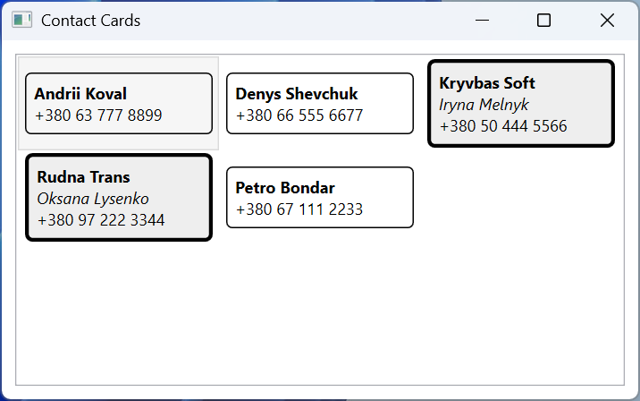
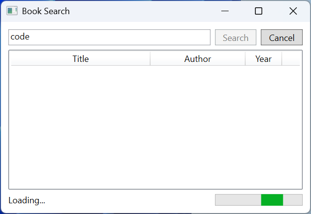

# Practice

## Example 1. A timetable editor

Create a WPF application following the MVVM pattern for putting together a class timetable. The user chooses a day of the week and enters the start time in the `HH:mm` format, the subject name (at least 3 characters), and the room number (1–999). Invalid fields are marked with a border and a tooltip, the *Add* button is available only when the data is valid, an occupied time is not accepted, classes are shown in a table ordered by day and time, and the *Remove* button deletes the selected class.

The ViewModel inherits `ObservableValidator` from the CommunityToolkit.Mvvm library (the package was added with `dotnet add package CommunityToolkit.Mvvm`): validation attributes from the `System.ComponentModel.DataAnnotations` namespace together with `[NotifyDataErrorInfo]` validate a property after every change, and `INotifyDataErrorInfo` is implemented in the base class.

```cs
using System.Collections.ObjectModel;
using System.ComponentModel.DataAnnotations;
using System.Globalization;
using CommunityToolkit.Mvvm.ComponentModel;
using CommunityToolkit.Mvvm.Input;

namespace Schedule;

public record Lesson(DayOfWeek Day, TimeOnly Start,
    string Subject, int Room);

public partial class ScheduleViewModel : ObservableValidator
{
    public DayOfWeek[] Days { get; } =
    [
        DayOfWeek.Monday, DayOfWeek.Tuesday, DayOfWeek.Wednesday,
        DayOfWeek.Thursday, DayOfWeek.Friday
    ];

    public ObservableCollection<Lesson> Lessons { get; } = [];

    [ObservableProperty]
    public partial DayOfWeek Day { get; set; } = DayOfWeek.Monday;

    [ObservableProperty]
    [NotifyDataErrorInfo]
    [NotifyCanExecuteChangedFor(nameof(AddCommand))]
    [RegularExpression(@"^([01]\d|2[0-3]):[0-5]\d$",
        ErrorMessage = "Use the HH:mm format, e.g. 08:30")]
    public partial string Start { get; set; } = "08:30";

    [ObservableProperty]
    [NotifyDataErrorInfo]
    [NotifyCanExecuteChangedFor(nameof(AddCommand))]
    [Required(ErrorMessage = "Enter a subject")]
    [MinLength(3, ErrorMessage = "At least 3 characters")]
    public partial string Subject { get; set; } = "";

    [ObservableProperty]
    [NotifyDataErrorInfo]
    [NotifyCanExecuteChangedFor(nameof(AddCommand))]
    [Range(1, 999, ErrorMessage = "Room must be from 1 to 999")]
    public partial int Room { get; set; } = 101;

    [ObservableProperty]
    [NotifyCanExecuteChangedFor(nameof(RemoveCommand))]
    public partial Lesson? SelectedLesson { get; set; }

    [ObservableProperty]
    public partial string Message { get; set; } = "";

    [RelayCommand(CanExecute = nameof(CanAdd))]
    private void Add()
    {
        ValidateAllProperties();   // validate all properties
        if (HasErrors)
        {
            return;
        }
        var start = TimeOnly.ParseExact(Start, "HH:mm",
            CultureInfo.InvariantCulture);
        if (Lessons.Any(l => l.Day == Day && l.Start == start))
        {
            Message = $"{Day} {Start} is already taken";
            return;
        }
        var lesson = new Lesson(Day, start, Subject.Trim(), Room);
        // Insert so that the timetable stays ordered.
        int index = Lessons.TakeWhile(l => l.Day < Day
            || l.Day == Day && l.Start < start).Count();
        Lessons.Insert(index, lesson);
        Message = $"Lessons: {Lessons.Count}";
        Subject = "";
        ClearErrors(nameof(Subject));   // an empty field without a border
    }

    private bool CanAdd() =>
        !HasErrors && !string.IsNullOrWhiteSpace(Subject);

    [RelayCommand(CanExecute = nameof(CanRemove))]
    private void Remove()
    {
        Lessons.Remove(SelectedLesson!);
        Message = $"Lessons: {Lessons.Count}";
    }

    private bool CanRemove() => SelectedLesson is not null;
}
```

The `MainWindow.xaml` window (`Title="Schedule Editor"`) creates the ViewModel in `<Window.DataContext>`, and its resources contain an implicit `TextBox` style with a tooltip for the first error, as in the lecture. At the top of a `DockPanel` there is a horizontal panel with a `ComboBox` (`ItemsSource="{Binding Days}"`, `SelectedItem="{Binding Day}"`), three fields bound to `Start`, `Subject`, and `Room` with `UpdateSourceTrigger=PropertyChanged`, and an *Add* button (`Command="{Binding AddCommand}"`, `IsDefault="True"`); at the bottom, a `{Binding Message}` label and a *Remove* button (`RemoveCommand`); and the rest is taken by a table:

```xml
<DataGrid ItemsSource="{Binding Lessons}" IsReadOnly="True"
          AutoGenerateColumns="False"
          SelectedItem="{Binding SelectedLesson}">
    <DataGrid.Columns>
        <DataGridTextColumn Header="Day"
            Binding="{Binding Day}"/>
        <DataGridTextColumn Header="Start"
            Binding="{Binding Start, StringFormat=HH:mm}"/>
        <DataGridTextColumn Header="Subject" Width="*"
            Binding="{Binding Subject}"/>
        <DataGridTextColumn Header="Room"
            Binding="{Binding Room}"/>
    </DataGrid.Columns>
</DataGrid>
```

The `CanAdd` method depends on `HasErrors` and the subject name, so each form property has `[NotifyCanExecuteChangedFor(nameof(AddCommand))]`. After a class is added, the subject name is cleared, and `ClearErrors` removes the `[Required]` error so that the empty field does not light up with a border. The `DataGrid` columns are declared explicitly: this is how the headers and the `StringFormat=HH:mm` time format for `TimeOnly` are set.

At first the *Add* button is unavailable. The subject `OO` gives the tooltip `At least 3 characters`, the time `8:3` gives `Use the HH:mm format, e.g. 08:30`, and room `1200` gives `Room must be from 1 to 999`. After adding *Monday 10:10 OOP C# 101*, *Tuesday 08:30 Databases 101*, and *Monday 08:30 Algorithms 215*, the table shows the rows in the order Monday 08:30, Monday 10:10, Tuesday 08:30, and the label shows `Lessons: 3`. An attempt to add another class on Monday 08:30 prints `Monday 08:30 is already taken`. The *Remove* button is enabled after a row is selected (Fig. 13.13).


Fig. 13.13. The "Timetable editor" application {.caption}

## Example 2. Contact cards

Create a WPF application that shows contacts as cards arranged in rows with wrapping. The contacts are sorted by name. A personal contact card has a thin border, the name, and the phone, while a work contact card (with a company name) has a thick border, a gray background, the company name, the name in italics, and the phone. The look is chosen by a `DataTemplateSelector`, and sorting is done by a `CollectionViewSource` in XAML.

```cs
using System.Windows;
using System.Windows.Controls;

namespace Cards;

public record Contact(string Name, string Phone, string? Company);

// Chooses the card template by the data, not by the type.
public class ContactTemplateSelector : DataTemplateSelector
{
    public DataTemplate? PersonTemplate { get; set; }

    public DataTemplate? CompanyTemplate { get; set; }

    public override DataTemplate? SelectTemplate(object item,
        DependencyObject container) =>
        item is Contact { Company: not null }
            ? CompanyTemplate : PersonTemplate;
}
```

After `InitializeComponent()`, the window constructor assigns to `DataContext` a `List<Contact>` of five contacts, for example `new("Petro Bondar", "+380 67 111 2233", null)` and `new("Iryna Melnyk", "+380 50 444 5566", "Kryvbas Soft")`. The window markup:

```xml
<Window x:Class="Cards.MainWindow"
    xmlns="http://schemas.microsoft.com/winfx/2006/xaml/presentation"
    xmlns:x="http://schemas.microsoft.com/winfx/2006/xaml"
    xmlns:scm=
        "clr-namespace:System.ComponentModel;assembly=WindowsBase"
    xmlns:local="clr-namespace:Cards"
    Title="Contact Cards" Width="480" Height="300">
    <Window.Resources>
        <CollectionViewSource x:Key="SortedContacts"
                              Source="{Binding}">
            <CollectionViewSource.SortDescriptions>
                <scm:SortDescription PropertyName="Name"/>
            </CollectionViewSource.SortDescriptions>
        </CollectionViewSource>
        <Style x:Key="Card" TargetType="Border">
            <Setter Property="Width" Value="140"/>
            <Setter Property="Padding" Value="6"/>
            <Setter Property="BorderBrush" Value="Black"/>
            <Setter Property="CornerRadius" Value="4"/>
        </Style>
        <DataTemplate x:Key="PersonTemplate">
            <Border Style="{StaticResource Card}"
                    BorderThickness="1">
                <StackPanel>
                    <TextBlock Text="{Binding Name}"
                               FontWeight="Bold"/>
                    <TextBlock Text="{Binding Phone}"/>
                </StackPanel>
            </Border>
        </DataTemplate>
        <DataTemplate x:Key="CompanyTemplate">
            <Border Style="{StaticResource Card}"
                    BorderThickness="3" Background="#EEEEEE">
                <StackPanel>
                    <TextBlock Text="{Binding Company}"
                               FontWeight="Bold"/>
                    <TextBlock Text="{Binding Name}"
                               FontStyle="Italic"/>
                    <TextBlock Text="{Binding Phone}"/>
                </StackPanel>
            </Border>
        </DataTemplate>
        <local:ContactTemplateSelector x:Key="CardSelector"
            PersonTemplate="{StaticResource PersonTemplate}"
            CompanyTemplate="{StaticResource CompanyTemplate}"/>
    </Window.Resources>
    <ListBox ItemsSource="{Binding Source={StaticResource
             SortedContacts}}"
             ItemTemplateSelector="{StaticResource CardSelector}"
             ScrollViewer.HorizontalScrollBarVisibility="Disabled"
             Margin="10">
        <ListBox.ItemsPanel>
            <ItemsPanelTemplate>
                <WrapPanel/>
            </ItemsPanelTemplate>
        </ListBox.ItemsPanel>
    </ListBox>
</Window>
```

The resources are declared in order of use: `StaticResource` does not see resources declared further down in the same dictionary. `SortDescription` belongs to the `WindowsBase` assembly, so the `scm` namespace is declared for it; the long attribute value is wrapped after the `=` sign, which XML allows. Disabling horizontal scrolling makes the `WrapPanel` wrap the cards to a new row. The template is chosen when the item container is created: if a contact's company changes, the card's look does not change until the list is refreshed.

The window shows the cards in the order Andrii Koval, Denys Shevchuk, Iryna Melnyk (*Kryvbas Soft*), Oksana Lysenko (*Rudna Trans*), Petro Bondar: the two work cards have a thick border and a gray background (Fig. 13.14). After the window is made narrower, the cards wrap to new rows.



Fig. 13.14. The "Contact cards" application {.caption}

## Example 3. Searching for books in a web service

Create a WPF client for a book web service that searches for books by part of the title. The search runs asynchronously: during a request a progress indicator is visible, the *Search* button is unavailable, and the *Cancel* button cancels the request. The results are shown in a table, and the status bar reports the number of books found, a cancellation, or a connection error. The `HttpClient` and the ViewModel are created by the dependency container.

For testing, a simple ASP.NET Core Minimal API web service (Topic 10) was created with `dotnet new web -o BookService`. A 2 s delay simulates a slow network:

```cs
var app = WebApplication.Create(args);

Book[] books =
[
    new(1, "Kobzar", "Taras Shevchenko", 1840),
    new(2, "Clean Code", "Robert C. Martin", 2008),
    new(3, "The Pragmatic Programmer", "D. Thomas, A. Hunt", 2019),
    new(4, "C# 12 in a Nutshell", "Joseph Albahari", 2023),
    new(5, "Code Complete", "Steve McConnell", 2004)
];

app.MapGet("/api/books", async (string? search,
    CancellationToken token) =>
{
    await Task.Delay(2000, token);   // simulate a slow service
    return books.Where(b => string.IsNullOrEmpty(search)
        || b.Title.Contains(search,
            StringComparison.OrdinalIgnoreCase));
});

app.Run("http://localhost:5080");

record Book(int Id, string Title, string Author, int Year);
```

The `BookClient` client (`dotnet new wpf`, the `CommunityToolkit.Mvvm` and `Microsoft.Extensions.DependencyInjection` packages). The ViewModel receives an `HttpClient` in its primary constructor, and the `IncludeCancelCommand` attribute creates the `SearchCancelCommand` command:

```cs
using System.Collections.ObjectModel;
using System.Net.Http;
using System.Net.Http.Json;
using CommunityToolkit.Mvvm.ComponentModel;
using CommunityToolkit.Mvvm.Input;

namespace BookClient;

public record Book(int Id, string Title, string Author, int Year);

public partial class BookSearchViewModel(HttpClient http)
    : ObservableObject
{
    public ObservableCollection<Book> Books { get; } = [];

    [ObservableProperty]
    public partial string Query { get; set; } = "";

    [ObservableProperty]
    public partial string Status { get; set; } = "Ready";

    [RelayCommand(IncludeCancelCommand = true)]
    private async Task SearchAsync(CancellationToken token)
    {
        Status = "Loading...";
        try
        {
            string url = "api/books?search="
                + Uri.EscapeDataString(Query.Trim());
            List<Book> found = await http
                .GetFromJsonAsync<List<Book>>(url, token) ?? [];
            Books.Clear();
            foreach (Book book in found)
            {
                Books.Add(book);
            }
            Status = $"Found: {found.Count}";
        }
        catch (OperationCanceledException)
        {
            Status = "Cancelled";
        }
        catch (HttpRequestException ex)
        {
            Status = $"Error: {ex.Message}";
        }
    }
}

// The App.xaml.cs file (StartupUri was removed from App.xaml)
using System.Net.Http;
using System.Windows;
using Microsoft.Extensions.DependencyInjection;

namespace BookClient;

public partial class App : Application
{
    protected override void OnStartup(StartupEventArgs e)
    {
        base.OnStartup(e);
        var services = new ServiceCollection();
        services.AddSingleton(new HttpClient
        {
            BaseAddress = new Uri("http://localhost:5080/"),
            Timeout = TimeSpan.FromSeconds(10)
        });
        services.AddTransient<BookSearchViewModel>();
        services.AddTransient<MainWindow>();
        services.BuildServiceProvider()
            .GetRequiredService<MainWindow>().Show();
    }
}
```

The `MainWindow(BookSearchViewModel viewModel)` constructor assigns the ViewModel to the `DataContext` property. The window markup (`Title="Book Search"`, with a `BooleanToVisibilityConverter` with the `BoolToVisibility` key in the resources):

```xml
<DockPanel Margin="10">
    <DockPanel DockPanel.Dock="Top">
        <Button DockPanel.Dock="Right" Content="_Cancel"
                Command="{Binding SearchCancelCommand}"
                Padding="10,2" Margin="6,0,0,0"/>
        <Button DockPanel.Dock="Right" Content="_Search"
                Command="{Binding SearchCommand}"
                IsDefault="True" Padding="10,2"/>
        <TextBox Text="{Binding Query,
                 UpdateSourceTrigger=PropertyChanged}"
                 Margin="0,0,6,0"/>
    </DockPanel>
    <DockPanel DockPanel.Dock="Bottom" Margin="0,6,0,0">
        <ProgressBar DockPanel.Dock="Right" Width="120"
            IsIndeterminate="True"
            Visibility="{Binding SearchCommand.IsRunning,
            Converter={StaticResource BoolToVisibility}}"/>
        <TextBlock Text="{Binding Status}"/>
    </DockPanel>
    <ListView ItemsSource="{Binding Books}" Margin="0,6,0,0">
        <ListView.View>
            <GridView>
                <GridViewColumn Header="Title" Width="190"
                    DisplayMemberBinding="{Binding Title}"/>
                <GridViewColumn Header="Author" Width="130"
                    DisplayMemberBinding="{Binding Author}"/>
                <GridViewColumn Header="Year" Width="50"
                    DisplayMemberBinding="{Binding Year}"/>
            </GridView>
        </ListView.View>
    </ListView>
</DockPanel>
```

The asynchronous command itself disables the *Search* button while it runs (`AllowConcurrentExecutions` is `false` by default), and its `IsRunning` property controls the indicator. The cancel command is available only while the command runs and passes the signal to the `CancellationToken` that `GetFromJsonAsync` receives. Continuations after `await` run on the UI thread, so the `ObservableCollection<T>` can be changed without a `Dispatcher`.

First the service is started (`dotnet run` in the `BookService` folder), then the client. While searching for `code`, the status bar shows `Loading...`, *Search* is unavailable, and *Cancel* and the indicator are visible; after 2 s the table contains Clean Code and Code Complete, and the status is `Found: 2` (Fig. 13.15). Clicking *Cancel* during a new request gives `Cancelled`, and the previous results remain. If the service is not running, the status bar shows the `HttpRequestException` message: *Error: No connection could be made because the target machine actively refused it. (localhost:5080)*.



Fig. 13.15. The "Book search" application while a request is running {.caption}
