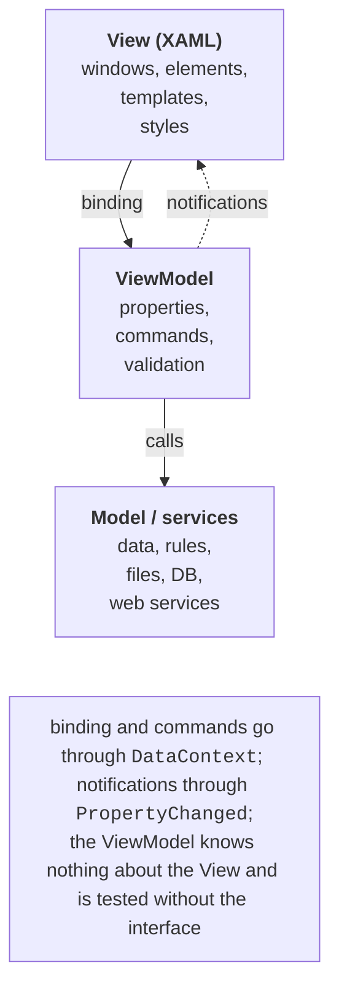

# Validation, MVVM, and CommunityToolkit

## Input validation

A binding validates data at three levels: **conversion errors** (the text `abc` for an `int` property is not written to the source), **rules** `ValidationRule` in the `Binding.ValidationRules` collection, and the **`INotifyDataErrorInfo` interface**, implemented by the source itself: the `HasErrors` property, the `GetErrors(propertyName)` method, and the `ErrorsChanged` event. The last approach suits MVVM, because the rules live in the ViewModel and are tested without the interface (<https://learn.microsoft.com/dotnet/api/system.componentmodel.inotifydataerrorinfo>).

An element with an error gets the attached properties `Validation.HasError` and `Validation.Errors`, and the `Validation.ErrorTemplate` template is drawn around it (a red border by default). The registration form ViewModel validates the age (the `Email` property with a check for the `@` character works the same way):

```cs
using System.Collections;
using System.ComponentModel;

namespace Registration;

public class RegistrationViewModel : ObservableObject,
    INotifyDataErrorInfo
{
    private readonly Dictionary<string, string> errors = [];

    public int Age
    {
        get;
        set
        {
            SetProperty(ref field, value);
            SetError(nameof(Age), value is >= 16 and <= 100
                ? null : "Age must be from 16 to 100");
        }
    } = 18;

    public bool HasErrors => errors.Count > 0;

    public event EventHandler<DataErrorsChangedEventArgs>?
        ErrorsChanged;

    public IEnumerable GetErrors(string? propertyName) =>
        propertyName is not null
        && errors.TryGetValue(propertyName, out string? error)
            ? new[] { error } : Array.Empty<string>();

    private void SetError(string property, string? error)
    {
        if (error is null)
        {
            errors.Remove(property);
        }
        else
        {
            errors[property] = error;
        }
        ErrorsChanged?.Invoke(this,
            new DataErrorsChangedEventArgs(property));
        OnPropertyChanged(nameof(HasErrors));
    }
}
```

An implicit field style in the window resources shows the text of the first error in a tooltip. A custom error look (in the example, a border with a "!" sign) is set by a `Validation.ErrorTemplate` setter with a `ControlTemplate`, in which the `AdornedElementPlaceholder` element marks the place of the field:

```xml
<Style TargetType="TextBox">
    <Style.Triggers>
        <Trigger Property="Validation.HasError" Value="True">
            <Setter Property="ToolTip" Value="{Binding
                RelativeSource={RelativeSource Self},
                Path=(Validation.Errors)[0].ErrorContent}"/>
        </Trigger>
    </Style.Triggers>
</Style>
```

The *Save* button is disabled by a data trigger in its style: a `DataTrigger` bound to `{Binding HasErrors}` with the value `True` and a setter for the `IsEnabled` property.

After `olena` is entered in the *Email* field and `12` in the *Age* field, both fields get a border and the tooltips *Email must contain @* and *Age must be from 16 to 100*, and *Save* becomes unavailable (Fig. 13.8). The text `x` in the age field gives the conversion error *Value 'x' could not be converted.*, which the ViewModel does not know about (`HasErrors` does not change), so such a value is also checked before saving.


Fig. 13.8. Displaying validation errors {.caption}

## The MVVM pattern and commands

### The roles of the parts

**Model–View–ViewModel** (MVVM) is an architectural pattern that separates the interface from the logic (Fig. 13.9) (<https://learn.microsoft.com/dotnet/communitytoolkit/mvvm/>):

- **Model** – data and business rules, services for accessing files, databases (Topics 7–8), and web services (Topic 10); it knows nothing about the interface;
- **View** – the XAML markup: elements, styles, templates; the code-behind contains only purely visual code;
- **ViewModel** – a class that prepares data for the View in a convenient form (properties with notification, collections), holds the interface state (the selected item, the search text), and performs actions (commands). The ViewModel does not reference controls.



Fig. 13.9. The structure of the MVVM pattern {.caption}

Compared with event handlers in the code-behind, MVVM gives testability and reuse of the ViewModel, but it adds classes, so for a window with two buttons the pattern is overkill.

For the XAML editor to suggest ViewModel properties in `{Binding}`, you set a **design-time data context**: attributes with the `d:` prefix (the `xmlns:d` and `xmlns:mc` namespaces are already in the window template, `mc:Ignorable="d"`) are used only by the designer and are absent from the compiled application (<https://learn.microsoft.com/visualstudio/xaml-tools/xaml-designtime-data>). For the to-do list window this is the root element attribute `d:DataContext="{d:DesignInstance Type=core:TodoViewModel}"`, where `xmlns:core="clr-namespace:TodoApp.Core;assembly=TodoApp.Core"`. Now IntelliSense inside `{Binding }` suggests `NewTitle`, `Items`, `AddCommand` (Fig. 13.10), and a mistake in a name is underlined.


Fig. 13.10. Binding suggestions with `d:DataContext` {.caption}

### Commands

In MVVM, buttons and menu items have no `Click` handlers: their `Command` property is bound to a ViewModel **command** – an object with the `ICommand` interface (the `System.Windows.Input` namespace) (<https://learn.microsoft.com/dotnet/api/system.windows.input.icommand>):

- `Execute(parameter)` – performs the action; the parameter is passed by `CommandParameter`;
- `CanExecute(parameter)` – whether the action can be performed now; an element with a command automatically becomes unavailable when the method returns `false`;
- the `CanExecuteChanged` event – a signal to the element that `CanExecute` must be called again.

The built-in WPF commands (`RoutedCommand`, Topic 12) look for handlers in the element tree, so for a ViewModel you write your own command that "relays" calls to delegates:

```cs
using System.Windows.Input;

namespace Manual;

public class RelayCommand(Action<object?> execute,
    Func<object?, bool>? canExecute = null) : ICommand
{
    public event EventHandler? CanExecuteChanged;

    public bool CanExecute(object? parameter) =>
        canExecute?.Invoke(parameter) ?? true;

    public void Execute(object? parameter) => execute(parameter);

    // The ViewModel reports that the CanExecute condition may have changed.
    public void RaiseCanExecuteChanged() =>
        CanExecuteChanged?.Invoke(this, EventArgs.Empty);
}
```

The ViewModel creates the command in the constructor and calls `RaiseCanExecuteChanged` from the setter of the property the condition depends on:

```cs
AddCommand = new RelayCommand(_ => Add(),
    _ => !string.IsNullOrWhiteSpace(NewTitle));
// in the NewTitle setter:
if (SetProperty(ref field, value))
{
    AddCommand.RaiseCanExecuteChanged();
}
```

The button `<Button Content="_Add" Command="{Binding AddCommand}"/>` is unavailable while the title field is empty and becomes enabled after the first character is typed. The command parameter is set with a binding, for example `CommandParameter="{Binding SelectedItem, ElementName=itemsList}"`; a change of the parameter also makes the button call `CanExecute` again.

## The CommunityToolkit.Mvvm library

A base class, commands, and notifications would have to be written in every project, so Microsoft supports the **CommunityToolkit.Mvvm** library (MVVM Toolkit, the `CommunityToolkit.Mvvm` NuGet package, current version 8.4.2). It does not depend on WPF and also works in WinUI and .NET MAUI (Topic 15) (<https://www.nuget.org/packages/CommunityToolkit.Mvvm>). The `ObservableObject` base class contains `SetProperty` and `OnPropertyChanged`; the `[ObservableProperty]` attribute generates a property with notification, `[NotifyPropertyChangedFor]` a notification about a dependent property, `[RelayCommand]` a command from a method (`Add()` → `AddCommand`, `SaveAsync()` → `SaveCommand`), and `[NotifyCanExecuteChangedFor]` a repeated `CanExecute` check after a property changes. The `ObservableValidator` class implements `INotifyDataErrorInfo` for the validation attributes `[Required]`, `[Range]` (the `[NotifyDataErrorInfo]` attribute), and `WeakReferenceMessenger` passes messages between ViewModels.

Classes with the attributes must be `partial`, because **source generators** write the second part of the class during compilation (<https://learn.microsoft.com/dotnet/communitytoolkit/mvvm/generators/overview>). The documentation shows the `[ObservableProperty]` attribute on fields (`private string name;` → the `Name` property), but starting with version 8.4 **partial properties** are recommended: since C# 14 they do not require a preview language version, and the MVVMTK0042 analyzer offers to convert a field into a property. The generated property is visible to other generators and to IntelliSense.

A method with the `[RelayCommand]` attribute that returns `Task` becomes an asynchronous `IAsyncRelayCommand`: while it runs, the `IsRunning` property is `true`, and starting it again is not allowed. A `CancellationToken` parameter of the method links the command to cancellation, and `[RelayCommand(IncludeCancelCommand = true)]` also creates a `…CancelCommand` command (<https://learn.microsoft.com/dotnet/communitytoolkit/mvvm/generators/relaycommand>). The generated code can be viewed in *Solution Explorer*: *Dependencies → Analyzers → CommunityToolkit.Mvvm.SourceGenerators* (Fig. 13.11).


Fig. 13.11. Code generated by CommunityToolkit.Mvvm {.caption}

The **messenger** passes messages between parts of the application that have no references to each other (for example, a to-do list and a status bar). `WeakReferenceMessenger` holds recipients through weak references, so a forgotten unsubscription does not cause a memory leak (<https://learn.microsoft.com/dotnet/communitytoolkit/mvvm/messenger>). The `Send` and `Register` methods are extension methods from the `CommunityToolkit.Mvvm.Messaging` namespace:

```cs
public record TodoAddedMessage(string Title);
// Recipient (in the StatusViewModel constructor):
WeakReferenceMessenger.Default
    .Register<StatusViewModel, TodoAddedMessage>(this,
        (recipient, message) =>
            recipient.LastAdded = message.Title);
// Sender:
WeakReferenceMessenger.Default.Send(new TodoAddedMessage("Walk"));
```
