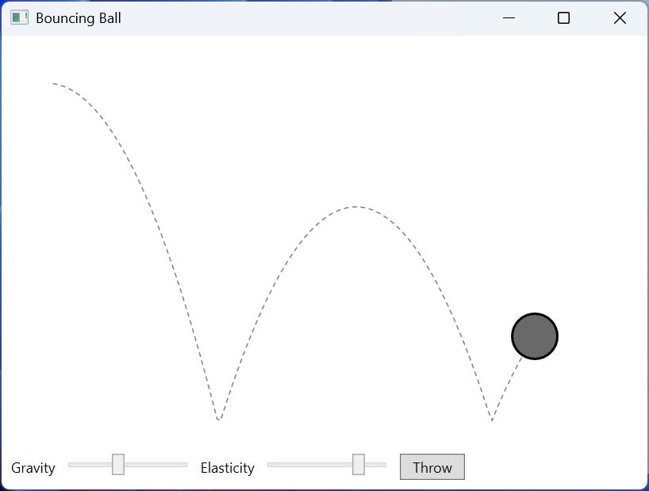

# Frame-by-frame animation and performance

## Frame-by-frame animation

Storyboards describe motion that is known in advance well. In a game or a physical model the next position depends on velocity, collisions, and user actions, so it is calculated in every frame. For this WPF has the static `CompositionTarget.Rendering` event, which occurs before every frame is drawn, after layout (<https://learn.microsoft.com/dotnet/desktop/wpf/graphics-multimedia/how-to-render-on-a-per-frame-interval-using-compositiontarget>). Usage rules:

- the frame rate depends on the computer and the load (on the test computer, 60 frames per second), so the displacement is calculated from time: *x* = *x* + *v* · *dt*, where *dt* is the time since the previous frame;
- the event parameter is cast to `RenderingEventArgs`; its `RenderingTime` property is the frame time. The event can occur several times for the same frame; then `RenderingTime` does not change, and the repeated call is skipped;
- the event is static: the subscription keeps the window in memory, so you unsubscribe when the window closes.

A `DispatcherTimer` (Topic 5) also calls its handler on the UI thread, but with its own interval that is not synchronized with the frames. It is used for infrequent events: updating a clock, a media file position, a game timer.

### Example: a bouncing ball

The ball falls under gravity, bounces off the floor and the walls, losing part of its speed at every impact, and leaves a dotted trail (Fig. 14.7). Sliders change the gravitational acceleration and the elasticity. The model does not depend on WPF (the `Ball.cs` file), so it can be tested without a window:

```cs
namespace BouncingBall;

// The ball model: center and velocity in pixels (DIP).
public class Ball
{
    public double X { get; set; } = 40;
    public double Y { get; set; } = 40;
    public double VX { get; set; } = 180;    // pixels per second
    public double VY { get; set; }
    public double Radius { get; } = 20;
    public double Gravity { get; set; } = 900;
    public double Elasticity { get; set; } = 0.8;

    // Motion over dt seconds in a width × height field.
    // Returns true if the ball hit the floor.
    public bool Step(double dt, double width, double height)
    {
        VY += Gravity * dt;
        X += VX * dt;
        Y += VY * dt;
        if (X < Radius || X > width - Radius)
        {
            X = Math.Clamp(X, Radius, width - Radius);
            VX = -VX;                        // bounce off a wall
        }
        if (Y > height - Radius && VY > 0)
        {
            Y = height - Radius;
            VY = -VY * Elasticity;           // energy loss
            return true;
        }
        return false;
    }
}
```

The `MainWindow.xaml` markup: a canvas with a dashed trail polyline and the ball, with sliders below it:

```xml
<Window x:Class="BouncingBall.MainWindow"
    xmlns="http://schemas.microsoft.com/winfx/2006/xaml/presentation"
    xmlns:x="http://schemas.microsoft.com/winfx/2006/xaml"
    Title="Bouncing Ball" Width="560" Height="420">
    <DockPanel>
        <StackPanel DockPanel.Dock="Bottom" Orientation="Horizontal"
                    Margin="8">
            <TextBlock Text="Gravity" VerticalAlignment="Center"/>
            <Slider x:Name="gravitySlider" Width="110" Margin="6,0"
                    Minimum="100" Maximum="2000" Value="900"/>
            <TextBlock Text="Elasticity" VerticalAlignment="Center"/>
            <Slider x:Name="elasticitySlider" Width="110" Margin="6,0"
                    Minimum="0.3" Maximum="0.95" Value="0.8"/>
            <Button Content="Throw" Padding="10,2"
                    Click="Throw_Click"/>
        </StackPanel>
        <Canvas x:Name="field" Background="White" ClipToBounds="True">
            <Polyline x:Name="trail" Stroke="Gray"
                      StrokeDashArray="4 3"/>
            <Ellipse x:Name="ballShape" Width="40" Height="40"
                     Fill="DimGray" Stroke="Black"
                     StrokeThickness="2"/>
        </Canvas>
    </DockPanel>
</Window>
```

The `OnRendering` handler in the `MainWindow.xaml.cs` file calculates the time since the previous frame, advances the model, and transfers it to the screen. Limiting *dt* to 0.05 s is needed in case the window "froze" for a moment (dragging, minimizing): otherwise the ball would fly through the floor in a single step.

```cs
using System.Windows;
using System.Windows.Controls;
using System.Windows.Media;

namespace BouncingBall;

public partial class MainWindow : Window
{
    private readonly Ball ball = new();
    private TimeSpan lastTime = TimeSpan.Zero;

    public MainWindow()
    {
        InitializeComponent();
        Loaded += (s, e) =>
            CompositionTarget.Rendering += OnRendering;
        Closed += (s, e) =>
            CompositionTarget.Rendering -= OnRendering;
    }

    private void OnRendering(object? sender, EventArgs e)
    {
        TimeSpan now = ((RenderingEventArgs)e).RenderingTime;
        if (now == lastTime) return;         // this frame was already handled
        double dt = lastTime == TimeSpan.Zero
            ? 0 : (now - lastTime).TotalSeconds;
        lastTime = now;
        if (field.ActualWidth < 2 * ball.Radius) return;

        ball.Gravity = gravitySlider.Value;
        ball.Elasticity = elasticitySlider.Value;
        dt = Math.Min(dt, 0.05);             // after a window delay
        ball.Step(dt, field.ActualWidth, field.ActualHeight);
        Draw();
    }

    private void Draw()
    {
        Canvas.SetLeft(ballShape, ball.X - ball.Radius);
        Canvas.SetTop(ballShape, ball.Y - ball.Radius);
        trail.Points.Add(new Point(ball.X, ball.Y));
        if (trail.Points.Count > 150) trail.Points.RemoveAt(0);
    }

    private void Throw_Click(object sender, RoutedEventArgs e)
    {
        (ball.X, ball.Y, ball.VX, ball.VY) = (40, 40, 180, 0);
        trail.Points.Clear();
    }
}
```

The model was tested separately with a step of 1/60 s in a 544 × 343 field (the canvas size in the window):

```
Impact 1: t = 0.80 s, x = 184, upward speed 576
Impact 2: t = 2.07 s, x = 412, upward speed 451
Impact 3: t = 3.07 s, x = 458, upward speed 359
Impact 4: t = 3.85 s, x = 317, upward speed 277
```

After each impact the speed is multiplied by 0.8, so the bounces become lower and more frequent; between the third and fourth impacts the ball bounced off the right wall.



Fig. 14.7. The "Bouncing ball" application {.caption}

## Animation performance

Animations run on the UI thread, so their number and complexity affect the smoothness of the whole window. The main techniques:

- **freezing** `Freezable` objects. The `Freeze()` method makes a brush, transform, geometry, or image immutable: WPF no longer tracks its changes and can use it on several threads (<https://learn.microsoft.com/dotnet/desktop/wpf/advanced/freezable-objects-overview>). Check `CanFreeze` before the call. The ready-made `Brushes.Gray` brushes are already frozen;
- animate **transforms** (`RenderTransform`) and `Opacity` rather than `Width`, `Margin`, or `LayoutTransform`, which force the layout to be recalculated;
- `CacheMode="BitmapCache"` for a complex element that only moves, rotates, or changes opacity: WPF draws it once into a bitmap and then moves the ready bitmap (<https://learn.microsoft.com/dotnet/api/system.windows.media.bitmapcache>). When scaled, the bitmap gets blurry;
- `Timeline.DesiredFrameRate` – the desired frame rate of the root timeline (`<Storyboard Timeline.DesiredFrameRate="30">`) for slow background animations (<https://learn.microsoft.com/dotnet/api/system.windows.media.animation.timeline.desiredframerate>);
- the `RenderOptions` attached properties: `RenderOptions.BitmapScalingMode="NearestNeighbor"` (fast image scaling without smoothing, crisp pixels) and `RenderOptions.EdgeMode="Aliased"` (shapes without edge anti-aliasing) (<https://learn.microsoft.com/dotnet/api/system.windows.media.renderoptions>);

```cs
var brush = new SolidColorBrush(Colors.Gray);
if (brush.CanFreeze) brush.Freeze();
brush.Color = Colors.Black;       // InvalidOperationException
```

An attempt to change the frozen brush ended with the exception *Cannot set a property on object '#FF808080' because it is in a read-only state*, and an attempt to animate it with *Cannot animate the 'Color' property on 'System.Windows.Media.SolidColorBrush' because the object is sealed or frozen*. The `Clone()` method creates an unfrozen copy that can be changed.
