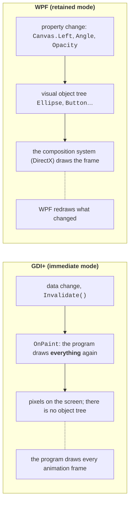
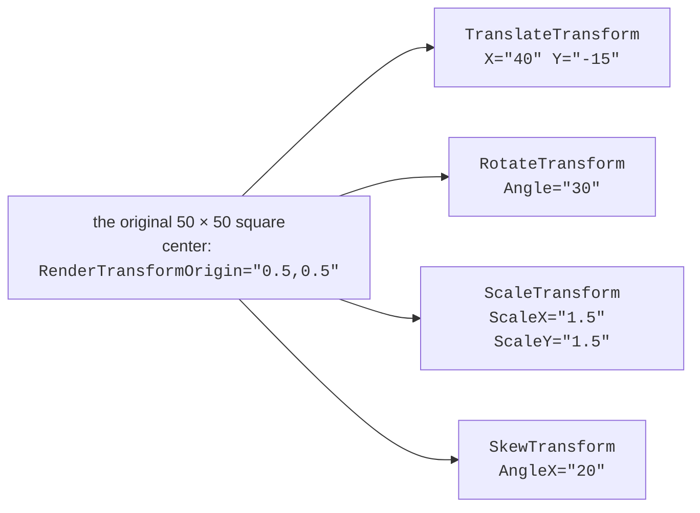
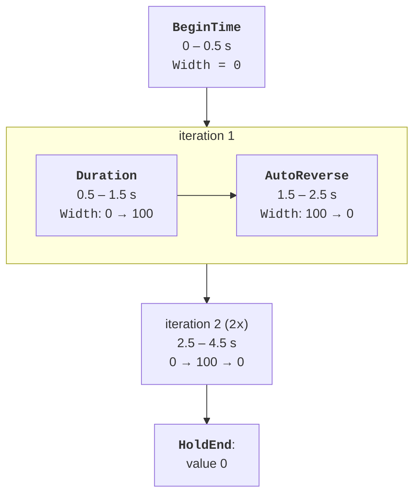

# Graphics and property animation

## WPF graphics: retained mode

In Topic 4, Windows Forms graphics were drawn with GDI+ in **immediate mode**: the window does not remember what has been drawn on it, so after every change the program calls `Invalidate()` and draws everything again in `OnPaint`. WPF works in **retained mode**: a button, an ellipse, or a line is an object in the visual element tree that WPF remembers and redraws itself through DirectX (Fig. 14.1) (<https://learn.microsoft.com/dotnet/desktop/wpf/graphics-multimedia/wpf-graphics-rendering-overview>). To move a shape, it is enough to change its property, for example `Canvas.Left`; you do not need to write a drawing method.



Fig. 14.1. GDI+ immediate mode and WPF retained mode {.caption}

That is why animation in WPF is **changing property values over time**: every frame the animation system calculates a new value (width, rotation angle, opacity), and the composition system shows the result.

### Shapes and brushes

The simple shapes from the `System.Windows.Shapes` namespace – `Rectangle`, `Ellipse`, `Line`, `Polyline`, `Polygon`, and `Path` – are full-fledged elements: they have a size and mouse events, are placed on panels, and have the `Fill` (fill brush), `Stroke` (outline brush), `StrokeThickness`, and `StrokeDashArray` (dashes) properties (<https://learn.microsoft.com/dotnet/desktop/wpf/graphics-multimedia/shapes-and-basic-drawing-in-wpf-overview>). A `Path` shape is defined with the **path markup mini-language**: `M x,y` – move to a point, `L x,y` – a line segment, `C` – a Bézier curve, `A` – an elliptical arc, `Z` – close the figure; for example, `<Path Stroke="Black" Data="M 10,50 L 60,10 L 110,50 Z"/>` draws a triangle (<https://learn.microsoft.com/dotnet/desktop/wpf/graphics-multimedia/geometry-overview>). Coordinates are given in device-independent units (1/96 inch), as in Topic 12.

A brush (`Brush`) paints a shape, a background, or text: `SolidColorBrush` – a solid color, `LinearGradientBrush` and `RadialGradientBrush` – gradients with `GradientStop` points, `ImageBrush` – an image. Brushes, transforms, and geometries are not interface elements: they derive from the `Freezable` class, which matters for animation and performance.

## Transformations

A **transform** changes the look of an element without changing its `Width`, `Height`, or `Margin` properties (Fig. 14.2) (<https://learn.microsoft.com/dotnet/desktop/wpf/graphics-multimedia/transforms-overview>):

- `TranslateTransform` – a shift by `X`, `Y`;
- `RotateTransform` – a clockwise rotation by the `Angle` in degrees;
- `ScaleTransform` – scaling by `ScaleX`, `ScaleY` (a negative value mirrors);
- `SkewTransform` – a skew by `AngleX`, `AngleY`;
- `TransformGroup` – several transforms applied in the order they are written.



Fig. 14.2. Kinds of transforms: dashed – the original square, dot – the transform center {.caption}

By default, the center of rotation and scaling is the top-left corner of the element. The `RenderTransformOrigin="0.5,0.5"` property moves it to the center: the coordinates are given as fractions of the element's width and height (0 – the left/top edge, 1 – the right/bottom edge).

### `RenderTransform` and `LayoutTransform`

A transform is assigned to one of two properties:

- `RenderTransform` is applied **after** layout: neighboring elements do not move, and a rotated element can overlap them. This is fast, so it is the one used for animation;
- `LayoutTransform` is applied **before** layout: the panel allocates space for the rotated element. In a test, a `StackPanel` of three buttons with the middle one rotated by 45° had a height of 59.9 units with `RenderTransform` and 110.6 with `LayoutTransform`.

Animating `LayoutTransform` forces the panel to recalculate the layout in every frame, so it is much slower.

## The property animation system

In WPF an animation is applied to an individual property. A property can be animated if three conditions are met (<https://learn.microsoft.com/dotnet/desktop/wpf/graphics-multimedia/animation-overview>):

1. it is a **dependency property** (Topic 12);
2. it belongs to a class derived from `DependencyObject` that implements the `IAnimatable` interface (all elements, shapes, brushes, transforms);
3. there is an animation class for its type.

The animation classes from the `System.Windows.Media.Animation` namespace are named after the value type (Table 14.1). An ordinary C# property or a field cannot be animated: they lack the mechanism through which the animation system supplies values.

Table 14.1. The main animation classes {.caption}

| **Type** | **Animation** | **Example property** |
| --- | --- | --- |
| `double` | `DoubleAnimation` | `Width`, `Opacity`, `Canvas.Left`, `RotateTransform.Angle` |
| `Color` | `ColorAnimation` | `SolidColorBrush.Color`, `GradientStop.Color` |
| `Thickness` | `ThicknessAnimation` | `Margin`, `Padding`, `BorderThickness` |
| `Point` | `PointAnimation` | `EllipseGeometry.Center`, `LineGeometry.StartPoint` |

Besides these **basic** animations, each type has a key-frame animation (`DoubleAnimationUsingKeyFrames`), and `double`, `Point`, and `Matrix` also have a path animation (`DoubleAnimationUsingPath`).

### `From`, `To`, and `By`

A basic animation moves from a starting value to an ending value (<https://learn.microsoft.com/dotnet/desktop/wpf/graphics-multimedia/from-to-by-animations-overview>):

- `From` and `To` – from `From` to `To`;
- only `To` – from the current value to `To` (the most convenient option: the animation continues from where the previous one stopped);
- only `By` – from the current value to `By` more;
- none – to the **base** value of the property, that is, the value without animations. This is how a button is returned to its normal size after the cursor leaves it.

### Animation from code: `BeginAnimation`

The shortest way to start an animation from code is the `BeginAnimation(property, animation)` method, which all elements, brushes, and transforms have:

```cs
var grow = new DoubleAnimation
{
    To = 250,                                  // from the current value
    Duration = TimeSpan.FromSeconds(0.3)
};
box.BeginAnimation(WidthProperty, grow);       // Rectangle box
```

In the same way, a `PointAnimation` started for the `EllipseGeometry.CenterProperty` property moves the center of a circle: in a test it ended up at the point (200, 60). A rectangle 100 wide had a width of 150 after an animation with `By = 50`.

## Animation timing parameters

All animations derive from the `Timeline` class and have the same timing parameters (Fig. 14.3) (<https://learn.microsoft.com/dotnet/desktop/wpf/graphics-multimedia/timing-behaviors-overview>):

- `Duration` – the duration of one iteration, in XAML `"hours:minutes:seconds"`, for example `"0:0:1.5"`; 1 s by default;
- `BeginTime` – the delay before the start;
- `AutoReverse="True"` – after reaching the end, play the animation in reverse; one iteration takes twice as long;
- `RepeatBehavior` – the number of repeats `"3x"`, a total time `"0:0:10"`, or `"Forever"`;
- `SpeedRatio` – the rate at which time flows: `2` means twice as fast;
- `FillBehavior` – what happens after completion: `HoldEnd` (the default) holds the final value, `Stop` returns the property to its base value.



Fig. 14.3. Timing parameters of a width animation from 0 to 100 {.caption}

The figure shows the animation `From="0" To="100" Duration="0:0:1" BeginTime="0:0:0.5" AutoReverse="True" RepeatBehavior="2x"`. Its values were read from WPF every 0.5 s: 0, 0, 50, 100, 50, 0, 50, 100, 50, 0, 0. The animation ends after 4.5 s (0.5 + 2 · 2 s) and holds the last value 0.

::: tip Important
While an animation with `FillBehavior="HoldEnd"` holds a value, assigning the property in code "does not work". In a test, after an animation to 250, the line `box.Width = 40` left the width at 250: the animation has a higher precedence than the local value (Topic 12). To give control back to the code, remove the animation with `box.BeginAnimation(WidthProperty, null)` – after that the width became 40 – or set `FillBehavior = FillBehavior.Stop` from the start.
:::
