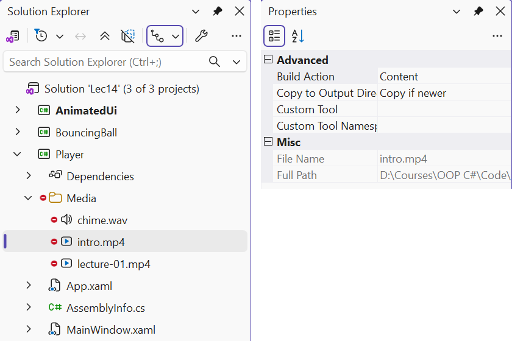
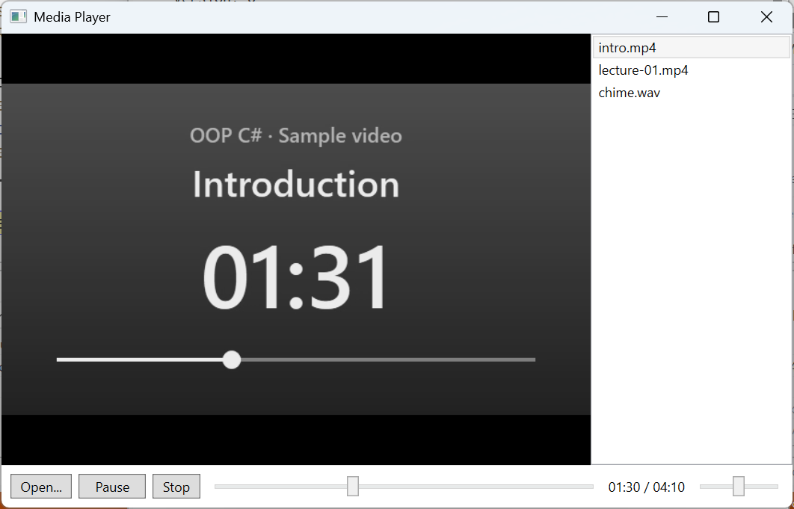

# Images, sound, and video

## Images and sound

### Images: `Image` and `BitmapImage`

The `Image` element shows an image (PNG, JPEG, BMP, GIF, TIFF, ICO); `Stretch` sets the scaling: `Uniform` (the default, preserving proportions), `UniformToFill`, `Fill`, `None` (<https://learn.microsoft.com/dotnet/desktop/wpf/graphics-multimedia/imaging-overview>). An image added to the project with the *Resource* build action is specified by a relative path: `<Image Source="Images/logo.png"/>`. For a file on disk, a `BitmapImage` is created in code:

```cs
var bitmap = new BitmapImage();
bitmap.BeginInit();
bitmap.UriSource = new Uri(path);        // the full file path
bitmap.DecodePixelWidth = 400;           // shrink while reading
bitmap.CacheOption = BitmapCacheOption.OnLoad;   // do not hold the file
bitmap.EndInit();
bitmap.Freeze();
photo.Source = bitmap;                   // an Image element
```

`DecodePixelWidth` decodes the photo directly at the required size and saves memory (a 1920 × 1200 Windows wallpaper was read as a 400 × 250 image), and `CacheOption.OnLoad` reads the whole file during `EndInit`, so it can be deleted or overwritten immediately.

### Sound: `SoundPlayer`, `MediaPlayer`, `SoundPlayerAction`

There are three tools for short sound signals:

- `System.Media.SoundPlayer` – WAV files only; the `Load`, `Play` (asynchronous), `PlaySync`, `PlayLooping`, `Stop` methods (<https://learn.microsoft.com/dotnet/api/system.media.soundplayer>). If the file does not exist, `Load` and `Play` throw a `FileNotFoundException` with the message *Please be sure a sound file exists at the specified location*;
- `System.Windows.Media.MediaPlayer` – audio and video without a visual element (MP3, WMA, WAV, M4A, and the formats Windows Media Foundation supports), `Volume`, several players at the same time (<https://learn.microsoft.com/dotnet/api/system.windows.media.mediaplayer>);
- `SoundPlayerAction` – a trigger action in XAML that plays a WAV file without code: `<EventTrigger RoutedEvent="Button.Click"><SoundPlayerAction Source="Sounds/click.wav"/></EventTrigger>` (<https://learn.microsoft.com/dotnet/api/system.windows.controls.soundplayeraction>).

```cs
private readonly MediaPlayer player = new();   // a class field

player.MediaFailed += (s, e) =>
    status.Text = e.ErrorException.Message;
player.Open(new Uri(Path.Combine(AppContext.BaseDirectory,
    "Sounds", "click.wav")));
player.Play();
```

`MediaPlayer` opens a file asynchronously: errors do not throw exceptions but arrive through the `MediaFailed` event. For a missing file, `e.ErrorException` is a `FileNotFoundException` *Cannot find the media file*. The duration `NaturalDuration` is known only after the `MediaOpened` event (1.62 s for the system sound `tada.wav`).

## Video and `MediaElement`

`MediaElement` is an interface element that shows video and plays audio; it can be placed on any panel, rotated with a transform, or have text overlaid on it (<https://learn.microsoft.com/dotnet/desktop/wpf/graphics-multimedia/multimedia-overview>). It uses Windows codecs (Windows Media Player / Media Foundation): WPF plays the formats the operating system supports (usually MP4 with H.264, WMV, MP3, WAV). The main members:

- `Source` – the file `Uri`; `LoadedBehavior`: `Play` by default (playback right after loading). To control playback with the `Play`, `Pause`, and `Stop` methods, you must set `LoadedBehavior="Manual"`, otherwise the calls do not work;
- `Position` – the current position; assigning it moves to another place (seeking); `NaturalDuration` – the duration, available after `MediaOpened` (`HasTimeSpan`);
- `Volume` (0–1, 0.5 by default), `IsMuted`, `Balance`, `SpeedRatio`;
- the `MediaOpened`, `MediaEnded`, `MediaFailed` (`ExceptionRoutedEventArgs.ErrorException`), `BufferingStarted`, and `BufferingEnded` events.

`MediaElement` has no position change event, so the position slider is updated by a `DispatcherTimer` several times per second.

### Media files in a project

A media file **cannot** be embedded as a resource (*Resource*): `MediaElement` and `MediaPlayer` read only files. The file is added to the project (for example, `Media/intro.mp4`), and in *Properties* you set *Build Action = Content* and *Copy to Output Directory = Copy if newer* (Fig. 14.8), which corresponds to this entry in the `.csproj`:

```xml
<ItemGroup>
  <Content Include="Media\intro.mp4">
    <CopyToOutputDirectory>PreserveNewest</CopyToOutputDirectory>
  </Content>
</ItemGroup>
```

A relative `Uri` is resolved against the process's **current directory**, which depends on how the program was started, so it is more reliable to build the full path from the program folder: `new Uri(Path.Combine(AppContext.BaseDirectory, "Media", "intro.mp4"))`.



Fig. 14.8. Media file settings in the *Properties* window {.caption}

For the learning examples, use **your own** files: a video recorded with the Windows *Camera* app or a smartphone, sound recorded with the *Sound Recorder* app, or freely licensed files from an official source whose terms allow such use. Do not add files from unverified sites to the project.

### Example: a media player

The media player opens several files into a playlist, shows video, has *Play*/*Pause* and *Stop* buttons, a position slider with a "current / total" time, and a volume slider, and moves to the next file after the current one ends (Fig. 14.9). `MediaElement` is controlled by methods rather than properties, so the example is written in the code-behind; in an MVVM application (Topic 13) these calls are moved into a view service. The `MainWindow.xaml` markup:

```xml
<Window x:Class="Player.MainWindow"
    xmlns="http://schemas.microsoft.com/winfx/2006/xaml/presentation"
    xmlns:x="http://schemas.microsoft.com/winfx/2006/xaml"
    Title="Media Player" Width="720" Height="460">
    <DockPanel>
        <DockPanel DockPanel.Dock="Bottom" Margin="8">
            <Button Content="Open..." Padding="8,2"
                    Click="Open_Click"/>
            <Button x:Name="playButton" Content="Play" Width="60"
                    Margin="6,0" Click="Play_Click"/>
            <Button Content="Stop" Padding="8,2" Click="Stop_Click"/>
            <Slider x:Name="volumeSlider" DockPanel.Dock="Right"
                    Width="80" Maximum="1" Value="0.5"
                    VerticalAlignment="Center" ToolTip="Volume"/>
            <TextBlock x:Name="timeText" DockPanel.Dock="Right"
                       Text="00:00 / 00:00" Margin="0,0,8,0"
                       VerticalAlignment="Center"/>
            <Slider x:Name="positionSlider" Margin="8,0"
                    VerticalAlignment="Center"
                    Thumb.DragStarted="Position_DragStarted"
                    Thumb.DragCompleted="Position_DragCompleted"/>
        </DockPanel>
        <ListBox x:Name="playlist" DockPanel.Dock="Right" Width="180"
                 DisplayMemberPath="Name"
                 SelectionChanged="Playlist_SelectionChanged"/>
        <Border Background="Black">
            <MediaElement x:Name="media" LoadedBehavior="Manual"
                Volume="{Binding Value, ElementName=volumeSlider}"
                MediaOpened="Media_MediaOpened"
                MediaEnded="Media_MediaEnded"
                MediaFailed="Media_MediaFailed"/>
        </Border>
    </DockPanel>
</Window>
```

The volume is linked to the slider through element binding. The attached events `Thumb.DragStarted` and `Thumb.DragCompleted` report that the user is dragging the position slider's thumb: during that time the timer must not overwrite the slider value. The `MainWindow.xaml.cs` file:

```cs
using System.IO;
using System.Windows;
using System.Windows.Controls;
using System.Windows.Controls.Primitives;
using System.Windows.Threading;
using Microsoft.Win32;

namespace Player;

public partial class MainWindow : Window
{
    private readonly DispatcherTimer timer =
        new() { Interval = TimeSpan.FromMilliseconds(250) };
    private bool isPlaying;
    private bool isDragging;       // the user is dragging the slider

    public MainWindow()
    {
        InitializeComponent();
        timer.Tick += (s, e) => UpdatePosition();
    }

    private void Open_Click(object sender, RoutedEventArgs e)
    {
        var dialog = new OpenFileDialog
        {
            Filter = "Media files|*.mp4;*.wmv;*.mp3;*.m4a;*.wav"
                + "|All files|*.*",
            Multiselect = true
        };
        if (dialog.ShowDialog(this) != true) return;
        foreach (string file in dialog.FileNames)
            playlist.Items.Add(new FileInfo(file));
        if (playlist.SelectedIndex < 0) playlist.SelectedIndex = 0;
    }

    private void Playlist_SelectionChanged(object sender,
        SelectionChangedEventArgs e)
    {
        if (playlist.SelectedItem is not FileInfo file) return;
        media.Source = new Uri(file.FullName);
        SetPlaying(true);
    }
```

The playlist stores `FileInfo` objects, and `DisplayMemberPath="Name"` shows only the file names. Selecting a list item (with a click or from code) opens the file and starts playback. The `SetPlaying` method toggles between playback and pause, changes the button caption, and enables the timer only during playback.

```cs
private void SetPlaying(bool play)
{
    if (play) media.Play();
    else media.Pause();
    isPlaying = play;
    playButton.Content = play ? "Pause" : "Play";
    timer.IsEnabled = play;
}

private void Play_Click(object sender, RoutedEventArgs e)
{
    if (media.Source != null) SetPlaying(!isPlaying);
}

private void Stop_Click(object sender, RoutedEventArgs e)
{
    SetPlaying(false);
    media.Stop();                // the position returns to 0
    UpdatePosition();
}

private void Media_MediaOpened(object sender, RoutedEventArgs e)
{
    positionSlider.Maximum = media.NaturalDuration.HasTimeSpan
        ? media.NaturalDuration.TimeSpan.TotalSeconds : 0;
    UpdatePosition();
}

private void Media_MediaEnded(object sender, RoutedEventArgs e)
{
    if (playlist.SelectedIndex < playlist.Items.Count - 1)
        playlist.SelectedIndex++;          // the next file
    else
        Stop_Click(sender, e);
}

private void Media_MediaFailed(object? sender,
    ExceptionRoutedEventArgs e)
{
    Stop_Click(this, e);
    MessageBox.Show(this, e.ErrorException.Message,
        "Cannot play the file", MessageBoxButton.OK,
        MessageBoxImage.Error);
}
```

The position slider works in seconds: its maximum is the file duration, and its value is the current position. When the user releases the thumb, the player seeks to the selected position:

```cs
    private void Position_DragStarted(object sender,
        DragStartedEventArgs e) => isDragging = true;

    private void Position_DragCompleted(object sender,
        DragCompletedEventArgs e)
    {
        isDragging = false;
        media.Position = TimeSpan.FromSeconds(positionSlider.Value);
    }

    private void UpdatePosition()
    {
        if (!isDragging)
            positionSlider.Value = media.Position.TotalSeconds;
        TimeSpan total = media.NaturalDuration.HasTimeSpan
            ? media.NaturalDuration.TimeSpan : TimeSpan.Zero;
        timeText.Text = $@"{media.Position:mm\:ss} / {total:mm\:ss}";
    }
}
```

In the `mm\:ss` format string the colon is escaped, because in a custom `TimeSpan` format it is not a separator by default. During testing, two Windows system sounds were added to the list: after `MediaOpened` the slider got a maximum of 1.09 (the duration of the first file), after `MediaEnded` the player moved to the second file by itself (5.57 s), seeking `Position` to 1 s showed "00:01 / 00:05", and *Stop* showed "00:00 / 00:05".



Fig. 14.9. The "Media player" application {.caption}
