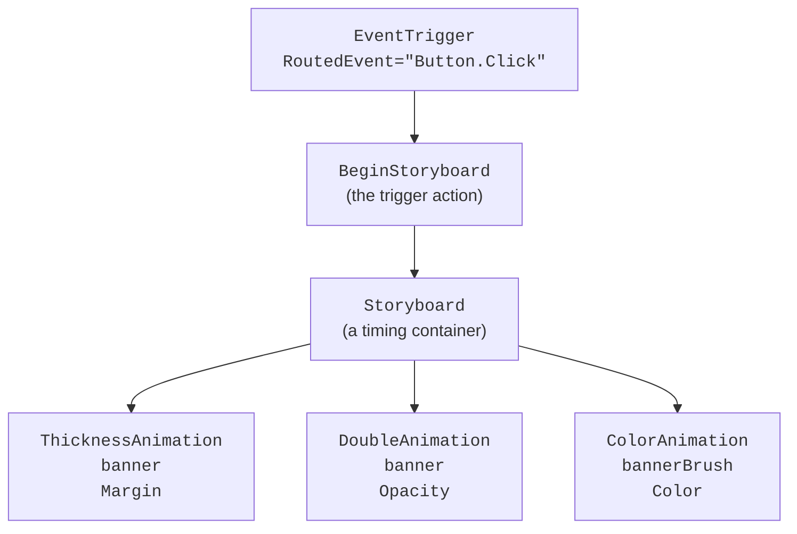
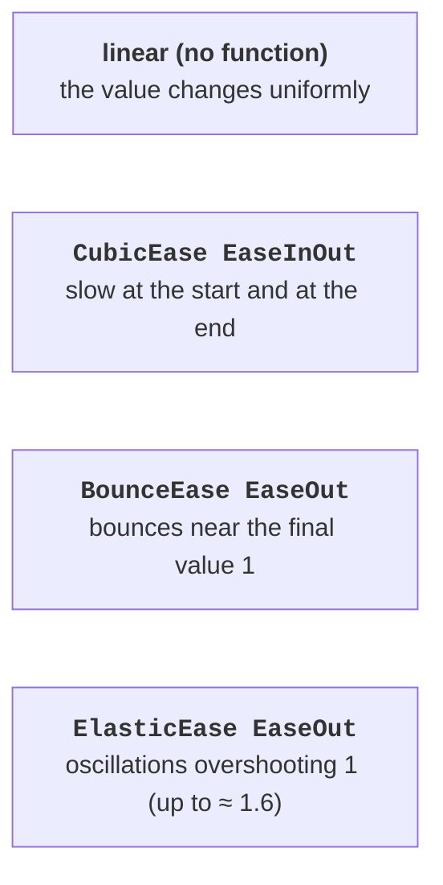

# Storyboards and keyframes

## `Storyboard` storyboards and triggers

A **storyboard** is a container timeline that starts several animations together and specifies, with attached properties, what exactly to animate (<https://learn.microsoft.com/dotnet/desktop/wpf/graphics-multimedia/storyboards-overview>):

- `Storyboard.TargetName` – the name (`x:Name`) of an element or a `Freezable` object (a brush, a transform);
- `Storyboard.TargetProperty` – the path to the property. A simple path: `"Width"`, `"Opacity"`. A path through nested objects is written with dots (`"RenderTransform.Angle"`) or in the full form with types in parentheses: `"(UIElement.RenderTransform).(RotateTransform.Angle)"`.

The full form is needed when the object type is not obvious (for example, in a style) and in code. If the transform has no name, the animation finds it by the path from the element, but the transform itself must be set in advance: by default `RenderTransform` contains an immutable identity transform, and an angle animation has no effect at all. If the transform is set in a style, it is frozen; a storyboard automatically animates a copy of it, while calling `BeginAnimation` for such an object throws an exception.

### Starting in XAML: `EventTrigger` and `BeginStoryboard`

In XAML a storyboard is started by an **event trigger** `EventTrigger`, whose `BeginStoryboard` action begins the storyboard (Fig. 14.4). Event triggers are written into the `Triggers` collection of an element or a style; `RoutedEvent` sets the routed event, for example `Button.Click` or `FrameworkElement.Loaded`. For a property trigger (`Trigger` in a style), storyboards are started in `Trigger.EnterActions` (the condition became true) and `Trigger.ExitActions` (the condition became false).



Fig. 14.4. The structure of the trigger with a storyboard from the "Animated interface elements" example {.caption}

In custom control templates (Topic 13), storyboards are also described for `VisualStateManager` states (`MouseOver`, `Pressed`).

### Control from code

A storyboard described in resources is obtained with the `FindResource` method and controlled with the `Begin`, `Pause`, `Resume`, `Stop`, `Seek`, and `SetSpeedRatio` methods. For the control methods to work, the storyboard is started with the `isControllable: true` parameter, and every method is passed the same element for which it was started. The `Completed` event occurs after all child animations finish; `Stop` stops the animations and returns the properties to their base values. A storyboard can also be created in code:

```cs
var spin = new DoubleAnimation(0, 360, TimeSpan.FromSeconds(1));
Storyboard.SetTargetProperty(spin, new PropertyPath(
    "(UIElement.RenderTransform).(RotateTransform.Angle)"));
var storyboard = new Storyboard();
storyboard.Children.Add(spin);
storyboard.Begin(logo);   // logo has a RotateTransform set
```

### Example: animated interface elements

The window contains a spinning loading indicator, a progress bar, buttons for controlling the storyboard, and a *Notify* button that shows a notification (Fig. 14.5). Each button smoothly grows by 15 % when the cursor is over it and returns to its normal size when the cursor leaves it. The project is a *WPF Application* (.NET 10); the `MainWindow.xaml` file:

```xml
<Window x:Class="AnimatedUi.MainWindow"
    xmlns="http://schemas.microsoft.com/winfx/2006/xaml/presentation"
    xmlns:x="http://schemas.microsoft.com/winfx/2006/xaml"
    Title="Animated UI" Width="440" Height="300">
    <Window.Resources>
        <!-- The button grows when the cursor is over it. -->
        <Style TargetType="Button">
            <Setter Property="Margin" Value="4"/>
            <Setter Property="Padding" Value="10,3"/>
            <Setter Property="RenderTransformOrigin" Value="0.5,0.5"/>
            <Setter Property="RenderTransform">
                <Setter.Value>
                    <ScaleTransform/>
                </Setter.Value>
            </Setter>
            <Style.Triggers>
                <Trigger Property="IsMouseOver" Value="True">
                    <Trigger.EnterActions>
                        <BeginStoryboard>
                            <Storyboard>
                                <DoubleAnimation To="1.15"
                                    Duration="0:0:0.15"
                                    Storyboard.TargetProperty=
                                    "RenderTransform.ScaleX"/>
                                <DoubleAnimation To="1.15"
                                    Duration="0:0:0.15"
                                    Storyboard.TargetProperty=
                                    "RenderTransform.ScaleY"/>
                            </Storyboard>
                        </BeginStoryboard>
                    </Trigger.EnterActions>
```

When the cursor leaves, the animations have neither `From` nor `To`, so the scale returns to the base value 1:

```xml
            <Trigger.ExitActions>
                <BeginStoryboard>
                    <Storyboard>
                        <DoubleAnimation Duration="0:0:0.15"
                            Storyboard.TargetProperty=
                            "RenderTransform.ScaleX"/>
                        <DoubleAnimation Duration="0:0:0.15"
                            Storyboard.TargetProperty=
                            "RenderTransform.ScaleY"/>
                    </Storyboard>
                </BeginStoryboard>
            </Trigger.ExitActions>
        </Trigger>
    </Style.Triggers>
</Style>
```

Two storyboards with keys are described in the window resources. `LoadingStoryboard` stretches the bar from 0 to 300 units over 3 s with smooth acceleration and deceleration (`CubicEase`) and rotates the indicator by 360° three times. `NotifyStoryboard` drops the notification from above with two bounces (`BounceEase`), makes it opaque in 0.3 s, and then twice changes the background brightness from light gray to white and back:

```xml
    <!-- Loading: the bar grows, the indicator spins. -->
    <Storyboard x:Key="LoadingStoryboard">
        <DoubleAnimation Storyboard.TargetName="bar"
            Storyboard.TargetProperty="Width"
            From="0" To="300" Duration="0:0:3">
            <DoubleAnimation.EasingFunction>
                <CubicEase EasingMode="EaseInOut"/>
            </DoubleAnimation.EasingFunction>
        </DoubleAnimation>
        <DoubleAnimation Storyboard.TargetName="spinnerRotation"
            Storyboard.TargetProperty="Angle"
            From="0" To="360" Duration="0:0:1"
            RepeatBehavior="3x"/>
    </Storyboard>

    <!-- The notification "falls" from above with a bounce and blinks. -->
    <Storyboard x:Key="NotifyStoryboard">
        <ThicknessAnimation Storyboard.TargetName="banner"
            Storyboard.TargetProperty="Margin"
            From="0,-40,0,80" To="0,0,0,40" Duration="0:0:0.6">
            <ThicknessAnimation.EasingFunction>
                <BounceEase EasingMode="EaseOut" Bounces="2"/>
            </ThicknessAnimation.EasingFunction>
        </ThicknessAnimation>
        <DoubleAnimation Storyboard.TargetName="banner"
            Storyboard.TargetProperty="Opacity"
            From="0" To="1" Duration="0:0:0.3"/>
        <ColorAnimation Storyboard.TargetName="bannerBrush"
            Storyboard.TargetProperty="Color"
            From="Gainsboro" To="White" BeginTime="0:0:0.6"
            Duration="0:0:0.5" AutoReverse="True"
            RepeatBehavior="2x"/>
    </Storyboard>
</Window.Resources>
```

The indicator is a thick three-quarter-circle arc (a `Path` with the `A` command) rotated by the `spinnerRotation` transform. The notification background brush has the name `bannerBrush` so that the `ColorAnimation` can find it. The *Notify* button starts the storyboard with an event trigger without a single line of C#:

```xml
    <StackPanel Margin="16">
        <Border x:Name="banner" BorderBrush="Black"
                BorderThickness="1" Padding="8" Margin="0,0,0,40"
                Opacity="0">
            <Border.Background>
                <SolidColorBrush x:Name="bannerBrush" Color="White"/>
            </Border.Background>
            <TextBlock Text="New message received"/>
        </Border>

        <StackPanel Orientation="Horizontal">
            <Path Width="40" Height="40" Stroke="Black"
                  StrokeThickness="5" StrokeStartLineCap="Round"
                  StrokeEndLineCap="Round"
                  Data="M 20,3 A 17,17 0 1 1 3,20"
                  RenderTransformOrigin="0.5,0.5">
                <Path.RenderTransform>
                    <RotateTransform x:Name="spinnerRotation"/>
                </Path.RenderTransform>
            </Path>
            <TextBlock x:Name="status" Text="Ready" Margin="12,0"
                       VerticalAlignment="Center"/>
        </StackPanel>
        <Border BorderBrush="Black" BorderThickness="1" Width="302"
                Height="14" Margin="0,10" HorizontalAlignment="Left">
            <Rectangle x:Name="bar" Fill="Gray" Width="0"
                       HorizontalAlignment="Left"/>
        </Border>

        <WrapPanel>
            <Button Content="Start" Click="Start_Click"/>
            <Button Content="Pause" Click="Pause_Click"/>
            <Button Content="Resume" Click="Resume_Click"/>
            <Button Content="Stop" Click="Stop_Click"/>
            <Button x:Name="notifyButton" Content="Notify">
                <Button.Triggers>
                    <EventTrigger RoutedEvent="Button.Click">
                        <BeginStoryboard Storyboard=
                            "{StaticResource NotifyStoryboard}"/>
                    </EventTrigger>
                </Button.Triggers>
            </Button>
        </WrapPanel>
    </StackPanel>
</Window>
```

The `MainWindow.xaml.cs` file controls the loading storyboard:

```cs
using System.Windows;
using System.Windows.Media.Animation;

namespace AnimatedUi;

public partial class MainWindow : Window
{
    private readonly Storyboard loading;

    public MainWindow()
    {
        InitializeComponent();
        loading = (Storyboard)FindResource("LoadingStoryboard");
        loading.Completed += (s, e) => status.Text = "Done";
    }

    private void Start_Click(object sender, RoutedEventArgs e)
    {
        status.Text = "Loading...";
        loading.Begin(this, isControllable: true);
    }

    private void Pause_Click(object sender, RoutedEventArgs e)
    {
        loading.Pause(this);
        TimeSpan? time = loading.GetCurrentTime(this);
        status.Text = $"Paused at {time?.TotalSeconds:F1} s";
    }

    private void Resume_Click(object sender, RoutedEventArgs e)
    {
        loading.Resume(this);
        status.Text = "Loading...";
    }

    private void Stop_Click(object sender, RoutedEventArgs e)
    {
        loading.Stop(this);           // the values are restored
        status.Text = "Stopped";
    }
}
```

When the frames were checked (the storyboard was moved with the `SeekAlignedToLastTick` method), the bar had a width of 18.8 after 0.75 s, 150 after 1.5 s, and 281.2 after 2.25 s: because of `CubicEase`, it covers only 6 % of the distance in the first quarter of the time, moves fastest in the middle, and slows down at the end. The indicator angle at those moments is 270°, 180°, and 90°. After a pause at 1.35 s, the status line shows "Paused at 1.4 s" (with US regional settings), after completion "Done", and after *Stop* the bar again has a width of 0.


Fig. 14.5. The "Animated interface elements" application {.caption}

## Easing functions and keyframes

### Easing functions

A linear animation changes the value uniformly and looks mechanical. An **easing function** changes the character of the motion: acceleration, deceleration, a bounce, elastic oscillations (Fig. 14.6) (<https://learn.microsoft.com/dotnet/desktop/wpf/graphics-multimedia/easing-functions>). It is assigned to the animation's `EasingFunction` property. The `EasingMode` property determines which part of the motion the effect applies to: `EaseIn` – at the start, `EaseOut` (the default) – at the end, `EaseInOut` – at both ends.



Fig. 14.6. Easing functions: `IEasingFunction.Ease` values from WPF {.caption}

The most commonly used functions: `QuadraticEase`, `CubicEase`, `QuarticEase`, `QuinticEase` (acceleration and deceleration of different strength), `SineEase`, `CircleEase`, `ExponentialEase`, `BackEase` (a small pull back), `BounceEase` (bounces; `Bounces` is 3 by default), `ElasticEase` (elastic oscillations around the final value; `Oscillations` is 3). The `ElasticEase` function overshoots the final value (up to 1.62 in the figure), so it is not used for opacity, which cannot be greater than 1.

### Key-frame animation

A basic animation has only two values. A **key-frame animation** passes through any number of values at the given `KeyTime`; the way of moving to each frame is determined by the frame class (<https://learn.microsoft.com/dotnet/desktop/wpf/graphics-multimedia/key-frame-animations-overview>):

- `LinearDoubleKeyFrame` – a uniform transition;
- `DiscreteDoubleKeyFrame` – a jump at the `KeyTime` moment;
- `SplineDoubleKeyFrame` – a transition along a `KeySpline` Bézier curve;
- `EasingDoubleKeyFrame` – a transition with an easing function.

```xml
<DoubleAnimationUsingKeyFrames Storyboard.TargetName="box"
                               Storyboard.TargetProperty="Width">
    <LinearDoubleKeyFrame Value="100" KeyTime="0:0:1"/>
    <DiscreteDoubleKeyFrame Value="50" KeyTime="0:0:2"/>
    <SplineDoubleKeyFrame Value="150" KeyTime="0:0:3"
                          KeySpline="0.5,0 1,1"/>
    <EasingDoubleKeyFrame Value="0" KeyTime="0:0:4">
        <EasingDoubleKeyFrame.EasingFunction>
            <BounceEase EasingMode="EaseOut"/>
        </EasingDoubleKeyFrame.EasingFunction>
    </EasingDoubleKeyFrame>
</DoubleAnimationUsingKeyFrames>
```

For a rectangle with an initial width of 0, WPF gave the values: 50 after 0.5 s, 100 after 1 s and 1.99 s, 50 after 2 s, 77.8 after 2.5 s, 150 after 3 s, and 0 after 4 s. Between 1 and 2 s the width does not change and jumps to 50 only at the 2 s moment (a discrete frame), while between 2 and 3 s it grows first slowly and then quickly (a spline). Discrete frames are the only way to animate properties without interpolation, for example `StringAnimationUsingKeyFrames` for text or `ObjectAnimationUsingKeyFrames` for `Visibility`.

A **path animation** (`DoubleAnimationUsingPath`, `MatrixAnimationUsingPath`) takes values from a `PathGeometry`: the object moves along the curve, and with `DoesRotateWithTangent="True"` it also turns in the direction of motion (<https://learn.microsoft.com/dotnet/desktop/wpf/graphics-multimedia/path-animations-overview>).

Complex storyboards are convenient to create visually in **Blend for Visual Studio**, a component of the Visual Studio 2026 *.NET desktop development* workload: the *View → Design in Blend…* command opens the project, and the *Objects and Timeline* window shows a timeline with keyframes (<https://learn.microsoft.com/visualstudio/xaml-tools/creating-a-ui-by-using-blend-for-visual-studio>). The result is still written to XAML as a `Storyboard`.
