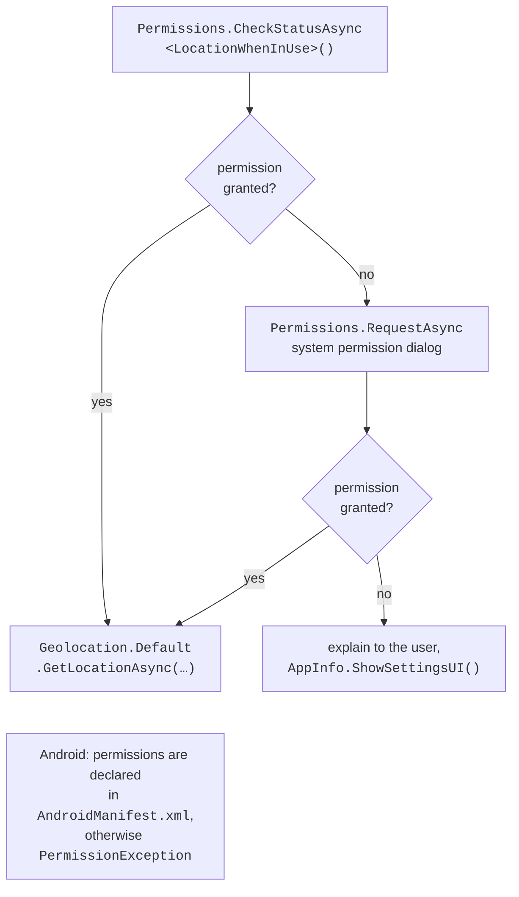
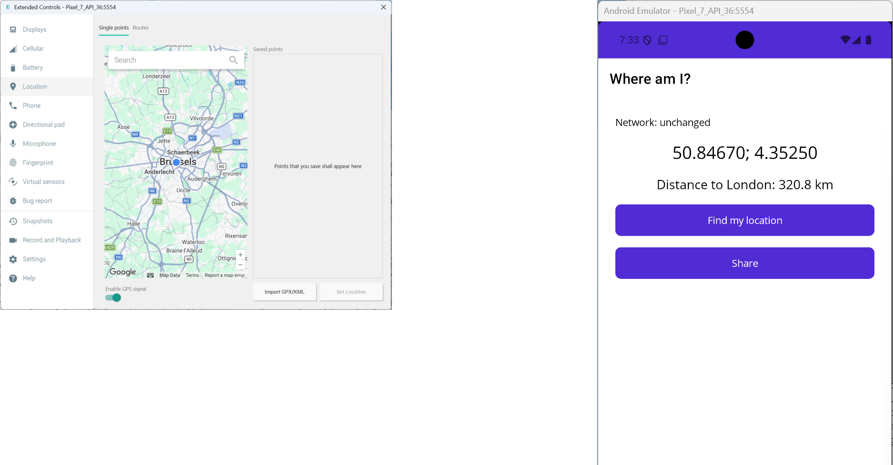

# Device services, data, and publishing

## Device services and permissions

### Platform APIs

MAUI provides cross-platform classes for device capabilities (Table 15.4). Each class has a static `Default` or `Current` property with the implementation for the current platform and an interface for DI (<https://learn.microsoft.com/dotnet/maui/platform-integration/>).

Table 15.4. .NET MAUI device services {.caption}

| **Class** | **Purpose and main members** |
| --- | --- |
| `Preferences` | simple key-value settings (`bool`, numbers, `string`, `DateTime`): `Set`, `Get(key, default)`, `Remove` |
| `SecureStorage` | encrypted storage for tokens and passwords: `SetAsync`, `GetAsync`, `Remove` |
| `FileSystem` | `AppDataDirectory` – application data, `CacheDirectory` – the cache, `OpenAppPackageFileAsync` – files from `Resources/Raw` |
| `Connectivity` | `NetworkAccess` (`Internet`, `Local`, `None`), the `ConnectivityChanged` event |
| `Geolocation` | `GetLocationAsync`, `GetLastKnownLocationAsync`, `IsEnabled` (.NET 10) |
| `MediaPicker` | `PickPhotosAsync` (`SelectionLimit`), `CapturePhotoAsync`, `IsCaptureSupported` |
| `Share` | the system "Share" window: `ShareTextRequest`, `ShareFileRequest` |
| `DeviceInfo`, `AppInfo` | platform, device type, versions; `AppInfo.ShowSettingsUI()` |
| `PhoneDialer`, `Email`, `Launcher` | a call, an email, opening an address in another application |
| `HapticFeedback`, `Vibration` | haptic feedback and vibration; `IsSupported` (.NET 10) |
| `Accelerometer`, `Compass` | sensors: `IsSupported`, `Start(SensorSpeed)`, the `ReadingChanged` event, `Stop` |

Not every platform has every capability: a Windows computer usually has no compass or accelerometer, so before use you check `IsSupported` or catch `FeatureNotSupportedException`. The `MediaPicker.PickPhotoAsync` method is obsolete in .NET 10: use `PickPhotosAsync` instead, which returns a list (empty if the user canceled the selection).

**The main thread.** Interface elements can be changed only on the main thread. `Connectivity` events and events of sensors with the `SensorSpeed.Game` or `Fastest` speed may arrive from another thread, so updates are performed through `MainThread.BeginInvokeOnMainThread(() => …)`. Events of sensors with the `SensorSpeed.UI` speed arrive on the main thread.

### Permissions

Access to location, the camera, and contacts requires the user's **permission**. The `Permissions` class checks the permission status with the `CheckStatusAsync<T>` method and shows the system prompt with the `RequestAsync<T>` method, where `T` is the permission type, for example `Permissions.LocationWhenInUse` or `Permissions.Camera` (Fig. 15.11). The result has the `PermissionStatus` type: `Granted`, `Denied`, `Disabled`, `Restricted`, `Limited`, `Unknown`. A permission should be requested when the first page has already appeared and the user is performing an action that needs it; on iOS, after a denial the prompt is not shown again, and the user is directed to the settings (<https://learn.microsoft.com/dotnet/maui/platform-integration/appmodel/permissions>).



Fig. 15.11. Requesting permission to use location {.caption}

The permissions an application requests must be declared on each platform. On Windows these APIs need no separate permissions (`CheckStatusAsync` returns `Granted`); on iOS the `NSLocationWhenInUseUsageDescription` key with an explanation for the user is added to `Info.plist`; and on Android `<uses-permission android:name="android.permission.ACCESS_FINE_LOCATION" />` elements (and likewise `ACCESS_COARSE_LOCATION`) are added to the `Platforms/Android/AndroidManifest.xml` file. If a permission is not declared, `RequestAsync` throws a `PermissionException`. These lines can be checked in the visual manifest editor (double-click `AndroidManifest.xml`, the *Required permissions* section).

### Example: where am I?

The page shows network state changes, determines the device coordinates and the distance to London, and shares a map link. The markup consists of a `VerticalStackLayout` with the labels `networkLabel`, `coordinatesLabel`, `distanceLabel`, the buttons *Find my location* (the `OnLocateClicked` event) and `shareButton` (*Share*, `IsEnabled="False"`, the `OnShareClicked` event), and a `busyIndicator` (`ActivityIndicator`). The page code:

```cs
using System.Globalization;

namespace WhereAmI;

public partial class MainPage : ContentPage
{
    private static readonly Location London = new(51.5074, -0.1278);
    private Location? current;

    public MainPage() => InitializeComponent();

    protected override void OnAppearing()
    {
        base.OnAppearing();
        Connectivity.Current.ConnectivityChanged += OnConnectivity;
    }

    protected override void OnDisappearing()
    {
        base.OnDisappearing();
        Connectivity.Current.ConnectivityChanged -= OnConnectivity;
    }

    // The event may arrive not on the main thread.
    private void OnConnectivity(object? sender,
        ConnectivityChangedEventArgs e) =>
        MainThread.BeginInvokeOnMainThread(() =>
            networkLabel.Text = $"Network: {e.NetworkAccess}");

    private async void OnLocateClicked(object? sender, EventArgs e)
    {
        PermissionStatus status = await Permissions
            .CheckStatusAsync<Permissions.LocationWhenInUse>();
        if (status != PermissionStatus.Granted)
        {
            status = await Permissions
                .RequestAsync<Permissions.LocationWhenInUse>();
        }
        if (status != PermissionStatus.Granted)
        {
            await DisplayAlertAsync("Location",
                "Allow location access in the app settings.", "OK");
            return;
        }
        busyIndicator.IsRunning = true;
        try
        {
            current = await Geolocation.Default.GetLocationAsync(
                new GeolocationRequest(GeolocationAccuracy.Medium,
                    TimeSpan.FromSeconds(10)));
            if (current is null)
            {
                coordinatesLabel.Text = "Location is unavailable";
                return;
            }
            coordinatesLabel.Text =
                $"{current.Latitude:F5}; {current.Longitude:F5}";
            double km = Location.CalculateDistance(
                current, London, DistanceUnits.Kilometers);
            distanceLabel.Text = $"Distance to London: {km:F1} km";
            shareButton.IsEnabled = true;
        }
        catch (FeatureNotEnabledException)
        {
            coordinatesLabel.Text = "Turn on location services";
        }
        finally
        {
            busyIndicator.IsRunning = false;
        }
    }

    private async void OnShareClicked(object? sender, EventArgs e)
    {
        // A decimal point in the coordinates under any regional settings.
        var inv = CultureInfo.InvariantCulture;
        string lat = current!.Latitude.ToString("F5", inv);
        string lon = current.Longitude.ToString("F5", inv);
        await Share.Default.RequestAsync(new ShareTextRequest
        {
            Title = "My location",
            Uri = $"https://www.openstreetmap.org/?mlat={lat}"
                + $"&mlon={lon}"
        });
    }
}
```

The first time *Find my location* is clicked on Android, the system permission prompt appears (Fig. 15.12). Coordinates in the emulator are set in *Extended controls* (the "…" button on the emulator panel → *Location*) (Fig. 15.13). For the sample point 50.8467, 4.3525 (Brussels, Grand-Place), the labels show `50.84670; 4.35250` and `Distance to London: 320.8 km` – this is the distance along the Earth's surface calculated by `Location.CalculateDistance` (an emulator with the English language formats numbers with a decimal point, one with Ukrainian uses a comma). Under regional settings with a decimal comma, a number with a comma in the link would break the map address, so for the URL the coordinates are formatted with `CultureInfo.InvariantCulture` (`50.84670`). If the permission is denied, the message advises turning it on in the settings (they are opened by `AppInfo.Current.ShowSettingsUI()`).


Fig. 15.12. The system location permission prompt {.caption}



Fig. 15.13. Simulating coordinates in the emulator's extended controls {.caption}

## Local data and web services

### An SQLite database

For small settings `Preferences` is enough, for documents files in `AppDataDirectory`, and for tables with search and sorting a local SQLite database. The MAUI documentation uses the **sqlite-net-pcl** package (owner `praeclarum`; other packages have similar names, so check the identifier) (<https://learn.microsoft.com/dotnet/maui/data-cloud/database-sqlite>). It provides a simple ORM: the `[PrimaryKey, AutoIncrement]` attributes, the asynchronous `SQLiteAsyncConnection`, the `CreateTableAsync<T>`, `InsertAsync`, `UpdateAsync`, `DeleteAsync` methods, and LINQ queries `Table<T>().Where(…).ToListAsync()`. The database file is placed in `AppDataDirectory`, and the connection is opened on first access (an example is in the lab assignment). The alternatives are the Microsoft.Data.Sqlite package (ADO.NET, Topic 7) and EF Core with the SQLite provider (Topic 8).

### A client for the "Book catalog" REST service

The application gets a list of books from an ASP.NET Core web service running on the same computer (Topic 10) and refreshes it with a "pull down" gesture. The Android emulator works behind a virtual router, so `localhost` in it is the emulator itself, and the computer is reachable at `10.0.2.2`. Android forbids unencrypted HTTP by default, so for the duration of development `[Application(UsesCleartextTraffic = true)]` is set inside `#if DEBUG` in `Platforms/Android/MainApplication.cs` (<https://learn.microsoft.com/dotnet/maui/data-cloud/local-web-services>).

`BooksViewModel` receives an `HttpClient` in its constructor. Its `LoadCommand` calls `http.GetFromJsonAsync<List<Book>>("api/books")`, fills the `ObservableCollection<Book> Books`, writes the number of books or the `HttpRequestException` text to `Status`, and resets the `IsRefreshing` property in the `finally` block. The service address depends on the platform and is set when the `HttpClient` is registered in `MauiProgram`: `BaseAddress` is `http://10.0.2.2:5080/` if `DeviceInfo.Platform == DevicePlatform.Android`, and `http://localhost:5080/` on other platforms. The page wraps the `CollectionView` in a `RefreshView` with the bindings `Command="{Binding LoadCommand}"` and `IsRefreshing="{Binding IsRefreshing}"`.

The refresh gesture sets `IsRefreshing = true` and runs `LoadCommand`, and after loading the ViewModel resets the property, and the indicator disappears. If the service is not running, the `Status` label shows `Server is unavailable: …`, and the list stays as it was. The `Page.IsBusy` property is obsolete in .NET 10: use `ActivityIndicator` or `RefreshView` to indicate long-running operations.

### CommunityToolkit.Maui

The **CommunityToolkit.Maui** package (version 15 for .NET 10, enabled with a `.UseMauiCommunityToolkit()` call) adds `Toast` and `Snackbar` pop-up messages, `Popup` windows, behaviors, and converters, and the separate CommunityToolkit.Maui.MediaElement package plays audio and video (<https://learn.microsoft.com/dotnet/communitytoolkit/maui/>). It is not required for the lab assignment.

## Publishing the application

The `dotnet publish` command builds the application for one platform, so the `-f` parameter is required (<https://learn.microsoft.com/dotnet/maui/deployment/>):

```powershell
# Windows: a folder with an .exe without an MSIX package
dotnet publish -f net10.0-windows10.0.19041.0 -c Release `
    -p:WindowsPackageType=None -p:WindowsAppSDKSelfContained=true
# Android: .aab (Google Play) and .apk files
dotnet publish -f net10.0-android -c Release
```

For Windows, the `WindowsAppSDKSelfContained=true` parameter adds the Windows App SDK libraries to the application folder, and an MSIX package for the Microsoft Store is signed with a certificate. For Android, a Release build creates an `.aab` package for Google Play and an `.apk` that can be installed on a phone directly. To publish to the store, the package is signed with your own key created with the `keytool` utility from the JDK (the `AndroidKeyStore`, `AndroidSigningKeyStore`, `AndroidSigningKeyAlias` parameters), and this key must be kept: without it you cannot release updates. Publishing for iOS requires a Mac and a paid Apple Developer Program account.
