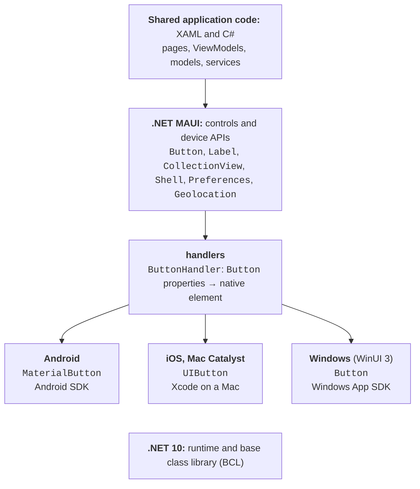
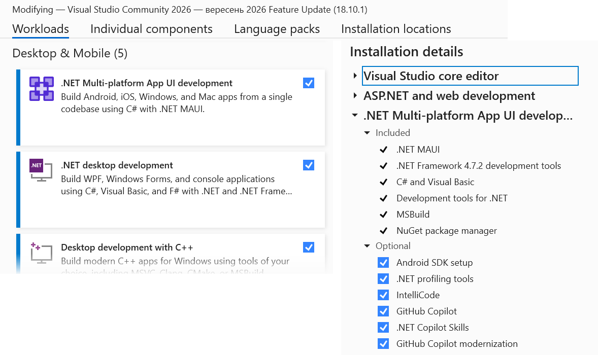
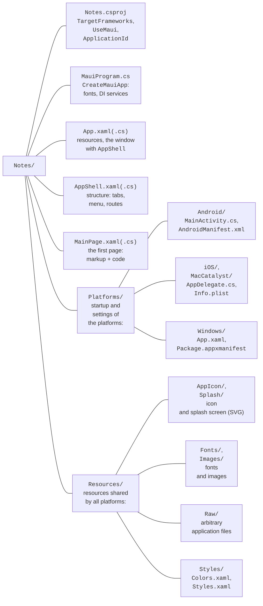
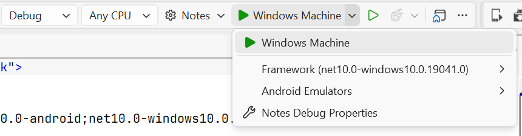
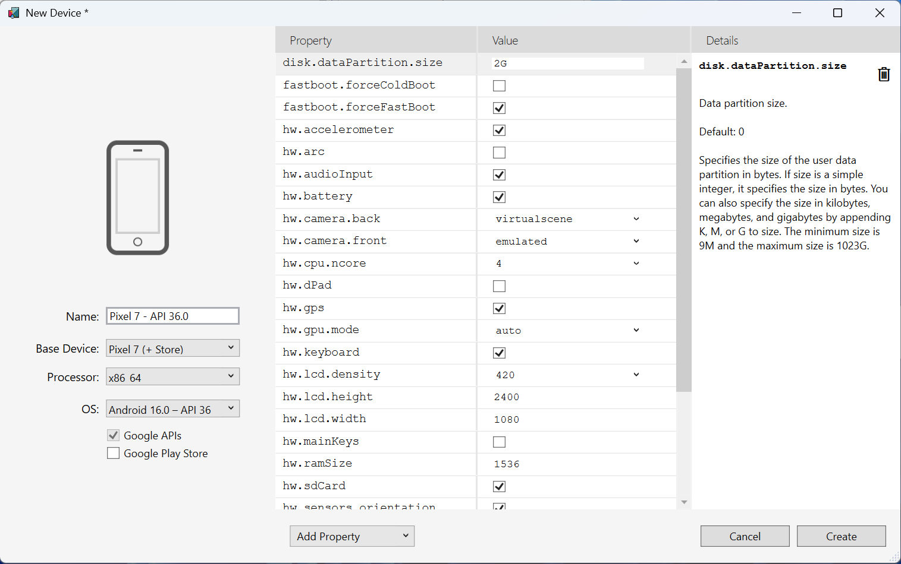

# The platform and single project

## The .NET MAUI platform

**.NET MAUI** (*.NET Multi-platform App UI*) is a framework for creating applications with a single codebase in C# and XAML markup that run on Android, iOS, macOS, and Windows (<https://learn.microsoft.com/dotnet/maui/what-is-maui>). It is the successor of **Xamarin.Forms**: support for all Xamarin SDKs ended on May 1, 2024, and new .NET mobile applications are created with MAUI. Unlike WPF (Topics 12–14), which runs only on Windows, a MAUI application from a single project is built for each platform separately and uses its **native** interface elements: a button on Android looks like an Android button, and on Windows like a Windows button.

The minimum platform versions for .NET MAUI 10 are given in Table 15.1 (<https://learn.microsoft.com/dotnet/maui/supported-platforms>). There is no official support for Linux as a target platform: on Linux you can only develop applications for Android.

Table 15.1. .NET MAUI 10 target platforms {.caption}

| **Platform** | **Minimum version** | **Where to build and run** |
| --- | --- | --- |
| Android | 5.0 (API 21) | Windows, macOS, Linux; an emulator or a phone |
| iOS | 12.2 | requires a Mac with Xcode; from Windows through a paired Mac |
| macOS (Mac Catalyst) | macOS 12 | only on a Mac |
| Windows (WinUI 3) | Windows 10 1809, Windows 11 | only on Windows |

### Architecture and handlers

An application works with cross-platform MAUI classes: `Button`, `Label`, `CollectionView`. Each such element has a **handler** – a class that creates the platform's native element and transfers property values to it (Fig. 15.1). For example, `ButtonHandler` creates a `MaterialButton` on Android, a `UIButton` on iOS, and a WinUI library `Button` on Windows. The same .NET 10 runtime and class library run under all platforms, so model classes, `HttpClient`, LINQ, and `System.Text.Json` are used the same way as in console programs (<https://learn.microsoft.com/dotnet/maui/user-interface/handlers/>).



Fig. 15.1. .NET MAUI application architecture {.caption}

**Support.** .NET MAUI 10 was released on November 11, 2025, together with .NET 10, but the MAUI support rules differ from .NET LTS support: each MAUI version is supported for 6 months after the next one is released. For MAUI 10 the end of support is May 11, 2027, so projects should be moved to new versions in time (<https://dotnet.microsoft.com/platform/support/policy/maui>).

### Installation

Visual Studio 2026 requires the *.NET Multi-platform App UI development* workload (*Tools → Get Tools and Features…*, Fig. 15.2). It installs the MAUI SDK, the Android SDK, OpenJDK, and the Android emulator. Without Visual Studio, MAUI is installed with a dotnet CLI command and checked with the workload list (<https://learn.microsoft.com/dotnet/maui/get-started/installation>):

```powershell
dotnet workload install maui
dotnet workload list
```



Fig. 15.2. The *.NET Multi-platform App UI development* workload {.caption}

## The single project and running the application

### Project structure

A project is created from the *.NET MAUI App* template (*File → New → Project…*, search for `maui`) or with the command `dotnet new maui -n Notes`. The `--sample-content` parameter adds a demo application with MVVM and a database to the template. MAUI uses a **single project**: one `.csproj` file contains the shared code for all platforms, and the platform code lives in the `Platforms` folder (Fig. 15.3) (<https://learn.microsoft.com/dotnet/maui/fundamentals/single-project>).



Fig. 15.3. The structure of a .NET MAUI single project {.caption}

The project file contains the `UseMaui` property and lists the platform target frameworks in `TargetFrameworks`: `net10.0-android`, `net10.0-ios`, `net10.0-maccatalyst`, and (only on Windows) `net10.0-windows10.0.19041.0`. When building for Android, only the files from `Platforms/Android` are compiled, and the images from `Resources/Images` are scaled to the required resolutions. The .NET 10 template also sets `MauiXamlInflator = SourceGen` (XAML is converted to C# at compile time), `WindowsPackageType = None` (the Windows version runs as an ordinary `.exe` without an MSIX package), the `ApplicationTitle` name, and the unique `ApplicationId` identifier.

### Entry point

The startup code of each platform (`MainActivity` on Android, `App` in `Platforms/Windows`) calls the shared `MauiProgram.CreateMauiApp` method. It configures the **application builder** (`MauiAppBuilder`) the same way as `Host` in Topic 6: `MauiApp.CreateBuilder()`, registering the application class with `UseMauiApp<App>()`, fonts with `ConfigureFonts`, services with `builder.Services`, and logging with `builder.Logging.AddDebug()` (only in the *Debug* configuration), and finally `builder.Build()`.

The `App` class (the `App.xaml` and `App.xaml.cs` files) merges the resource dictionaries and creates a window with the `AppShell` shell. The `Application.MainPage` property has been obsolete since .NET 9, so the window is returned by the overridden method `protected override Window CreateWindow(IActivationState? activationState)` with the expression `new Window(new AppShell())`.

### Running on Windows and Android

The target platform is chosen in the drop-down list of the Visual Studio run button (Fig. 15.4): *Windows Machine* runs the application as a Windows program, the *Android Emulators* section runs it in an emulator, and *Android Local Devices* on a connected phone. *Windows Machine* gives the fastest development cycle: it needs no extra setup and works on any computer with Windows 10/11.



Fig. 15.4. Choosing the target platform to run {.caption}

An **Android emulator** is created in *Tools → Android → Android Device Manager* with the *New* button: choose a device profile (for example, Pixel) and an x86\_64 system image, and click *Create* (Fig. 15.5). Without **hardware virtualization**, the emulator runs very slowly. On Windows, Hyper-V with the *Windows Hypervisor Platform* (WHPX) is recommended: they are enabled in *Turn Windows features on or off*, and Intel VT-x or AMD-V (SVM) must be enabled in the BIOS. The `systeminfo` command shows whether the computer supports Hyper-V. If Hyper-V is unavailable, the AEHD driver (*Android Emulator hypervisor driver*) is used. On computers with ARM processors (Windows on Arm), the Android emulator does not work (<https://learn.microsoft.com/dotnet/maui/android/emulator/hardware-acceleration>).



Fig. 15.5. Creating an emulator in *Android Device Manager* {.caption}

**Your own phone** is often more convenient than an emulator (<https://learn.microsoft.com/dotnet/maui/android/device/setup>):

1. In the phone's *About phone* settings, tap *Build number* seven times until the message *You are now a developer!* appears (on different phones the item may be in a different place).
2. In *Developer options*, turn on *USB debugging*.
3. Connect the phone with a USB cable and allow debugging from this computer (*Always allow from this computer*).
4. Choose the phone in the *Android Local Devices* list and run the application (**F5**).

Android 11 and later also support debugging over Wi-Fi (*Wireless debugging*). In .NET 10 the Android version can also be run from the command line with `dotnet run` with the parameters `-f net10.0-android` and `-p:AdbTarget=-d` (a phone) or `-p:AdbTarget=-e` (an emulator). Applications for iOS and macOS can be built and debugged only from a Mac with Xcode installed.

### Hot Reload

During debugging (**F5**, the *Debug* configuration), **XAML Hot Reload** applies markup changes to the running application immediately as you type, without a restart and with the page state preserved (Fig. 15.6). **.NET Hot Reload** transfers C# code changes after you click the *Hot Reload* button on the toolbar. Hot Reload does not apply added files and NuGet packages, or some C# changes (for example, new class fields) – after them the application is restarted (<https://learn.microsoft.com/dotnet/maui/xaml/hot-reload>).


Fig. 15.6. XAML Hot Reload while the application is running {.caption}
