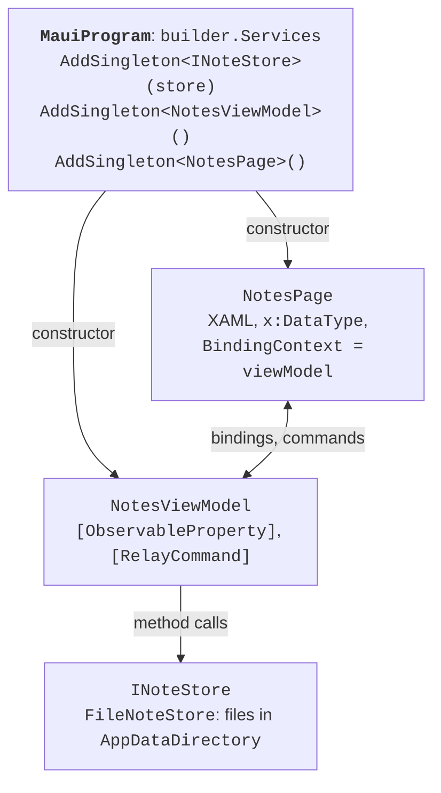

# Pages, styles, and MVVM

## XAML pages and layout

### Comparison with WPF

XAML in MAUI is the same markup language as in WPF, but with a different set of classes (Table 15.2). The default namespace is `http://schemas.microsoft.com/dotnet/2021/maui`. Sizes are given in **device-independent units**, and the `WidthRequest` and `HeightRequest` properties only **request** a size: the final one is determined by the layout container (<https://learn.microsoft.com/dotnet/maui/user-interface/layouts/>).

Table 15.2. Correspondence of WPF and .NET MAUI classes {.caption}

| **WPF** | **.NET MAUI** |
| --- | --- |
| `Window` with content | `ContentPage` in a `Window`, `Shell` |
| `StackPanel` | `VerticalStackLayout`, `HorizontalStackLayout` |
| `Grid` with `RowDefinition` | `Grid`, shorthand `RowDefinitions="Auto,*"` |
| `WrapPanel`, `Canvas` | `FlexLayout`, `AbsoluteLayout` |
| `TextBlock`, `TextBox` | `Label`, `Entry` (single line), `Editor` (multiline) |
| `ListBox`, `ListView` | `CollectionView` |
| `Border`, `ScrollViewer` | `Border`, `ScrollView` |
| `Width`, `Visibility` | `WidthRequest`, `IsVisible` |
| the `Button.Click` event | the `Button.Clicked` event |

Layout containers: `VerticalStackLayout` and `HorizontalStackLayout` (elements one after another with a `Spacing` gap), `Grid` (rows and columns `Auto`, `*`, `2*`), `FlexLayout` (wrapping into several rows), `AbsoluteLayout` (position in units or fractions of the container), `ScrollView` (scrolling), and `Border` (a border with rounding `StrokeShape="RoundRectangle 8"`).

The main controls are listed in Table 15.3 (<https://learn.microsoft.com/dotnet/maui/user-interface/controls/>).

Table 15.3. The main .NET MAUI controls {.caption}

| **Element** | **Purpose and main members** |
| --- | --- |
| `Label` | text: `Text`, `FontSize`, `MaxLines`, `LineBreakMode` |
| `Entry`, `Editor` | input: `Text`, `Placeholder`, `Keyboard="Numeric"`, `IsPassword`, the `Completed` event |
| `Button`, `ImageButton` | a button: `Text` or `Source`, the `Clicked` event, `Command` |
| `Switch`, `CheckBox` | a switch and a check box: `IsToggled`, `IsChecked` |
| `Slider`, `Stepper` | a number: `Value`, `Minimum`, `Maximum` |
| `Picker` | choosing from a list: `ItemsSource`, `SelectedItem` |
| `DatePicker`, `TimePicker` | date and time: `Date` (`DateTime?` in .NET 10), `Time` |
| `Image` | an image: `Source`, `Aspect` |
| `ProgressBar`, `ActivityIndicator` | operation progress: `Progress` (0–1), `IsRunning` |

### Example: a water tracker

The page counts the water drunk during the day with the *+250 ml* and *+500 ml* buttons, shows a progress bar toward a daily goal of 2000 ml, and keeps the value between runs. The `MainPage.xaml` markup uses a `Grid` with four rows, nested stack containers, an explicit button style, and a theme binding:

```xml
<ContentPage xmlns="http://schemas.microsoft.com/dotnet/2021/maui"
             xmlns:x="http://schemas.microsoft.com/winfx/2009/xaml"
             x:Class="WaterTracker.MainPage"
             Title="Water Tracker">
    <!-- An explicit button style: Style="{StaticResource AddButton}" -->
    <ContentPage.Resources>
        <Style x:Key="AddButton" TargetType="Button">
            <Setter Property="WidthRequest" Value="110" />
            <Setter Property="FontSize" Value="18" />
        </Style>
    </ContentPage.Resources>

    <Grid RowDefinitions="Auto,Auto,Auto,Auto" RowSpacing="20"
          Padding="24" MaximumWidthRequest="500">
        <Label x:Name="totalLabel" FontSize="32"
               HorizontalOptions="Center" />
        <ProgressBar x:Name="progressBar" Grid.Row="1"
                     ProgressColor="{AppThemeBinding
                         Light={StaticResource Primary},
                         Dark=White}" />
        <!-- Row 2: buttons for adding water -->
        <HorizontalStackLayout Grid.Row="2" Spacing="12"
                               HorizontalOptions="Center">
            <Button Text="+250 ml" Style="{StaticResource AddButton}"
                    Clicked="OnAdd250Clicked" />
            <Button Text="+500 ml" Style="{StaticResource AddButton}"
                    Clicked="OnAdd500Clicked" />
        </HorizontalStackLayout>
        <Button Grid.Row="3" Text="Reset" Clicked="OnResetClicked" />
    </Grid>
</ContentPage>
```

The `MainPage.xaml.cs` page code stores the total and the date in the `Preferences` service – a key-value store for simple settings (more on it in the section on device services):

```cs
namespace WaterTracker;

public partial class MainPage : ContentPage
{
    private const int Goal = 2000;              // ml per day
    private int total;

    public MainPage()
    {
        InitializeComponent();
        string today = DateTime.Today.ToString("yyyy-MM-dd");
        // The saved total is valid only on the day it was written.
        total = Preferences.Default.Get("date", "") == today
            ? Preferences.Default.Get("total", 0)
            : 0;
        Preferences.Default.Set("date", today);
        ShowTotal();
    }

    private void OnAdd250Clicked(object? sender, EventArgs e) =>
        Add(250);

    private void OnAdd500Clicked(object? sender, EventArgs e) =>
        Add(500);

    private void OnResetClicked(object? sender, EventArgs e) =>
        Add(-total);

    private void Add(int ml)
    {
        total += ml;
        Preferences.Default.Set("total", total);
        ShowTotal();
    }

    private void ShowTotal()
    {
        totalLabel.Text = $"{total} / {Goal} ml";
        progressBar.Progress = Math.Min(1.0, (double)total / Goal);
    }
}
```

Elements with the `x:Name` attribute become class fields, as in WPF, and event handlers have an `object? sender` parameter. After startup the label shows `0 / 2000 ml`; after *+250 ml* and *+500 ml* are clicked, it shows `750 / 2000 ml`, and the bar is 37.5 % full. After the application is restarted on the same day, the total is kept, and the next day the counter starts from zero. In the system's dark theme the progress bar turns white (Fig. 15.7).


Fig. 15.7. The "Water tracker" application in the Windows light and dark themes {.caption}

## Styles, resources, and themes

The project template contains the resource dictionaries `Resources/Styles/Colors.xaml` (the `Primary` and `Secondary` colors, shades of gray) and `Styles.xaml` (styles of all elements), merged in `App.xaml` through `ResourceDictionary.MergedDictionaries`. As in WPF (Topic 13), an **implicit style** has only a `TargetType` and applies to all elements of that type, while an **explicit style** has an `x:Key` key and is attached with the `Style` property. The `StaticResource` extension reads a resource once, and `DynamicResource` updates the value when the resource is replaced at run time (<https://learn.microsoft.com/dotnet/maui/user-interface/styles/xaml>).

**Light and dark themes.** The `AppThemeBinding` extension sets values for the system's light (`Light`) and dark (`Dark`) themes; the application updates it itself when the user changes the theme. The theme can also be set in code: `Application.Current!.UserAppTheme = AppTheme.Dark` (<https://learn.microsoft.com/dotnet/maui/user-interface/system-theme-changes>).

**Platform and device type.** The `OnPlatform` extension sets different values for platforms, and `OnIdiom` for a phone (`Phone`), a tablet (`Tablet`), and a computer (`Desktop`). For example, `FontSize="{OnIdiom Phone=20, Desktop=24}"` enlarges the font on a computer, `Padding="{OnPlatform Android='8,4', WinUI='16,8'}"` sets padding for Android and Windows, and `Span="{OnIdiom Phone=1, Default=3}"` in a `GridItemsLayout` shows three columns on a wide screen.

## Data binding, MVVM, and dependency injection

### Data binding

Data binding in MAUI works as in WPF: `BindingContext` (the counterpart of `DataContext`) sets the source object, nested elements inherit it, and `{Binding Property}` updates the element after the `PropertyChanged` event. The default mode depends on the property: for `Entry.Text`, `Editor.Text`, `Switch.IsToggled`, `Slider.Value`, and `CollectionView.SelectedItem` it is `TwoWay`, and for most others `OneWay`. The binding's `StringFormat` parameter formats the value, for example `'{0:d}'` for a date, and an `IValueConverter` changes the type (<https://learn.microsoft.com/dotnet/maui/fundamentals/data-binding/>).

**Compiled bindings** are checked at build time: the `x:DataType` attribute tells the compiler the type of the `BindingContext`. A misspelled property name gives a build warning rather than a silent run-time error, and the binding works faster because it does not use reflection. Starting with .NET 9, the compiler warns about bindings without `x:DataType`, so it is set on the page and separately on each `DataTemplate`: a list item template binds not to the ViewModel but to a collection item (<https://learn.microsoft.com/dotnet/maui/fundamentals/data-binding/compiled-bindings>).

### MVVM with CommunityToolkit.Mvvm

The MVVM pattern and the **CommunityToolkit.Mvvm** package (Topic 13) carry over to MAUI unchanged: the ViewModel inherits `ObservableObject`, the `[ObservableProperty]` attribute on a partial property generates notifications, `[RelayCommand]` creates a command from a method, and `[NotifyCanExecuteChangedFor]` updates command availability. A MAUI application is conveniently split into the `Models`, `Services`, `ViewModels`, and `Views` folders. The `MessagingCenter` class became internal in .NET 10: for messages between ViewModels, use `WeakReferenceMessenger` from the same package.

### Dependency injection

`MauiProgram.CreateMauiApp` has a `builder.Services` container (Topic 6). Services, ViewModels, and pages are registered in it, and constructors receive dependencies automatically (Fig. 15.8). Shell itself creates the pages registered in the container through it, both for tabs and for `Routing.RegisterRoute` routes (<https://learn.microsoft.com/dotnet/maui/fundamentals/dependency-injection>). The lifetime is chosen by role: `AddSingleton` – one instance for the whole application (a data service, the main page with a list), `AddTransient` – a new instance for each navigation (an edit page). The `AddScoped` method has no natural scope boundaries in MAUI and behaves like `AddSingleton`.



Fig. 15.8. MVVM and dependency injection in .NET MAUI {.caption}

Device services have interfaces (`IPreferences`, `IGeolocation`, `IMediaPicker`), so they are registered in the container and passed to the ViewModel: `builder.Services.AddSingleton(Preferences.Default)`. Such a ViewModel can be covered by unit tests with the service replaced, without starting the emulator.

## `CollectionView` lists

`CollectionView` is the main element for lists and grids. In .NET 10, `ListView`, `TableView`, and the cell classes (`TextCell`, `ViewCell`, and others) are marked obsolete, so new applications use only `CollectionView` (<https://learn.microsoft.com/dotnet/maui/user-interface/controls/collectionview/>). Its main properties:

- `ItemsSource` – the collection of items; an `ObservableCollection<T>` updates the list when items are added and removed;
- `ItemTemplate` – a `DataTemplate` with `x:DataType` of the item type;
- `SelectionMode` (`None`, `Single`, `Multiple`), `SelectedItem`, `SelectedItems`, the `SelectionChanged` event, and the `SelectionChangedCommand` command;
- `EmptyView` – the content for an empty collection;
- `ItemsLayout` – `LinearItemsLayout` (a list) or `GridItemsLayout` with a `Span` of columns;
- `IsGrouped`, `GroupHeaderTemplate` – grouping: the source is a collection of groups, and each group is a class derived from `List<T>` with a group name;
- `RemainingItemsThreshold` and `RemainingItemsThresholdReachedCommand` – loading more items while scrolling.

`CollectionView` **virtualizes** items: it creates views only for the visible rows. That is why it is not placed inside a `ScrollView` or a `VerticalStackLayout` without a height limit – the list would lose virtualization or stop scrolling. Three more elements are used alongside it:

- `RefreshView` – refresh with a "pull down" gesture: the `Command` and `IsRefreshing` properties;
- `SwipeView` – actions with a swipe gesture (`LeftItems`, `RightItems` with `SwipeItem`); on Windows the swipe is done with the mouse or a touch screen;
- `CarouselView` with `IndicatorView` – flipping through items one at a time, like cards.

A ViewModel command is not available inside a `DataTemplate`, because its context is a collection item. It is accessed through a binding to an ancestor with an explicit type: inside `{Binding …}` you set `Source={RelativeSource AncestorType={x:Type vm:NotesViewModel}}` and `x:DataType=vm:NotesViewModel`, and the item is passed as the parameter `CommandParameter="{Binding .}"` (an example is in the lab assignment).
