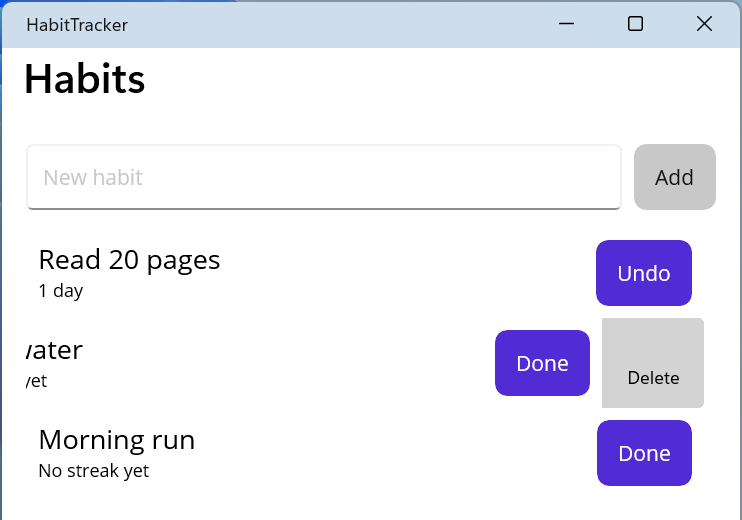

# Practice

## Example 1. A habit tracker

Create a .NET MAUI "Habit tracker" application. The user adds a habit (the name is not empty), marks it as done every day with the *Done* button (pressing *Undo* again removes the mark), and deletes a habit with a swipe. For each habit a streak is shown – the number of consecutive days ending today or yesterday; the list is sorted by streak length. The data is kept between runs.

The model, the list row, and the ViewModel (the `HabitsViewModel.cs` file). The habits are serialized to JSON and stored as a single string in `Preferences`; the `IPreferences` service arrives through the constructor:

```cs
using System.Collections.ObjectModel;
using System.Text.Json;
using CommunityToolkit.Mvvm.ComponentModel;
using CommunityToolkit.Mvvm.Input;

namespace Habits;

public class Habit
{
    public string Name { get; set; } = "";
    public List<DateOnly> DoneDays { get; set; } = [];

    // Consecutive days ending today or yesterday.
    public int Streak(DateOnly today)
    {
        DateOnly day = DoneDays.Contains(today)
            ? today : today.AddDays(-1);
        int count = 0;
        while (DoneDays.Contains(day))
        {
            count++;
            day = day.AddDays(-1);
        }
        return count;
    }
}

public record HabitRow(Habit Habit, bool IsDoneToday, int Streak)
{
    public string Name => Habit.Name;
    public string StreakText => Streak switch
    {
        0 => "No streak yet",
        1 => "1 day",
        _ => $"{Streak} days in a row"
    };
    public string ButtonText => IsDoneToday ? "Undo" : "Done";
}

public partial class HabitsViewModel(IPreferences preferences)
    : ObservableObject
{
    private const string Key = "habits";
    private List<Habit> habits = [];

    public ObservableCollection<HabitRow> Rows { get; } = [];

    [ObservableProperty]
    [NotifyCanExecuteChangedFor(nameof(AddCommand))]
    public partial string NewName { get; set; } = "";

    public void Load()
    {
        string json = preferences.Get(Key, "[]");
        habits = JsonSerializer.Deserialize<List<Habit>>(json) ?? [];
        Refresh();
    }

    private bool CanAdd() => !string.IsNullOrWhiteSpace(NewName);

    [RelayCommand(CanExecute = nameof(CanAdd))]
    private void Add()
    {
        habits.Add(new Habit { Name = NewName.Trim() });
        NewName = "";
        SaveAndRefresh();
    }

    [RelayCommand]
    private void Toggle(HabitRow row)
    {
        DateOnly today = DateOnly.FromDateTime(DateTime.Today);
        if (!row.Habit.DoneDays.Remove(today))
        {
            row.Habit.DoneDays.Add(today);
        }
        SaveAndRefresh();
    }

    [RelayCommand]
    private void Delete(HabitRow row)
    {
        habits.Remove(row.Habit);
        SaveAndRefresh();
    }

    private void SaveAndRefresh()
    {
        preferences.Set(Key, JsonSerializer.Serialize(habits));
        Refresh();
    }

    private void Refresh()
    {
        DateOnly today = DateOnly.FromDateTime(DateTime.Today);
        Rows.Clear();
        foreach (Habit h in habits.OrderByDescending(
                     h => h.Streak(today)))
        {
            Rows.Add(new HabitRow(h, h.DoneDays.Contains(today),
                h.Streak(today)));
        }
    }
}
```

The `HabitsPage.xaml` page: an input field with a button and a list, in whose template the done button and the swipe action access the ViewModel commands through `RelativeSource`:

```xml
<ContentPage xmlns="http://schemas.microsoft.com/dotnet/2021/maui"
             xmlns:x="http://schemas.microsoft.com/winfx/2009/xaml"
             xmlns:local="clr-namespace:Habits"
             x:Class="Habits.HabitsPage"
             x:DataType="local:HabitsViewModel"
             Title="Habits">
    <Grid RowDefinitions="Auto,*" ColumnDefinitions="*,Auto"
          Padding="16" RowSpacing="12" ColumnSpacing="8">
        <Entry Placeholder="New habit" Text="{Binding NewName}"
               ReturnCommand="{Binding AddCommand}" />
        <Button Grid.Column="1" Text="Add"
                Command="{Binding AddCommand}" />

        <CollectionView Grid.Row="1" Grid.ColumnSpan="2"
                        ItemsSource="{Binding Rows}">
            <CollectionView.EmptyView>
                <Label Text="Add your first habit" />
            </CollectionView.EmptyView>
            <CollectionView.ItemTemplate>
                <DataTemplate x:DataType="local:HabitRow">
                    <SwipeView>
                        <SwipeView.RightItems>
                            <SwipeItems>
                                <SwipeItem Text="Delete"
                                    BackgroundColor="LightGray"
                                  Command="{Binding DeleteCommand,
                                    Source={RelativeSource
                                    AncestorType={x:Type
                                    local:HabitsViewModel}},
                                    x:DataType=local:HabitsViewModel}"
                                    CommandParameter="{Binding .}" />
                            </SwipeItems>
                        </SwipeView.RightItems>
                        <Grid ColumnDefinitions="*,Auto" Padding="8">
                            <VerticalStackLayout>
                                <Label Text="{Binding Name}"
                                       FontSize="18" />
                                <Label Text="{Binding StreakText}"
                                       FontSize="12" />
                            </VerticalStackLayout>
                            <Button Grid.Column="1"
                                Text="{Binding ButtonText}"
                                Command="{Binding ToggleCommand,
                                    Source={RelativeSource
                                    AncestorType={x:Type
                                    local:HabitsViewModel}},
                                    x:DataType=local:HabitsViewModel}"
                                CommandParameter="{Binding .}" />
                        </Grid>
                    </SwipeView>
                </DataTemplate>
            </CollectionView.ItemTemplate>
        </CollectionView>
    </Grid>
</ContentPage>
```

The page constructor `HabitsPage(HabitsViewModel viewModel)` assigns `BindingContext` and calls `viewModel.Load()`. In `MauiProgram`, `AddSingleton(Preferences.Default)`, `AddSingleton<HabitsViewModel>()`, and `AddSingleton<HabitsPage>()` are registered.

The `HabitRow` row is an immutable `record`, so after every change the ViewModel rebuilds the `Rows` collection, and the `CollectionView` shows the new values. The `NewName` property is bound to the `Entry` two-way, and the `[NotifyCanExecuteChangedFor]` attribute makes the *Add* button unavailable for an empty field; `ReturnCommand` runs the same command with the **Enter** key. In a console test, `IPreferences` was replaced with a dictionary, and the ViewModel works without the MAUI platform. For a habit marked on September 14, 15, and 16, the `Streak` method returns 3 on September 17, 2026, after a mark on September 17 it returns 4, and for a habit with a single mark on September 12 it returns 0. After the habits *Drink water* and *Read* are added and *Read* is marked, the list looks like this:

```
Read | 1 day | Undo
Drink water | No streak yet | Done
```

and `Preferences` stores under the `habits` key the string `[{"Name":"Drink water","DoneDays":[]},{"Name":"Read","DoneDays":["2026-09-17"]}]`. On Windows, the *Delete* action is revealed by dragging the row to the left with the mouse (Fig. 15.14).



Fig. 15.14. The "Habit tracker" application {.caption}

## Example 2. A photo diary

Create a "Photo diary" application that adds photos from the gallery or the camera to a diary, saves a copy of the photo in the application folder, and saves the caption and date in a local SQLite database. The main page shows the entries as a two-column grid from newest to oldest, and the entry page lets you change the caption or delete the entry together with the photo file.

The `sqlite-net-pcl` package was added to the project. The database access class opens the connection on first access:

```cs
using SQLite;

namespace PhotoDiary;

public class DiaryEntry
{
    [PrimaryKey, AutoIncrement]
    public int Id { get; set; }
    public string PhotoPath { get; set; } = "";
    public string Caption { get; set; } = "";
    public DateTime Date { get; set; }
}

public class DiaryDatabase(string path)
{
    private SQLiteAsyncConnection? connection;

    // Open the database and create the table on first access.
    private async Task<SQLiteAsyncConnection> GetConnectionAsync()
    {
        if (connection is null)
        {
            connection = new SQLiteAsyncConnection(path,
                SQLiteOpenFlags.ReadWrite | SQLiteOpenFlags.Create
                | SQLiteOpenFlags.SharedCache);
            await connection.CreateTableAsync<DiaryEntry>();
        }
        return connection;
    }

    public async Task<List<DiaryEntry>> GetAllAsync()
    {
        var db = await GetConnectionAsync();
        return await db.Table<DiaryEntry>()
            .OrderByDescending(e => e.Date).ToListAsync();
    }

    public async Task SaveAsync(DiaryEntry entry)
    {
        var db = await GetConnectionAsync();
        if (entry.Id == 0)
        {
            await db.InsertAsync(entry);   // Id is filled in here
        }
        else
        {
            await db.UpdateAsync(entry);
        }
    }

    // GetAsync(int id): Table<DiaryEntry>().Where(e => e.Id == id)
    //     .FirstOrDefaultAsync(); DeleteAsync(entry): db.DeleteAsync.
}
```

The main page ViewModel (abbreviated) receives the database and `IMediaPicker` through its constructor. After a photo is picked or taken, it is copied to `AppDataDirectory`, the entry is saved, and the application navigates to the entry page with a string `id` parameter:

```cs
using System.Collections.ObjectModel;
using CommunityToolkit.Mvvm.ComponentModel;
using CommunityToolkit.Mvvm.Input;

namespace PhotoDiary;

public partial class DiaryViewModel(DiaryDatabase database,
    IMediaPicker mediaPicker) : ObservableObject
{
    public ObservableCollection<DiaryEntry> Entries { get; } = [];

    // LoadAsync fills Entries from database.GetAllAsync().

    [RelayCommand]
    private async Task PickAsync()
    {
        List<FileResult> photos = await mediaPicker.PickPhotosAsync(
            new MediaPickerOptions
            {
                SelectionLimit = 1,
                MaximumWidth = 1600,
                MaximumHeight = 1600
            });
        await AddAsync(photos.FirstOrDefault());
    }

    [RelayCommand]
    private async Task CaptureAsync()
    {
        if (!mediaPicker.IsCaptureSupported)
        {
            await Shell.Current.DisplayAlertAsync("Camera",
                "This device has no camera.", "OK");
            return;
        }
        await AddAsync(await mediaPicker.CapturePhotoAsync());
    }

    private async Task AddAsync(FileResult? photo)
    {
        if (photo is null)
        {
            return;                        // the user canceled
        }
        // A copy of the photo in the app folder does not depend on the gallery.
        string target = Path.Combine(FileSystem.AppDataDirectory,
            $"{Guid.NewGuid():N}{Path.GetExtension(photo.FileName)}");
        using (Stream source = await photo.OpenReadAsync())
        using (FileStream file = File.Create(target))
        {
            await source.CopyToAsync(file);
        }
        var entry = new DiaryEntry
        {
            PhotoPath = target,
            Date = DateTime.Now
        };
        await database.SaveAsync(entry);
        await Shell.Current.GoToAsync($"entry?id={entry.Id}");
    }
}
```

`EntryViewModel` implements `IQueryAttributable`: in the `ApplyQueryAttributes` method the `id` value arrives as a string, so it is converted with `int.TryParse`, the entry is loaded with the `GetAsync` method, and the `Caption` and `PhotoPath` properties are filled. The `SaveCommand` updates the caption, and `DeleteCommand` deletes the entry and the file with `File.Delete(entry.PhotoPath)`; both navigate back with `".."`. The `DiaryPage.xaml` page has *Pick* and *Camera* toolbar buttons and a `CollectionView` with a `GridItemsLayout` (`Span="2"`); the template contains an `Image` (`Source="{Binding PhotoPath}"`, `Aspect="AspectFill"`), the caption, and the date, and a `TapGestureRecognizer` runs `OpenCommand`. In `MauiProgram`, `new DiaryDatabase(dbPath)` (the `diary.db3` file in `AppDataDirectory`), `MediaPicker.Default`, both ViewModels and pages, and the `entry` route are registered. On Android the `CAMERA` permission is declared in the manifest for the camera; on Windows `IsCaptureSupported` depends on whether a camera is present, and `SelectionLimit` is not supported.

A console test of the `DiaryDatabase` class: after the entries *Park* (9/10/2026) and *Campus* (9/15/2026) are saved, they get `Id` 1 and 2, and `GetAllAsync` returns

```
2 Campus 9/15/2026
1 Park 9/10/2026
```

After the caption of the first entry is changed, `GetAsync(1)` returns `City park`, and after the second one is deleted, one entry remains in the database and `GetAsync(2)` returns `null` (Fig. 15.15).


Fig. 15.15. The "Photo diary" application on Android {.caption}

## Example 3. A compass and level

Create a "Compass and level" application that shows the direction to magnetic north in degrees and in words (N, NE, E…), rotates a pointer arrow, and, based on accelerometer data, shows the device tilt and moves the "bubble" of a level. If a sensor is missing (for example, on a Windows computer), the application reports it instead of crashing.

The `MainPage.xaml` page contains a `VerticalStackLayout` with the `headingLabel` and `tiltLabel` labels, a `needle` arrow label (the ▲ character, `FontSize="64"`), and a 200×200 `Border` with `StrokeShape="Ellipse"`, inside which lies a 24×24 `Ellipse` named `bubble`. The page code (abbreviated) and a helper calculation class:

```cs
namespace CompassLevel;

public static class LevelMath
{
    private static readonly string[] Directions =
        ["N", "NE", "E", "SE", "S", "SW", "W", "NW"];

    // 0° – north, 90° – east; each direction's sector is 45°.
    public static string ToDirection(double heading)
    {
        double normalized = (heading % 360 + 360) % 360;
        int index = (int)Math.Round(normalized / 45) % 8;
        return Directions[index];
    }

    // Tilt along the Y (pitch) and X (roll) axes in degrees.
    public static (double Pitch, double Roll) Tilt(
        double x, double y, double z)
    {
        double pitch = Math.Atan2(y, Math.Sqrt(x * x + z * z));
        double roll = Math.Atan2(x, Math.Sqrt(y * y + z * z));
        return (pitch * 180 / Math.PI, roll * 180 / Math.PI);
    }
}

public partial class MainPage : ContentPage
{
    private const double MaxShift = 90;   // half the frame width

    public MainPage()
    {
        InitializeComponent();
    }

    protected override void OnAppearing()
    {
        base.OnAppearing();
        if (Compass.Default.IsSupported)
        {
            Compass.Default.ReadingChanged += OnCompassChanged;
            Compass.Default.Start(SensorSpeed.UI,
                applyLowPassFilter: true);
        }
        else
        {
            headingLabel.Text = "Compass is not supported";
        }
        if (Accelerometer.Default.IsSupported)
        {
            Accelerometer.Default.ReadingChanged += OnAccelerometer;
            Accelerometer.Default.Start(SensorSpeed.UI);
        }
        else
        {
            tiltLabel.Text = "Accelerometer is not supported";
        }
    }

    // OnDisappearing: Stop() and unsubscribing from both sensors' events.

    private void OnCompassChanged(object? sender,
        CompassChangedEventArgs e)
    {
        double heading = e.Reading.HeadingMagneticNorth;
        headingLabel.Text =
            $"{heading:F0}° {LevelMath.ToDirection(heading)}";
        needle.Rotation = -heading;       // the arrow points north
    }

    private void OnAccelerometer(object? sender,
        AccelerometerChangedEventArgs e)
    {
        var a = e.Reading.Acceleration;
        var (pitch, roll) = LevelMath.Tilt(a.X, a.Y, a.Z);
        bool level = Math.Abs(pitch) < 1 && Math.Abs(roll) < 1;
        tiltLabel.Text = level
            ? "Level"
            : $"Pitch {pitch:F1}°, roll {roll:F1}°";
        // The bubble moves opposite to the tilt.
        bubble.TranslationX = Math.Clamp(-roll * 3, -MaxShift,
            MaxShift);
        bubble.TranslationY = Math.Clamp(pitch * 3, -MaxShift,
            MaxShift);
    }
}
```

The sensors are started in `OnAppearing` and stopped in `OnDisappearing` so as not to drain the battery when the page is not visible. The `SensorSpeed.UI` speed guarantees that the handlers are called on the main thread, so the labels are changed without `MainThread`. The `applyLowPassFilter` parameter smooths the compass readings only on Android. A console test of `LevelMath` (with US regional settings):

```
0 N
44 NE
90 E
181 S
350 N
-30 NW
0 0 -1 -> Pitch 0.0°, roll 0.0°
0 0.5 -0.866 -> Pitch 30.0°, roll 0.0°
0.2588 0 -0.9659 -> Pitch 0.0°, roll 15.0°
0.01 -0.01 -1 -> Pitch -0.6°, roll 0.6°
```

Each line is the input data (a heading in degrees or the acceleration components *x*, *y*, *z* in units of *g*) and the result. A device lying horizontally has an acceleration of (0, 0, −1) and shows *Level*. On Windows without sensors, the page shows `Compass is not supported` and `Accelerometer is not supported` (Fig. 15.16).

::: info Screenshot
CompassLevel on a physical Android phone via USB debugging: heading "312° NW", rotated arrow, bubble off-center, "Pitch 4.2°, roll -2.5°"
:::

Fig. 15.16. The "Compass and level" application on an Android phone {.caption}
