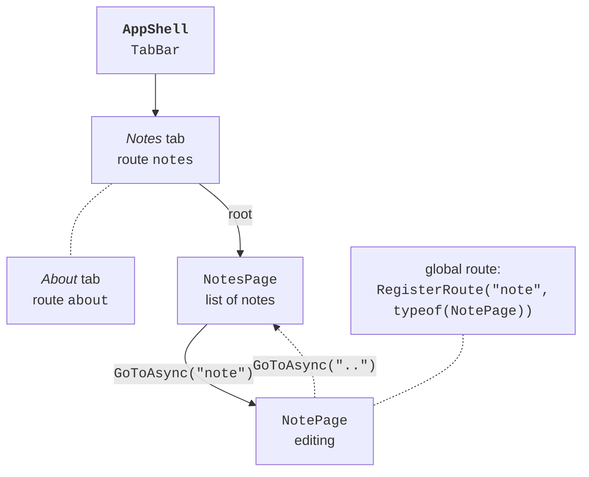

# Shell navigation

## Shell navigation

**Shell** is the application shell that describes its visual structure: `TabBar` tabs, a `FlyoutItem` side menu, and `ShellContent` pages (<https://learn.microsoft.com/dotnet/maui/fundamentals/shell/>). The `ContentTemplate="{DataTemplate views:NotesPage}"` attribute creates a page only on the first navigation to it, which speeds up startup. Each element has a **route** in its `Route` property.

Pages that are not part of the Shell structure (details, editing) are registered as **global routes** with the `Routing.RegisterRoute` method and opened with the `Shell.Current.GoToAsync` method (Fig. 15.9) (<https://learn.microsoft.com/dotnet/maui/fundamentals/shell/navigation>):

- `GoToAsync("note")` – relative navigation: the page is pushed onto the navigation stack of the current tab;
- `GoToAsync("//about")` – absolute navigation to an element of the Shell structure (the stack is cleared);
- `GoToAsync("..")` – back to the previous page, `"../.."` – two pages back;
- `GoToAsync("note?id=5&mode=edit")` – string query parameters;
- `GoToAsync("note", parameters)` – passing objects: a `Dictionary<string, object>` is kept while the page is on the stack, and `ShellNavigationQueryParameters` is cleared after navigation.



Fig. 15.9. Shell navigation in the "Notes" application {.caption}

A page or its ViewModel receives parameters in the `ApplyQueryAttributes` method of the `IQueryAttributable` interface or through `[QueryProperty(nameof(Id), "id")]` attributes. The documentation recommends `IQueryAttributable`: `QueryProperty` attributes use reflection and are not compatible with full trimming and NativeAOT. `QueryProperty` attributes URL-decode string values automatically, and `IQueryAttributable` does not. A `GoToAsync` call is always awaited: without `await`, the code after the call runs before navigation completes. A modal page is set with the `Shell.PresentationMode="Modal"` attribute on its root.

### Example: notes

The application has *Notes* and *About* tabs. The list of notes opens an edit page, and notes are stored as separate text files in the application data folder.

The `Note` model has the `FileName`, `Text`, and `Date` properties. The data service is described by an interface, and its `FileNoteStore(string folder)` implementation stores each note in a `*.note.txt` file: `LoadAllAsync` reads the folder's files with `File.ReadAllTextAsync` and sorts them by modification date, `SaveAsync` creates a name from `Guid.NewGuid()` for a new note, and `Delete` deletes the file:

```cs
public interface INoteStore
{
    Task<List<Note>> LoadAllAsync();
    Task SaveAsync(Note note);
    void Delete(Note note);
}
```

`FileNoteStore` does not depend on MAUI, so it was tested in a console program. The list ViewModel opens the note page when the user selects an item and passes the `Note` object as a navigation parameter:

```cs
using System.Collections.ObjectModel;
using CommunityToolkit.Mvvm.ComponentModel;
using CommunityToolkit.Mvvm.Input;
using Notes.Models;
using Notes.Services;

namespace Notes.ViewModels;

public partial class NotesViewModel(INoteStore store)
    : ObservableObject
{
    public ObservableCollection<Note> Notes { get; } = [];

    [ObservableProperty]
    public partial Note? SelectedNote { get; set; }

    [RelayCommand]
    private async Task LoadAsync()
    {
        Notes.Clear();
        foreach (Note note in await store.LoadAllAsync())
        {
            Notes.Add(note);
        }
    }

    [RelayCommand]
    private Task AddAsync() => Shell.Current.GoToAsync("note");

    // Called by the generated SelectedNote property.
    async partial void OnSelectedNoteChanged(Note? value)
    {
        if (value is null)
        {
            return;
        }
        SelectedNote = null;      // clear the selection in the list
        await Shell.Current.GoToAsync("note",
            new ShellNavigationQueryParameters { ["note"] = value });
    }
}
```

The note page ViewModel receives the parameter in `ApplyQueryAttributes`. For a new note there is no parameter, and an empty `Note` object is edited. The `Save` command is available only for non-empty text:

```cs
using CommunityToolkit.Mvvm.ComponentModel;
using CommunityToolkit.Mvvm.Input;
using Notes.Models;
using Notes.Services;

namespace Notes.ViewModels;

public partial class NoteViewModel(INoteStore store)
    : ObservableObject, IQueryAttributable
{
    private Note note = new();

    [ObservableProperty]
    [NotifyCanExecuteChangedFor(nameof(SaveCommand))]
    public partial string Text { get; set; } = "";

    // Receives navigation parameters: the note passed from NotesPage.
    public void ApplyQueryAttributes(
        IDictionary<string, object> query)
    {
        if (query.TryGetValue("note", out object? value)
            && value is Note existing)
        {
            note = existing;
            Text = existing.Text;
        }
    }

    private bool CanSave() => !string.IsNullOrWhiteSpace(Text);

    [RelayCommand(CanExecute = nameof(CanSave))]
    private async Task SaveAsync()
    {
        note.Text = Text.Trim();
        await store.SaveAsync(note);
        await Shell.Current.GoToAsync("..");
    }

    [RelayCommand]
    private async Task DeleteAsync()
    {
        store.Delete(note);
        await Shell.Current.GoToAsync("..");
    }
}
```

The `Views/NotesPage.xaml` list page has a toolbar button and a `CollectionView` with compiled bindings:

```xml
<ContentPage xmlns="http://schemas.microsoft.com/dotnet/2021/maui"
             xmlns:x="http://schemas.microsoft.com/winfx/2009/xaml"
             xmlns:vm="clr-namespace:Notes.ViewModels"
             xmlns:models="clr-namespace:Notes.Models"
             x:Class="Notes.Views.NotesPage"
             x:DataType="vm:NotesViewModel"
             Title="Notes">
    <ContentPage.ToolbarItems>
        <ToolbarItem Text="Add" Command="{Binding AddCommand}" />
    </ContentPage.ToolbarItems>

    <CollectionView ItemsSource="{Binding Notes}" Margin="16"
                    SelectionMode="Single"
                    SelectedItem="{Binding SelectedNote}">
        <CollectionView.EmptyView>
            <Label Text="No notes yet. Click Add."
                   HorizontalOptions="Center" Margin="0,40" />
        </CollectionView.EmptyView>
        <CollectionView.ItemTemplate>
            <DataTemplate x:DataType="models:Note">
                <VerticalStackLayout Padding="8">
                    <Label Text="{Binding Text}" FontSize="18"
                           MaxLines="1"
                           LineBreakMode="TailTruncation" />
                    <Label Text="{Binding Date, StringFormat='{0:g}'}"
                           FontSize="12" TextColor="Gray" />
                </VerticalStackLayout>
            </DataTemplate>
        </CollectionView.ItemTemplate>
    </CollectionView>
</ContentPage>
```

The `Views/NotePage.xaml` page (`x:DataType="vm:NoteViewModel"`) contains a `Grid` with an `Editor` (`Text="{Binding Text}"`) and *Save* and *Delete* buttons bound to `SaveCommand` and `DeleteCommand`. The page code only receives the ViewModel in the constructor and assigns it to `BindingContext`, and `NotesPage` runs `await viewModel.LoadCommand.ExecuteAsync(null)` in the overridden `OnAppearing` method, so the list is refreshed after returning from editing.

The Shell structure (`AppShell.xaml`), the note page route, and the service registration:

```xml
<Shell xmlns="http://schemas.microsoft.com/dotnet/2021/maui"
       xmlns:x="http://schemas.microsoft.com/winfx/2009/xaml"
       xmlns:views="clr-namespace:Notes.Views"
       x:Class="Notes.AppShell"
       Title="Notes">
    <TabBar>
        <ShellContent Title="Notes" Route="notes"
            ContentTemplate="{DataTemplate views:NotesPage}" />
        <ShellContent Title="About" Route="about"
            ContentTemplate="{DataTemplate views:AboutPage}" />
    </TabBar>
</Shell>
```

```cs
public partial class AppShell : Shell
{
    public AppShell()
    {
        InitializeComponent();
        // The note page is outside the TabBar: a global route.
        Routing.RegisterRoute("note", typeof(NotePage));
    }
}
```

The pages, ViewModels, and data service are registered in the DI container:

```cs
public static class MauiProgram
{
    public static MauiApp CreateMauiApp()
    {
        var builder = MauiApp.CreateBuilder();
        builder.UseMauiApp<App>();

        builder.Services.AddSingleton<INoteStore>(
            new FileNoteStore(FileSystem.AppDataDirectory));
        builder.Services.AddSingleton<NotesViewModel>();
        builder.Services.AddSingleton<NotesPage>();
        builder.Services.AddTransient<NoteViewModel>();
        builder.Services.AddTransient<NotePage>();

        return builder.Build();
    }
}
```

The *About* page shows the application version `AppInfo.Current.VersionString`, the platform `DeviceInfo.Current.Platform`, and the path `FileSystem.Current.AppDataDirectory`. After startup the list is empty and shows the `EmptyView`. The *Add* button opens the *Note* page with a back button, and the *Save* button is unavailable while the field is empty. After saving, the note appears first in the list with a date in the format `9/17/2026 10:15 AM` (with US regional settings), and clicking it opens the same note for editing (Fig. 15.10). On Windows the files are in the user's local data folder, and on Android in the application's private folder, which other programs cannot access.


Fig. 15.10. The "Notes" application on Windows and in the Android emulator {.caption}
