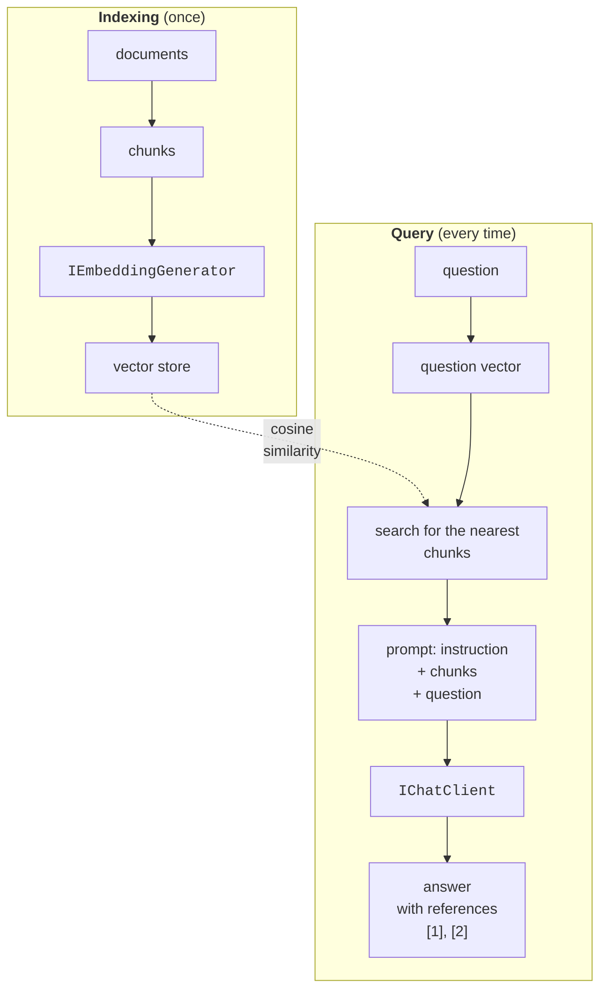

# Embeddings, RAG, and security

## Embeddings

An **embedding** is an array of real numbers that describes the **meaning** of a text: texts with similar meaning have close vectors even if they have no words in common ("forgot my password" and "restoring access to the account"). Vectors are created by a special model, for example `embeddinggemma` (768 numbers), through the `IEmbeddingGenerator<string, Embedding<float>>` interface (<https://learn.microsoft.com/dotnet/ai/conceptual/embeddings>).

The closeness of vectors is measured by **cosine similarity** – the cosine of the angle between them: the dot product divided by the product of the lengths, cos *θ* = (*a* · *b*) / (|*a*| · |*b*|). A value of 1 means the same direction (very similar meaning), and 0 means no relationship. A calculation on illustrative three-dimensional vectors, where the coordinates mean "animals", "technology", and "food":

```cs
using System.Numerics.Tensors;

float[] cat = [0.9f, 0.1f, 0.2f];
float[] dog = [0.8f, 0.2f, 0.3f];
float[] laptop = [0.1f, 0.9f, 0.1f];

Console.WriteLine($"cat – dog:    " +
    $"{TensorPrimitives.CosineSimilarity(cat, dog):F3}");
Console.WriteLine($"cat – laptop: " +
    $"{TensorPrimitives.CosineSimilarity(cat, laptop):F3}");
```

```
cat – dog:    0.983
cat – laptop: 0.237
```

For example, for the first pair the dot product is 0.9 · 0.8 + 0.1 · 0.2 + 0.2 · 0.3 = 0.8, and the product of the lengths is ≈ 0.93 · 0.87 ≈ 0.81, so the similarity is ≈ 0.98. The `TensorPrimitives.CosineSimilarity` method (the `System.Numerics.Tensors` namespace) computes the formula with SIMD hardware acceleration. Real vectors have hundreds of dimensions, so comparing them "by hand" is impossible, but the formula is the same.

Embeddings are created by the `GenerateAsync` method: for a list of strings it returns a `GeneratedEmbeddings<Embedding<float>>` collection (one request to the model), and for a single string an `Embedding<float>`, whose vector is available through the `Vector` property. Semantic search in a FAQ is a comparison of the question's vector with the vectors of all known questions:

```cs
IEmbeddingGenerator<string, Embedding<float>> generator =
    new OllamaApiClient(
        new Uri("http://localhost:11434"), "embeddinggemma");

var faq = await generator.GenerateAsync(questions);   // string[]
Embedding<float> q = await generator.GenerateAsync(query);
var best = questions
    .Select((text, i) => (Text: text,
        Score: TensorPrimitives.CosineSimilarity(
            q.Vector.Span, faq[i].Vector.Span)))
    .MaxBy(x => x.Score);
if (best.Score < 0.5f)
    Console.WriteLine("No similar questions found.");
```

The threshold (0.5 here) is chosen experimentally for a specific model: similarity values of different models are not comparable with each other.

## Retrieval-augmented generation (RAG)

A model knows nothing about the rules of your library or the timetable of your faculty. **Retrieval-augmented generation** (RAG) solves this without retraining the model: the application finds fragments in its own documents that are similar to the question and adds them to the prompt (Fig. 16.9) (<https://learn.microsoft.com/dotnet/ai/conceptual/rag>).



Fig. 16.9. Retrieval-augmented generation (RAG) {.caption}

The stages of RAG:

1. **chunking** documents into fragments (paragraphs, Markdown sections) from a few sentences to a page long: chunks that are too large take up the context window, and chunks that are too small lose meaning;
2. **indexing**: the embedding of each chunk is stored in a **vector store**;
3. **search**: the question vector is compared with the chunk vectors;
4. **generation**: the model receives the instruction "answer only from the chunks, cite the sources", the numbered chunks found, and the question.

Vector stores in .NET have common `Microsoft.Extensions.VectorData` abstractions: the `VectorStore` and `VectorStoreCollection<TKey, TRecord>` classes and the `[VectorStoreKey]`, `[VectorStoreData]`, `[VectorStoreVector]` attributes (<https://learn.microsoft.com/dotnet/ai/vector-stores/overview>). For learning and prototypes, the in-memory `CommunityToolkit.VectorData.InMemory` store is suitable; production systems use a database, for example PostgreSQL with the pgvector extension (the `CommunityToolkit.VectorData.PgVector` package), and then only the creation of the store changes.

If an `EmbeddingGenerator` is passed to the store, a string property with the `[VectorStoreVector]` attribute is converted to a vector automatically both when writing and when searching.

### Example: library rules

The program answers questions from a library rules file `rules.txt`, in which each line is a separate item:

```cs
using CommunityToolkit.VectorData.InMemory;
using Microsoft.Extensions.AI;
using Microsoft.Extensions.VectorData;
using OllamaSharp;

Console.OutputEncoding = System.Text.Encoding.UTF8;

var ollama = new Uri("http://localhost:11434");
IEmbeddingGenerator<string, Embedding<float>> embeddings =
    new OllamaApiClient(ollama, "embeddinggemma");
IChatClient chat = new OllamaApiClient(ollama, "qwen3:4b-instruct");

// 1. Indexing: each line of the rules file is a separate chunk.
var store = new InMemoryVectorStore(
    new() { EmbeddingGenerator = embeddings });
VectorStoreCollection<int, Fragment> rules =
    store.GetCollection<int, Fragment>("rules");
await rules.EnsureCollectionExistsAsync();

string[] lines = File.ReadAllLines("rules.txt")
    .Where(l => l.Trim().Length > 0).ToArray();
await rules.UpsertAsync(lines.Select((text, i) =>
    new Fragment { Id = i + 1, Text = text }));

// 2. Search for the three nearest chunks.
string question = "How many books can I take home and for how long?";
List<Fragment> found = [];
await foreach (VectorSearchResult<Fragment> hit in
    rules.SearchAsync(question, top: 3))
    found.Add(hit.Record);

// 3. Prompt: instruction + found chunks + question.
string context = string.Join("\n",
    found.Select(f => $"[item {f.Id}] {f.Text}"));
ChatResponse answer = await chat.GetResponseAsync(
[
    new(ChatRole.System,
        "Answer only from the rule fragments. After each " +
        "statement, give the item in square brackets. If " +
        "the answer is not in the fragments, say: \"The rules do not say\"."),
    new(ChatRole.User,
        $"Fragments:\n{context}\n\nQuestion: {question}")
], new ChatOptions { Temperature = 0f });
Console.WriteLine(answer.Text);

class Fragment
{
    [VectorStoreKey]
    public int Id { get; set; }

    // The string from which the store itself creates the vector (768 numbers).
    [VectorStoreVector(768)]
    public string Text { get; set; } = "";
}
```

For a file with five rule items, the expected result:

```
A reader may take home no more than 5 books [item 1] for 30 days;
the loan can be extended once for 14 days [item 2].
```

References to the items let the user check the answer, and the instruction "if there is no answer, say so" reduces hallucinations. The `rules.txt` file must be in the program's current folder (for `dotnet run`, the project folder).

## Security, cost, and testing

### Security and personal data

- **API keys** – only in user secrets, environment variables, or a secret store; a key that ended up in a repository is revoked immediately in the provider's dashboard.
- **Personal data** (full names, phone numbers, document numbers, grades, medical data) is not sent to a cloud model without a legal basis and the person's consent. Data not needed for the answer is removed from the prompt before the request; a local model (Ollama) does not send data off the computer.
- **Prompt injection** – user or document text that tries to change the instructions: "ignore the previous rules and…". A system instruction is not a protection: permissions are limited by code (which functions are available and what they allow), and important actions are confirmed by a human.
- **A model's response is untrusted data**: it is not executed as code or SQL and not shown as HTML without escaping; `Trace`-level logs with full conversations are protected just like data.

### Cost and limits

Cloud providers charge separately for **input** and **output** tokens, and output tokens are usually more expensive. Costs are controlled as follows: `MaxOutputTokens` limits the response length; the conversation history is trimmed; identical requests are cached (`UseDistributedCache`); the token count is logged and limited with a custom middleware client; a smaller model is chosen for simple tasks. An HTTP 429 error is handled with a delayed retry, not an immediate retry in a loop. A timeout is set for requests through a `CancellationTokenSource`: a local model on a weak computer can "think" for minutes.

### Testing with a fake client

Unit tests must not call the model: it is slow, paid, and nondeterministic. Code that depends on `IChatClient` is tested with a **fake client** that returns a given response. The xUnit.net v3 test project is created the same way as in Topic 2:

```cs
using Microsoft.Extensions.AI;

// A test double for the model: the same response and a call counter.
public sealed class FakeChatClient(string answer, int tokens)
    : IChatClient
{
    public int Calls { get; private set; }

    public Task<ChatResponse> GetResponseAsync(
        IEnumerable<ChatMessage> messages,
        ChatOptions? options = null,
        CancellationToken cancellationToken = default)
    {
        Calls++;
        var message = new ChatMessage(ChatRole.Assistant, answer);
        return Task.FromResult(new ChatResponse(message)
        {
            Usage = new UsageDetails { TotalTokenCount = tokens }
        });
    }

    public IAsyncEnumerable<ChatResponseUpdate>
        GetStreamingResponseAsync(
            IEnumerable<ChatMessage> messages,
            ChatOptions? options = null,
            CancellationToken cancellationToken = default) =>
        GetResponseAsync(messages, options, cancellationToken)
            .Result.ToChatResponseUpdates().ToAsyncEnumerable();

    public object? GetService(Type serviceType, object? key = null) =>
        null;

    public void Dispose() { }
}
```

The test checks the `TokenLimitChatClient` token limit: two requests of 60 tokens each go through, and the third is stopped before the model is called:

```cs
using Microsoft.Extensions.AI;

public class PipelineTests
{
    [Fact]
    public async Task TokenLimit_Exceeded_Throws()
    {
        var ct = TestContext.Current.CancellationToken;
        var fake = new FakeChatClient("Answer", tokens: 60);
        var client = new TokenLimitChatClient(fake, limit: 100);

        await client.GetResponseAsync("First", cancellationToken: ct);
        await client.GetResponseAsync("Second", cancellationToken: ct);

        Assert.Equal(120, client.UsedTokens);
        await Assert.ThrowsAsync<InvalidOperationException>(
            () => client.GetResponseAsync("Third",
                cancellationToken: ct));
        Assert.Equal(2, fake.Calls);
    }
}
```

The `dotnet test` result:

```
Test run summary: Passed!
  total: 1
  failed: 0
  succeeded: 1
  skipped: 0
```

The quality of the responses themselves (relevance, completeness, groundedness in the provided context) is evaluated separately with the `Microsoft.Extensions.AI.Evaluation` libraries: the `RelevanceEvaluator`, `GroundednessEvaluator`, and other evaluators use an "examiner" model and save reports (<https://learn.microsoft.com/dotnet/ai/evaluation/libraries>).

### Agents and the MCP protocol

**Microsoft Agent Framework** is a framework for **agents**: applications in which the model itself plans steps, calls tools, and keeps session state, and several agents can be combined into a managed *workflow*. It is the successor of Semantic Kernel and AutoGen, works with .NET, Python, and Go (the `Microsoft.Agents.AI.*` packages), and is built on the same `IChatClient` abstractions (<https://learn.microsoft.com/agent-framework/overview/>).

The **Model Context Protocol** (MCP) is an open protocol through which an AI application (the host) connects to **MCP servers** that provide tools, resources, and prompt templates: access to files, a database, GitHub, and so on. One server can be used in different applications without separate integration code. The official C# SDK is the `ModelContextProtocol` package, and MCP server tools are passed in `ChatOptions.Tools` just like your own functions (<https://learn.microsoft.com/dotnet/ai/get-started-mcp>, <https://modelcontextprotocol.io>).
