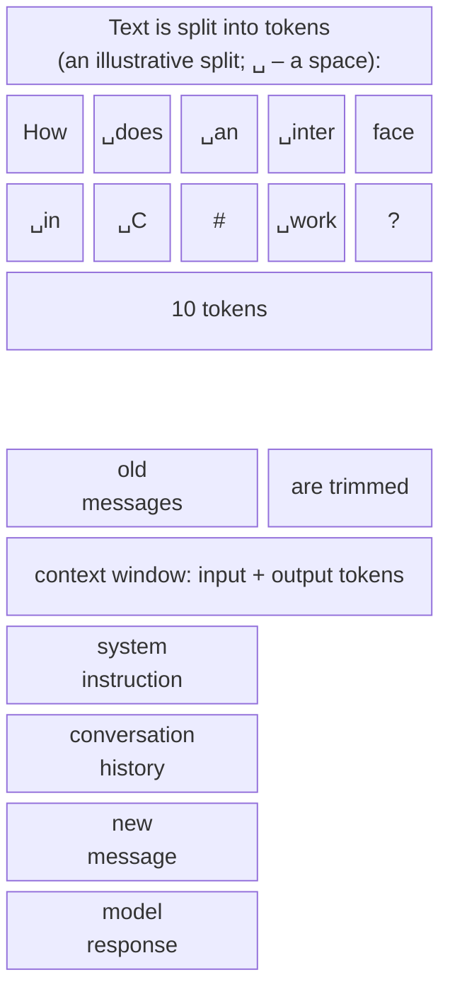
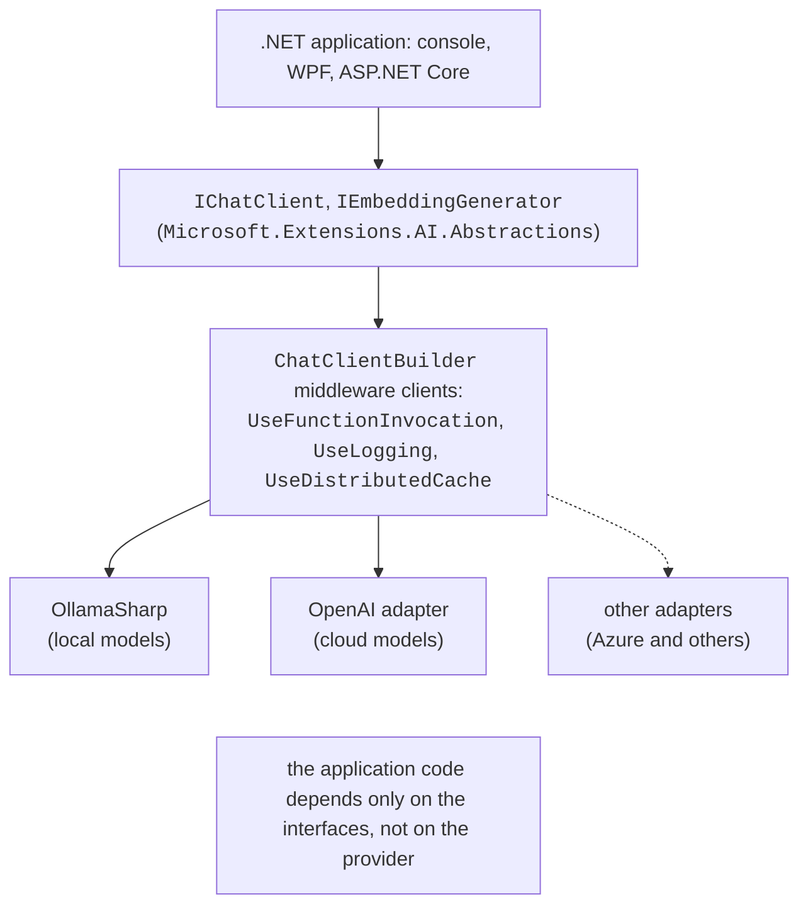
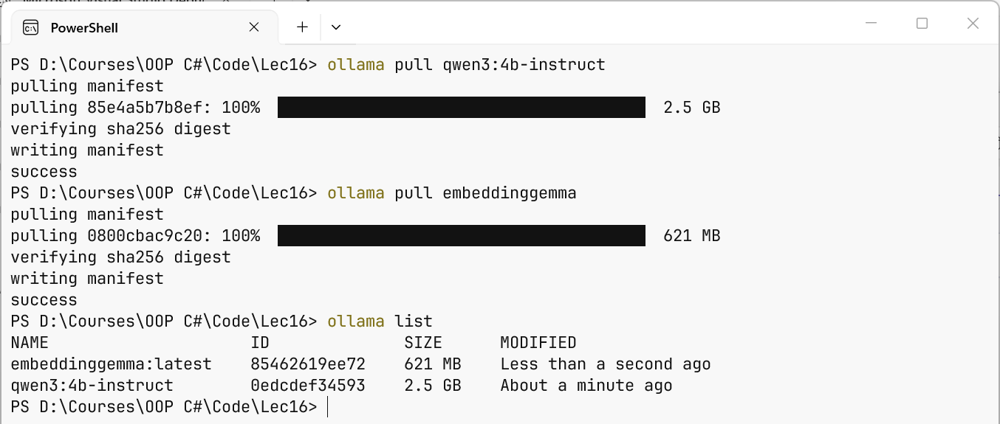
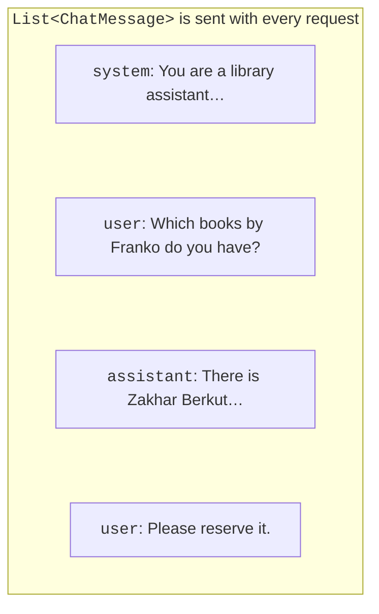

# Language models and IChatClient

## Large language models

A **large language model** (LLM) is a neural network trained on a huge amount of text that, given input text, predicts the most likely continuation. This is exactly how chatbots work: the user's question together with instructions is fed to the model, and the model generates the answer step by step (<https://learn.microsoft.com/dotnet/ai/conceptual/how-genai-and-llms-work>). The text sent to a model is called a **prompt**.

### Tokens and the context window

A model works not with letters or words but with **tokens** – parts of words, whole short words, punctuation marks (Fig. 16.1). The split depends on the particular model; words in languages other than English (for example, Ukrainian) usually split into more tokens than English words, so the same content in such a language "costs" more tokens (<https://learn.microsoft.com/dotnet/ai/conceptual/understanding-tokens>).



Fig. 16.1. Tokens and the model's context window {.caption}

The **context window** is the largest number of tokens a model processes in one request: the system instruction, the whole conversation history, the new message, **and** the response together. The model does not "remember" previous requests: the application sends the history again every time, and when it no longer fits, the oldest messages have to be trimmed. The response time and the cost of a request to a cloud model also depend on the number of tokens.

### Temperature, nondeterminism, and hallucinations

A model chooses each next token randomly, taking probabilities into account. **Temperature** controls this randomness: a value close to 0 gives predictable, "dry" responses (data extraction, classification), and a higher value gives more varied ones (ideas, creative text). Even at temperature 0, the same request does not guarantee the same response, so a program must not rely on the exact text of the response.

A **hallucination** is a confident but made-up answer: a nonexistent book, API method, or quotation. A model does not know facts after its training date and has no access to your data. Ways of reducing hallucinations covered below: a clear system instruction ("if you don't know, say so"), passing the required data in the prompt (RAG), calling application functions, and checking the response in code.

### Cloud and local models

**Cloud models** (OpenAI, Azure AI Foundry, and others) are the most powerful, but they require an API key, payment per token, and sending data to the provider's server. Providers impose **rate limits**: the number of requests and tokens per minute; exceeding them gives an HTTP 429 *Too Many Requests* response. **Local models** run on your own computer: free, without the internet, and the data does not leave the computer, but the quality is lower and the speed depends on the processor, the graphics card, and the amount of memory. The lab assignments use the local **Ollama** server (<https://ollama.com>).

## The AI ecosystem in .NET

The **Microsoft.Extensions.AI** (MEAI) libraries define common abstractions for working with models from different providers, just as `ILogger` (Topic 6) defines a logging abstraction (<https://learn.microsoft.com/dotnet/ai/microsoft-extensions-ai>). The application programs against the interfaces, and a specific provider is plugged in by an **adapter** (Fig. 16.2, Table 16.1).



Fig. 16.2. Microsoft.Extensions.AI abstractions {.caption}

Table 16.1. Packages for working with models {.caption}

| **NuGet package (version)** | **Purpose** |
| --- | --- |
| `Microsoft.Extensions.AI.Abstractions` (10.10.0) | the `IChatClient` and `IEmbeddingGenerator` interfaces, message and content types |
| `Microsoft.Extensions.AI` (10.10.0) | function calling, logging, caching, `ChatClientBuilder`, `GetResponseAsync<T>` |
| `OllamaSharp` (5.4.30) | the Ollama client, implements both interfaces |
| `Microsoft.Extensions.AI.OpenAI` (10.10.0) | the OpenAI adapter: the `AsIChatClient()` method |
| `CommunityToolkit.VectorData.InMemory` (1.0.1) | an in-memory vector store |

Microsoft used to release a separate `Microsoft.Extensions.AI.Ollama` package; it is now obsolete, and the documentation recommends `OllamaSharp`. For web applications there is the *AI Chat Web App* template (the `Microsoft.Extensions.AI.Templates` template package, the `dotnet new aichatweb` command) – a ready-made Blazor chat with search in your own documents (<https://learn.microsoft.com/dotnet/ai/quickstarts/ai-templates>).

### Installing Ollama and models

Ollama for Windows 10 22H2 and later is installed with the `OllamaSetup.exe` program from <https://ollama.com/download/windows> (administrator rights are not required). After installation the server runs in the background and accepts requests at `http://localhost:11434`, and models are stored in the `.ollama` folder of the user profile (<https://docs.ollama.com/windows>). Models are downloaded with the `ollama pull` command (Fig. 16.3, Table 16.2):

```powershell
ollama pull qwen3:4b-instruct
ollama pull embeddinggemma
ollama list
ollama run qwen3:4b-instruct "Hi! Who are you?"
```

Table 16.2. Local models for the lab assignments {.caption}

| **Model** | **Size** | **Purpose** |
| --- | --- | --- |
| `qwen3:4b-instruct` | 2.5 GB | chat, function calling; a 256K-token window; over 100 languages |
| `embeddinggemma` | 622 MB | embeddings (768 numbers), over 100 languages |
| `gemma3:4b` | 3.3 GB | chat with images |
| `llama3.2:3b` | 2.0 GB | chat for weaker computers; Ukrainian is not among the officially supported languages |



Fig. 16.3. Downloading local models {.caption}

While running, a model is loaded into RAM or graphics card memory, so you need free memory no smaller than the model size; with a graphics card the response is generated much faster than on the processor. The catalog of models with sizes and capabilities (*tools*, *vision*, *embedding*) is at <https://ollama.com/library>.

## The `IChatClient` interface

The `IChatClient` interface (<https://learn.microsoft.com/dotnet/ai/ichatclient>) has two main methods:

- `GetResponseAsync` – returns the complete response;
- `GetStreamingResponseAsync` – returns the response in parts.

The simplest request:

```cs
using Microsoft.Extensions.AI;
using OllamaSharp;

IChatClient client = new OllamaApiClient(
    new Uri("http://localhost:11434"), "qwen3:4b-instruct");

ChatResponse response = await client.GetResponseAsync(
    "Explain in one sentence what an interface is in C#.");
Console.WriteLine(response.Text);
```

### Messages and roles

A request is a list of `ChatMessage` messages, each of which has a **role** `ChatRole` (Fig. 16.4):

- `ChatRole.System` – the **system instruction**: the assistant's role, language, style, restrictions. It is set by the programmer, not the user;
- `ChatRole.User` – a user message;
- `ChatRole.Assistant` – previous responses of the model;
- `ChatRole.Tool` – the results of called functions.



Fig. 16.4. Message roles in a conversation {.caption}

Models served through Ollama and most cloud APIs are **stateless**: for the model to "remember" the conversation, the application keeps a `List<ChatMessage>`, adds every question to it, and the `AddMessages` extension method moves the response messages into the list (the "Console chat" example below).

The request parameters are set by the `ChatOptions` class: `ModelId` (the model, if the client was created without one), `Temperature`, `MaxOutputTokens`, `StopSequences`, `Tools` (functions), and so on. The `ChatResponse` object contains `Text` (the text of the last message), `Messages`, `ModelId`, `FinishReason` (`Stop` – the model finished the response, `Length` – `MaxOutputTokens` was reached), and `Usage` (`UsageDetails`: `InputTokenCount`, `OutputTokenCount`, `TotalTokenCount`). Not every provider supports all parameters: unsupported ones are usually ignored.

### Images in a request

A message can contain several content parts: `TextContent`, `DataContent` (bytes with a MIME type: an image, audio, PDF), `UriContent`. Only multimodal models understand images, for example `gemma3:4b`: `new TextContent("List the items on the receipt")` and `new DataContent(bytes, "image/jpeg")`, where `bytes` is the content of the photo file, are added to the user message. The recognized text must be checked: a model can be just as confidently wrong about digits as about words.
