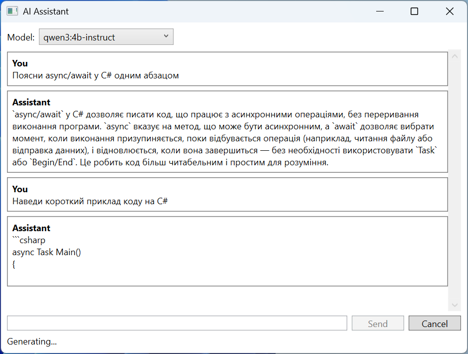

# Practice

The examples require a running Ollama server with the `qwen3:4b-instruct` and `embeddinggemma` models (the `ollama pull` commands). If the models are unavailable, the programs report a connection error.

## Example 1. A review classifier

Write a console program that reads customer reviews from a text file (one review per line), determines for each the sentiment, the main topic, the likely rating from 1 to 5, and a short summary, prints a table and totals, and saves a report to JSON. The file paths are given as command-line arguments; errors are written to the error stream with exit codes 1–3.

```cs
using System.ComponentModel;
using System.Text.Encodings.Web;
using System.Text.Json;
using System.Text.Json.Serialization;
using Microsoft.Extensions.AI;
using OllamaSharp;

Console.OutputEncoding = System.Text.Encoding.UTF8;

if (args.Length != 2)
{
    Console.Error.WriteLine(
        "Usage: Reviews <input.txt> <report.json>");
    return 1;
}
if (!File.Exists(args[0]))
{
    Console.Error.WriteLine($"File not found: {args[0]}");
    return 2;
}

IChatClient client = new OllamaApiClient(
    new Uri("http://localhost:11434"), "qwen3:4b-instruct");
var options = new ChatOptions { Temperature = 0f };
const string Instructions =
    "Analyze an online store customer's review. Rating is the rating " +
    "from 1 to 5 that the customer most likely gave. Summary is " +
    "one sentence in English of up to 12 words.";
```

Each line of the file is a separate request with structured output. A response is accepted only if the JSON is valid and the rating is within the allowed range:

```cs
List<ReviewResult> results = [];
int lineNumber = 0;
foreach (string line in File.ReadLines(args[0]))
{
    lineNumber++;
    if (string.IsNullOrWhiteSpace(line)) continue;
    try
    {
        ChatResponse<Analysis> response =
            await client.GetResponseAsync<Analysis>(
            [
                new(ChatRole.System, Instructions),
                new(ChatRole.User, line)
            ], options);
        if (response.TryGetResult(out Analysis? a)
            && a.Rating is >= 1 and <= 5)
        {
            results.Add(new ReviewResult(lineNumber, line, a));
            Console.WriteLine($"{lineNumber,3}. {a.Sentiment,-8} " +
                $"{a.Category,-8} {a.Rating}  {a.Summary}");
        }
        else
        {
            Console.Error.WriteLine(
                $"{lineNumber,3}. invalid response");
        }
    }
    catch (HttpRequestException ex)
    {
        Console.Error.WriteLine($"The model is unavailable: {ex.Message}");
        return 3;
    }
}

Console.WriteLine();
foreach (var group in results.GroupBy(r => r.Analysis.Sentiment))
    Console.WriteLine($"{group.Key,-8} {group.Count(),3}");
if (results.Count > 0)
    Console.WriteLine($"Average rating: " +
        $"{results.Average(r => r.Analysis.Rating):F2}");

var json = new JsonSerializerOptions
{
    WriteIndented = true,
    Encoder = JavaScriptEncoder.UnsafeRelaxedJsonEscaping,
    Converters = { new JsonStringEnumConverter() }
};
await File.WriteAllTextAsync(args[1],
    JsonSerializer.Serialize(results, json));
return 0;

enum Sentiment { Positive, Neutral, Negative }
enum Category { Delivery, Quality, Price, Support, Other }

record Analysis(
    Sentiment Sentiment,
    [property: Description("The main topic of the review")] Category Category,
    int Rating,
    string Summary);

record ReviewResult(int Line, string Text, Analysis Analysis);
```

The enumerations restrict the model's response to allowed values, and `JsonStringEnumConverter` writes them to the report as names rather than numbers. The `UnsafeRelaxedJsonEscaping` encoding keeps non-ASCII characters (for example, Cyrillic) readable (without `\u0406…` escapes). For the `reviews.txt` file

```
The headphones are great, the sound is clear, delivered in a day!
Waited three weeks for the parcel, nobody answered the phone.
A decent kettle for the money, but the lid is a bit wobbly.
```

the command `dotnet run -- reviews.txt report.json` prints roughly the following (with US regional settings):

```
  1. Positive Quality  5  Clear sound and fast delivery.
  2. Negative Delivery 1  Slow delivery, the seller does not respond.
  3. Neutral  Quality  3  A decent kettle, but the lid wobbles.

Positive   1
Negative   1
Neutral    1
Average rating: 3.00
```

A fragment of the `report.json` report:

```json
{
  "Line": 1,
  "Text": "The headphones are great, the sound is clear, delivered in a day!",
  "Analysis": {
    "Sentiment": "Positive",
    "Category": "Quality",
    "Rating": 5,
    "Summary": "Clear sound and fast delivery."
  }
}
```

## Example 2. An assistant in WPF

Create a WPF application following the MVVM pattern (Topic 13) for a conversation with a model: choosing the model from a list, streaming output of the response, a button for canceling generation, and a status bar with the number of tokens. A *WPF Application* project (.NET 10) with the `Microsoft.Extensions.AI`, `OllamaSharp`, and `CommunityToolkit.Mvvm` packages.

The ViewModel does not depend on Ollama: it receives an `IChatClient` in its constructor, so it can be tested with a fake client without a window and without a model. The `[RelayCommand]` attribute with the `IncludeCancelCommand = true` parameter creates the `SendCommand` command and the `SendCancelCommand` cancel command, which cancels the method's `CancellationToken`:

```cs
using System.Collections.ObjectModel;
using System.Net.Http;
using CommunityToolkit.Mvvm.ComponentModel;
using CommunityToolkit.Mvvm.Input;
using Microsoft.Extensions.AI;

namespace AiAssistant;

public partial class MessageItem(string author) : ObservableObject
{
    public string Author { get; } = author;

    [ObservableProperty]
    public partial string Text { get; set; } = "";
}

public partial class ChatViewModel(IChatClient client)
    : ObservableObject
{
    private readonly List<ChatMessage> history =
    [
        new(ChatRole.System,
            "You are a student's assistant. Answer in English, concisely.")
    ];

    public ObservableCollection<MessageItem> Messages { get; } = [];
    public string[] Models { get; } =
        ["qwen3:4b-instruct", "llama3.2:3b"];

    [ObservableProperty]
    public partial string SelectedModel { get; set; } =
        "qwen3:4b-instruct";

    [ObservableProperty]
    [NotifyCanExecuteChangedFor(nameof(SendCommand))]
    public partial string Prompt { get; set; } = "";

    [ObservableProperty]
    public partial string Status { get; set; } = "Ready";

    private bool CanSend() => !string.IsNullOrWhiteSpace(Prompt);
```

The command method adds messages to the collection and appends the response text as updates arrive. The `await foreach` loop continues on the UI thread, so the `Text` property can be changed without a `Dispatcher`:

```cs
    [RelayCommand(CanExecute = nameof(CanSend),
        IncludeCancelCommand = true)]
    private async Task SendAsync(CancellationToken token)
    {
        string text = Prompt.Trim();
        Prompt = "";
        Messages.Add(new MessageItem("You") { Text = text });
        var answer = new MessageItem("Assistant");
        Messages.Add(answer);
        history.Add(new ChatMessage(ChatRole.User, text));

        var options = new ChatOptions { ModelId = SelectedModel };
        List<ChatResponseUpdate> updates = [];
        Status = "Generating...";
        try
        {
            var stream = client.GetStreamingResponseAsync(
                history, options, token);
            await foreach (ChatResponseUpdate update in stream)
            {
                answer.Text += update.Text;   // UI thread: binding
                updates.Add(update);
            }
            history.AddMessages(updates);
            UsageDetails? usage = updates.ToChatResponse().Usage;
            Status = $"Tokens: {usage?.TotalTokenCount ?? 0}";
        }
        catch (OperationCanceledException)
        {
            answer.Text += " [cancelled]";
            history.RemoveAt(history.Count - 1);
            Status = "Cancelled";
        }
        catch (HttpRequestException ex)
        {
            answer.Text = "Model is not available.";
            history.RemoveAt(history.Count - 1);
            Status = ex.Message;
        }
    }
}
```

The `MainWindow.xaml` markup binds the model list, the input field, the buttons, and the message list to the ViewModel properties:

```xml
<Window x:Class="AiAssistant.MainWindow"
  xmlns="http://schemas.microsoft.com/winfx/2006/xaml/presentation"
  xmlns:x="http://schemas.microsoft.com/winfx/2006/xaml"
  Title="AI Assistant" Width="640" Height="480">
  <DockPanel Margin="8">
    <StackPanel DockPanel.Dock="Top" Orientation="Horizontal">
      <TextBlock Text="Model:" VerticalAlignment="Center"/>
      <ComboBox Width="180" Margin="6,0"
                ItemsSource="{Binding Models}"
                SelectedItem="{Binding SelectedModel}"/>
    </StackPanel>
    <TextBlock DockPanel.Dock="Bottom" Text="{Binding Status}"/>
    <DockPanel DockPanel.Dock="Bottom" Margin="0,6">
      <Button DockPanel.Dock="Right" Content="Cancel" Width="70"
              Command="{Binding SendCancelCommand}"/>
      <Button DockPanel.Dock="Right" Content="Send" Width="70"
              Margin="6,0" IsDefault="True"
              Command="{Binding SendCommand}"/>
      <TextBox Text="{Binding Prompt,
                              UpdateSourceTrigger=PropertyChanged}"/>
    </DockPanel>
    <ScrollViewer Margin="0,6,0,0">
      <ItemsControl ItemsSource="{Binding Messages}">
        <ItemsControl.ItemTemplate>
          <DataTemplate>
            <Border BorderBrush="Gray" BorderThickness="1"
                    Margin="0,3" Padding="6">
              <StackPanel>
                <TextBlock Text="{Binding Author}" FontWeight="Bold"/>
                <TextBlock Text="{Binding Text}" TextWrapping="Wrap"/>
              </StackPanel>
            </Border>
          </DataTemplate>
        </ItemsControl.ItemTemplate>
      </ItemsControl>
    </ScrollViewer>
  </DockPanel>
</Window>
```

`MainWindow.xaml.cs` creates an Ollama client without a model name (it is set by `ChatOptions.ModelId`):

```cs
using System.Windows;
using OllamaSharp;

namespace AiAssistant;

public partial class MainWindow : Window
{
    public MainWindow()
    {
        InitializeComponent();
        var ollama = new OllamaApiClient(
            new Uri("http://localhost:11434"));
        DataContext = new ChatViewModel(ollama);
    }
}
```

The *Send* button is unavailable while the field is empty (`CanExecute`). A test of the ViewModel with a fake client that returns five chunks with a 100 ms delay and 42 tokens gave: after the command runs, the response "Asynchronous code does not block the thread." and the status `Tokens: 42`; after `SendCancelCommand` is called 250 ms in, the response "Asynchronous code [cancelled]" and the status `Cancelled`. The window during generation is shown in Fig. 16.10.



Fig. 16.10. An assistant in a WPF application {.caption}

## Example 3. A course handbook

Write a console program that answers students' questions from the course's Markdown files (grading rules, software, and so on) in a folder given as an argument. Each section of a file (from a `## ` heading to the next one) becomes a chunk; the answer is formed only from the three nearest chunks with a similarity of at least 0.35 and ends with a list of sources.

```cs
using CommunityToolkit.VectorData.InMemory;
using Microsoft.Extensions.AI;
using Microsoft.Extensions.VectorData;
using OllamaSharp;

Console.InputEncoding = System.Text.Encoding.UTF8;
Console.OutputEncoding = System.Text.Encoding.UTF8;

string folder = args.Length > 0 ? args[0] : "docs";
if (!Directory.Exists(folder))
{
    Console.Error.WriteLine($"Folder not found: {folder}");
    return 1;
}

var ollama = new Uri("http://localhost:11434");
var store = new InMemoryVectorStore(new()
{
    EmbeddingGenerator = new OllamaApiClient(ollama, "embeddinggemma")
});
IChatClient chat = new OllamaApiClient(ollama, "qwen3:4b-instruct");

var chunks = store.GetCollection<string, Chunk>("course");
await chunks.EnsureCollectionExistsAsync();
List<Chunk> all = Directory.GetFiles(folder, "*.md")
    .SelectMany(Splitter.Split).ToList();
await chunks.UpsertAsync(all);
Console.WriteLine($"Indexed {all.Count} chunks.");
```

If no chunk reaches the threshold, the model is not called at all: this way the program does not answer questions outside the course topic and does not spend time on generation. The chunk numbers in the prompt match the numbers in the list of sources:

```cs
while (true)
{
    Console.Write("\nQuestion: ");
    string? question = Console.ReadLine();
    if (string.IsNullOrWhiteSpace(question)) return 0;

    List<Chunk> found = [];
    await foreach (var hit in chunks.SearchAsync(question, top: 3))
        if (hit.Score >= 0.35) found.Add(hit.Record);
    if (found.Count == 0)
    {
        Console.WriteLine("The course materials do not answer this.");
        continue;
    }

    string context = string.Join("\n\n", found.Select((c, i) =>
        $"[{i + 1}] {c.Source}\n{c.Text}"));
    var response = await chat.GetResponseAsync(
    [
        new(ChatRole.System,
            "Answer in English only from the fragments. Refer " +
            "to them by the numbers [1], [2]. Do not make up what is not there."),
        new(ChatRole.User, $"{context}\n\nQuestion: {question}")
    ], new ChatOptions { Temperature = 0f });

    Console.WriteLine(response.Text);
    Console.WriteLine("Sources:");
    for (int i = 0; i < found.Count; i++)
        Console.WriteLine($"  [{i + 1}] {found[i].Source}");
}
```

The store record class and splitting a file into sections. The chunk key consists of the file name and the section number, and the chunk text starts with the heading so that the vector takes it into account too:

```cs
public class Chunk
{
    [VectorStoreKey]
    public string Key { get; set; } = "";

    [VectorStoreData]
    public string Source { get; set; } = "";

    [VectorStoreVector(768)]
    public string Text { get; set; } = "";
}

public static class Splitter
{
    // A chunk is a Markdown section from a "## " heading to the next one.
    public static IEnumerable<Chunk> Split(string path)
    {
        string file = Path.GetFileName(path);
        string heading = file;
        var text = new System.Text.StringBuilder();
        int n = 0;
        foreach (string line in File.ReadLines(path).Append("## "))
        {
            if (!line.StartsWith("## "))
            {
                text.AppendLine(line);
                continue;
            }
            if (text.ToString().Trim().Length > 0)
                yield return new Chunk
                {
                    Key = $"{file}#{++n}",
                    Source = $"{file} › {heading}",
                    Text = $"{heading}\n{text}".Trim()
                };
            heading = line[3..].Trim();
            text.Clear();
        }
    }
}
```

The `"## "` line appended to the end of the file with the `Append` method closes the last section. For a `docs` folder with the files `grading.md` (the sections "Lab assignments", "Exam") and `tools.md` ("Development environment", "Local model"), the result is:

```
Indexed 6 chunks.

Question: How many points do I get for a lab assignment if I submit it late?
A lab assignment is graded up to 5 points, and if it is submitted more
than two weeks late, no more than 3 points [1].
Sources:
  [1] grading.md › Lab assignments

Question: What will the weather be tomorrow?
The course materials do not answer this.
```

There are six chunks because the text before the first `## ` heading (the file's `# …` heading) also becomes a chunk.
